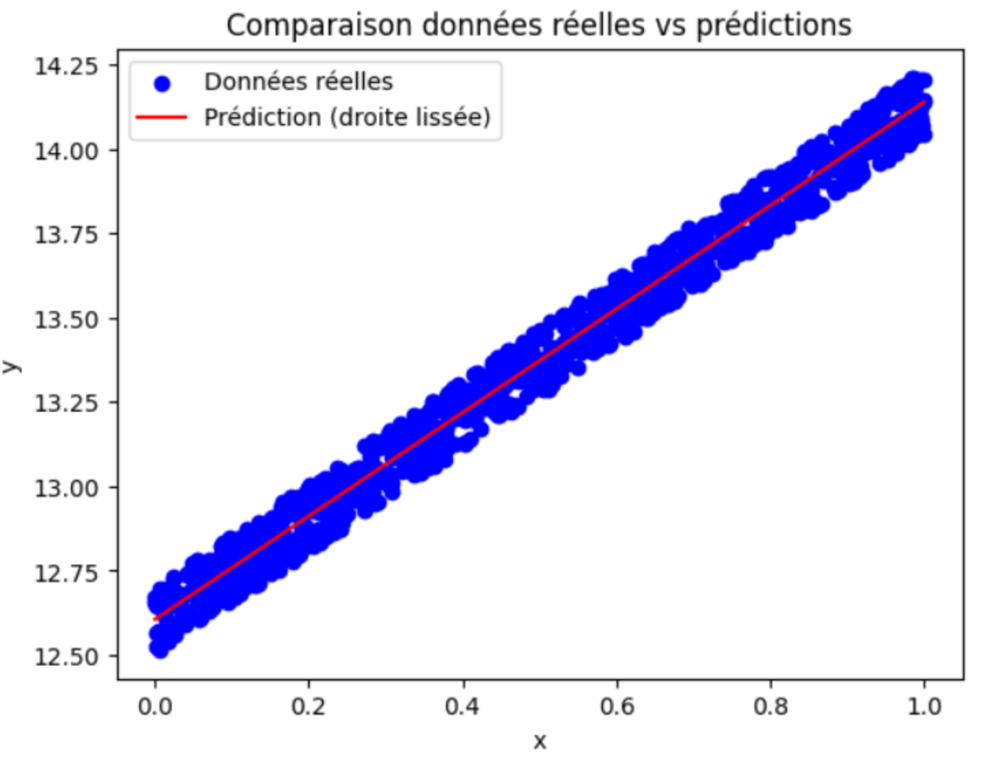

🏋️ Travaux Pratiques 1
=========================
.. slide::
Sur cette page se trouvent des exercices de TP sur le Chapitre 1. Ils sont classés par niveau de difficulté :
.. discoverList::
    * Facile : 🍀
    * Moyen : ⚖️
    * Difficile : 🌶️

.. slide::
🍀 Exercice 1 : Calculer le gradient d’une fonction simple avec PyTorch
~~~~~~~~~~~~~~~~~~~~~~~~~~~~~~

Considérons la fonction suivante : $$f(a) = a^2 + a$$, avec $$a = 1.0$$.

**Consigne :** Faites les deux approches suivantes pour calculer le gradient de cette fonction par rapport à $$a$$ :

1) Calculez à la main la dérivée de $$f$$ par rapport à $$a$$. Puis évaluez ce gradient pour $$a = 1.0$$.  

2) Faites l'implémentation de la même fonction avec PyTorch, calculez et évaluez son gradient.

3) Comparez le résultat obtenu par PyTorch avec le calcul manuel.

**Astuce :**
.. spoiler::
    .. discoverList::
        La dérivée de $$f(a)$$ par rapport à $$a$$ est égale à $$2a + 1$$

**Résultat attendu :**

Le gradient est égal à 3 dans les deux cas.

.. slide::
⚖️ Exercice 2 : Trouver la droite qui passe au mieux par les données
~~~~~~~~~~~~~~~~~~~~~~~~~~~~~~

Dans cet exercice, vous allez implémenter une **boucle d'entraînement simple** pour ajuster les paramètres d'une droite 
aux données fournies.

On vous donne les données suivantes :

.. code-block:: python

    # Données bruitées suivantes
    import numpy as np
    x = np.random.rand(1000)
    y_true = x * 1.54 + 12.5 + np.random.rand(1000)*0.2
    

**Objectif :** Trouver une droite de la forme

.. math::

    y = f(x) =a x + b

où : $$a$$ et $$b$$ sont des paramètres appris automatiquement en minimisant l'erreur  entre les prédictions du modèle et les données réelles.

**Consigne :** Écrire un programme qui ajuste les paramètres $$a$$ et $$b$$ de la droite aux données fournies en utilisant  PyTorch.

    1) Dans un premier temps, vous pouvez faire une boucle de 10000 itérations et coder vous-même la fonction de perte.

    2) Afficher les paramètres appris $$a$$ et $$b$$.

    3) Ensuite, trouver un moyen plus intelligent d'arrêter l'entraînement de tel sorte à ce que le modèle converge avec le minimum d'itérations.
    
    4) Afficher le nombre d'itérations nécessaires pour converger.
    
    5) Tracer les données réelles et les données prédites pour comparer visuellement le résultat.

    6) Utiliser la fonction de perte MSE fournie par PyTorch et afficher les paramètres appris $$a$$ et $$b$$.

    7) Vérifier que le résultat des paramètres et le tracé sont similaires à ceux obtenus avec la boucle d'entraînement manuelle.

**Remarque :** Pour utiliser ``matplotlib``, vous devez l'installer avec la commande suivante :

.. code-block:: bash
    pip install matplotlib

Puis, vous pouvez l'importer dans votre code avec :

.. code-block:: python
    import matplotlib.pyplot as plt
    %matplotlib inline #À ajouter si vous utilisez Jupyter Notebook

**Astuce :**
.. spoiler::
    .. discoverList::
        1. Initialiser les paramètres : $$a$$ et $$b$$ à zéro.
        2. Utiliser une fonction de perte en codant l'équation de la MSE (loss = torch.sum((y_pred - y_true) ** 2)).
        3. Implémenter une boucle d'entraînement (par exemple 10000 itérations) avec l'optimiseur ADAM ``torch.optim.ADAM``.
        4. À chaque itération :
            - calculer les prédictions,
            - calculer la perte,
            - effectuer la rétropropagation,
            - mettre à jour les paramètres :$$a$$ et $$b$$.

        5. Il faut arrêter l'entraînement lorsque la perte est suffisamment faible (par exemple, inférieure à 0.01)

**Résultat attendu :**

Vous devez obtenir un graphique où :  
- les points bleus correspondent aux données réelles (``y_true``),  
- et une droite rouge correspond aux prédictions (``y_pred``).  

Exemple d’affichage attendu :

################# Stop ICI #############################

################# Stop ICI #############################

################# Stop ICI #############################

################# Stop ICI #############################

