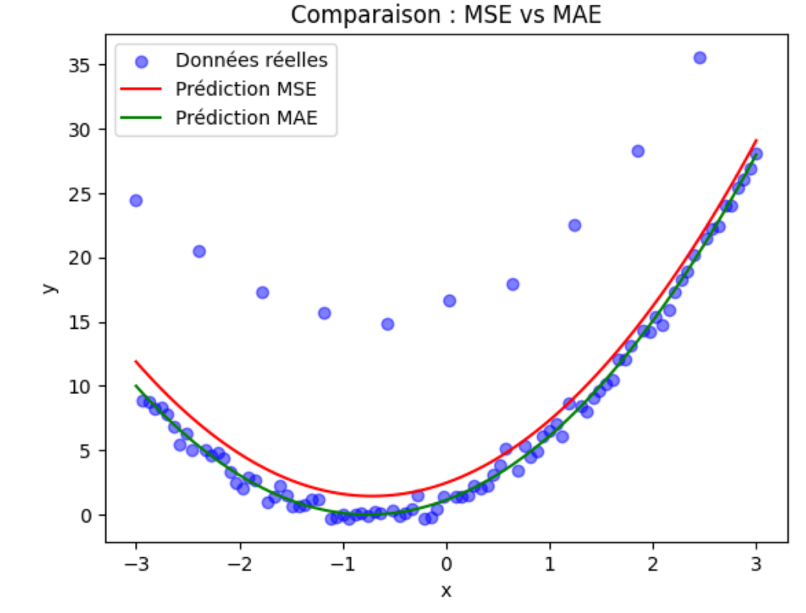

🏋️ Travaux Pratiques 1
=========================
.. slide::
Sur cette page se trouvent des exercices de TP sur le Chapitre 1. Ils sont classés par niveau de difficulté :
.. discoverList::
    * Facile : 🍀
    * Moyen : ⚖️
    * Difficile : 🌶️

.. slide::
🍀 Exercice 1 : Calculer le gradient d’une fonction simple avec PyTorch
~~~~~~~~~~~~~~~~~~~~~~~~~~~~~~

Considérons la fonction suivante : $$f(a) = a^2 + a$$, avec $$a = 1.0$$.

**Consigne :** Utiliser les deux approches suivantes pour calculer le gradient de cette fonction par rapport à $$a$$ :

1) Calculez à la main la dérivée de $$f$$ par rapport à $$a$$. Puis évaluez ce gradient pour $$a = 1.0$$.  

2) Faites l'implémentation de la même fonction avec PyTorch, calculez et évaluez son gradient.

3) Comparez le résultat obtenu par PyTorch avec le calcul manuel.

**Astuce :**
.. spoiler::
    .. discoverList::
        La dérivée de $$f(a)$$ par rapport à $$a$$ est égale à $$2a + 1$$

**Résultat attendu :** Le gradient est égal à 3 dans les deux cas.

.. slide::
⚖️ Exercice 2 : Trouver la droite qui passe au mieux par les données avec MSE
~~~~~~~~~~~~~~~~~~~~~~~~~~~~~~

Dans cet exercice, vous allez implémenter une **boucle d'entraînement simple** pour ajuster les paramètres d'une droite 
aux données fournies.

On vous donne les données suivantes :

.. code-block:: python

    # Données bruitées suivantes
    import numpy as np
    x = np.random.rand(1000)
    y_true = x * 1.54 + 12.5 + np.random.rand(1000)*0.2
    

**Objectif :** Trouver une droite de la forme :

.. math::

    y = f(x) =a x + b

où : $$a$$ et $$b$$ sont des paramètres appris automatiquement en minimisant l'erreur entre les prédictions du modèle et les données réelles.

**Consigne :** Écrire un programme qui ajuste les paramètres $$a$$ et $$b$$ de la droite aux données fournies en utilisant  PyTorch.

    1) Dans un premier temps, vous pouvez faire une boucle de 10000 itérations et coder vous-même la fonction de perte.

    2) Afficher les paramètres appris $$a$$ et $$b$$.

    3) Ensuite, trouver un moyen plus intelligent d'arrêter l'entraînement de tel sorte à ce que le modèle converge avec le minimum d'itérations.
    
    4) Afficher le nombre d'itérations nécessaires pour converger.
    
    5) Tracer les données réelles et les données prédites pour comparer visuellement le résultat.

    6) Utiliser la fonction de perte MSE fournie par PyTorch et afficher les paramètres appris $$a$$ et $$b$$.

    7) Vérifier que le résultat des paramètres et le tracé sont similaires à ceux obtenus avec la boucle d'entraînement manuelle.

**Remarque :** Pour utiliser ``matplotlib``, vous devez l'installer avec la commande suivante :

.. code-block:: bash
    pip install matplotlib

Puis, vous pouvez l'importer dans votre code avec :

.. code-block:: python
    import matplotlib.pyplot as plt
    %matplotlib inline #À ajouter si vous utilisez Jupyter Notebook

**Astuce :**
.. spoiler::
    .. discoverList::
        1. Initialiser les paramètres : $$a$$ et $$b$$ à zéro.
        2. Utiliser une fonction de perte en codant l'équation de la MSE (loss = torch.sum((y_pred - y_true) ** 2)).
        3. Implémenter une boucle d'entraînement (par exemple 10000 itérations) avec l'optimiseur ADAM ``torch.optim.ADAM``.
        4. À chaque itération :
            - calculer les prédictions,
            - calculer la perte,
            - effectuer la rétropropagation,
            - mettre à jour les paramètres :$$a$$ et $$b$$.

        5. Il faut arrêter l'entraînement lorsque la perte est suffisamment faible (par exemple, inférieure à 0.01)

**Résultat attendu :** Vous devez obtenir un graphique où :  
    - les points bleus correspondent aux données réelles (``y_true``),  
    - et une droite rouge correspond aux prédictions (``y_pred``).  

Exemple d’affichage attendu :

.. image:: images/chap1_exo_2_resultat.png
    :alt: droite ajustée aux points
    :align: center

.. slide::
⚖️ Exercice 3 : Trouver la droite qui passe au mieux par les données avec une fonction de perte de type valeur absolue
~~~~~~~~~~~~~~~~~~~~~~~~~~~~~~~~~~~~~~~~~~~~~~~~~~~~~~~~~~~~~~~~~~~~~~~~~~~~~~~~~~~~~~

**Objectif** :  
L'objectif est le même que celui de l'exercice précédent (faire de la régression linéaire), mais cette fois-ci,  vous allez utiliser une fonction de perte de type valeur absolue (MAE de l'anglais Mean Absolute Error)  au lieu de la MSE. L’idée de cet exercice est de comparer deux optimisateurs SGD et Adam.

**Consignes :**  Implémenter une boucle d'entraînement pour ajuster les paramètres d'une droite aux données fournies dans l'exercice précédent en utilisant une fonction de perte de type valeur absolue et en réutilisant l'implémentation de l'exercice précédent.

1) Réutilisez la boucle d'entraînement de l’exercice précédent qui s'arrête au bout de 2500 itérations et qui utilise un learning rate de 0.01.  
2) Remplacez la fonction de perte MSE par une fonction de perte de type MAE. Il faudra chercher dans la documentation comment l'implémenter dans PyTorch.  
3) Testez avec l’optimiseur SGD puis avec l’optimiseur Adam.  
4) Pour chaque optimiseur, affichez les paramètres appris appris $$a$$ et $$b$$.
5) Tracez les données réelles et les données prédites pour comparer visuellement les résultats.  
6) Comparez les deux méthodes : que constatez-vous en termes de stabilité et de vitesse de convergence ?  
7) Expliquez quel optimiseur est meilleur et pourquoi?   

**Astuce :**
.. spoiler::
    .. discoverList::
        - La valeur absolue dans PyTorch s'obtient avec la fonction ``nn.L1Loss()``.
        - Adam gère mieux ce type de fonction de perte non dérivable partout.

**Résultat attendu :**
Vous devez obtenir des valeurs pour les paramètres proche de :

    - Adam -> a = 1.5451, b = 12.5996
    - SGD  -> a = 2.3039, b = 12.1880

et un graphique similaire à celui ci-dessous :

.. image:: images/chap1_exo_3_resultat.png
    :alt: droite ajustée aux points
    :align: center

.. slide::
🏋️ Exercices supplémentaires 1
===============================
Dans cette section, il y a des exercices supplémentaires pour vous entraîner. Ils suivent le même classement de difficulté que précédemment.

.. slide::
🍀 Exercice supplémentaire 1 : Gradient d’une fonction polynomiale
~~~~~~~~~~~~~~~~~~~~~~~~~~~~~~~~~~~~~~~~~~~~~~~~~

Considérons la fonction suivante $$f(a) = 3a^3 - 2a^2 + a$$ avec $$a = 2.0$$.

**Consigne :** Utiliser les deux approches suivantes pour calculer le gradient de cette fonction par rapport à $$a$$ :

1) Calculez à la main la dérivée de $$f$$ par rapport à $$a$$. Puis évaluez ce gradient pour $$a = 2.0$$.

2) Faites l'implémentation de la même fonction avec PyTorch, calculez et évaluez son gradient.

3) Comparez le résultat obtenu par PyTorch avec le calcul manuel.

**Astuce :**
.. spoiler::
    .. discoverList::
        La dérivée de $$f(a)$$ par rapport à $$a$$ est égale à $$9a² - 4a + 1$$

**Résultat attendu :**  
Le gradient est égal à 29 dans les deux cas. 

.. slide::
🍀 Exercice supplémentaire 2 : Gradient de deux variables
~~~~~~~~~~~~~~~~~~~~~~~~~~~~~~~~~~~~~~~~~~~~~~~~~

Considérons la fonction suivante $$f(a, b) = a \cdot b + a^2$$ avec $$a = 2.0$$ et $$b = 3.0$$.

**Consigne :** Utiliser les deux approches suivantes pour calculer les dérivées partielles de cette fonction par rapport à $$a$$ et $$b$$ :

1) Calculez à la main la dérivée partielle de $$f$$ par rapport à $$a$$ et par rapport à $$b$$. Puis évaluez ces dérivées pour $$a = 2.0$$ et $$b = 3.0$$.

2) Faites l'implémentation de la même fonction avec PyTorch, calculez et évaluez le gradient de cette fonction.

3) Comparez le résultat obtenu par PyTorch avec le calcul manuel.

**Astuce :**  
.. spoiler::
    .. discoverList::
        - La dérivée de $$f$$ par rapport à $$a$$ est $$∂f/∂a = b + 2a$$ et par rapport à $$b$$ est $$∂f/∂b = a$$.

**Résultat attendu :**  
Les dérivées partielles sont, dans les deux cas, égales à : $$∂f/∂a = 7$$ et $$∂f/∂b = 2$$.

⚖️ Exercice supplémentaire 3 : Comparaison de des fonctions de perte MSE et MAE
~~~~~~~~~~~~~~~~~~~~~~~~~~~~~~~~~~~~

On vous donne les données suivantes :

.. code-block:: python

    # Données bruitées suivantes
    torch.manual_seed(0)
    x = torch.linspace(-3, 3, 100)
    y_true = 2 * x**2 + 3 * x + 1 + 0.5 * torch.randn(x.size())  # avec bruit
    y_true[::10] += 15  # tous les 10 points, on ajoute une grosse valeur
    

**Objectif :** Trouver une courbe 2D de la forme :

.. math::

    y = f(x) =a x^2 + b x + c

où : $$a$$, $$b$$ et $$c$$ sont des paramètres appris automatiquement en minimisant l'erreur entre les prédictions du modèle et les données réelles.

**Consignes** : Implémenter une boucle d'entraînement pour ajuster les paramètres d'une courbe d'ordre 2 aux données fournies en utilisant une fonction de perte MAE et MSE.

1) Réutilisez la boucle d'entraînement de l’exercice 3 qui s'arrête au bout de 1000 itérations et qui utilise un learning rate de 0.01.  

2) Tester la fonction de perte MSE et MAE.

3) Pour chaque fonction de perte, afficher les paramètres appris $$a$$, $$b$$ et $$c$$.

4) Pour chaque fonction de perte, tracer les données réelles et les données prédites et comparer visuellement les résultats. 

6) Quelle différence observez-vous dans la convergence et les paramètres appris ?

7) Pourquoi la MSE et la MAE ne donnent-elles pas exactement le même résultat ?

8) Dans quel cas préfèreriez-vous utiliser MSE ? Dans quel cas préfèreriez-vous utiliser MAE ?

**Astuce :**
.. spoiler::
    .. discoverList::
        - La MSE pénalise davantage les grandes erreurs.  
        - La MAE est plus robuste aux valeurs aberrantes (outliers).

**Résultat attendu :**
Vous devez obtenir des valeurs pour les paramètres proche de :

    - MSE -> a = 2.002, b = 2.866, c = 2.464
    - MAE -> a = 1.984, b = 2.997, c = 1.132

et un graphique similaire à celui ci-dessous :

.. slide::
🌶️ Exercice supplémentaire 4 : Visualiser une surface de perte en 3D & descente de gradient
~~~~~~~~~~~~~~~~~~~~~~~~~~~~~~~~~~~~~~~~~~~~~~~~~~~~~~~~~~~~~~~~~~~~~~~~~~~~~~~~~~~~~~~~

On considère la fonction suivante :  

.. math::

    f(a, b) = a^2 + b^2

**Objectif :** Comprendre la descente de gradient en visualisant la surface de la fonction et la trajectoire de convergence.  

**Consignes :**

1) Calculer à la main le gradient de $$f(a,b)$$ et ses dérivées partielles .

2) Implémenter une boucle de descente de gradient avec un point de départ choisi (par exemple $$a=2.5$$, $$b=-2.0$$) et un learning rate de 0.1.

3) Stocker les points de la trajectoire au cours des itérations.  

4) Tracer la surface 3D de $$f(a, b)$$ avec Matplotlib.  

5) Ajouter sur la surface des flèches représentant les étapes de la descente de gradient.  

6) Expliquer ce que représente la trajectoire observée et pourquoi elle converge vers $$(a, b) = (0,0)$$.

7) Testez plusieurs learning rate (ex: 0.02, 0.1, 0.5, 2.0) pour observer convergence lente, rapide, ou divergence.

**Astuce :**
.. spoiler::
    .. discoverList::
        - Utilisez ``ax.plot_surface`` pour la surface 3D.  
        - Utilisez ``ax.quiver`` pour tracer les flèches en 3D.  
        - Le minimum de la fonction est atteint en $$(0,0,0)$$. 

**Astuce avancée :**        
.. spoiler::
    .. discoverList:: 
        **Squelette de code :**
        .. code-block:: python

            import numpy as np
            import matplotlib.pyplot as plt
            from mpl_toolkits.mplot3d import Axes3D  # nécessaire pour la 3D

            # 1) Créer une grille pour la surface
            A = np.linspace(-3, 3, 100)
            B = np.linspace(-3, 3, 100)
            AA, BB = np.meshgrid(A, B)

            # À compléter : calculer Z = f(a,b) = a^2 + b^2
            Z = ...

            # 2) Préparer une figure 3D
            fig = plt.figure(figsize=(7, 5))
            ax = fig.add_subplot(111, projection='3d')
            ax.plot_surface(AA, BB, Z, alpha=0.5)

            # 3) Descente de gradient depuis un point de départ
            lr = 0.1   # learning rate
            a, b = 2.5, -2.0
            n_iter = 15

            traj = [(a, b, a**2 + b**2)]

            for _ in range(n_iter):
                # À compléter : calculer le gradient ga, gb
                ga, gb = ...
                
                # À compléter : mettre à jour a et b avec le learning rate
                a, b = ...
                
                traj.append((a, b, a**2 + b**2))

            # 4) Représenter la trajectoire (quiver pour flèches)
            for (a1, b1, z1), (a2, b2, z2) in zip(traj[:-1], traj[1:]):
                # À compléter : dessiner une flèche de (a1,b1,z1) vers (a2,b2,z2)
                ax.quiver(...)

            ax.set_xlabel('a')
            ax.set_ylabel('b')
            ax.set_zlabel('f(a,b)')
            ax.set_title('Surface de perte et descente de gradient')
            plt.tight_layout()
            plt.show()

**Résultat attendu :**  
Un graphique 3D montrant la surface convexe de la fonction et la descente du point de départ vers le minimum global en $$(0,0)$$ avec ``lr=0.1`` :  

.. image:: images/chap1_exo_sup_4_resultat.png
    :alt: droite ajustée aux points
    :align: center

