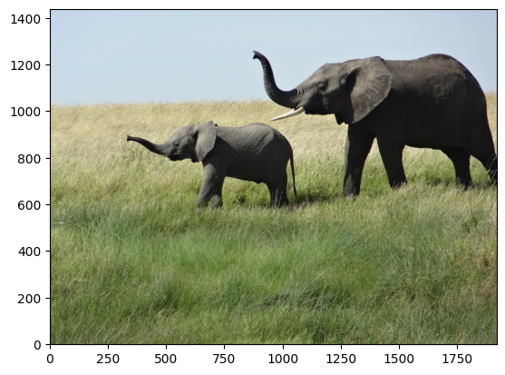
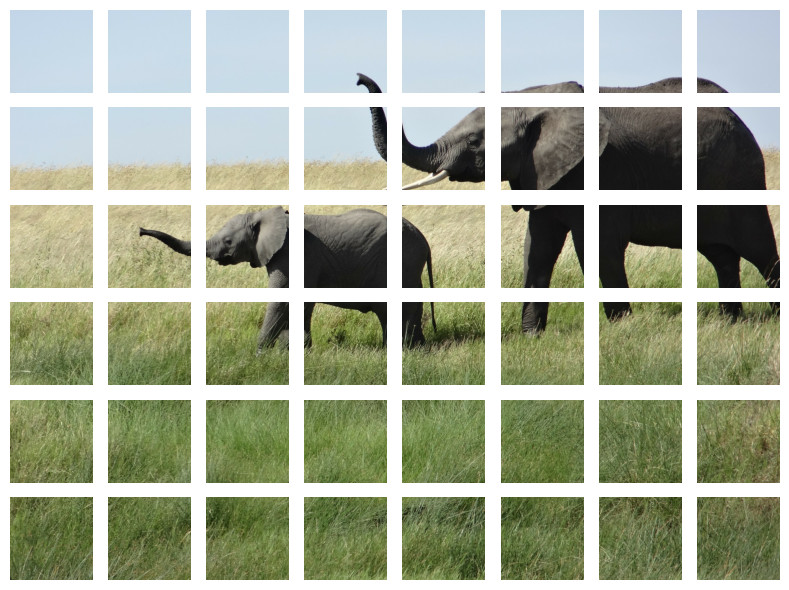
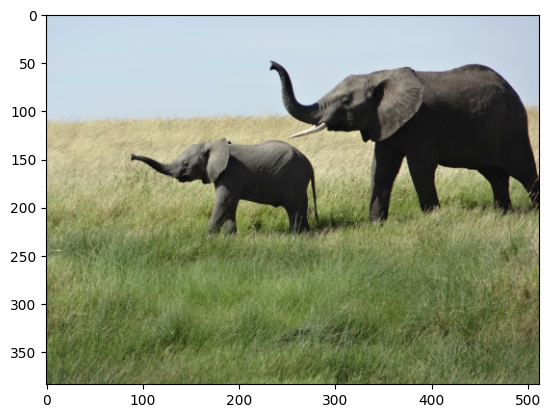
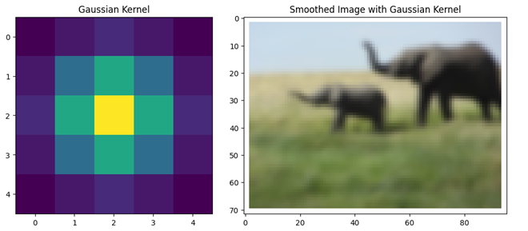

🏋️ Travaux Pratiques 4
=========================

.. slide::
Exercice 0 : Mise en place
~~~~~~~~~~~~~~~~~~~~~~~~~~~~~~
Créer un notebook Jupyter et importer les bibliothèques nécessaires. Assurez-vous que celles-ci soient disponibles dans votre noyau jupyter.

- numpy
- matplotlib
- skimage
- torch

.. slide::
Exercice 1 : Fichier Image
~~~~~~~~~~~~~~~~~~~~~~~~~~~~~~
1) Téléchargez l'image suivante.

2) Charger l'image avec la bibliothèque matplotlib.

3) Afficher l'image chargée.

4) Expliquer le format numérique de l'image chargée (i.e., regardez le type et la forme de votre variable image).

.. figure:: images/tp4/elephants.png
   :align: center
   :width: 250px
   :alt: elephants.png

.. slide::
Exercice 2 : Traitement d'une image
~~~~~~~~~~~~~~~~~~~~~~~~~~~~~~

1) **[En une seule ligne]** Atténuer les couleurs (réduire alpha)

.. figure:: images/tp4/low_alpha.png
   :align: center
   :width: 250px

2) **[En une seule ligne]** Donner un alpha différent (aléatoire) à chaque pixel, afficher pour vérifier puis remettre à 1

.. figure:: images/tp4/rand_alpha.png
   :align: center
   :width: 250px

3) **[En une seule ligne]** Récupérer et afficher uniquement l'éléphanteau (attention au système de coordonnées !)

.. figure:: images/tp4/baby.png
   :align: center
   :width: 250px

4) Faites en sorte que l'image soit affichée correctement avec l'origine (0,0) en bas à gauche

5) Découpez l'image en morceaux (aka, patches) de taille 240x240 pixels, affichez-les dans une seule figure

6) Redimmensionnez chaque patch en 64x64 pixels

7) Reconstituez et affichez l'image a partir des patches redimensionnés

8) Afficher l'histogramme des couleurs de l'image

.. figure:: images/tp4/color_hist.png
   :align: center
   :width: 400px

9) Changer la couleur du ciel bleu en bleu sombre (nuit). Cela équivaut également à annoter automatiquement les pixels du ciels pour cette image.

.. figure:: images/tp4/blue_sky.png
   :align: center
   :width: 400px

10) Réduisez la résolution de l'image d'un facteur 20.

.. figure:: images/tp4/rescale.png
   :align: center
   :width: 250px

11) Appliquer un filtre de convolution gaussien pour lisser l'image en basse résolution

.. slide::
Exercice 3 : Traitement d'un batch d'images
~~~~~~~~~~~~~~~~~~~~~~~~~~~~~~

1) Récupérez sur internet une image de Chien, Chat et Cheval, puis redimensionnez les toutes aux mêmes dimensions. 

2) Appliquez ensuite les mêmes traitements (exercice 2.) sur le batch d'images [Elephants, Chien, Chat, Cheval] en utilisant la bibliothèque PyTorch. Adaptez les questions si nécessaire (par exemple lorsqu'il n'y a pas d'éléphanteau dans les images). ⚠️ Votre code doit traiter toutes les images simultanément.

3) Créez une nouvelle classe *MyDataset* qui hérite de *torch.utils.data.Dataset*. Faites en sorte que cette classe charge et pré automatiquement vos images et les pré-traite de la manière suivante : 

- Redimensionnement à 64x64 pixels
- Lissage avec un filtre gaussien (convolution)
- Normalisation des valeurs de chaque canal entre -0.5 et 0.5
- Association d'un label (a.k.a., étiquette, vérité terrain) à chaque image

.. raw:: html

   ⚠️ Votre classe doit bien <b>hériter</b> de <i>torch.utils.data.Dataset</i>, et il est impératif d'implémenter les méthodes <code>__len__()</code> et <code>__getitem__()</code>.

.. slide::
Exercice 4 : Classification d'image avec des couches de convolution
~~~~~~~~~~~~~~~~~~~~~~~~~~~~~~
1) Reprenez le jeu de données Digits_ de sklearn vu dans les exercices du TP3, et rechargez-le comme vous avez appris à le faire (jeux de *train* et *val*).

.. _Digits: https://scikit-learn.org/stable/modules/generated/sklearn.datasets.load_digits.html

2) Créez un réseau de neurones convolutif (CNN) avec maximum 3 couches pour classer ces images. Vous pouvez vous inspirer de l'architecture suivante :

💡Regardez la documentation de ``torch.nn.Conv2d`` pour plus de détails sur les couches de convolution.

3) Comparez les performances de ce CNN avec celles du MLP que vous aviez créé dans le TP3.