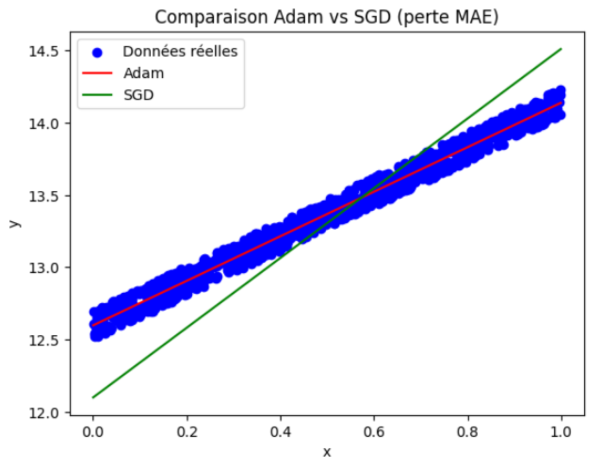

.. slide::

Chapitre 1 - Introduction à PyTorch et Optimisation de Modèles (partie 2)
================

🎯 Objectifs du Chapitre
----------------------

.. important::

   À la fin de ce chapitre, vous saurez : 

   - Créer et manipuler des tenseurs PyTorch sur CPU et GPU.
   - Calculer automatiquement les gradients à l’aide de ``autograd``.
   - Définir une fonction de perte.
   - Utiliser un optimiseur pour ajuster les paramètres d’un modèle.
   - Implémenter une boucle d'entraînement simple.

.. slide::
📖 13. Les fonctions de perte (Loss Functions)
-------------------------------

Lorsqu’on entraîne un réseau de neurones, l’objectif est de minimiser l’erreur entre les prédictions du modèle et les valeurs attendues. Cette erreur est mesurée par une fonction de perte (loss function en anglais).

Une fonction de perte prend en entrée :

    - la sortie du modèle (la prédiction),
    - la valeur cible (la réponse attendue, donnée par les données d’apprentissage),

et retourne un nombre réel qui indique "à quel point le modèle s'est trompé".

Par conséquent, plus la perte est grande → plus le modèle se trompe et plus la perte est petite → plus le modèle est proche de la bonne réponse.

.. slide::
📖 14. Pourquoi la fonction de perte est essentielle ?
----------------------------------------------------
La fonction de perte est essentielle pour plusieurs raisons :

    - Elle quantifie l'erreur du modèle : elle donne une mesure numérique de la performance du modèle.
    - Elle permet de guider l'apprentissage : le modèle apprend en essayant de réduire cette valeur.
    - Elle est le point de départ de la rétropropagation : les gradients sont calculés à partir de la fonction de perte.
    - Elle est utilisée par les algorithmes d'optimisation pour ajuster les paramètres du modèle.
    - Elle permet de comparer différents modèles : en utilisant la même fonction de perte, on peut évaluer quel modèle est le meilleur.
    - Elle est essentielle pour le processus d'entraînement : sans fonction de perte, le modèle n'aurait aucun signal pour savoir comment s’améliorer.

.. slide::
📖 15. Régression & Erreur quadratique moyenne (MSE)
----------------------------------------------------

15.1. Définitions
~~~~~~~~~~~~~~~~~
On appelle régression le cas où le modèle doit prédire une valeur numérique par exemple : la température demain, la taille d’une personne, etc.

Dans ce cas, la fonction de perte la plus utilisée est l’erreur quadratique moyenne (MSE de l'anglais Mean Squared Error) :

.. math::

   L(y, \hat{y}) = \frac{1}{n} \sum_{i=1}^n (y_i - \hat{y}_i)^2,

où :

    - $$L$$ est la fonction de perte,
    - $$n$$ est le nombre de données,
    - $$y_i$$ est la valeur attendue (target) et
    - $$\hat{y}_i$$ est la prédiction du modèle.

La fonction MSE calcule la moyenne des erreurs au carré de toutes les données.

.. slide::
15.2. Exemple d'une régression avec MSE dans PyTorch
~~~~~~~~~~~~~~~~~~~~~
Pour utiliser la fonction MSE dans PyTorch, on peut utiliser la classe ``nn.MSELoss()``. Pour cela, il faut d'abord importer le module ``torch.nn`` qui contient les fonctions de perte :
.. code-block:: python

    import torch.nn as nn

**Exemple** : 

.. code-block:: python

    # Valeurs réelles et prédictions
    y_true = torch.tensor([2.0, 3.0, 4.0])
    y_pred = torch.tensor([2.5, 2.7, 4.2])

    # Définition de la fonction de perte MSE
    loss_fn = nn.MSELoss()

    # Calcul de la perte
    loss = loss_fn(y_pred, y_true)
    print(loss)

.. slide::
📖 16. Classification & Entropie croisée
------------------------------------------------------------

16.1. Définitions
~~~~~~~~~~~~~~~~~~~

On appelle classification le cas où le modèle doit prédire à quelle catégorie appartient la donnée parmi plusieurs possibles par exemple : "chat" ou "chien", ou bien "spam" ou "non spam", etc.

Dans ce cas, la fonction de perte la plus courante est l'entropie croisée (Cross-Entropy Loss en anglais). Elle compare la probabilité prédite par le modèle et la vraie catégorie (donnée par les données d’apprentissage) :

.. math::
   L(y, \hat{y}) = -\sum_{i=1}^n y_i \log(\hat{y}_i),
où :

    - $$L$$ est la fonction de perte,
    - $$n$$ est le nombre de classes,
    - $$y_i$$ est la valeur attendue (target) pour la classe $$i$$ ((souvent codée en *one-hot encoding*, c'est-à-dire un vecteur avec un 1 pour la bonne classe et 0 pour les autres),
    - $$\hat{y}_i$$ est la probabilité prédite par le modèle pour la classe $$i$$.

La fonction enropie croisée mesure la distance entre la distribution de probabilité prédite par le modèle et la distribution de probabilité réelle (la vraie classe).
La présence de la somme permet de prendre en compte toutes les classes.   Mais, dans le cas du *one-hot encoding*, seul le terme correspondant à la vraie classe reste (puisque tous les autres $$y_i$$ valent 0).

.. slide::
16.2. Pourquoi l'entropie croisée ?
~~~~~~~~~~~~~~~~~~~
L'entropie croisée est utilisée car :

    - Elle est adaptée aux problèmes de classification multi-classes.
    - Elle pénalise fortement les erreurs de classification, surtout lorsque la probabilité prédite pour la classe correcte est faible.
    - Elle est différentiable, ce qui permet de l'utiliser avec les algorithmes d'optimisation basés sur la rétropropagation.

.. slide::
16.3. Exemple d'une classification avec Cross-Entropy Loss 
~~~~~~~~~~~~~~~~~~~~
Prenons un exemple où on a 3 classes possibles : "Chat", "Chien", "Oiseau". Nous avons : 

- La sortie du modèle suivante : $$\hat{y} = [0.7, 0.2, 0.1]$$ et
- imaginons que la vraie classe est "Chat", donc $$y = [1, 0, 0]$$.

Alors :

.. math::

    L = - \big( 1 \cdot \log(0.7) + 0 \cdot \log(0.2) + 0 \cdot \log(0.1) \big)

Les termes multipliés par 0 disparaissent :

.. math::

    L = -\log(0.7)

👉 La perte est faible car le modèle a donné une forte probabilité à la bonne classe.

Si au contraire le modèle avait prédit : $$\hat{y} = [0.2, 0.7, 0.1]$$ :

.. math::

    L = -\log(0.2)

👉 La perte serait plus grande, car la probabilité attribuée à la bonne classe ("Chat") est faible.

.. slide::
16.4. Le même exemple dans PyTorch 
~~~~~~~~~~~~~~~~~~~~

Pour utiliser la fonction Cross-Entropy Loss dans PyTorch, on peut utiliser la classe ``nn.CrossEntropyLoss()`` du module ``torch.nn``.

.. code-block:: python

    # Définition de la fonction de perte
    loss_fn = nn.CrossEntropyLoss()

    # Cas 1 : le modèle prédit correctement (forte valeur pour "Chat")
    logits1 = torch.tensor([[2.0, 1.0, 0.1]])  # sortie brute du modèle qui sera convertie à l'aide d'une fonction de PyTorch en probabilités
    y_true = torch.tensor([0])  # la vraie classe est "Chat" (indice 0)

    loss1 = loss_fn(logits1, y_true)
    print("Perte (bonne prédiction) :", loss1.item())

    # Cas 2 : le modèle se trompe (forte valeur pour "Chien")
    logits2 = torch.tensor([[0.2, 2.0, 0.1]])  # sortie brute du modèle qui sera convertie à l'aide d'une fonction de PyTorch en probabilités
    loss2 = loss_fn(logits2, y_true)
    print("Perte (mauvaise prédiction) :", loss2.item())

.. slide::
📖 17. Optimisation
-----------------------

L’optimisation est l’étape qui permet d’ajuster les paramètres du modèle pour qu’il réalise mieux la tâche demandée.  

L’idée est simple :  

1. On calcule la perte (loss en anglais) qui indique l’erreur du modèle.  
2. On calcule le gradient de la perte par rapport aux paramètres (grâce à Autograd).  
3. On met à jour les paramètres dans la bonne direction (celle qui diminue la perte).  

C’est un processus itératif qui se répète jusqu’à ce que le modèle apprenne correctement.

.. slide::
📖 18. Descente de gradient
-----------------------

L’algorithme d’optimisation le plus courant est la descente de gradient (ou Gradient Descent en anglais). 

18.1. Principe et formule de la descente de gradient
~~~~~~~~~~~~~~~~~~~~~~~~~~~

Imaginons une montagne :  
- La hauteur correspond à la valeur de la fonction de perte.  
- Le but est de descendre la montagne pour atteindre la vallée (la perte minimale).  
- Le gradient indique la pente : on suit la pente descendante pour réduire la perte.

Formule de mise à jour des paramètres :

.. math::

   \theta_{new} = \theta_{old} - \eta \cdot \nabla_\theta L(\theta)

où :  

- $$\theta$$ représente l’ensemble des paramètres du modèle,  
- $$L$$ est la fonction de perte,  
- $$\eta$$ est le taux d’apprentissage (*learning rate* en anglais) : il contrôle la taille des pas et  
- $$\nabla_\theta L(\theta)$$ désigne le vecteur des dérivées partielles de $$L$$ par rapport à chacun des paramètres.  

.. slide::
📖 18.2. Exemple simple de la descente de gradient
~~~~~~~~~~~~~~~~~~~~~~~~
Prenons un exemple très simple : nous voulons ajuster un seul paramètre $$a$$ pour approximer une fonction.

Supposons que le modèle soit une droite passant par l’origine :

.. math::

   f(x) = a x

Nous avons une donnée d’apprentissage :  

- Entrée : $$x = 2$$  
- Sortie attendue : $$y = 4$$  

On part du paramètre initial : $$a = 0$$.

.. slide::
**1. Fonction de perte**

On utilise l’erreur quadratique (MSE) pour mesurer l’écart entre la prédiction et la vraie valeur :

.. math::

   L(a) = (f(x) - y)^2 = (a * 2 - 4)^2

**2. Calcul du gradient**

On dérive la perte par rapport à $$a$$ :

.. math::

   \frac{\partial L}{\partial a} = 2 * (a * 2 - 4) * 2 = 8a - 16

.. slide::

**3. Mise à jour avec descente de gradient**

On choisit un taux d’apprentissage $$\eta = 0.1$$ et on applique la formule :

.. math::

   a_{new} = a_{old} - \eta \cdot \frac{\partial L}{\partial a}

**4. Exemple numérique**

- Point de départ : $$a = 0$$  
- Gradient : $$\frac{\partial L}{\partial a} = 8 * 0 - 16 = -16$$  
- Mise à jour :  

.. math::

   a_{new} = 0 - 0.1 * (-16) = 1.6

👉 Après une étape, $$a$$ se rapproche déjà de la bonne valeur (qui devrait être $$a = 2$$ pour que $$f(x) = 2 * 2 = 4$$).  

En répétant plusieurs mises à jour, $$a$$ converge vers 2, et la perte devient de plus en plus faible.

.. slide::
📖 19. Descente de gradient avec PyTorch
----------------------------------------

PyTorch fournit le module ``torch.optim`` qui implémente plusieurs algorithmes d’optimisation. Dans PyTorch, l’algorithme de descente de gradient est appelé SGD (Stochastic Gradient Descent) et peut être importé via ``torch.optim.SGD`` :

.. code-block:: python
   import torch.optim as optim

On reprend le modèle simple :

- Modèle : $$f(x) = ax$$
- Objectif : trouver $$a$$ tel que $$f(x) ≈ y$$
- Jeu de données : $$x = [1, 2, 3, 4], y = [2, 4, 6, 8]$$
- Paramètre initial : $$a = 0$$
- Taux d'apprentissage : $$\eta = lr = 0.1$$

.. slide::
.. code-block:: python
    # Données
    x = torch.tensor([1.0, 2.0, 3.0, 4.0])
    y = torch.tensor([2.0, 4.0, 6.0, 8.0])
    a = torch.tensor([0.0], requires_grad=True)

    # Optimiseur : descente de gradient
    optimizer = optim.SGD([a], lr=0.1)

    # Fonction de perte : MSE
    loss_fn = nn.MSELoss()

    for i in range(10):
        # 1. Remettre les gradients à zéro avant de recalculer
        optimizer.zero_grad()
        
        # 2. Calcul de la prédiction
        y_pred = a * x
        
        # 3. Calcul de la perte avec MSE
        loss = loss_fn(y_pred, y)
        
        # 4. Calcul automatique des gradients
        loss.backward()
        
        # 5. Mise à jour du paramètre a
        optimizer.step()
        
        print(f"Iter {i+1}: a = {a.item()}, loss = {loss.item()}")

.. note::

      Explications des nouvelles lignes de code :

         - ``optimizer.zero_grad()`` : remet à zéro les gradients calculés lors de la dernière itération.  
         Sinon, PyTorch additionne les gradients à chaque ``backward()``, ce qui fausserait les calculs.
         
         - ``optimizer.step()`` : applique la mise à jour des paramètres selon la règle de la descente de gradient :  
         $$a_{new} = a_{old} - lr * \frac{\partial loss}{\partial a}$$.
         

Dans cet exemple, SGD converge très vite car le problème est simple.
 
.. slide::
📖 20. Optimiseur Adam
--------------------------------------

20.1. Définition
~~~~~~~~~~~~~~~~~~
Adam est un autre algorithme d'optimisation qui adapte le pas pour chaque paramètre grâce à une moyenne mobile des gradients ($$m_t$$ ) et une moyenne mobile des carrés des gradients ($$v_t$$).  

On définit :

- $$g_t = \nabla_\theta L(\theta)$$ : le gradient à l'itération t  
- $$m_t = \beta_1 m_{t-1} + (1-\beta_1) g_t$$ : moyenne mobile des gradients (1er moment)  
- $$v_t = \beta_2 v_{t-1} + (1-\beta_2) g_t^2$$ : moyenne mobile des carrés des gradients (2e moment)  
- $$\hat{m}_t = \frac{m_t}{1-\beta_1^t}$$ : correction de biais pour le 1er moment  
- $$\hat{v}_t = \frac{v_t}{1-\beta_2^t}$$ : correction de biais pour le 2e moment  
- $$\epsilon$$ : petite constante pour éviter la division par zéro  

La mise à jour des paramètres est alors :

.. math::
  \theta_{\text{new}} = \theta_{\text{old}} - \eta \cdot \frac{\hat{m}_t}{\sqrt{\hat{v}_t} + \epsilon}

💡 Interprétation :

- $$m_t$$ capture la direction moyenne des gradients (ce qui évite les oscillations),  
- $$v_t$$ ajuste le pas selon la variance des gradients (pour qu'il ne soitpas plus grand si le gradient est bruité),  
- $$\epsilon$$ empêche la division par zéro et
- la correction de biais $$\hat{m}_t, \hat{v}_t$$ est importante surtout au début pour ne pas sous-estimer les moments.

.. slide::
20.2. Adam vs. SGD
~~~~~~~~~~~~~~~~~~~~~
 Différences entre Adam et la descente de gradient classique (SGD) :

    1. **SGD** applique la même règle de mise à jour pour tous les paramètres à chaque itération :  
       $$\theta_{new} = \theta_{old} - lr * \frac{\partial L}{\partial \theta}$$.
       
    2. **Adam** adapte le taux d'apprentissage pour chaque paramètre individuellement,  
       en utilisant des moyennes mobiles des gradients et des carrés des gradients.  
       Cela permet souvent une convergence plus rapide et plus stable.
    
    3. La syntaxe PyTorch reste très similaire : on utilise toujours ``optimizer.zero_grad()``, ``loss.backward()`` et ``optimizer.step()``. On peut reprendre le même modèle simple que précédemment à titre d'exemple.

.. note::
   ⚠️ Remarque : Dans le cadre de ce cours, nous utiliserons principalement Adam pour sa robustesse et sa facilité d'utilisation. Nous allons surtout utiliser l'implémentation de ADAM dans Pytorch sans avoir à recoder les équations. Elles sont énoncées à titre informatif.

.. slide::
20.3. Implémentation d'Adam avec PyTorch
~~~~~~~~~~~~~~~~~~~~~~~~~~~~

Dans PyTorch, Adam est implémenté via ``torch.optim.Adam`` :

.. code-block:: python
    # Données
    x = torch.tensor([1.0, 2.0, 3.0, 4.0])
    y = torch.tensor([2.0, 4.0, 6.0, 8.0])
    a = torch.tensor([0.0], requires_grad=True)

    # Optimiseur : Adam
    optimizer = torch.optim.Adam([a], lr=0.1)

    # Fonction de perte : MSE
    loss_fn = nn.MSELoss()

    for i in range(50):
        optimizer.zero_grad()  # remise à zéro des gradients
        y_pred = a * x
        loss = loss_fn(y_pred, y)  # perte MSE
        loss.backward()  # calcul automatique des gradients
        optimizer.step()  # mise à jour du paramètre
        
        print(f"Iter {i+1}: a = {a.item()}, loss = {loss.item()}")

💡 Remarques :

   - Pour des problèmes **simples** comme $$f(x)=ax$$, SGD converge très vite et Adam peut sembler plus lent sur peu d’itérations.  
   - Pour des **modèles complexes** avec beaucoup de paramètres et des gradients bruités, Adam est souvent plus efficace grâce à ses ajustements adaptatifs.

.. slide::
⚖️ Exercice 2 : Trouver la droite qui passe au mieux par les données avec MSE
------------------------------------

Dans cet exercice, vous allez implémenter une **boucle d'entraînement simple** pour ajuster les paramètres d'une droite aux données fournies.

On vous donne les données suivantes :

.. code-block:: python

    # Données bruitées suivantes
    import numpy as np
    x = np.random.rand(1000)
    y_true = x * 1.54 + 12.5 + np.random.rand(1000)*0.2
    

**Objectif :** Trouver une droite de la forme :

.. math::

    y = f(x) =a x + b

où : $$a$$ et $$b$$ sont des paramètres appris automatiquement en minimisant l'erreur entre les prédictions du modèle et les données réelles.

**Consigne :** Écrire un programme qui ajuste les paramètres $$a$$ et $$b$$ de la droite aux données fournies en utilisant  PyTorch.

.. step::
    1) Dans un premier temps, vous pouvez faire une boucle de 10000 itérations et coder vous-même la fonction de perte.

.. step::
    2) Affichez les paramètres appris $$a$$ et $$b$$.

.. step::
    3) Ensuite, trouvez un moyen plus intelligent d'arrêter l'entraînement de telle sorte que le modèle converge avec le minimum d'itérations.

.. step::
    4) Affichez le nombre d'itérations nécessaires pour converger.

.. step::
    5) Tracez les données réelles et les données prédites pour comparer visuellement le résultat.

.. step::
    6) Utilisez la fonction de perte MSE fournie par PyTorch et affichez les paramètres appris $$a$$ et $$b$$.

.. step::
    7) Vérifiez que le résultat des paramètres et le tracé sont similaires à ceux obtenus avec la boucle d'entraînement manuelle.

**Remarque :** Pour utiliser ``matplotlib``, vous devez l'installer avec la commande suivante :

.. code-block:: bash
    pip install matplotlib

Puis, vous pouvez l'importer dans votre code avec :

.. code-block:: python
    import matplotlib.pyplot as plt
    %matplotlib inline #À ajouter si vous utilisez Jupyter Notebook

**Astuce :**
.. spoiler::
    .. discoverList::
        1. Créer les paramètres : $$a$$ et $$b$$ sous forme de tenseurs dérivables.
        2. Initialiser les paramètres : $$a$$ et $$b$$ à zéro.
        3. Créer un optimiseur Adam (``torch.optim.Adam``) avec un taux d'apprentissage (learning rate) de 1e-3.
        4. Utiliser une fonction de perte en codant l'équation de la MSE (``torch.mean((y_true - y_pred) ** 2)`` ou ``loss = torch.sum((y_pred - y_true) ** 2) / y_true.shape[0]``).
        5. Implémenter une boucle d'entraînement (par exemple 100000 itérations) avec l'optimiseur ADAM.
        6. À chaque itération :
            - calculer les prédictions,
            - calculer la perte,
            - effectuer la rétropropagation,
            - mettre à jour les paramètres : $$a$$ et $$b$$.

        7. Il faut arrêter l'entraînement lorsque la perte est suffisamment faible (par exemple, inférieure à 0.01)

**Résultat attendu :** Vous devez obtenir un graphique où :  
    - les points bleus correspondent aux données réelles (``y_true``),  
    - et une droite rouge correspond aux prédictions (``y_pred``).  

Exemple d’affichage attendu :

.. image:: images/chap1_exo_2_resultat.png
    :alt: droite ajustée aux points
    :align: center

.. slide::
⚖️ Exercice 3 : Trouver la droite qui passe au mieux par les données avec une fonction de perte de type valeur absolue
--------------------------------------------------

**Objectif** :  
L'objectif est le même que celui de l'exercice précédent (faire de la régression linéaire), mais cette fois-ci,  vous allez utiliser une fonction de perte de type valeur absolue (MAE de l'anglais Mean Absolute Error)  au lieu de la MSE. L’idée de cet exercice est de comparer deux optimisateurs SGD et Adam.

**Consignes :**  Implémenter une boucle d'entraînement pour ajuster les paramètres d'une droite aux données fournies dans l'exercice précédent en utilisant une fonction de perte de type valeur absolue et en réutilisant l'implémentation de l'exercice précédent.

.. step:: 
 
    1) Réutilisez la boucle d'entraînement de l’exercice précédent qui s'arrête au bout de 2500 itérations et qui utilise un learning rate de 0.01.  

.. step:: 
    2) Remplacez la fonction de perte MSE par une fonction de perte de type MAE. Il faudra chercher dans la documentation comment l'implémenter dans PyTorch.  
   
.. step::    
    3) Testez avec l’optimiseur SGD puis avec l’optimiseur Adam.  

.. step:: 
    4) Pour chaque optimiseur, affichez les paramètres appris $$a$$ et $$b$$.

.. step::
    5) Tracez les données réelles et les données prédites pour comparer visuellement les résultats.  

.. step::
    6) Comparez les deux méthodes : que constatez-vous en termes de stabilité et de vitesse de convergence ?  

.. step::
    7) Expliquez quel optimiseur est meilleur et pourquoi?

.. step::
    8) Essayez de modifier le taux d'apprentissage (learning rate) pour voir son impact sur la convergence ainsi que le nombre d'itérations nécessaires.

**Astuce :**
.. spoiler::
    .. discoverList::
        - La valeur absolue dans PyTorch s'obtient avec la fonction ``nn.L1Loss()``.
        - Adam gère mieux ce type de fonction de perte non dérivable partout.

**Résultat attendu :**
Vous devez obtenir des valeurs pour les paramètres proches de :

    - Adam -> a = 1.5451, b = 12.5996
    - SGD  -> a = 2.3039, b = 12.1880

et un graphique similaire à celui ci-dessous :

.. slide::
🏋️ Exercices Supplémentaires
--------------------

.. toctree::

    exos_sup_chap1