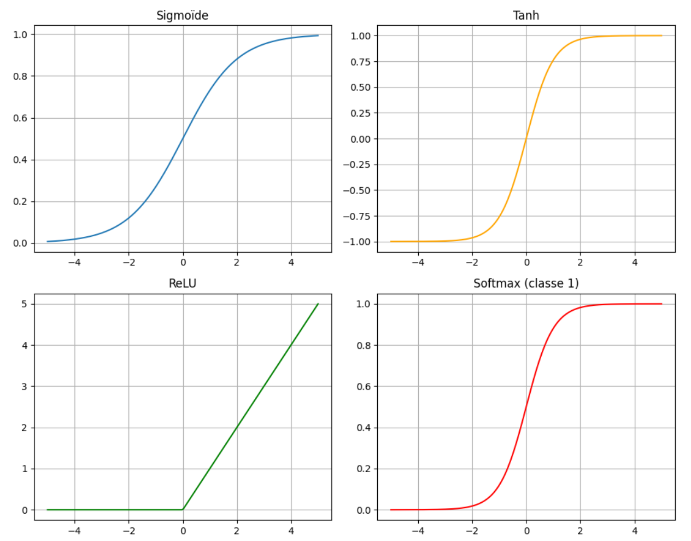
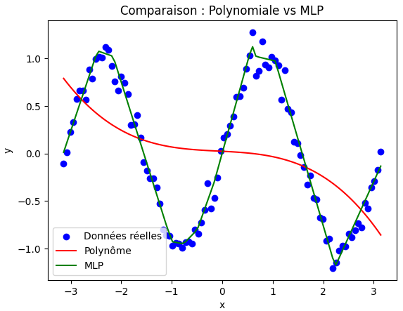

.. slide::
Chapitre 2 — Perceptron multi-couches (partie 1)
===========================================

🎯 Objectifs du Chapitre
----------------------

.. important::

    À la fin de cette section,  vous saurez :  

    - Le fonctionnement du perceptron simple.
    - Utiliser une fonction d'activation adaptée.  
    - L’importance de la normalisation / standardisation des données et l'usage des epochs.  
    - Construire un réseau de neurones avec ``torch.nn``. 
    - Faire un entraînement simple d’un MLP pour un problème de régression.   
    - Suivre l’évolution de la loss et interpréter les résultats.  
    - Utiliser ``torch-summary`` pour inspecter l’architecture du réseau.  

.. slide::

📖 1. Rappels sur les perceptrons
----------------------

Le perceptron multi-couches (MLP de Multi-Layers Perceptron en anglais) est la brique de base des réseaux de neurones modernes. Dans ce chapitre, nous allons l’appliquer à des problèmes de régression simple. Avant de commencer, voici quelques rappels.

1.1. Perceptron simple
~~~~~~~~~~~~~~~~~~~~~~

Le perceptron est le bloc de base d’un réseau de neurones. Il réalise une transformation linéaire suivie (ou pas) d’une fonction d’activation telle que :  

  .. math::

     y = \sigma(Wx + b)

  où :  
   - $$y$$ est la sortie du perceptron, 
   - $$\sigma$$ est une fonction d’activation, 
   - $$W$$ est la matrice des poids,  
   - $$b$$ est le biais et  
   - $$x$$ est l'ensemble des entrées du perceptron.  

.. slide::
1.2. Perceptron intuition
~~~~~~~~~~~~~~~~~~~~~~
.. image:: images/chap2_perceptron.png
    :alt: perceptron
    :align: center
    :width: 40%

avec $$y= \sigma(x_1*w_1 + x_2*w_2 + ...+ x_i*w_i + ... + x_n*w_n + b)$$

💡 **Intuition :**

    - Chaque poids $$w_i$$ mesure l’importance de la caractéristique $$x_i$$.  
    - Le biais $$b$$ déplace la frontière de décision.  
    - La fonction d’activation permet d’introduire de la non-linéarité, indispensable pour modéliser des relations complexes mais nous en parlerons plus en détails par la suite.  

.. slide::
1.3. Mise à jour des paramètres
~~~~~~~~~~~~~~~~~~~~~~

Un perceptron possède deux types de **paramètres** : les **poids** et le **biais**.  

Lors de l’entraînement, on souhaite ajuster ces paramètres pour améliorer les prédictions du modèle.  Pour cela, il faut mettre à jour les poids après avoir calculé la loss grâce à la fonction de perte et le gradient grâce à l'optimiseur comme expliqué dans le chapitre précédent.  

Pour rappel, on met à jour les paramètres du modèle grâce à l'équation introduite dans le chapitre précédent. 

.. math::

    \theta \leftarrow \theta - \eta \, \nabla_\theta \mathcal{L}(\theta)

où :  

    - $$\theta$$ représente l’ensemble des paramètres du modèle (ici $$W$$ et $$b$$),  
    - $$\mathcal{L}$$ est la fonction de perte,  
    - $$\nabla_\theta \mathcal{L}$$ est le gradient de la perte par rapport aux paramètres,  
    - $$\eta$$ est le taux d’apprentissage (learning rate en anglais).

.. slide::
1.4. Exemples d'applications du perceptron simple
~~~~~~~~~~~~~~~~~~~~~~~~~~~~~~~~~~~~~~~~~~~~~

Un perceptron simple ne peut résoudre que les problèmes linéairement séparables puisqu'en trouvant les paramètres du modèle, le perceptron trace une droite dans le plan des entrées et sépare les points selon qu’ils sont au-dessus ou en dessous de cette droite.

**Exemple 1 : porte logique ET**

+-----+-----+-------+
| x₁  | x₂  | y=ET  |
+=====+=====+=======+
|  0  |  0  |   0   |
+-----+-----+-------+
|  0  |  1  |   0   |
+-----+-----+-------+
|  1  |  0  |   0   |
+-----+-----+-------+
|  1  |  1  |   1   |
+-----+-----+-------+

Dans ce cas, une droite sépare bien les deux classes :  

    - la classe $$0$$ (points en bas à gauche, en haut à gauche, en bas à droite),  
    - la classe $$1$$ (point en haut à droite).  

Un perceptron simple peut donc apprendre cette fonction.

.. slide::
**Exemple 2 : porte logique XOR**

+-----+-----+--------+
| x₁  | x₂  | y=XOR  |
+=====+=====+========+
|  0  |  0  |   0    |
+-----+-----+--------+
|  0  |  1  |   1    |
+-----+-----+--------+
|  1  |  0  |   1    |
+-----+-----+--------+
|  1  |  1  |   0    |
+-----+-----+--------+

Ici, il est impossible de tracer une seule droite qui sépare correctement les classes. Autrement dit, XOR n’est pas linéairement séparable.  

.. image:: images/chap2_et_vs_xor.png
   :alt: Représentation du XOR dans le plan (non-séparable linéairement)
   :align: center
   :width: 300%

**Conclusion :** 

    - Le perceptron simple suffit pour des tâches linéaires (comme ET, OU).  
    - Pour résoudre des problèmes plus complexes comme XOR, il faut introduire plusieurs couches de neurones et des fonctions d’activation non-linéaires : c’est le principe du **perceptron multi-couches (MLP)**. 

.. slide::
1.5. Faire un perceptron dans PyTorch
~~~~~~~~~~~~~~~~~~~~~~~~~~~~~~~~~~~~~~~~~~~~~

Pour créer un perceptron simple dans PyTorch, on peut utiliser la fonction ``Linear`` de ``torch.nn``, qui implémente une couche linéaire (ou affine) : $$y = Wx + b$$. La fonction ``Linear`` prend en entrée le nombre d'entrée $$x$$ et le nombre de sortie $$y$$.

.. code-block:: python

    import torch
    import torch.nn as nn

    # Données ET
    X = torch.tensor([[0,0],[0,1],[1,0],[1,1]], dtype=torch.float32)
    y = torch.tensor([[0],[0],[0],[1]], dtype=torch.float32)

    # Modèle linéaire (perceptron)
    model = nn.Linear(2, 1, bias=True)

    # Loss function et optimiseur
    loss_fc = nn.MSELoss()
    optimizer = torch.optim.SGD(model.parameters(), lr=0.1)

    # Entraînement
    for _ in range(500):
        optimizer.zero_grad()
        loss = loss_fc(model(X), y)
        loss.backward()
        optimizer.step()

    # Résultat
    with torch.no_grad():
        print((model(X)).round())
        print(model.weight, model.bias)

**Remarque** : si maintenant on change les entrées et sorties pour le XOR, le modèle ne pourra pas apprendre correctement la fonction (les $$W$$ restent à 0 comme à l'initialisation). Vous pouvez faire le test pour vérifier.

.. slide::

📖 2. Fonction d'activation
-----------

Les fonctions d’activation introduisent de la non-linéarité dans le modèle, ce qui permet de mieux capturer des relations complexes dans les données. Sans une fonction d'activation, un perceptron (ou même plusieurs formant un réseau de neurones de plusieurs couches) ne ferait que des combinaisons linéaires et ne pourrait pas résoudre des problèmes non linéaires comme XOR. 

.. slide::
2.1. Équations des fonctions d'activation
~~~~~~~~~~~~~~~~~~~~~~~~~~~~~~~~~~~~~~~~~~~~

Voici quatre fonctions d’activation couramment utilisées :

1. **Sigmoïde** : $$\sigma(x) = \frac{1}{1 + e^{-x}}$$
   - Sortie comprise entre 0 et 1.
   - Utilisée pour les problèmes de classification binaire.

2. **Tanh** : $$\tanh(x) = \frac{e^x - e^{-x}}{e^x + e^{-x}}$$
   - Sortie comprise entre -1 et 1.
   - Souvent utilisée dans les couches cachées des réseaux de neurones.

3. **ReLU (de Rectified Linear Unit en anglais)** : $$\text{ReLU}(x) = \max(0, x)$$
   - Sortie nulle pour les entrées négatives.
   - La plus utilisée dans les réseaux de neurones profonds en raison de sa simplicité et de son efficacité.

4. **Softmax** : $$\text{Softmax}(x_i) = \frac{e^{x_i}}{\sum_{j} e^{x_j}}$$
   - Transforme un vecteur en une distribution de probabilité (chaque sortie est comprise entre 0 et 1 et la somme vaut 1).
   - Utilisée en sortie des modèles de classification multi-classes.

.. slide::
2.2. Représentation graphique des fonctions d'activation
~~~~~~~~~~~~~~~~~~~~~~~~~~~~~~~~~~~~~~~~~~~~

.. slide::
2.3. Les fonctions d'activation dans PyTorch
~~~~~~~~~~~~~~~~~~~~~~~~~~~~~~~~~~~~~

Dans PyTorch, les fonctions d'activation sont disponibles dans la bibliothèque ``torch.nn``. Voici quelques exemples :

1. **Sigmoïde** : ``nn.sigmoid(x)``
2. **Tanh** : ``nn.tanh(x)``
3. **ReLU** : ``nn.relu(x)``
4. **Softmax** : ``nn.softmax(x, dim=1)``

.. slide::
2.4. Rôle de la fonction d’activation
~~~~~~~~~~~~~~~~~~~~~~~~~~~~~~~~~~~~~

Reprenons le problème ET avec un perceptron.

- **Sans fonction d’activation** :  
  Le perceptron calcule une combinaison linéaire des entrées : $$ z = w_1 x_1 + w_2 x_2 + b $$.

  La sortie est un nombre réel, positif ou négatif. Pour classer les données, on fixe un seuil arbitraire (par exemple : si $$z > 0$$ alors classe 1, sinon 0). La frontière de décision reste **linéaire**.

- **Avec une fonction d'activation (la fonction sigmoïde par exemple)** :  
  On applique une transformation non linéaire : $$\hat{y} = \sigma(z) = \frac{1}{1 + e^{-z}}$$.

  La sortie est toujours comprise entre 0 et 1. On peut alors l’interpréter comme une **probabilité** qui mesure la confiance du modèle dans sa prédiction : proche de 0 → classe 0 et proche de 1 → classe 1. Le seuil devient naturel : **0.5**.

.. note::
Remarque : Dans le cas où le problème à résoudre est non linéairement séparable (comme XOR), une fonction d’activation seule ne suffit pas. Il faut empiler plusieurs couches de neurones avec des fonctions d’activation entre chaque couche pour capturer la complexité des données.

.. slide::
2.5. Exemple d'utilisation des fonctions d'activation
~~~~~~~~~~~~~~~~~~~~~~~~~~~~~~~~~~~~~~~~~~~~

Voici un exemple d'utilisation des fonctions d'activation pour le problème ET avec un perceptron :

.. code-block:: python

    import torch
    import torch.nn as nn

    # Données ET
    X = torch.tensor([[0,0],[0,1],[1,0],[1,1]], dtype=torch.float32)
    y = torch.tensor([[0],[0],[0],[1]], dtype=torch.float32)

    # --- Cas 1 : Perceptron sans activation ---
    linear = nn.Linear(2, 1, bias=True)
    with torch.no_grad():
        linear.weight[:] = torch.tensor([[1., 1.]])  # w1=1, w2=1
        linear.bias[:] = torch.tensor([-1.5])        # b=-1.5

    z = linear(X)  # sortie brute
    print("Sorties sans activation :")
    print(z)

    # --- Cas 2 : Perceptron avec sigmoïde ---
    sigmoid = nn.Sigmoid()
    y_hat = sigmoid(z)
    print("\nSorties avec sigmoïde :")
    print(y_hat)

Une sortie brute comme -1.5 devient 0.18 après sigmoïde, et 0.5 devient 0.62 : la sigmoid transforme les nombres en valeurs entre 0 et 1, les rendant interprétables comme des probabilités.

.. slide::
2.6. Choisir la fonction d'activation adaptée
~~~~~~~~~~~~~~~~~~~~~~~~~~~~~~~~~~~~~~~~~~~~
On peut choisir la fonction d’activation en fonction de plusieurs critères: le problème à résoudre ou la convergence de l'entraînement.

**Choix selon le contexte** : 

  - Pour une sortie binaire, la sigmoïde est adaptée car elle renvoie une valeur entre 0 et 1, interprétable comme une probabilité.  
  - Pour une sortie multi-classes, la fonction Softmax normalise les valeurs pour obtenir une distribution de probabilité.  
  - Pour des sorties continues ou pour moduler les valeurs internes, ReLU ou Tanh peuvent être utilisées.

**Impact sur l’apprentissage** :  
  Certaines fonctions d’activation influencent la vitesse de convergence. Par exemple, la sigmoïde borne les sorties, ce qui peut réduire l’amplitude des gradients et ralentir l’apprentissage pour de grandes valeurs absolues.

.. slide::
📖 3. Epoch
-----------

Lorsqu’on entraîne un modèle de machine learning, il est nécessaire de présenter plusieurs fois l’ensemble des données d’apprentissage $$x$$ au modèle afin d’ajuster correctement ses paramètres.

3.1 Définitions
~~~~~~~~~~~~~~~~~~~~~~~~~~

- **Itération** : mise à jour des paramètres du modèle après avoir traité un seul exemple ou un mini-batch.  
- **Batch / mini-batch** : sous-ensemble d’exemples utilisé pour calculer la descente de grandient et la mise à jour des paramètres.  
- **Epoch** : passage complet sur toutes les données d’apprentissage.  

**Exemple** :

Si vous disposez de 1000 exemples et que vous utilisez des mini-batchs de 100 exemples chacun, une epoch correspond à 10 itérations (1000 ÷ 100). Après chaque epoch, chaque exemple de l’ensemble d’apprentissage a été utilisé exactement une fois pour mettre à jour les paramètres du modèle.

.. slide::
3.2 Pourquoi effectuer plusieurs epochs ?
~~~~~~~~~~~~~~~~~~~~~~~~~~~~~~~~~~~~~~~~

Au début de l’entraînement, le modèle commet souvent de grandes erreurs.  Chaque epoch permet aux poids et aux biais de s’ajuster progressivement, améliorant ainsi les prédictions. En pratique, plusieurs dizaines ou centaines d’epochs sont souvent nécessaires pour que la loss se stabilise et que le modèle converge vers une bonne solution.

💡 **Intuition** : imaginez un perceptron comme un élève qui apprend : il ne retient pas tout parfaitement du premier coup. Il faut plusieurs passages sur les mêmes exercices pour maîtriser la tâche.

.. slide::

📖 4. Normalisation et standardisation des données
--------------------------------------------------

Avant d'entraîner un modèle, il est important de préparer les données pour que l’apprentissage soit efficace. Pour cela, deux opérations courantes sont la normalisation et la standardisation.

4.1. Normalisation
~~~~~~~~~~~~~~~~~

La normalisation consiste à mettre les valeurs dans une plage donnée, souvent entre 0 et 1. Cela est utile lorsque les données ont des échelles très différentes. Pour cela, il faut appliquer la formule suivante à chaque donnée:

.. math::

   x'_i = \frac{x_i - x_\text{min}}{x_\text{max} - x_\text{min}}

- $$x_\text{min}$$ et $$x_\text{max}$$ sont respectivement la valeur minimale et maximale de la variable.  
- $$x'_i$$ est la valeur normalisée.

.. slide::
4.2. Exemple de normalisation avec PyTorch
~~~~~~~~~~~~~~~~~

.. code-block:: python

    import torch
    X = torch.tensor([[1., 50.],[2., 60.],[3., 55.]])
    X_min = X.min(dim=0).values
    X_max = X.max(dim=0).values
    X_norm = (X - X_min) / (X_max - X_min)
    print(X_norm)

.. slide::
4.3. Standardisation
~~~~~~~~~~~~~~~~~~

La standardisation consiste à centrer et réduire les variables : on soustrait la moyenne et on divise par l’écart-type. C’est particulièrement utile pour les algorithmes basés sur le gradient (comme les perceptrons), car cela accélère la convergence. Pour standardiser les données voici la formule à appliquer pour chaque donnée :

.. math::

   x'_i = \frac{x_i - \mu}{\sigma}

- $$\mu$$ est la moyenne de la variable.  
- $$\sigma$$ est l’écart-type.  

.. slide::
4.4. Exemple de standardisation avec PyTorch
~~~~~~~~~~~~~~~~~~
 Contrairement à la normalisation, la standardisation a une fonction dans PyTorch pré-implémentée nommée ``torch.nn.BatchNorm1d``. Voici comment l'implémenter avec PyTorch :

.. code-block:: python
    import torch
    import torch.nn as nn

    X = torch.tensor([[1., 50.],[2., 60.],[3., 55.]], dtype=torch.float32)

    # Standardisation "manuelle"
    X_mean = X.mean(dim=0)
    X_std = X.std(dim=0)
    X_stdized = (X - X_mean) / X_std
    print("Standardisation manuelle :")
    print(X_stdized)

    # Standardisation avec BatchNorm1d
    batchnorm = nn.BatchNorm1d(num_features=2, affine=False)
    X_stdized_bn = batchnorm(X)
    print("\nStandardisation avec BatchNorm1d :")
    print(X_stdized_bn)

.. slide::
4.5. Normalisation vs. Standardisation
~~~~~~~~~~~~~~~~~~
   
La standardisation est souvent préférée à la normalisation car elle est **plus robuste aux valeurs aberrantes** et permet une **convergence plus rapide** du modèle.

- **Robustesse aux valeurs aberrantes** : la standardisation centre et réduit les données par rapport à la moyenne et à l’écart-type, plutôt que de les ramener dans une plage fixe comme la normalisation Min-Max. Une valeur très grande ou très petite affecte moins l’échelle globale et n’écrase pas les autres données.

- **Convergence plus rapide** : la standardisation met toutes les variables sur une échelle comparable. Sans standardisation, une variable avec de grandes valeurs provoque de très grands gradients dans sa direction, tandis qu’une variable plus petite change lentement. Le gradient combiné suit alors une trajectoire en zigzag, avançant lentement vers le minimum. En standardisant, les gradients sont équilibrés et le modèle descend plus directement vers la solution optimale.

.. slide::
4.6. Ce qui est attendu après la standardisation
~~~~~~~~~~~~~~~~~~

Après avoir centré et réduit les données, la standardisation permet généralement d'avoir une **moyenne proche de 0** et un **écart-type proche de 1** pour chaque variable.

**Pourquoi ?**

  - Une moyenne proche de 0 aide les fonctions d'activation et la descente de gradient à mieux fonctionner, sans que le modèle ne doive apprendre un biais pour décaler toutes les données.
  - Un écart-type proche de 1 met toutes les données sur une échelle comparable, ce qui évite que certaines variables dans les données dominent les gradients et permet une descente plus directe vers le minimum de la loss.

.. note::
   Si la standardisation est appliquée sur un mini-batch (par exemple avec ``BatchNorm1d``), la moyenne et l’écart-type sont calculés sur ce mini-batch. Dans ce cas, la moyenne n’est pas exactement 0 et l’écart-type n’est pas exactement 1 pour l’ensemble du dataset. De plus, certains modules comme BatchNorm peuvent apprendre un scale et un shift, modifiant légèrement ces valeurs finales.

**Est-ce grave si ce n'est pas exactement 0 et 1 ?**

  - Pas nécessairement : une moyenne et un écart-type approximatifs suffisent généralement pour que l'apprentissage reste efficace.
  - Par contre, si les valeurs sont très éloignées de 0 ou très dispersées, certaines fonctions d'activation peuvent saturer et ralentir la convergence.

.. slide:: 

📖 5. Réseaux de neurones multi-couches (MLP)
--------------------------------------------

Les réseaux de neurones multi-couches (MLP, de l'anglais Multi-Layer Perceptron) permettent de résoudre des problèmes non linéaires comme XOR, que le perceptron simple ne peut pas gérer. Un MLP se compose de **couches linéaires** suivies de **fonctions d'activation**, et peut être construit très simplement avec ``torch.nn.Sequential``.

5.1. Définitions
~~~~~~~~~~~~~~~~

- **Une couche** d'un MLP se compose d'un ensemble de perceptrons. Chaque perceptron (aussi appelé neurone) reçoit les mêmes entrées et produit une sortie individuelle. La combinaison des sorties de tous les perceptrons forme le vecteur de sortie de la couche.

- Il existe plusieurs types de couches :
  - **La couche d'entrée** reçoit les features du dataset et les transmet à la première couche cachée.
  - **Les couches cachées** sont situées entre l'entrée et la sortie, elles permettent de modéliser des relations non linéaires entre les variables.
  - **La couche de sortie** produit la sortie finale du réseau (par exemple, une probabilité pour la classification binaire).

.. slide:: 
5.2. Construction d'un MLP
~~~~~~~~~~~~~~~~~~~~~~~~~~

Pour construire un MLP, il faut choisir le nombre de couches et de neurones par couche ainsi que la fonction d'activation à utiliser après chaque couche. Il n’est généralement pas possible de connaître à l’avance le nombre exact à mettre. On teste plusieurs architectures pour trouver celle qui converge correctement et rapidement.

- Nombre de couches cachées : généralement 1 ou 2 couches suffisent pour des problèmes simples comme XOR. Pour des problèmes plus complexes, plusieurs couches peuvent être nécessaires.  
- Nombre de neurones par couche : il n’existe pas de règle stricte. On choisit un nombre suffisant pour capturer la complexité du problème, mais pas trop pour éviter le surapprentissage (lorsque le modèle s'adapte trop aux données d'entraînement et ne généralise pas bien sur de nouvelles données).  
- En pratique, on peut commencer par un petit nombre de neurones et augmenter si le modèle n’arrive pas à converger correctement.

💡 Résumé :  
Chaque couche d’un MLP est un ensemble de perceptrons. Les couches cachées permettent de modéliser la non-linéarité, et le nombre de couches et de neurones doit être choisi en fonction de la complexité du problème et de la performance souhaitée.

.. slide:: 
5.3. Construire un MLP simple avec ``torch.nn``
~~~~~~~~~~~~~~~~~~~~~~~~~~~~~~~~~~~~~~~~~~~~~~

Pour créer un MLP dans PyTorch, on utilise principalement :  

- ``Sequential`` : permet d’empiler facilement les couches les unes après les autres.  
- ``Linear`` : crée une couche affine, c’est-à-dire une transformation de la forme $$y = Wx + b$$.  
- Fonctions d’activation : introduisent de la **non-linéarité** dans le modèle (par exemple ``nn.ReLU()`` ou ``nn.Sigmoid()``).

Exemple minimal d’un réseau de neurones pour une régression 1D avec un MLP à deux couches cachées :

.. code-block:: python

   import torch.nn as nn

   model = nn.Sequential(
       nn.Linear(1, 10),   # couche d'entrée 1D -> première couche cachée 10 neurones
       nn.ReLU(),           # activation non linéaire
       nn.Linear(10, 5),    # deuxième couche cachée avec 5 neurones
       nn.ReLU(),           # activation non linéaire
       nn.Linear(5, 1)      # couche de sortie 1D
   )

💡 Remarques :  

    - La première couche transforme l’entrée en un vecteur de dimension 10.
    - La deuxième couche réduit ce vecteur à 5 dimensions, permettant au réseau de combiner et transformer les features.
    - Chaque couche cachée est suivie d’une fonction d’activation capturant la non-linéarité. 
    - La couche finale produit la sortie finale du réseau.

.. note:: 
    **Important** : La dimension de sortie d’une couche doit correspondre à la dimension d’entrée de la couche suivante.  

.. slide:: 
5.4. Construire un MLP avec une classe
~~~~~~~~~~~~~~~~~~~~~~~~~~~~~~~~~~~~~~

Dans PyTorch, il est courant de définir un modèle en créant une classe qui hérite de ``nn.Module``. Cela permet de mieux organiser le code, de réutiliser facilement le modèle. Dans ce cas, la méthode ``forward``  décrit comment les données traversent le réseau.

Voici le même exemple que précédemment avec une classe :

.. code-block:: python

   import torch
   import torch.nn as nn

   class SimpleMLP(nn.Module):
       def __init__(self):
           super(SimpleMLP, self).__init__()
           self.fc1 = nn.Linear(1, 10)   # première couche cachée
           self.fc2 = nn.Linear(10, 5)   # deuxième couche cachée
           self.fc3 = nn.Linear(5, 1)    # couche de sortie
           self.relu = nn.ReLU()         # fonction d'activation

       def forward(self, x):
           x = self.relu(self.fc1(x))
           x = self.relu(self.fc2(x))
           x = self.fc3(x)
           return x

    # Création d'une instance du modèle
    model = SimpleMLP()

💡 Remarques : 

    - La méthode ``forward`` définit comment les données passent de la couche d'entrée à la sortie, en appliquant les fonctions d’activation entre les couches.  
    - L’avantage de la classe : elle permet de séparer la définition du modèle et l’entraînement, ce qui rend le code plus clair et modulable.  
    - On peut facilement réutiliser ce modèle pour différentes entrées ou problèmes.

.. slide::
5.5. Résoudre XOR avec un MLP
~~~~~~~~~~~~~~~~~~~~~~~~~~~~~~~~~~~~~~~

Comme expliqué précédemment, un perceptron simple ne peut pas résoudre le problème XOR, même avec une fonction d’activation, car il ne fait qu’une séparation linéaire (une droite).

    - Pour le XOR, il faut un réseau de neurones avec au moins une couche cachée et une fonction d’activation à la sortie de la couche cachée.
    - La frontière de décision apprise n’est plus une droite mais une courbe formée par la combinaison des sorties de plusieurs neurones. Visuellement, cela peut ressembler à deux demi-plans combinés ou à une courbe fermée entourant certains points, selon l’activation utilisée (Tanh ou ReLU).

Exemple minimal en PyTorch avec une seule couche cachée et une activation non-linéaire :

.. code-block:: python

    import torch
    import torch.nn as nn
    import torch.optim as optim
    import matplotlib.pyplot as plt

    # Données XOR
    X = torch.tensor([[0,0],[0,1],[1,0],[1,1]], dtype=torch.float32)
    y = torch.tensor([[0],[1],[1],[0]], dtype=torch.float32)

    # Définition du MLP avec une classe
    class XORMLP(nn.Module):
        def __init__(self):
            super(XORMLP, self).__init__()
            self.fc1 = nn.Linear(2, 4)  # couche cachée 1
            self.fc2 = nn.Linear(4, 1)  # couche de sortie
            self.activation = nn.ReLU()
            self.out_activation = nn.Sigmoid()
        
        def forward(self, x):
            x = self.activation(self.fc1(x))
            x = self.out_activation(self.fc2(x))
            return x

    # Création du modèle
    model = XORMLP()

    # Optimiseur et fonction de perte
    optimizer = optim.Adam(model.parameters(), lr=0.05)
    fc_loss = nn.MSELoss()

    # Entraînement
    for epoch in range(5000):
        y_pred = model(X)
        loss = fc_loss(y_pred, y)
        optimizer.zero_grad()
        loss.backward()
        optimizer.step()

    # Vérification numérique
    with torch.no_grad():
        y_pred_train = model(X)
        y_class = (y_pred_train > 0.5).float()
        print("Prédictions (probabilités) :\n", y_pred_train)
        print("Classes prédites :\n", y_class)
        print("Classes réelles :\n", y)
        correct = (y_class == y).all()
        print("Toutes les prédictions sont correctes :", correct)

    # Affichage de la frontière de décision
    xx, yy = torch.meshgrid(torch.linspace(-0.5, 1.5, 200),
                            torch.linspace(-0.5, 1.5, 200))
    grid = torch.cat([xx.reshape(-1,1), yy.reshape(-1,1)], dim=1)
    with torch.no_grad():
        zz = model(grid).reshape(xx.shape)

    plt.contourf(xx, yy, zz, levels=[0,0.5,1], alpha=0.3, colors=["red","blue"])
    plt.scatter(X[:,0], X[:,1], c=y[:,0], cmap="bwr", edgecolors="k", s=100)
    plt.title("Frontière de décision XOR avec MLP en classe")
    plt.xlabel("x1")
    plt.ylabel("x2")
    plt.show()

💡 Remarques :

- La fonction d’activation dans la couche cachée est essentielle pour résoudre des problèmes non linéaires comme XOR.
- La sortie finale est transformée par la Sigmoïde, produisant une probabilité entre 0 et 1 pour la classification binaire.
- Même un petit MLP avec une seule couche cachée de 4 neurones suffit pour apprendre XOR grâce à la non-linéarité introduite par ReLU.
- L’utilisation d’une classe et de la méthode ``forward`` rend le code plus modulable et facilite l’expérimentation avec différentes architectures de MLP.
- Vous pouvez remplacer la ReLU par une Tanh et voir la différence dans l'affichage.

.. slide::
5.6. Standardisation et entraînement d'un MLP sur un exemple de régression
~~~~~~~~~~~~~~~~~~~~~~~~~~~~~~~~~~~~~~~

On repart avec un exemple de régression simple pour illustrer l'importance de la standardisation des données avant l'entraînement d'un MLP. L'objectif est de prédire la sortie y pour de nouvelles entrées x que celles sur lesquelles le modèle a été entraîné.

.. code-block:: python

   import torch
   import torch.nn as nn
   import torch.optim as optim
   import matplotlib.pyplot as plt

   # Données
   X = torch.tensor([[0.],[10.],[20.],[30.],[40.],[50.]])
   y = 2*X + 1 # relation linéaire exacte
   # y = 2*X + 1 + torch.randn_like(X)*5  # relation linéaire bruitée

   # Standardisation
   X_mean, X_std = X.mean(), X.std()
   X_stdized = (X - X_mean)/X_std

   # Modèle simple
   class MLP(nn.Module):
       def __init__(self):
           super().__init__()
           self.net = nn.Sequential(
               nn.Linear(1, 5),
               nn.ReLU(),
               nn.Linear(5,1)
           )
       def forward(self, x):
           return self.net(x)

   # Modèles
   model_no_std = MLP()
   model_std = MLP()

   # Optimiseur
   optimizer_no_std = optim.SGD(model_no_std.parameters(), lr=0.001)
   optimizer_std = optim.SGD(model_std.parameters(), lr=0.01)

   # Entraînement
   for _ in range(5000):
       # Sans standardisation
       pred_no_std = model_no_std(X)
       loss_no_std = ((pred_no_std - y)**2).mean()
       optimizer_no_std.zero_grad()
       loss_no_std.backward()
       optimizer_no_std.step()

       # Avec standardisation
       pred_std = model_std(X_stdized)
       loss_std = ((pred_std - y)**2).mean()
       optimizer_std.zero_grad()
       loss_std.backward()
       optimizer_std.step()

   # Test des prédictions
   X_test = torch.tensor([[0.],[60.]])
   X_test_std = (X_test - X_mean)/X_std

   with torch.no_grad():
       preds_no_std = model_no_std(X_test)
       preds_std = model_std(X_test_std)

   print("Prédictions finales (Sans standardisation) :", preds_no_std.squeeze().tolist())
   print("Prédictions finales (Avec standardisation)  :", preds_std.squeeze().tolist())

   # Visualisation
   plt.scatter(X, y, color='black', label='Données')
   plt.scatter(X_test, preds_no_std, color='red', label='Sans standardisation')
   plt.scatter(X_test, preds_std, color='blue', label='Avec standardisation')
   plt.legend()
   plt.title("Impact de la standardisation sur la prédiction finale")
   plt.xlabel("x")
   plt.ylabel("y")
   plt.show()

.. slide::
5.7. Analyse des résultats de l'exemple de régression
~~~~~~~~~~~~~~~~~~~~~~~~~~
Les sorties attendues sont $$y_{true} = [1, 121]$$.

- **Sans standardisation** :  
  Prédictions finales $$\approx [1.0, 60.98]$$ → Le modèle prédit correctement pour $$x=0$$ mais extrapole mal pour $$x=60$$.  Cela montre que l’échelle des données peut déséquilibrer la descente de gradient.

- **Avec standardisation** :  
  Prédictions finales $$\approx [0.99999, 120.99]$$ → Le modèle prédit presque parfaitement la relation linéaire. La standardisation permet de centrer et réduire les données, équilibrant les gradients et accélérant la convergence.

💡 **Conclusion** :

    - La standardisation rend le modèle plus stable et fiable pour des valeurs en dehors de l’échelle d’entraînement.  
    - Même pour un réseau simple, ne pas standardiser peut provoquer des extrapolations incorrectes, alors que la standardisation corrige ce problème.
    - De plus, si les données d'entrée sont bruitées, ne pas standardiser peut dégrader encore plus les performances du modèle. Pour le tester, il suffit de décommenter la ligne ``y = 2*X + 1 + torch.randn_like(X)*5`` et relancer l'entraînement.

.. slide::

.. slide::
🍀 Exercice 1 : Approximations d’une fonction non linéaire
---------------------------------

Dans cet exercice, vous allez implémenter une boucle d'entraînement simple pour ajuster les paramètres d’un modèle polynômial comme dans le chapitre 1, puis comparer les résultats avec ceux d'un modèle MLP.

On vous donne les données suivantes :

.. code-block:: python

    torch.manual_seed(0)

    X = torch.linspace(-3, 3, 100).unsqueeze(1)
    y_true = torch.sin(X) + 0.1 * torch.randn(X.size())  # fonction sinusoïdale bruitée

**Objectif :** Comparer deux modèles pour approximer la fonction :

1. Polynôme cubique : $$y = f(x) = a x^3 + b x^2 + c x + d$$, où $$a, b, c, d$$ sont des paramètres appris automatiquement en minimisant l’erreur entre les prédictions et les données réelles comme dans le chapitre 1.

2. MLP simple :  

    - Implémenté sous forme de classe ``nn.Module``  
    - 2 couches cachées de 10 neurones chacune avec ``ReLU`` pour l'activation
    - Entrée : 1 feature, sortie : 1 prédiction

**Consigne :** Écrire un programme qui :
.. step:: 
    1) Ajuste les paramètres du polynôme cubique aux données en utilisant PyTorch.  

.. step::
    2) Affiche les paramètres appris $$a, b, c, d$$.  

.. step::
    3) Implémente ensuite un MLP et entraîne-le sur les mêmes données pendant 5000 epochs avec un learning rate de 0.01. 

.. step::     
    4) Compare visuellement les deux modèles avec les données réelles sur un même graphique. 

.. step::    
    5) Que remarquez-vous sur les performances des deux modèles ?

.. step::
    6) Que se passe-t-il si vous augmentez le nombre de degrés du polynôme ?

**Astuce :**
.. spoiler::
    .. discoverList::
        1. Initialisez les paramètres du polynôme avec ``torch.randn(1, requires_grad=True)``.  
        2. Utilisez ``nn.MSELoss()`` comme fonction de perte pour les deux modèles.  
        3. Pour le MLP, créez une classe héritant de ``nn.Module`` et définissez ``forward``.  
        4. Utilisez ``optimizer.zero_grad()``, ``loss.backward()``, ``optimizer.step()`` à chaque itération.  
        5. On voit que le MLP parvient à mieux s'adapter aux données, car il peut capturer des relations non linéaires plus complexes.

**Résultat attendu :** Vous devez obtenir un graphique similaire à celui ci-dessous où :  

- les points bleus correspondent aux données réelles (``y_true``)  
- la courbe rouge correspond au polynôme cubique  
- la courbe verte correspond au MLP  

