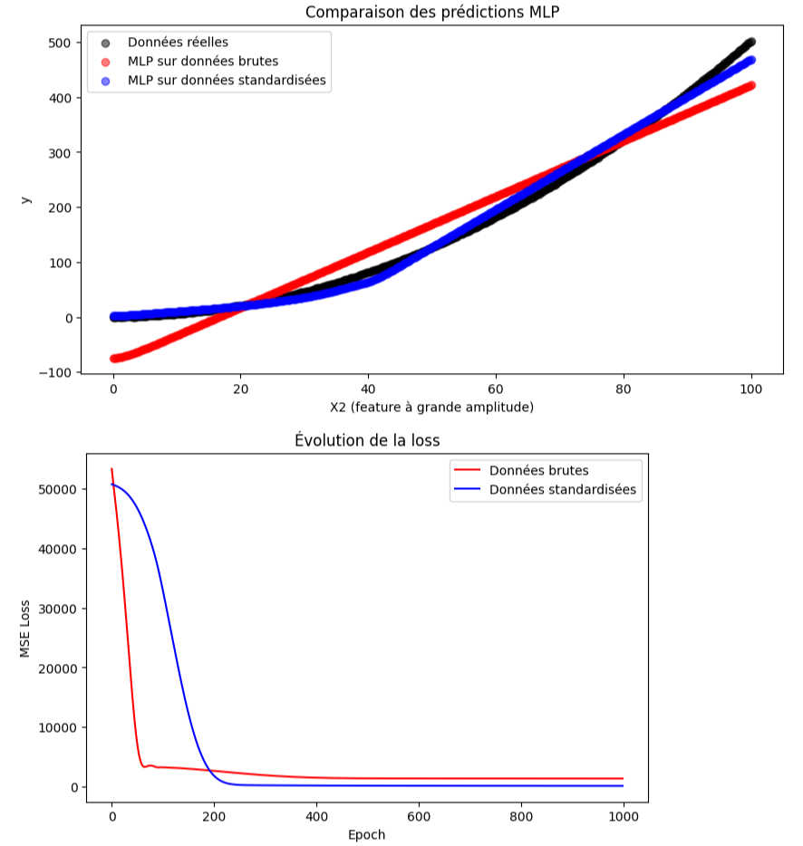
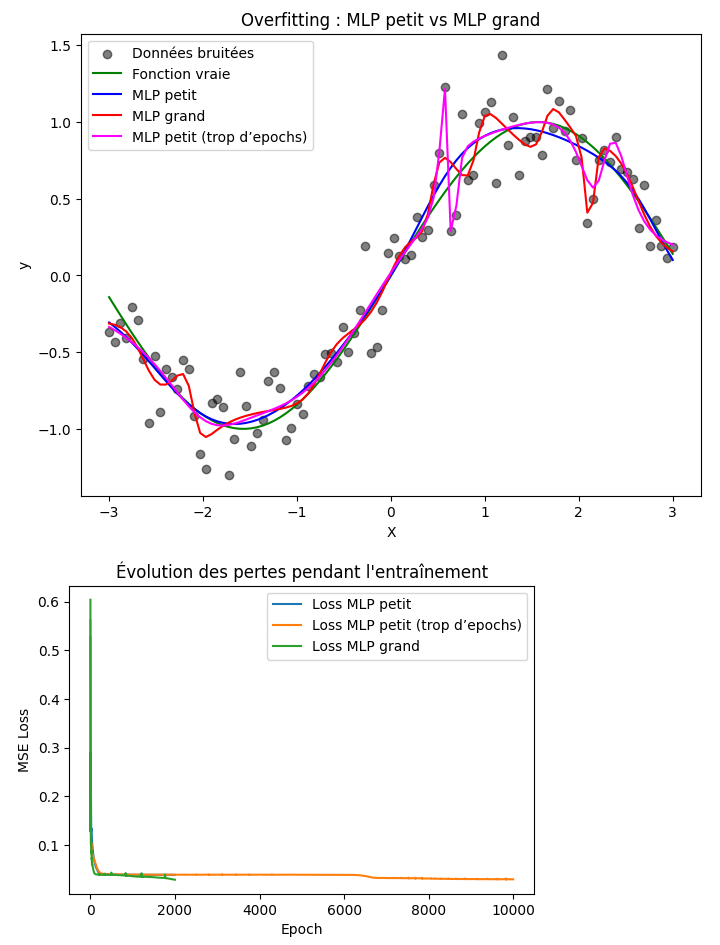

.. slide::
Chapitre 2 — Perceptron multi-couches (partie 2)
===========================================

🎯 Objectifs du Chapitre
----------------------

.. important::

    À la fin de cette section,  vous saurez :  

    - Le fonctionnement du perceptron simple.
    - Utiliser une fonction d'activation adaptée.  
    - L’importance de la normalisation / standardisation des données et l'usage des epochs.  
    - Construire un réseau de neurones avec ``torch.nn``. 
    - Faire un entraînement simple d’un MLP pour un problème de régression.   
    - Suivre l’évolution de la loss et interpréter les résultats.  
    - Utiliser ``torch-summary`` pour inspecter l’architecture du réseau.  

.. slide::

📖 6. Broadcasting
----------------------------

6.1 Qu'est-ce que le broadcasting ?
~~~~~~~~~~~~~~~~~~~~~~~~~~~~~~~~
Le broadcasting est un mécanisme qui permet à PyTorch de faire des opérations entre tenseurs de dimensions différentes sans avoir à écrire de boucles. C'est comme cela qu'est fait l'opération de centrage des données (soustraction de la moyenne) dans la standardisation des données.

💡 Idée principale :

- Si les dimensions des tenseurs sont compatibles, PyTorch réplique automatiquement le tenseur de plus petite dimension pour correspondre à la taille du tenseur le plus grand.
- Cela permet de vectoriser les calculs et de rendre le code plus simple et rapide.

.. slide::
6.2 Exemple de broadcasting pour centrer des données
~~~~~~~~~~~~~~~~~~~~~~~~~~~~~~~~~~~~~~~~~~~~~~~

.. code-block:: python

   import torch

   # Matrice 3x2
   X = torch.tensor([[1., 2.],
                     [3., 4.],
                     [5., 6.]])

   # Moyenne de chaque colonne
   mean = X.mean(dim=0)  # dimension (2,)

   # On soustrait la moyenne à chaque ligne
   X_centered = X - mean  # broadcasting

   print("X centré :", X_centered)

💡 Conclusion : Même si ``mean`` est un vecteur (dimension 2), PyTorch l’applique à toutes les lignes de ``X``. Le tenseur ``mean`` est automatiquement “étendu” pour correspondre à ``X``.  

✅ Résultat : On peut centrer toutes les lignes d’un coup, sans boucle.

.. slide::
📖 7. Observer la loss et déterminer le nombre d’epochs
------------------------------------------------------
Lorsqu’on entraîne un modèle, il est essentiel de suivre l’évolution de la loss pour savoir si le modèle apprend correctement et converge vers une solution. Dans l’exemple précédent, nous avons comparé l’impact de la standardisation sur les prédictions finales. Nous allons maintenant observer l’évolution de la loss pendant l’entraînement pour mieux comprendre la convergence et déterminer un nombre d’epochs approprié. Nous allons continuer à utiliser les données suivantes pour entraîner le modèle :

.. code-block:: python

   # Données d'entraînement
   X = torch.tensor([[0.],[10.],[20.],[30.],[40.],[50.]])
   y = 2*X + 1

7.1. Suivi de la loss
~~~~~~~~~~~~~~~~~~~~~

Pour suivre la loss pour le modèle avec et sans standardisation il faut d'abord créer deux listes pour stocker les valeurs de la loss à chaque epoch. Pour cela, il suffit d'ajouter le code suivant avant la classe de création du modèle : 

.. code-block:: python

    ...

    # Listes pour stocker l'évolution de la loss
    losses_no_std = []
    losses_std = []

    ...

.. slide::
Ensuite, pendant l’entraînement, on ajoute la valeur de la loss dans les listes à chaque epoch. Cela se fait comme suit : 

.. code-block:: python

    ...

    # Sans standardisation
    pred_no_std = model_no_std(X)
    
    ...

    optimizer_no_std.step()
    losses_no_std.append(loss_no_std.item()) # Ligne à ajouter

    # Avec standardisation
    pred_std = model_std(X_stdized)
    
    ...

    optimizer_std.step()
    losses_std.append(loss_std.item()) # Ligne à ajouter

    ...

.. slide::
Enfin on ajoute les lignes de code suivantes pour tracer les loss à la fin du code : 

.. code-block:: python

    ...

    # Visualisation de la loss
    plt.plot(losses_no_std, label='Sans standardisation')
    plt.plot(losses_std, label='Avec standardisation')
    plt.xlabel('Epoch')
    plt.ylabel('Loss MSE')
    plt.title("Évolution de la loss pendant l'entraînement")
    plt.legend()
    plt.show()

.. slide::
7.2. Interprétation du résultat
~~~~~~~~~~~~~~~~~~

- **Convergence** :  
  - Si la loss diminue et se stabilise autour d’une valeur faible, le modèle converge.  
  - Si la loss reste très élevée ou diverge, le modèle ne converge pas correctement.

- **Choix du nombre d’epochs** :  
  - En regardant le graphique, on peut déterminer à partir de quel epoch la loss se stabilise.  
  - Cela permet de choisir un nombre d’epochs suffisant sans sur-entraîner inutilement le modèle.
  - Dans cet exemple, on découvre que pour le modèle qui s'entraîne avec standardisation, la loss se stabilise à 0 autour de 500 epochs. Vous pouvez réduire le nombre d'epochs et vérifier que 500 epochs suffisent.

.. note::
    **Remarque** : Si vous relancer l'entraînement, le graphique de la loss peut varier à cause de l'initialisation aléatoire des poids sauf si vous utilisez un ``seed`` fixe.

.. slide::
7.3. Early Stopping
~~~~~~~~~~~~~~~~~~~~

Pour éviter de trop entraîner le modèle, on peut surveiller la loss et arrêter l’entraînement lorsque la perte ne diminue plus. Cela s’appelle l’early stopping. On peut automatiser le processus avec PyTorch. Tout d'abord, il faut remettre le nombre d'epoch à 5000. Ensuite il faut créer les variables suivantes et les ajouter avant la classe qui construit le modèle :

.. code-block:: python

    ...

    # Paramètres pour l'early stopping
    patience = 50       # nombre d'epochs sans amélioration avant arrêt
    best_loss_std = float('inf') # meilleure loss observée pour le modèle avec standardisation (initialisée à l'infini pour que la première amélioration soit toujours acceptée)
    counter_std = 0 # compteur d'epochs sans amélioration

    patience_no_std = 50
    best_loss_no_std = float('inf')    
    counter_no_std = 0

    ...

.. slide::
Ensuite, il faut ajouter le code suivant à la fin de chaque boucle d'entraînement pour vérifier si la loss s'est améliorée ou non. Si elle ne s'améliore pas pendant un certain nombre d'epochs (défini par ``patience``), l'entraînement s'arrête automatiquement. Voici le code à ajouter :

.. code-block:: python

    ...

    # Sans standardisation

    ...

    losses_no_std.append(loss_no_std.item())

    # Early stopping pour le modèle sans standardisation (code à ajouter)
    if loss_no_std.item() < best_loss_no_std:
        best_loss_no_std = loss_no_std.item()
        counter_no_std = 0
    else:
        counter_no_std += 1
    if counter_no_std >= patience_no_std:
        print(f"Arrêt anticipé (sans std) à l'epoch {epoch}, loss = {best_loss_no_std:.4f}")
        break

    # Avec standardisation
   
    ...

    losses_std.append(loss_std.item())

    # Early stopping pour le modèle standardisé (code à ajouter)
    if loss_std.item() < best_loss_std:
        best_loss_std = loss_std.item()
        counter_std = 0
    else:
        counter_std += 1
    if counter_std >= patience:
        print(f"Arrêt anticipé (avec std) à l'epoch {epoch}, loss = {best_loss_std:.4f}")
        break

    ...

.. slide::

💡 **Remarque** :  

- Cette méthode simple permet de déterminer un nombre d’epochs approprié automatiquement.  
- Pour cet exemple, le modèle sans standardisation des données ne converge jamais avec une loss $$\approx 0$$ tandis que le modèle avec standardisation des données converge à partir d'environ 200 epochs.
- Dans la pratique, on combine souvent early stopping avec un jeu de validation pour éviter le surapprentissage.

.. slide::
📖 8. Observer le modèle avec ``torch-summary`` et la performance des gradients avec autograd profiler
-------------------

Il existe plusieurs outils PyTorch qui permettent d'inspecter et de profiler les modèles. Le but étant de parvenir à identifier les goulots d'étranglement et à optimiser les performances. Parmi eux, on trouve :

- ``torchsummary`` : pour visualiser la structure du modèle et le nombre de paramètres par couche.
- ``torch.autograd.profiler`` : pour profiler le calcul des gradients et identifier les opérations coûteuses.

8.1. Utiliser ``torchsummary``
~~~~~~~~~~~~~~~~~~~~~~~~~~~~~

``torchsummary`` permet de visualiser la structure du modèle et le nombre de paramètres par couche avant l'entraînement. Pour l'utiliser, il faut d'abord l'installer :

.. code-block:: bash

    pip install torch-summary

Ensuite, juste après la définition de votre modèle, vous pouvez faire un résumé du modèle :

.. code-block:: python

    from torchsummary import summary

    # Modèle standardisé défini précédemment
    # Créer une copie sur CPU pour torchsummary
    model_std_cpu = MLP().to("cpu")

    # Résumé du modèle
    # input_size correspond aux dimensions d'un échantillon (hors batch)
    # Ici, chaque échantillon a 1 feature (scalaire)
    summary(model_std_cpu, input_size=(1,), device="cpu")

.. slide::
Explications :

- ``input_size`` : dimensions d’un échantillon (hors batch).  
  Dans notre exemple, chaque échantillon est un scalaire (1 feature), donc ``input_size=(1,)``.  
- ``device`` : est égal à ``"cpu"`` pour éviter tout conflit CUDA si le modèle ou PyTorch envoie certains tenseurs sur GPU.  

- Résultat : pour chaque couche, on voit :

  - le type de couche (Linear, ReLU…)
  - la taille des tenseurs intermédiaires
  - le nombre de paramètres
  - le nombre de paramètres entraînables

.. slide::
8.2. Rôle du profiler
~~~~~~~~~~~~~~~~~~~~~~~~~~~~~
Pour encore plus améliorer la performance de votre modèle, PyTorch fournit ``torch.autograd.profiler.profile`` pour profiler le calcul des gradients ce qui permet de :

- Mesurer le temps et la mémoire consommés par chaque opération.
- Identifier les goulots d'étranglement dans le réseau.
- Optimiser et débugger les modèles complexes.

.. slide::
8.3. Exemple d'utilisation du profiler pour l'exemple de régression
~~~~~~~~~~~~~~~~~~~~~~~~~~~~~~~~~~~~~~

Pour tester le profiler, il suffit d'ajouter le code suivant juste après le code de ``torchsummary`` :

.. code-block:: python

    ...

    # torch.autograd.profiler est utilisé dans ce chapitre pour la simplicité
    # Pour des usages avancés (timeline, TensorBoard), on peut utiliser torch.profiler
    import torch.autograd.profiler as profiler

    # Faire un profiling sur une seule passe avant la boucle d'entraînement
    with profiler.profile(use_cuda=True, profile_memory=True) as prof_dummy:
        # Forward + backward sur le modèle standardisé
        pred_std = model_std(X_stdized)
        loss_std = ((pred_std - y)**2).mean()
        optimizer_std.zero_grad()
        loss_std.backward()

    # Afficher le profil CPU (temps d'exécution)
    print("Profil CPU pour le modèle standardisé (une seule passe avant entraînement) :")
    print(prof_dummy.key_averages().table(sort_by="cpu_time_total"))

    # Afficher le profil GPU (mémoire consommée)
    print(prof_dummy.key_averages().table(sort_by="self_cuda_memory_usage", row_limit=10))

    ...

.. slide::
**Conclusion** : 

    - On peut profiler à la fois le **temps CPU** et la **mémoire GPU**.
    - On utilise :
        - ``cpu_time_total`` pour identifier les opérations coûteuses en calcul,
        - ``self_cuda_memory_usage`` pour repérer celles qui consomment le plus de mémoire GPU.
    - Le profiler ralentit fortement l'exécution : il ne doit pas être utilisé pendant tout l’entraînement, mais seulement ponctuellement pour analyser ou optimiser.

    - Chaque opération exécutée sur le CPU par PyTorch y est listée avec :
        - ``Self CPU %`` : temps passé directement dans l’opération.
        - ``CPU total %`` : temps total incluant les sous-opérations.
        - ``# of Calls`` : nombre d’appels à l’opération.

    - Chaque opération exécutée sur le GPU par PyTorch y est listée avec :
        - ``Self CUDA Memory Usage`` : mémoire GPU utilisée directement par l’opération.
        - ``CUDA Memory Usage`` : mémoire totale incluant les sous-opérations.
        - ``# of Calls`` : nombre d’appels à l’opération.

    - Les **couches linéaires** (``aten::linear``) prennent la majeure partie du temps : multiplication matricielle + bias.
    - Les **activations** (``ReLU``, ``Tanh``) et les calculs de **loss** (``mean``, ``pow``) consomment moins de temps mais sont nécessaires pour propager les gradients.
    - Les opérations comme ``detach`` ou ``clone`` apparaissent lorsqu’on fait des copies ou qu’on détache un tenseur du graphe pour ne pas calculer de gradient dessus.
    - Ce profilage permet de **visualiser les goulots d’étranglement** et d’optimiser l’entraînement si nécessaire.

    - Pour un petit MLP, le plus coûteux est le calcul des couches linéaires et du backward. Sur des modèles plus grands ou avec GPU, ces informations sont cruciales pour comprendre et améliorer les performances.

.. slide::
⚖️ Exercice 2 : Comparaison de l'entraînement d'un MLP sur données brutes et standardisées
---------------------------

Dans cet exercice, vous allez entraîner un MLP simple sur un jeu de données synthétiques avec deux features ayant des échelles différentes. Vous comparerez les performances lorsque les données sont brutes ou standardisées.

On vous donne les données suivantes :

.. code-block:: python

    # Données synthétiques
    N = 500
    X1 = torch.linspace(0, 1, N).unsqueeze(1)      # petite amplitude
    X2 = torch.linspace(0, 100, N).unsqueeze(1)    # grande amplitude
    X = torch.cat([X1, X2], dim=1)
    y = 3*X1 + 0.05*X2**2 + torch.randn(N,1) * 0.5

**Objectif :**  
Comprendre l’importance de la standardisation des données pour l’entraînement d’un réseau de neurones et observer l’évolution de la loss.

**Consigne :** Écrire un programme qui :  

.. step::

    1) Définit une classe MLP simple sans couches cachées avec : 

        - une couche linéaire d’entrée (2 features) vers 20 neurones  
        - une fonction d’activation ``ReLU``  
        - une couche de sortie avec 1 prédiction 

.. step::
    2) Crée deux modèles : un pour les données brutes, un pour les données standardisées.  

.. step::
    3) Entraîne les deux modèles avec Adam et une fonction de perte MSE pendant 1000 epochs avec un learning rate de 0.01.

.. step::
    4) Stocke et trace l’évolution de la loss pour les deux modèles.  

.. step::
    5) Trace les prédictions finales des deux modèles sur le même graphique que les données réelles.  

.. step::
    6) Comparez les performances des deux modèles et notez lequel converge plus vite et donne de meilleures prédictions.

.. step::
    7) A quelle epoch peut-on considérer que le modèle sur données standardisées a convergé et comment on peut faire pour le déterminer ?

**Astuce :**
.. spoiler::
    .. discoverList::
        1. N’oubliez pas d'initialiser les poids du modèle avec ``torch.randn()`` pour un démarrage aléatoire et de  mettre ``optimizer.zero_grad()`` avant ``loss.backward()``.  
        2. Pour standardiser, utilisez ``(X - X_mean)/X_std``.  
        3. Pour visualiser la loss : stockez ``loss.item()`` à chaque epoch et utilisez ``matplotlib.pyplot.plot()``.  
        4. Pour visualiser les prédictions, utilisez un scatter plot avec les données réelles et les prédictions des deux modèles.
        5. Pour savoir quand stopper l'entraînement, vous pouvez faire du Early Stopping.
        6. Pour que l’early stopping fonctionne correctement avec ce type de données, il est conseillé de :

            - Mettre le paramètre ``patience`` à 20.  
            - Comparer la perte actuelle avec la meilleure perte précédente en utilisant un seuil de tolérance. Par exemple, arrondir la perte à 5 pour considérer une amélioration significative (``if loss.item() < best_loss - 5``)

**Résultat attendu :**  
Le graphique montre les prédictions du MLP sur les données brutes (rouge) et standardisées (bleu) par rapport aux données réelles (noir). Vous devez obtenir un résultat similaire à celui-ci avant de réduire le nombre d'epochs :

.. slide::

🌶️ Exercice 3 : Overfitting et généralisation
---------------------

Cet exercise permet d'observer l'overfitting avec un MLP sur des données bruitées. L'overfitting se produit lorsque le modèle apprend trop bien les détails des données d'entraînement, au détriment de sa capacité à généraliser sur de nouvelles données.

**Objectif :**

    - Comparer un MLP de petite taille et un MLP de grande taille.
    - Observer ce qui se passe si on entraîne trop longtemps un petit MLP.
    - Visualiser comment la complexité du modèle et le bruit des données influencent la qualité des prédictions.
    - Tester les modèles sur de nouvelles données.

**Consigne :** Écrire un programme qui :  

.. step::
    1) Génère un jeu de données 1D avec ``N=100`` points :  

        - ``X`` uniformément dans $$[-3,3]$$.
        - ``y = sin(X) + bruit`` avec ``bruit = 0.2 * torch.randn_like(y)``.

.. step::
    2) Définit trois modèles MLP avec ``Tanh`` comme activation :  

        - Petit : 2 couches cachées de 5 neurones chacune  
        - Petit entraîné longtemps : même architecture, mais entraîné avec plus d’epochs  
        - Grand : 2 couches cachées de 50 neurones chacune

.. step::
    3) Entraîne chaque modèle avec ``MSELoss`` et Adam pendant :  

        - Petit : 2000 epochs  
        - Petit long : 10000 epochs  
        - Grand : 2000 epochs

.. step::
    4) Trace sur le même graphique :  

        - Les points de données bruitées  
        - La fonction vraie `sin(X)`  
        - Les prédictions des trois MLP  

.. step::
    5) Trace également l’évolution de la loss pour chaque modèle.

.. step::
    6) Teste les modèles sur une nouvelle valeur de X (ex. X=0.5) et affiche les prédictions et la valeur vraie.

**Questions :**

.. step::
    7) Que remarquez-vous sur la capacité de généralisation du MLP petit vs grand ?  

.. step::
    8) Que se passe-t-il si on augmente encore le nombre d’epochs pour le MLP petit ?  

.. step::
    9) Quel rôle joue le bruit dans la difficulté de l’apprentissage ?  

.. step::
    10) Comment pourrait-on améliorer la généralisation des modèles (pistes) ?

.. step::
    11) Pouvez-vous écrire du code pour éviter de l'overfitting ?

**Astuce :**
.. spoiler::
    .. discoverList::
    1. Utiliser ``torch.manual_seed(0)`` pour la reproductibilité.  
    2. Pour l’entraînement, penser à ``optimizer.zero_grad()``, ``loss.backward()``, ``optimizer.step()``.  
    3. Stocker les losses à chaque epoch pour pouvoir les tracer ensuite.  
    4. Pour la nouvelle valeur de test, utiliser ``with torch.no_grad()``.
    5. Faire de l'Early Stopping pour prévenir l'overfitting.

**Résultats attendus :**

- Voici un exemple de graphique attendu pour les prédictions des trois modèles par rapport aux données bruitées et à la fonction vraie :

- Les prédictions sur la nouvelle valeur permettent de comparer la capacité de généralisation des modèles. Vous devriez obtenir des résultats similaires à ceux-ci: 
    Pour X = 0.50 :
        MLP petit = 0.5706, MLP petit entraîné longtemps = 0.7065, MLP grand = 0.7116 et Valeur vraie = 0.4794.

**Réusltat pour éviter l'overfitting :**
.. spoiler::
    .. discoverList::
        .. image:: images/chap2_exo_3_suite_resultat.png
        :alt: Comparaison MLP petit vs grand
        :align: center

.. slide::
🏋️ Exercices Supplémentaires
--------------------

.. toctree::

    exos_sup_chap2

