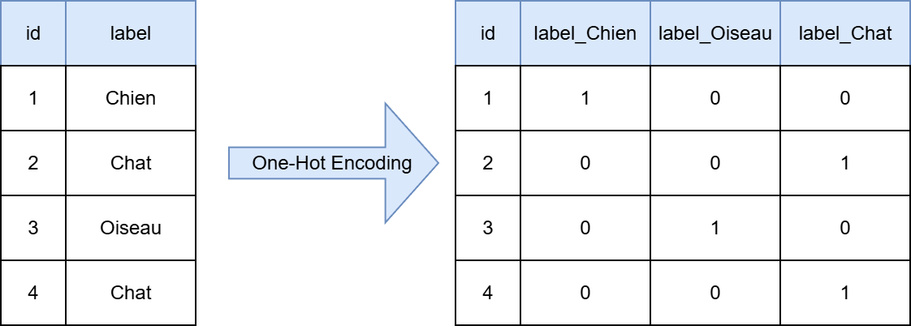
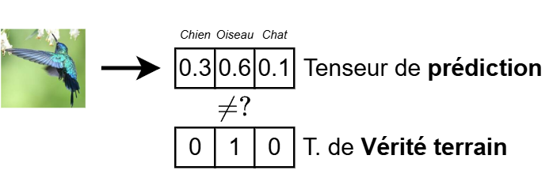
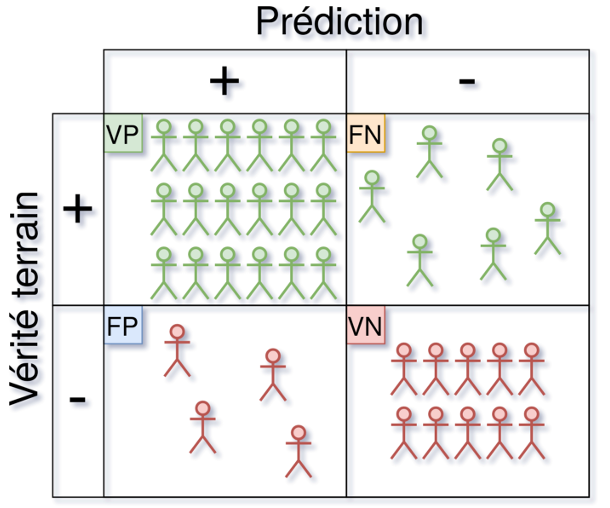
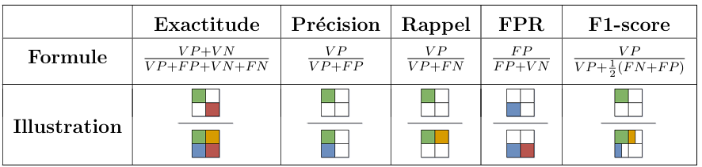
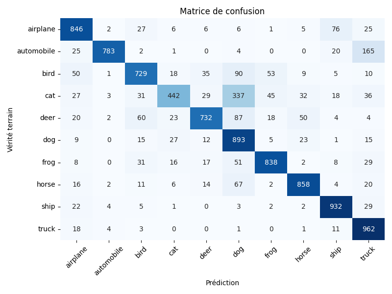
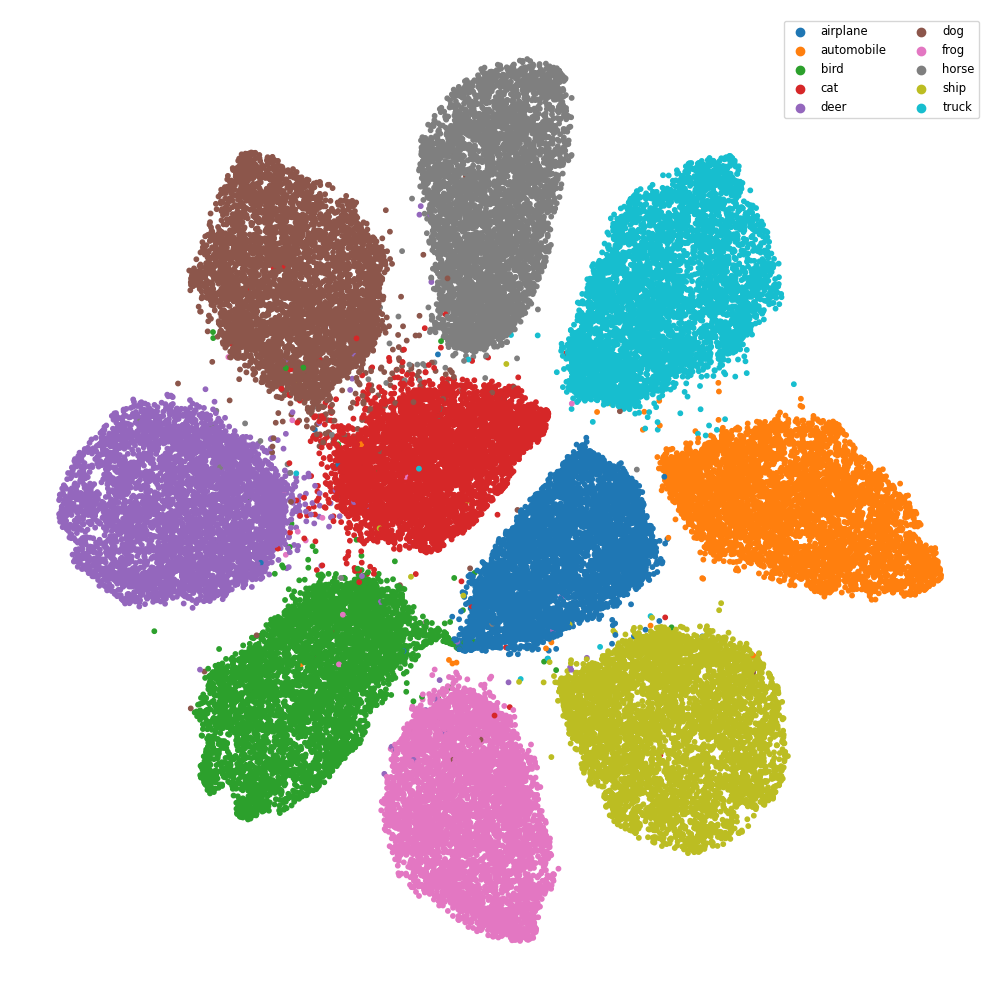

.. slide::

Chapitre 4 - Classification
================

🎯 Objectifs du Chapitre
----------------------

.. important::

   À la fin de ce chapitre, vous saurez : 

   - Définir un probleme de classification.
   - Mettre en place un pipeline de classification avec PyTorch.
   - Évaluer les performances d'un modèle de classification.   

.. slide::
📖 1. Classification - Définition
----------------------
La classification est une tâche fondamentale en apprentissage supervisé où l'objectif est de prédire une catégorie ou une classe à laquelle appartient une observation donnée, en se basant sur des données d'entrée. Contrairement à la régression, qui vise à prédire une valeur dans un domaine continu, la classification prédit une valeur discrète.

Là où la régression revient à trouver une courbe reliant tous les points, la classification revient à trouver la (ou les) courbes permettant de séparer les différentes classes.

Discrète ? Pas tout à fait ! En réalité, un modèle de classification ne prédit pas directement une classe, mais plutôt une probabilité pour chaque classe possible. Par exemple, dans un problème de classification binaire (deux classes), le modèle peut prédire une probabilité de 0.8 pour la classe 1 et 0.2 pour la classe 0. La classe finale est ensuite déterminée en appliquant un seuil (par exemple, 0.5) : si la probabilité de la classe 1 est supérieure à 0.5, l'observation est classée dans la classe 1, sinon dans la classe 0.

.. slide::
📖 2. Prédire une classe - One-Hot Encoding
----------------------
Imaginon un problème de classification à 3 classes... Comment représenter la variable cible ?

Avec ce que nous connaissons déjà, nous pourrions être tentés d'encoder les classes arbitrairement comme suit, et demander au modèle de prédire une unique valeur (par régression) :

- Classe A : 0
- Classe B : 1
- Classe C : 2

Cependant, cette modélisation comporte au moins deux problèmes majeurs : 

- Elle introduit une notion d'ordre entre les classes (0 < 1 < 2), ce qui n'a pas de sens dans un contexte de classification où les classes sont simplement des catégories distinctes sans hiérarchie.
- On ne saurait pas comment interpréter des valeurs flotantes intermédiaires (1.5).

.. slide::
Le One-Hot Encoding est une technique de prétraitement des données utilisée pour convertir des variables catégorielles en un format numérique que les algorithmes d'apprentissage automatique peuvent comprendre. Cette méthode est particulièrement utile lorsque les catégories n'ont pas d'ordre intrinsèque, comme les couleurs, les types de fruits, ou les classes dans un problème de classification (voir Figure 1).

Le principe du One-Hot Encoding est de créer une nouvelle colonne pour chaque catégorie unique dans la variable catégorielle. Pour chaque observation, la colonne correspondant à la catégorie de cette observation est marquée par un 1 (indiquant la présence de cette catégorie), tandis que toutes les autres colonnes sont marquées par un 0 (indiquant l'absence de ces catégories). Par exemple, si nous avons une variable "Animal" avec les catégories "Chien", "Oiseau", et "Chat", le One-Hot Encoding produira trois nouvelles colonnes : "Animal_Chien", "Animal_Oiseau", et "Animal_Chat".

   **Figure 1** : Illustration du One-Hot Encoding.

.. slide::
On demande alors au modèle d'apprentissage de prédire une probabilité qu'une donnée appartienne à chaque classe. Par exemple, pour une observation donnée, le modèle pourrait prédire les probabilités suivantes :

   **Figure 2** : Exemple d'une classification pour un modèle d'apprentissage supervisé.

Ici, le modèle prédit une probabilité de 0.3 pour la classe Chien, 0.6 pour la classe Oiseau, et 0.1 pour la classe Chat. La classe finale *prédite* est déterminée en choisissant la classe avec la probabilité la plus élevée (dans ce cas, Oiseau).

.. slide::
Pour s'assurer que les sorties du modèle sont bien des probabilités, on applique souvent une fonction d'activation comme la softmax à la couche de sortie du modèle. La fonction **softmax** convertit les scores bruts (appelés **logits**) en probabilités en s'assurant que toutes les valeurs sont positives et que leur somme est égale à 1.

.. math::
   softmax(z)_i = \frac{e^{z_i}}{\sum_{j=1}^{K} e^{z_j}}
où $$z$$ est le tenseur de sortie du modèle, $$z_i$$ est le score brut pour la classe $$i$$ dans ce tenseur, et $$K$$ est le nombre total de classes.

.. slide::
Dans la pratique, cette fonction d'activation finale n'est nécessaire que si la fonction de coût utilisée pour entraîner le modèle ne l'inclut pas déjà (comme c'est le cas avec la Cross-Entropy Loss en PyTorch).
Il suffit donc d'adapter la couche de sortie du modèle pour qu'elle produise un vecteur de taille égale au nombre de classes (sans appliquer de fonction d'activation comme la softmax en PyTorch).

.. code-block:: python
   import torch
   import torch.nn.functional as F

   class SimpleClassifMLP(torch.nn.Module):
      def __init__(self, input_dim, num_classes=3):
         super().__init__()
         self.fc1 = torch.nn.Linear(input_dim, 16)
         self.out_layer = torch.nn.Linear(16, num_classes) # couche de sortie pour "num_classes"

      def forward(self, x):
         x = F.relu(self.fc1(x))
         x = self.out_layer(x)
         return x  # logits pour "num_classes"
      

.. slide::
📖 3. Optimiser et évaluer un modèle de classification supervisé
----------------------

Traditionnellement, on dissocie les métriques d'optimisation de celles d'évaluation en classification. En effet, les fonctions de coût utilisées pour entraîner un modèle de classification ne sont pas nécessairement les mêmes que celles utilisées pour évaluer ses performances. 
Cette distinction est nécessaire car le modèle d'apprentissage a besoin d'une fonction de coût différentiable pour ajuster ses poids via la rétropropagation, tandis que les métriques d'évaluation peuvent être non différentiables et plus adaptées à la tâche spécifique. En l'occurance, les métriques d'évaluation en classification sont souvent basées sur des seuils (par exemple, déterminer si une probabilité est supérieure à 0.5 pour classer une observation dans une classe particulière), ce qui n'est pas différentiable.

.. slide::
3.1. Optimiser un modèle de classification (fonction de coût)
~~~~~~~~~~~~~~~~~~~

En classification, la fonction de coût la plus couramment utilisée est la **Cross-Entropy Loss** (ou entropie croisée). Cette fonction continue mesure la différence entre les distributions de probabilité prédites par le modèle et les vraies distributions (celles des étiquettes réelles).

.. math::
   CrossEntropy(y, \hat{y}) = - \sum_{i=1}^{C} y_i \log(\hat{y}_i)
où $$C$$ est le nombre de classes, $$y_i$$ est la valeur binairee (0 ou 1) indiquant si la classe $$i$$ est la vraie classe, et $$\hat{y}_i$$ est la probabilité prédite par le modèle pour la classe $$i$$.

.. slide::
En PyTorch, la Cross-Entropy Loss est implémentée dans la classe `torch.nn.CrossEntropyLoss`, qui combine à la fois la fonction softmax et le calcul de l'entropie croisée en une seule étape pour des raisons d'efficacité numérique.
Voici comment l'utiliser dans un pipeline de classification :
.. code-block:: python
   import torch
   import torch.nn as nn
   import torch.optim as optim

   # Supposons que nous avons un modèle, des données d'entrée et des étiquettes
   model = SimpleClassifMLP(input_dim=10, num_classes=3)
   inputs = torch.randn(5, 10)  # 5 échantillons, 10 caractéristiques chacun
   labels = torch.tensor([0, 2, 1, 0, 2])  # étiquettes réelles pour chaque échantillon

   # Définir la fonction de coût et l'optimiseur
   criterion = nn.CrossEntropyLoss()
   optimizer = optim.Adam(model.parameters(), lr=0.001)

   # Phase d'entraînement
   model.train()
   optimizer.zero_grad()  # Réinitialiser les gradients
   outputs = model(inputs)  # Obtenir les logits du modèle
   loss = criterion(outputs, labels)  # Calculer la perte
   loss.backward()  # Rétropropagation
   optimizer.step()  # Mise à jour des poids

⚠️ Notez que les labels doivent être fournis sous forme d'indices de classes (entiers) et non sous forme de vecteurs one-hot. La fonction *CrossEntropyLoss* de PyTorch s'occupe à la fois de convertir les logits en probabilités (softmax) et de convertir les labels en vecteurs one-hot.

.. slide::
3.2. Évaluer les performances d'un modèle de classification
~~~~~~~~~~~~~~~~~~~

Etant donné un modèle d'apprentissage, on souhaite évaluer ses performances sur des données qu'il n'a jamais vues auparavant. Pour chaque échantillon, il y a donc 4 possibilités :

- Vrai Positif (VP) : Le modèle prédit la classe positive, et c'est correct.
- Faux Positif (FP) : Le modèle prédit la classe positive, mais c'est incorrect.
- Vrai Négatif (VN) : Le modèle prédit la classe négative, et c'est correct.
- Faux Négatif (FN) : Le modèle prédit la classe négative, mais c'est incorrect.

   **Figure 3** : Illustration des possibilités d'erreur en classification, Vrai Positif (VP), Faux Positif (FP), Vrai Négatif (VN), Faux Négatif (FN). 

C'est sur la base de ces 4 possibilités que sont définies les principales métriques d'évaluation en classification.

.. slide::
📈 **Exactitude (Accuracy)** : La proportion de prédictions correctes par rapport au nombre total de prédictions.

- **Objectif :** Maximiser le nombre de prédictions correctes.
- **Intérêt :** Simple à comprendre et à calculer.
- **Limite :** Peut être trompeuse en cas de classes déséquilibrées. Exemple : si 95% des échantillons appartiennent à la classe négative, un modèle qui prédit toujours la classe négative aura une exactitude de 95%, mais ne sera pas utile.

.. slide::
📈 **Précision (Precision)** : La proportion de vraies prédictions positives par rapport au nombre total de prédictions positives.

- **Objectif :** Minimiser les faux positifs.
- **Intérêt :** Utile lorsque les faux positifs coûtent cher.
- **Limite :** Ne prend pas en compte les faux négatifs. Exemple : dans un test de dépistage d'une maladie rare, un modèle avec une haute précision minimisera les faux positifs, mais pourrait manquer de nombreux cas réels (faux négatifs).

.. slide::
📈 **Rappel (Recall)** : La proportion de vraies prédictions positives par rapport au nombre total d'exemples positifs.

- **Objectif :** Maximiser les vrais positifs.
- **Intérêt :** Utile lorsque les faux négatifs coûtent cher.
- **Limite :** Ne prend pas en compte les faux positifs. Exemple : dans un test de dépistage d'une maladie grave, un modèle avec un haut rappel minimisera les faux négatifs, mais pourrait générer de nombreux faux positifs (le modèle alerte "à tort").

.. slide::
📈 **Ratio de faux positifs (FPR)** : La proportion de fausses prédictions positives par rapport au nombre total d'exemples négatifs.

- **Objectif :** Minimiser les faux positifs.
- **Intérêt :** Utile pour évaluer la performance du modèle sur la classe négative.
- **Limite :** Ne prend pas en compte les vrais positifs. Exemple : dans un système de détection de fraude, un faible FPR est crucial pour éviter d'alerter à tort les utilisateurs légitimes.

.. slide::
📈 **F1-score** : La moyenne harmonique de la précision et du rappel, utile lorsque les classes sont déséquilibrées.

- **Objectif :** Trouver un équilibre entre précision et rappel.
- **Intérêt :** Utile lorsque les classes sont déséquilibrées et qu'il faut trouver un compromis entre éviter les faux positifs et rater les vrais positifs.
- **Limite :** Ne distingue les faux positifs des faux négatifs. Exemple : dans un système de recommandation, un F1-score élevé indique que le modèle est bon pour recommander des éléments pertinents tout en minimisant les recommandations non pertinentes.

.. slide::

   **Figure 4** : Mesures de performance en classification basées sur les concepts de Vrai Positif (VP), Faux Positif (FP), Vrai Négatif (VN), et Faux Négatif (FN).

.. slide::
⊞ **Matrice de confusion**

La terminologie VP, FP, VN, FN s'applique naturellement aux problèmes de classification binaire. Pour les problèmes de classification multi-classes, on peut étendre ces concepts en utilisant une approche "un contre tous" (one-vs-all) pour chaque classe.
Par exemple, pour une classe spécifique, on peut considérer cette classe comme la classe positive et toutes les autres classes comme la classe négative. On calcule alors VP, FP, VN, FN pour cette classe spécifique. En répétant ce processus pour chaque classe, on peut obtenir des métriques d'évaluation pour chaque classe individuelle.

Une méthode classique pour visualiser la performance globale en classification multi-classes est la matrice de confusion. Il s'agit d'un tableau qui résume les performances du modèle en affichant le nombre de prédictions correctes et incorrectes pour chaque classe.

.. slide::

   **Figure 5** : Matrice de confusion d'un modèle d'apprentissage sur un problème de classification d'images à 10 classes, sur un jeu de données équilibré (avec 1000 images par classe).

Chaque ligne de la matrice représente les instances dans une classe réelle, tandis que chaque colonne représente les instances dans une classe prédite. La diagonale principale (de haut en gauche à bas en droite) montre le nombre d'instances correctement classées pour chaque classe, tandis que les autres cellules montrent les erreurs de classification. Dans la Figure 5, on voit donc que 337 images de "Chat" ont été incorrectement classées comme "Chien". En revanche, les chiens ne sont pas considérés comme des chats.

Cette technique permet de voir les classes qui sont souvent confondues entre elles, ce qui peut aider à identifier les faiblesses du modèle et à orienter les efforts d'amélioration.

⚠️ Dans un jeu de données déséquilibré, la matrice de confusion peut être biaisée en faveur des classes majoritaires. Par exemple, si une classe n'est représentée que par quelques échantillons de données, il est difficile de voir le nombre de faux négatifs pour cette classe dans la matrice de confusion dont les couleurs sont étalonnées en fonction de toutes les classes.

.. slide::
**Projection en 2D**

Rappel : Classiquement, un réseau de neurones profond est composé de couches réparties en deux phases souvent représentées en double D : 

- Une phase d'extraction de caractéristiques (couches cachées, le nombre de caractéristiques grandit pour permettre une meilleure description des données dans l'espace latent) 
- Une phase de résolution de tâche (couches finales, le nombre de caractéristiques diminue jusqu'à atteindre la dimension souhaitée pour la tâche, par exemple 1 pour une régression ou K pour une classification).

Une autre manière de visualiser les performances d'un modèle de classification est de projeter les données dans un espace 2D avec des algorithmes de réduction de dimension. 
Cette étape est réalisée les caractéristiques extraites par le modèle (dernière couche avant la phase de résolution de la tâche dans le modèle) car c'est ici que les données sont le mieux séparées.

La projection en 2D, réalisée avec des algorithmes comme t-SNE (t-Distributed Stochastic Neighbor Embedding),  UMAP (Uniform Manifold Approximation and Projection) ou PCA (Principal Component Analysis), garantit (jusqu'à une certaine limite) que les distances observées en 2D correspondent aux distances dans l'espace des caractéristiques. Ainsi, si deux points sont proches en 2D, ils devraient également être proches dans l'espace des caractéristiques, et vice versa. Il est alors possible d'observer les données qui, d'après le modèle d'apprentissage, sont similaires ou différentes. Idéalement, les données similaires doivent avoir la même classe.

.. slide::

   **Figure 6** : Projection 2D des données d'un modèle d'apprentissage sur un problème de classification d'images à 10 classes, sur un jeu de données équilibré (avec 1000 images par classe).

Dans la Figure 6, chaque point correspond à une image. La couleur du point détermine la classe réelle de l'image (vérité terrain). On peut ainsi observer des groupes de données bien séparés des autres, ainsi que des groupes qui ont tendance à se mélanger (par exemple "Chien" et "Chat"). Grâce à cette visualisation, on peut identifier les classes les mieux discriminées ainsi que les erreurs de classification.

.. slide::
3.3. Validation croisée
~~~~~~~~~~~~~~~~~~~

.. slide::
📖 4. Déséquilibrage de classes
----------------------

.. slide::
📖 5. Classification avancée
----------------------

.. slide::
5.1. Classification multi-label
~~~~~~~~~~~~~~~~~~~

.. slide::
5.1. Classification hiérarchique
~~~~~~~~~~~~~~~~~~~