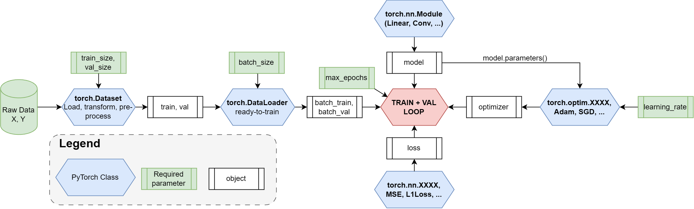
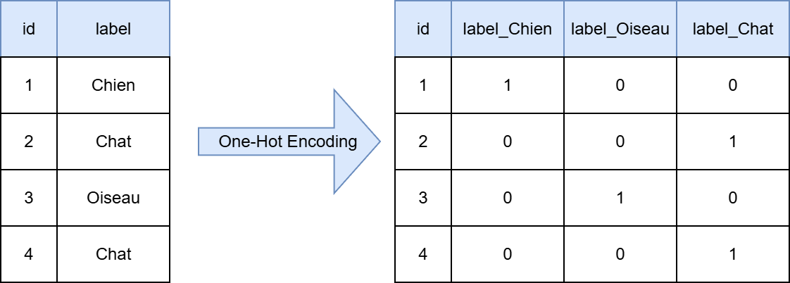
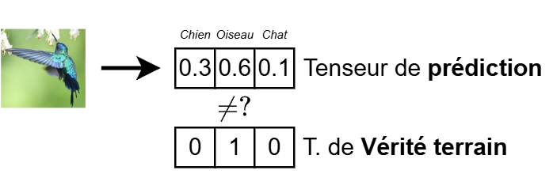
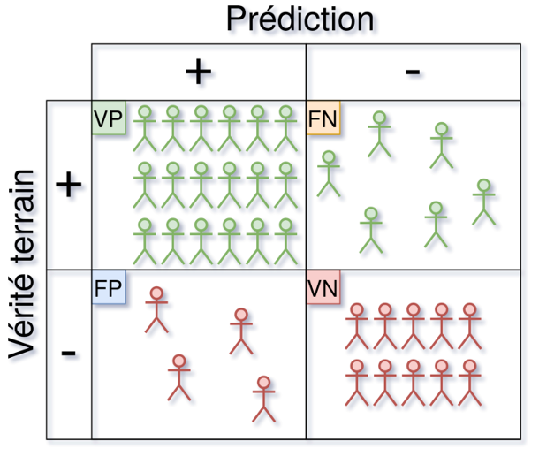
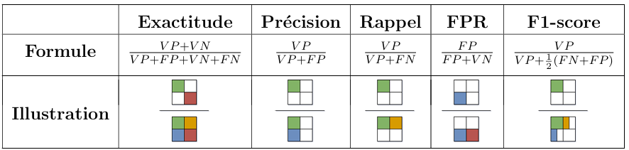
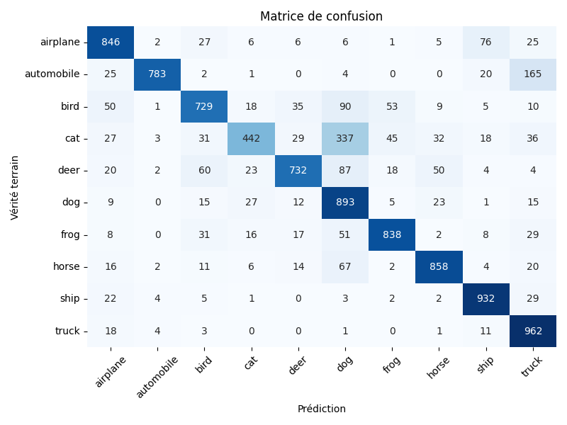
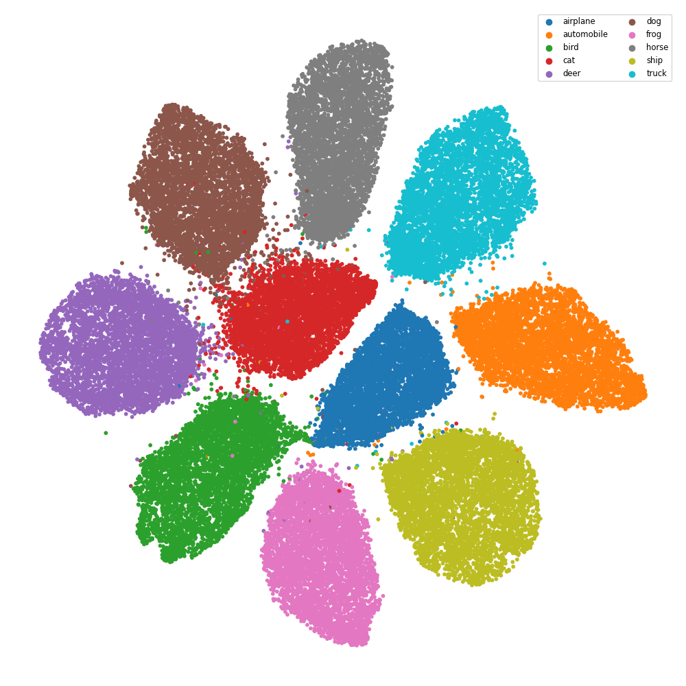

.. slide::

Chapitre 3 - Boucle d'apprentissage complète & Classification
================

🎯 Objectifs du Chapitre
----------------------

.. important::

   À la fin de ce chapitre, vous saurez : 

   - Réaliser une boucle d'apprentissage complète avec PyTorch.
   - Définir un probleme de classification.
   - Mettre en place un pipeline de classification avec PyTorch.
   - Évaluer les performances d'un modèle de classification.   

Jusqu'à présent, nous avons vu comment créer en entraîner un modèle en Deep learning avec PyTorch. 
Mais nous n'avons pas encore abordé la question de la gestion des données (jusqu'à présent, nous utilisions des tableaux numpy ou des tenseurs PyTorch générés directement).

En Deep Learning, il est courant d'entraîner un modèle sur de très grands jeux de données, ce qui peut nécessiter de nourrir le réseau avec des **batchs** de données plutôt que de lui fournir toutes les données d'un coup. 
Pour créer et gérer ces batchs de données, PyTorch propose des classes et des fonctions dédiées : les **Datasets** et les **DataLoaders**.

En outre: Les **Datasets** permettent de (télé)charger et mettre en forme les données (pré-traitement, normalisation, conversion en tenseur PyTorch, etc.), puis les **DataLoaders** permettent de créer des **batchs** de données automatiquement à partir de ces datasets, en gérant le mélange aléatoire des données et la parallélisation du chargement des données.

.. slide::
📖 1. Mini-batchs : entraînement efficace
----------------------
L'entraînement par mini-batchs est une technique fondamentale en deep learning qui combine les avantages de deux approches extrêmes.

1.1. Trois approches d'entraînement
~~~~~~~~~~~~~~~~~~~

**1. Batch Gradient Descent (tout le dataset)** :

- Calcule le gradient sur toutes les données
- Mise à jour stable mais très lente
- Nécessite beaucoup de mémoire

**2. Stochastic Gradient Descent (SGD, un exemple à la fois)** :

- Calcule le gradient sur un seul exemple
- Très rapide mais gradient bruité
- Converge de manière erratique

**3. Mini-Batch Gradient Descent** :

- Calcule le gradient sur un petit groupe d'exemples (typiquement 32, 64, 128)
- **Compromis idéal** : rapide et gradient raisonnablement stable
- Exploite efficacement le parallélisme du GPU

.. slide::

1.2. Pourquoi les mini-batchs ?
~~~~~~~~~~~~~~~~~~~

**Avantages** :

1. **Efficacité GPU** : les GPUs sont optimisés pour traiter plusieurs données en parallèle
2. **Estimation du gradient** : le gradient calculé sur un mini-batch est une bonne approximation du gradient sur tout le dataset
3. **Régularisation** : le bruit dans les mini-batchs peut aider à éviter les minima locaux
4. **Gestion mémoire** : on ne charge qu'une partie du dataset en mémoire à la fois

**Choix de la taille** :

- Petits batchs (16-32) : gradient plus bruité, convergence plus exploratrice
- Grands batchs (128-256) : gradient plus stable, convergence plus directe
- Compromis courant : 32 ou 64

.. slide::

1.3. Mini-batchs dans PyTorch
~~~~~~~~~~~~~~~~~~~

En PyTorch, tous les tenseurs ont une dimension de batch en première position :

.. code-block:: python

   # Format attendu : [batch_size, n_inputs]
   data = torch.randn(32, 4)  # batch de 32 données avec 4 entrées chacune

   # Les opérations sont automatiquement appliquées sur tout le batch
   # Exemple : Lineaire pour 4 entrées 
   fc = nn.Linear(4, 1)  # couche linéaire pour 4 entrées et 1 sortie
   output = fc(data)  # [32, 1] -> le batch reste !

**Exemple d'entraînement avec mini-batchs** :

.. code-block:: python

   # Supposons qu'on a des données et un modèle
   model = SimpleMLP()
   optimizer = torch.optim.Adam(model.parameters(), lr=0.001)
   criterion = nn.MSELoss()

   # Données factices
   data = torch.randn(100, 10) # dataset de 100 données à 10 variables
   labels = torch.randint(0, 10, (1,))

   # Paramètres
   batch_size = 32
   num_batches = len(data) // batch_size

   # Entraînement par mini-batchs
   for epoch in range(5): # 5 époques
       for i in range(num_batches):
           # Extraire un mini-batch de données et labels dans en suivant l'ordre du dataset
           # Attention en pratique on tire les mini-batchs de manière aléatoire
           start_idx = i * batch_size 
           end_idx = start_idx + batch_size
           
           batch_data = data[start_idx:end_idx]
           batch_labels = labels[start_idx:end_idx]
           
           # Forward pass
           outputs = model(batch_data)
           loss = criterion(outputs, batch_labels)
           
           # Backward pass et optimisation
           optimizer.zero_grad()
           loss.backward()
           optimizer.step()
       
       print(f"Epoch {epoch+1}, Loss: {loss.item():.4f}")

.. slide::
📖 2. Datasets et DataLoaders PyTorch
----------------------

Gérer manuellement les mini-batchs comme ci-dessus devient rapidement fastidieux. PyTorch fournit ``Dataset`` et ``DataLoader`` pour automatiser ce processus.

2.1. La classe Dataset
~~~~~~~~~~~~~~~~~~~

``Dataset`` est une classe abstraite qui représente votre jeu de données. Il existe deux approches :

**Approche 1 : Utiliser TensorDataset (recommandé pour des tenseurs simples)**

Si vos données sont déjà sous forme de tenseurs PyTorch, utilisez directement ``TensorDataset`` :

.. code-block:: python

   from torch.utils.data import TensorDataset

   # Créer des données factices
   num_samples = 1000
   data = torch.randn(num_samples, 10)  # données de 10 caractéristiques
   labels = torch.randint(0, 10, (num_samples,))  # labels de 0 à 9
   
   # Créer un dataset avec TensorDataset (une seule ligne !)
   dataset = TensorDataset(data, labels)
   
   print(f"Nombre d'exemples : {len(dataset)}")  # 1000
   
   # Accéder à un exemple
   datum, label = dataset[0]
   print(f"Shape des données : {datum.shape}")  # torch.Size([10])
   print(f"Label : {label}")  # tensor(X) avec X entre 0 et 9

💡 **Avantage** : Simple et direct, pas besoin de créer une classe personnalisée.

.. slide::

**Approche 2 : Créer une classe Dataset personnalisée avec transformations**

Exemple complet avec chargement depuis des fichiers et application de transformations :

.. code-block:: python

   from torch.utils.data import Dataset
   from torchvision import transforms
   import os

   class MyFirstDataset(Dataset): # héritage de Dataset
       def __init__(self, data_paths, labels, transform=None, preload=False):
           """
           Args:
               data_paths: Liste des chemins vers les données
               labels: Liste des labels correspondants
               transform: Transformations à appliquer (optionnel)
           """
           self.data_paths = data_paths
           self.labels = labels
           self.transform = transform
           self.preload = preload
           if(preload):
                  # Charger toutes les données en mémoire (optionnel)
                  # Avantage : temps d'accès à la donnée (__getitem__) plus rapide puisque la donnée est déjà en RAM
                  # Inconvénient : consommation mémoire plus importante, puisque toutes les données sont chargées en RAM
                  self.load_all()

      def load_all(self):
             # Charger toutes les données en mémoire (optionnel)
             self.data = []
             for path in self.data_paths:
                 datum = torch.load(path)  # Charger la donnée depuis le fichier
                 if(self.transform):
                     datum = self.transform(datum)  # Appliquer les transformations si spécifiées
                 self.data.append(datum)

       def __len__(self): # OBLIGATOIRE !
           return len(self.data_paths)
       
       def __getitem__(self, idx):  # OBLIGATOIRE !
           if(self.preload):
               datum = self.data[idx]  # si les données sont déjà en RAM, on les récupère directement
           else: # sinon, on la charge a la volée
               datum_path = self.data_paths[idx]
               datum = torch.load(datum_path)  
               if self.transform:   # Appliquer les transformations si spécifiées
                     datum = self.transform(datum)
           
           label = self.labels[idx]
           return datum, label

   #==================================================

   # Exemple d'utilisation avec transformations
   data_paths = ['data1.npy', 'data2.npy', 'data3.npy']  # Chemins vers vos données
   labels = [0, 1, 2]  # Labels correspondants

   # Définir les transformations pour l'entraînement
   transform = transforms.Compose([
       transforms.ToTensor(),                # Convertir en tenseur
       transforms.Normalize(mean=[0.5], std=[0.5]) # Attention a la shape de mean et std (doit correspondre à la dernière dimension des données)
   ])

   # Créer le dataset en passant les transformations
   train_dataset = MyFirstDataset(data_paths, labels, transform=transform)

   # Utiliser le dataset
   datum, label = train_dataset[0] # appelle __getitem__ automatiquement

.. slide::
**À propos des transformations** :

Les transformations permettent de modifier les données avant de les donner au réseau. Elles ont deux rôles :

1. **Prétraitement (toujours nécessaire)** : 
   
   - ``ToTensor()`` : convertit un itérable (tableau numpy, liste python, etc.) en tenseur PyTorch
   - ``Normalize(mean, std)`` : centre les valeurs autour de 0 pour faciliter l'apprentissage

2. **Augmentation de données (uniquement pour l'entraînement)** :
   
   Certaines transformations sont utilisées pour augmenter artificiellement la taille du dataset et améliorer la robustesse du modèle. Par exemple :
   - **Ajout de bruit aléatoire (jittering)** : ajouter un léger bruit gaussien aux variables numériques continues.
   - **Swap noise (bruit d'échange)** : remplacer aléatoirement la valeur d'une colonne par celle d'une autre ligne du dataset.
   - **Interpolation / Mixup** : combiner linéairement deux exemples existants (ou utiliser des méthodes comme SMOTE pour les classes minoritaires).
   - **Masquage de variables (feature dropout)** : masquer temporairement certaines colonnes en les remplaçant par zéro, la moyenne ou une valeur manquante.

.. slide::

2.2. La classe DataLoader
~~~~~~~~~~~~~~~~~~~

``DataLoader`` encapsule un ``Dataset`` et fournit :

- Le découpage automatique en mini-batchs
- Le mélange des données (shuffle)
- Le chargement parallèle (multiprocessing)
- La gestion du dernier batch incomplet

.. code-block:: python

   from torch.utils.data import DataLoader

   # Créer le dataset
   ...

   # Créer le dataloader
   dataloader = DataLoader(
       dataset,
       batch_size=32,        # taille des batchs
       shuffle=True,         # mélanger les données à chaque epoch (recommandé pour l'entraînement)
       num_workers=4,        # nombre de processus parallèles pour charger les données (0 = chargement dans le processus principal, >0 = chargement en parallèle pour accélérer)
       drop_last=True       # si True, ignore le dernier batch s'il est incomplet (utile quand la taille du batch doit être fixe, par exemple pour le batch normalization)
   )

   # Itération sur les batchs
   for batch_idx, (batch_data, batch_labels) in enumerate(dataloader):
       print(f"Batch {batch_idx}: data shape = {batch_data.shape}, labels shape = {batch_labels.shape}")

.. slide::
Pendant un entraînement, on itèrera désormais sur le DataLoader dans chaque époque pour récupérer des batchs de données et labels :

.. code-block:: python

   model = ...
   optimizer = ...
   loss = ...

   dataset = ...
   
   batch_size = 32
   data_loader = DataLoader(dataset, batch_size=batch_size, shuffle=True)

   epoch = 500
   for i_epoch in range(epoch):
      for batch_idx, (batch_data, batch_labels) in enumerate(data_loader):
          optimizer.zero_grad()

          # Forward pass
          outputs = model(batch_data)
          loss_value = loss(outputs, batch_labels)
          
          # Backward pass
          loss_value.backward()
          optimizer.step()

.. slide::

📖 3. Boucle d'entraînement complète
----------------------

3.1. Séparation des données en ensembles Train/Val/Test
~~~~~~~~~~~~~~~~~~~

En deep learning, le but principal d'un modèle n'est pas de mémoriser les exemples connus, mais d'être capable de **généraliser** à de nouvelles observations. La séparation des données en trois sous-ensembles indépendants (**Train**, **Validation**, **Test**) est indispensable pour :

- **Évaluer la généralisation** : s'assurer que le réseau apprend des représentations utiles et transférables plutôt que d'apprendre par cœur le bruit des données.
- **Prévenir et détecter le surapprentissage (*overfitting*)** : suivre les performances au fil des époques pour ajuster les hyperparamètres et arrêter l'entraînement avant la dégradation des résultats.
- **Obtenir une évaluation finale non biaisée** : tester le modèle final sur un ensemble strictement intouché afin de mesurer ses performances en conditions réelles.

.. slide::
**À quoi servent ces trois ensembles ?**

1. **Train (70-80%)** : Utilisé pour entraîner le modèle
   
   - Calcul du gradient et mise à jour des poids
   - Apprentissage des patterns dans les données

2. **Validation (10-15%)** : Utilisé pendant l'entraînement pour :
   
   - Surveiller les performances sur des données non vues
   - Détecter le surapprentissage (overfitting)
   - Choisir les meilleurs hyperparamètres
   - Décider quand arrêter l'entraînement
   - Sauvegarder le meilleur modèle

3. **Test (10-15%)** : Utilisé **uniquement à la fin** (après entraînement) pour :
   
   - Évaluer les performances finales du modèle
   - Obtenir des métriques non biaisées
   - Tester sur des données complètement nouvelles

.. warning::

   ⚠️ **Ne JAMAIS utiliser le test set pendant l'entraînement !**
   
   Le test set doit rester totalement invisible jusqu'à l'évaluation finale, sinon vous risquez de sur-optimiser votre modèle sur ces données (data leakage).

   ⚠️ **Ne JAMAIS faire de l'augmentation pour validation/test !** 
   
   On veut évaluer le modèle sur les vraies données, pas sur des versions modifiées artificiellement.

.. slide::
En pratique, PyTorch fournit ``random_split`` qui divise automatiquement un dataset et mélange les données :

.. code-block:: python

   from torch.utils.data import TensorDataset, random_split
   
   # 1. Créer ou charger toutes les données
   all_data = torch.randn(1000, 5)
   all_labels = torch.randint(0, 10, (1000,))
   
   # 2. Créer un dataset avec toutes les données
   full_dataset = TensorDataset(all_data, all_labels)
   
   # 3. Définir les tailles de chaque ensemble (70% train, 15% val, 15% test)
   train_size = int(0.70 * len(full_dataset))  # 700
   val_size = int(0.15 * len(full_dataset))     # 150
   test_size = len(full_dataset) - train_size - val_size  # 150
   
   # 4. Diviser le dataset automatiquement (avec mélange aléatoire)
   train_dataset, val_dataset, test_dataset = random_split(
       full_dataset,
       [train_size, val_size, test_size]
   )
   
   # 5. Créer les DataLoaders
   # shuffle=True pour train : mélanger les données à chaque epoch évite que le modèle apprenne l'ordre des exemples
   # shuffle=False pour val/test : l'ordre n'a pas d'importance pour l'évaluation, et garder le même ordre permet de reproduire les résultats
   batch_size = 32
   train_loader = DataLoader(train_dataset, batch_size=batch_size, shuffle=True)
   val_loader = DataLoader(val_dataset, batch_size=batch_size, shuffle=False)
   test_loader = DataLoader(test_dataset, batch_size=batch_size, shuffle=False)
   
   print(f"Train: {len(train_dataset)} exemples, {len(train_loader)} batches")
   print(f"Validation: {len(val_dataset)} exemples, {len(val_loader)} batches")
   print(f"Test: {len(test_dataset)} exemples, {len(test_loader)} batches")

💡 **Avantages** : ``random_split`` mélange automatiquement les données et crée des sous-ensembles du dataset original sans dupliquer les données en mémoire.

.. slide::
Pendant l'entraînement, il faudra bien spécifier explicitement le passage du modèle en mode entraînement ou évaluation avec ``model.train()`` et ``model.eval()``. Cela permet d'activer ou désactiver certaines fonctionnalités spécifiques à l'entraînement, comme le dropout ou la normalisation par batch (batch normalization).

.. code-block:: python
   epoch = 500
   for i_epoch in range(epoch):
      # Phase d'entraînement
      model.train()  # Activer le mode entraînement (dropout, batchnorm, etc.)
      for batch_idx, (batch_data, batch_labels) in enumerate(train_loader):
          ... # comme d'habitude

      # Phase de validation
      model.eval()  # Activer le mode évaluation (désactiver dropout, batchnorm, etc.)
      with torch.no_grad():  # Pas de calcul de gradient pour la validation
          val_loss = 0
          for batch_idx, (batch_data, batch_labels) in enumerate(val_loader):
              outputs = model(batch_data)
              loss_value = loss(outputs, batch_labels)
              val_loss += loss_value.item()
          val_loss /= len(val_loader)  # Moyenne sur tous les batches de validation
          print(f"Epoch {i_epoch+1}, Validation Loss: {val_loss:.4f}")

.. slide::
3.2. Putting it all together
~~~~~~~~~~~~~~~~~~~

Ça y est ! Nous avons maintenant tous les éléments pour créer une boucle d'entraînement complète avec PyTorch :

- Charger les données avec ``Dataset`` et ``DataLoader``
- Séparer les données en ensembles Train/Validation/Test
- Définir un modèle avec ``torch.nn.Module``
- Définir une fonction de coût (loss function) et un optimiseur
- Entraîner et tester un modèle

   **Figure 1** : Schéma d'une boucle d'entraînement complète.

Code d'une boucle complète :

.. code-block:: python
   # A paramétrer !
   model = ...
   optimizer = ... # Adam ? SGD ?
   loss = ... # MSE ? MAE ? 
   
   max_epoch = ... # 500 ? 1000 ?
   batch_size = ... # 32 ?

   dataset = ...
   train_proportion = ... # 0.80 ?
   val_proportion = ... # 0.10 ?
   test_proportion = 1 - train_proportion - val_proportion
   assert train_proportion + val_proportion + test_proportion == 1, "Les proportions doivent totaliser 1"
   #==========================

   train_size = int(train_proportion * len(dataset))
   val_size = int(val_proportion * len(dataset))
   test_size = len(dataset) - train_size - val_size
   train_dataset, val_dataset, test_dataset = random_split(dataset, [train_size, val_size, test_size])

   train_loader = DataLoader(train_dataset, batch_size=batch_size, shuffle=True)
   val_loader = DataLoader(val_dataset, batch_size=batch_size, shuffle=False)
   test_loader = DataLoader(test_dataset, batch_size=batch_size, shuffle=False)

   
   for i_epoch in range(max_epoch):
      # Phase d'entraînement
      model.train()  # Activer le mode entraînement (dropout, batchnorm, etc.)
      for batch_idx, (batch_data, batch_labels) in enumerate(train_loader):
          optimizer.zero_grad()

          #Forward
          outputs = model(batch_data)
          loss_value = loss(outputs, batch_labels)

          #Backward
          loss_value.backward()
          optimizer.step()
          print(f"Epoch {i_epoch+1}, Batch {batch_idx+1}, Loss: {loss_value.item():.4f}")

      # Phase de validation
      model.eval()  # Activer le mode évaluation (désactiver dropout, batchnorm, etc.)
      with torch.no_grad():  # Pas de calcul de gradient pour la validation
          val_loss = 0
          for batch_idx, (batch_data, batch_labels) in enumerate(val_loader):
              outputs = model(batch_data)
              loss_value = loss(outputs, batch_labels)
              val_loss += loss_value.item()
          val_loss /= len(val_loader)  # Moyenne sur tous les batches de validation
          print(f"Epoch {i_epoch+1}, Validation Loss: {val_loss:.4f}")

.. slide::
📖 4. Classification - Définition
----------------------
La classification est une tâche fondamentale en apprentissage supervisé où l'objectif est de prédire une catégorie ou une classe à laquelle appartient une observation donnée, en se basant sur des données d'entrée. Contrairement à la régression, qui vise à prédire une valeur dans un domaine continu, la classification prédit une valeur discrète.

Là où la régression revient à trouver une courbe reliant tous les points, la classification revient à trouver la (ou les) courbes permettant de séparer les différentes classes.

Discrète ? Pas tout à fait ! En réalité, un modèle de classification ne prédit pas directement une classe, mais plutôt une probabilité pour chaque classe possible. Par exemple, dans un problème de classification binaire (deux classes), le modèle peut prédire une probabilité de 0.8 pour la classe 1 et 0.2 pour la classe 0. La classe finale est ensuite déterminée en appliquant un seuil (par exemple, 0.5) : si la probabilité de la classe 1 est supérieure à 0.5, l'observation est classée dans la classe 1, sinon dans la classe 0.

.. slide::
📖 5. Prédire une classe - One-Hot Encoding
----------------------
Imaginon un problème de classification à 3 classes... Comment représenter la variable cible ?

Avec ce que nous connaissons déjà, nous pourrions être tentés d'encoder les classes arbitrairement comme suit, et demander au modèle de prédire une unique valeur (par régression) :

- Classe A : 0
- Classe B : 1
- Classe C : 2

Cependant, cette modélisation comporte au moins deux problèmes majeurs : 

- Elle introduit une notion d'ordre entre les classes (0 < 1 < 2), ce qui n'a pas de sens dans un contexte de classification où les classes sont simplement des catégories distinctes sans hiérarchie.
- On ne saurait pas comment interpréter des valeurs flotantes intermédiaires (1.5).

.. slide::
Le One-Hot Encoding est une technique de prétraitement des données utilisée pour convertir des variables catégorielles en un format numérique que les algorithmes d'apprentissage automatique peuvent comprendre. Cette méthode est particulièrement utile lorsque les catégories n'ont pas d'ordre intrinsèque, comme les couleurs, les types de fruits, ou les classes dans un problème de classification (voir Figure 2).

Le principe du One-Hot Encoding est de créer une nouvelle colonne pour chaque catégorie unique dans la variable catégorielle. Pour chaque observation, la colonne correspondant à la catégorie de cette observation est marquée par un 1 (indiquant la présence de cette catégorie), tandis que toutes les autres colonnes sont marquées par un 0 (indiquant l'absence de ces catégories). Par exemple, si nous avons une variable "Animal" avec les catégories "Chien", "Oiseau", et "Chat", le One-Hot Encoding produira trois nouvelles colonnes : "Animal_Chien", "Animal_Oiseau", et "Animal_Chat".

   **Figure 2** : Illustration du One-Hot Encoding.

.. slide::
On demande alors au modèle d'apprentissage de prédire une probabilité qu'une donnée appartienne à chaque classe. Par exemple, pour une observation donnée, le modèle pourrait prédire les probabilités suivantes :

   **Figure 3** : Exemple d'une classification pour un modèle d'apprentissage supervisé.

Ici, le modèle prédit une probabilité de 0.3 pour la classe Chien, 0.6 pour la classe Oiseau, et 0.1 pour la classe Chat. La classe finale *prédite* est déterminée en choisissant la classe avec la probabilité la plus élevée (dans ce cas, Oiseau).

.. slide::
Pour s'assurer que les sorties du modèle sont bien des probabilités, on applique souvent une fonction d'activation comme la softmax à la couche de sortie du modèle. La fonction **softmax** convertit les scores bruts (appelés **logits**) en probabilités en s'assurant que toutes les valeurs sont positives et que leur somme est égale à 1.

.. math::
   softmax(z)_i = \frac{e^{z_i}}{\sum_{j=1}^{K} e^{z_j}}
où $$z$$ est le tenseur de sortie du modèle, $$z_i$$ est le score brut pour la classe $$i$$ dans ce tenseur, et $$K$$ est le nombre total de classes.

.. slide::
Dans la pratique, cette fonction d'activation finale n'est nécessaire que si la fonction de coût utilisée pour entraîner le modèle ne l'inclut pas déjà (comme c'est le cas avec la Cross-Entropy Loss en PyTorch).
Il suffit donc d'adapter la couche de sortie du modèle pour qu'elle produise un vecteur de taille égale au nombre de classes (sans appliquer de fonction d'activation comme la softmax en PyTorch).

.. code-block:: python
   import torch
   import torch.nn.functional as F

   class SimpleClassifMLP(torch.nn.Module):
      def __init__(self, input_dim, num_classes=3):
         super().__init__()
         self.fc1 = torch.nn.Linear(input_dim, 16)
         self.out_layer = torch.nn.Linear(16, num_classes) # couche de sortie pour "num_classes"

      def forward(self, x):
         x = F.relu(self.fc1(x))
         x = self.out_layer(x)
         return x  # logits pour "num_classes"
      
.. slide::
Vocabulaire : On appelle **caractéristique** (feature) les variables décrivant une donnée, et **étiquette** (label) la variable que l'on cherche à prédire.

Les **caractéristiques initiales** sont celles de la données en entrée. Par exemple dans le cas d'une image de taille $$100\times100\times3$$, on a 30000 caractéristiques initiales. Dans ce cas précis, le terme "caractéristique" est un abus de langage car la donnée est brute, et chaque valeur de pixel individuel n'est pas informative pour résoudre la tâche.

Chaque couche d'un réseau de neurone prend en entrée un certain nombre de caractéristiques (pour chaque donnée du batch) qui décrivent la donnée, et en produit un autre nombre qui décrivent la prédiction. Par exemple, une couche linéaire (fully connected) avec 128 neurones prend en entrée un tenseur de taille $$N$$ et produit un tenseur de taille $$128$$. Les couches intermédiaires (dites "cachées") transforment également ces caractéristiques, de la manière programmée par le concepteur du réseau de neurones. Ces informations sont appelées **caractéristiques** ici car elles représentent bien le résultat de transformations des données avec des connaissances apprises par le réseau de neurone, et contiennent donc normalement des informations pour résoudre la tâche.

.. slide::
📖 6. Optimiser et évaluer un modèle de classification supervisé
----------------------

Traditionnellement, on dissocie les métriques d'optimisation de celles d'évaluation en classification. En effet, les fonctions de coût utilisées pour entraîner un modèle de classification ne sont pas nécessairement les mêmes que celles utilisées pour évaluer ses performances. 
Cette distinction est nécessaire car le modèle d'apprentissage a besoin d'une fonction de coût différentiable pour ajuster ses poids via la rétropropagation, tandis que les métriques d'évaluation peuvent être non différentiables et plus adaptées à la tâche spécifique. En l'occurance, les métriques d'évaluation en classification sont souvent basées sur des seuils (par exemple, déterminer si une probabilité est supérieure à 0.5 pour classer une observation dans une classe particulière), ce qui n'est pas différentiable.

.. slide::
6.1. Optimiser un modèle de classification (fonction de coût)
~~~~~~~~~~~~~~~~~~~

En classification, la fonction de coût la plus couramment utilisée est la **Cross-Entropy Loss** (ou entropie croisée). Cette fonction continue mesure la différence entre les distributions de probabilité prédites par le modèle et les vraies distributions (celles des étiquettes réelles).

.. math::
   CrossEntropy(y, \hat{y}) = - \sum_{i=1}^{C} y_i \log(\hat{y}_i)
où $$C$$ est le nombre de classes, $$y_i$$ est la valeur binaire (0 ou 1) indiquant si la classe $$i$$ est la vraie classe, et $$\hat{y}_i$$ est la probabilité prédite par le modèle pour la classe $$i$$.

.. slide::
En PyTorch, la Cross-Entropy Loss est implémentée dans la classe ``torch.nn.CrossEntropyLoss``, qui combine à la fois la fonction softmax et le calcul de l'entropie croisée en une seule étape pour des raisons d'efficacité numérique.
Voici comment l'utiliser dans un pipeline de classification :
.. code-block:: python
   import torch
   import torch.nn as nn
   import torch.optim as optim

   # Supposons que nous avons un modèle, des données d'entrée et des étiquettes
   model = SimpleClassifMLP(input_dim=10, num_classes=3)
   inputs = torch.randn(5, 10)  # 5 échantillons, 10 caractéristiques chacun
   labels = torch.tensor([0, 2, 1, 0, 2])  # étiquettes réelles pour chaque échantillon

   # Définir la fonction de coût et l'optimiseur
   criterion = nn.CrossEntropyLoss()
   optimizer = optim.Adam(model.parameters(), lr=0.001)

   # Phase d'entraînement
   model.train()
   optimizer.zero_grad()  # Réinitialiser les gradients
   outputs = model(inputs)  # Obtenir les logits du modèle
   loss = criterion(outputs, labels)  # Calculer la perte
   loss.backward()  # Rétropropagation
   optimizer.step()  # Mise à jour des poids

⚠️ Notez que les labels doivent être fournis sous forme d'indices de classes (entiers) et non sous forme de vecteurs one-hot. La fonction *CrossEntropyLoss* de PyTorch s'occupe à la fois de convertir les logits en probabilités (softmax) et de convertir les labels en vecteurs one-hot.

.. slide::
6.2. Évaluer les performances d'un modèle de classification
~~~~~~~~~~~~~~~~~~~

Etant donné un modèle d'apprentissage, on souhaite évaluer ses performances sur des données qu'il n'a jamais vues auparavant. Pour chaque échantillon, il y a donc 4 possibilités :

- Vrai Positif (VP) : Le modèle prédit la classe positive, et c'est correct.
- Faux Positif (FP) : Le modèle prédit la classe positive, mais c'est incorrect.
- Vrai Négatif (VN) : Le modèle prédit la classe négative, et c'est correct.
- Faux Négatif (FN) : Le modèle prédit la classe négative, mais c'est incorrect.

C'est sur la base de ces 4 possibilités que sont définies les principales métriques d'évaluation en classification.

   **Figure 4** : Illustration des possibilités d'erreur en classification, Vrai Positif (VP), Faux Positif (FP), Vrai Négatif (VN), Faux Négatif (FN). 

.. slide::

   **Figure 5** : Mesures de performance en classification basées sur les concepts de Vrai Positif (VP), Faux Positif (FP), Vrai Négatif (VN), et Faux Négatif (FN).

.. slide::
📈 **Exactitude (Accuracy)** : La proportion de prédictions correctes par rapport au nombre total de prédictions.

- **Objectif :** Maximiser le nombre de prédictions correctes.
- **Intérêt :** Simple à comprendre et à calculer.
- **Limite :** Peut être trompeuse en cas de classes déséquilibrées. Exemple : si 95% des échantillons appartiennent à la classe négative, un modèle qui prédit toujours la classe négative aura une exactitude de 95%, mais ne sera pas utile.

.. slide::
📈 **Précision (Precision)** : La proportion de vraies prédictions positives par rapport au nombre total de prédictions positives.

- **Objectif :** Minimiser les faux positifs.
- **Intérêt :** Utile lorsque les faux positifs coûtent cher.
- **Limite :** Ne prend pas en compte les faux négatifs. Exemple : dans un test de dépistage d'une maladie rare, un modèle avec une haute précision minimisera les faux positifs, mais pourrait manquer de nombreux cas réels (faux négatifs).

.. slide::
📈 **Rappel (Recall)** : La proportion de vraies prédictions positives par rapport au nombre total d'exemples positifs.

- **Objectif :** Maximiser les vrais positifs.
- **Intérêt :** Utile lorsque les faux négatifs coûtent cher.
- **Limite :** Ne prend pas en compte les faux positifs. Exemple : dans un test de dépistage d'une maladie grave, un modèle avec un haut rappel minimisera les faux négatifs, mais pourrait générer de nombreux faux positifs (le modèle alerte "à tort").

.. slide::
📈 **Ratio de faux positifs (FPR)** : La proportion de fausses prédictions positives par rapport au nombre total d'exemples négatifs.

- **Objectif :** Minimiser les faux positifs.
- **Intérêt :** Utile pour évaluer la performance du modèle sur la classe négative.
- **Limite :** Ne prend pas en compte les vrais positifs. Exemple : dans un système de détection de fraude, un faible FPR est crucial pour éviter d'alerter à tort les utilisateurs légitimes.

.. slide::
📈 **F1-score** : La moyenne harmonique de la précision et du rappel, utile lorsque les classes sont déséquilibrées.

- **Objectif :** Trouver un équilibre entre précision et rappel.
- **Intérêt :** Utile lorsque les classes sont déséquilibrées et qu'il faut trouver un compromis entre éviter les faux positifs et rater les vrais positifs.
- **Limite :** Ne distingue les faux positifs des faux négatifs. Exemple : dans un système de recommandation, un F1-score élevé indique que le modèle est bon pour recommander des éléments pertinents tout en minimisant les recommandations non pertinentes.

.. slide::
⊞ **Matrice de confusion**

La terminologie VP, FP, VN, FN s'applique naturellement aux problèmes de classification binaire. Pour les problèmes de classification multi-classes, on peut étendre ces concepts en utilisant une approche "un contre tous" (one-vs-all) pour chaque classe.
Par exemple, pour une classe spécifique, on peut considérer cette classe comme la classe positive et toutes les autres classes comme la classe négative. On calcule alors VP, FP, VN, FN pour cette classe spécifique. En répétant ce processus pour chaque classe, on peut obtenir des métriques d'évaluation pour chaque classe individuelle.

Une méthode classique pour visualiser la performance globale en classification multi-classes est la matrice de confusion. Il s'agit d'un tableau qui résume les performances du modèle en affichant le nombre de prédictions correctes et incorrectes pour chaque classe.

.. slide::

   **Figure 6** : Matrice de confusion d'un modèle d'apprentissage sur un problème de classification d'images à 10 classes, sur un jeu de données équilibré (avec 1000 images par classe).

Chaque ligne de la matrice représente les instances dans une classe réelle, tandis que chaque colonne représente les instances dans une classe prédite. La diagonale principale (de haut en gauche à bas en droite) montre le nombre d'instances correctement classées pour chaque classe, tandis que les autres cellules montrent les erreurs de classification. Dans la Figure 6, on voit donc que 337 images de "Chat" ont été incorrectement classées comme "Chien". En revanche, les chiens ne sont pas considérés comme des chats.

Cette technique permet de voir les classes qui sont souvent confondues entre elles, ce qui peut aider à identifier les faiblesses du modèle et à orienter les efforts d'amélioration.

⚠️ Dans un jeu de données déséquilibré, la matrice de confusion peut être biaisée en faveur des classes majoritaires. Par exemple, si une classe n'est représentée que par quelques échantillons de données, il est difficile de voir le nombre de faux négatifs pour cette classe dans la matrice de confusion dont les couleurs sont étalonnées en fonction de toutes les classes.

.. slide::
**Projection en 2D**

Rappel : Classiquement, un réseau de neurones profond est composé de couches réparties en deux phases souvent représentées en double D : 

- Une phase d'extraction de caractéristiques (couches cachées, le nombre de caractéristiques grandit pour permettre une meilleure description des données dans l'espace latent) 
- Une phase de résolution de tâche (couches finales, le nombre de caractéristiques diminue jusqu'à atteindre la dimension souhaitée pour la tâche, par exemple 1 pour une régression ou K pour une classification).

Une autre manière de visualiser les performances d'un modèle de classification est de projeter les données dans un espace 2D avec des algorithmes de réduction de dimension. 
Cette étape est réalisée les caractéristiques extraites par le modèle (dernière couche avant la phase de résolution de la tâche dans le modèle) car c'est ici que les données sont le mieux séparées.

La projection en 2D, réalisée avec des algorithmes comme t-SNE (t-Distributed Stochastic Neighbor Embedding),  UMAP (Uniform Manifold Approximation and Projection) ou PCA (Principal Component Analysis), garantit (jusqu'à une certaine limite) que les distances observées en 2D correspondent aux distances dans l'espace des caractéristiques. Ainsi, si deux points sont proches en 2D, ils devraient également être proches dans l'espace des caractéristiques, et vice versa. Il est alors possible d'observer les données qui, d'après le modèle d'apprentissage, sont similaires ou différentes. Idéalement, les données similaires doivent avoir la même classe.

.. slide::

   **Figure 7** : Projection 2D des données d'un modèle d'apprentissage sur un problème de classification d'images à 10 classes, sur un jeu de données équilibré (avec 1000 images par classe).

Dans la Figure 7, chaque point correspond à une image. La couleur du point détermine la classe réelle de l'image (vérité terrain). On peut ainsi observer des groupes de données bien séparés des autres, ainsi que des groupes qui ont tendance à se mélanger (par exemple "Chien" et "Chat"). Grâce à cette visualisation, on peut identifier les classes les mieux discriminées ainsi que les erreurs de classification.

.. slide::
📖 7. Jeux de données
----------------------
Dans tout apprentissage, supervisé ou non, la qualité et la quantité des données jouent un rôle crucial dans la performance du modèle. En classification, plusieurs défis spécifiques liés aux jeux de données peuvent influencer les résultats.

.. slide::
7.1. Généralisation et Validation
~~~~~~~~~~~~~~~~~~~
Bien qu'un modèle d'apprentissage puisse atteindre de bonnes performances sur son jeu d'entraînement, il est essentiel de s'assurer qu'il possède également une bonne capacité à **généraliser** son apprentissage à de nouvelles données.
On distingue alors les données *In distribution* (que le modèle a déjà vues pendant son entraînement) des données *Out of distribution* (que le modèle n'a jamais vues auparavant). Un bon modèle de classification doit être capable de bien performer sur les deux types de données.
Par exemple dans le cas d'une voiture autonome, il faut s'assurer qu'un modèle entraîné à reconnaître des piétons dans une ville en été, sera également capable de les reconnaître en hiver, de nuit, ou dans une autre ville.

La validation croisée est une technique utilisée pour évaluer la capacité de généralisation d'un modèle d'apprentissage. Elle consiste à diviser le jeu de données en plusieurs sous-ensembles (ou "folds"), puis à entraîner et évaluer le modèle plusieurs fois, en utilisant un fold différent pour l'évaluation à chaque itération.

Cette approche permet de s'assurer que le modèle est capable de généraliser son apprentissage à de nouvelles données, en le testant sur des exemples qu'il n'a pas vus pendant l'entraînement. Cela aide à détecter les problèmes de surapprentissage (overfitting) et à ajuster les hyperparamètres du modèle pour améliorer sa performance sur des données non vues.

.. slide::
7.1.1. K-fold, Leave-K-Out (LKO), Leave-One-Out (LOO)
~~~~~~~~~~~~~~~~~~~

Une première famille de méthodes de validation est appelée **validation croisée** (cross-validation). Elle consiste à diviser le jeu de données en plusieurs sous-ensembles, puis à entraîner et évaluer le modèle plusieurs fois, en utilisant un sous-ensemble différent pour l'évaluation à chaque itération. Voici les principales variantes :

**K-Fold** : Le jeu de données est divisé en K sous-ensembles ("folds"). À chaque itération, un fold sert de jeu de test et les K-1 autres de jeu d'entraînement. On répète l'opération K fois, chaque fold étant utilisé une fois comme test.

**Leave-K-Out (LKO)** : À chaque itération, K exemples sont retirés du jeu de données pour servir de test, et le reste sert à l'entraînement. On répète l'opération en changeant les K exemples testés à chaque fois.

**Leave-One-Out (LOO)** : Cas particulier du LKO où K=1. Chaque exemple du jeu de données est utilisé une fois comme test, les autres servant à l'entraînement, ce qui donne autant d'itérations que d'exemples.

Ces méthodes sont notamment utilisées en Machine Learning, avec de petits modèles et faibles volumes de données. Cependant, elles sont rarement utilisées en Deep Learning, où les modèles sont plus complexes et les volumes de données plus importants. En effet, ces méthodes peuvent être très coûteuses en temps de calcul, car elles nécessitent d'entraîner le modèle plusieurs fois.

En Deep Learning, on préfèrera plus souvent utiliser une validation Hold-Out.

.. slide::
7.1.2. Hold-Out
~~~~~~~~~~~~~~~~~~~

La validation Hold-Out est une méthode simple et largement utilisée pour évaluer la performance d'un modèle d'apprentissage. Elle consiste à diviser le jeu de données en deux à troies parties distinctes : 

- Un ensemble d'**entraînement** (train set) : utilisé pour entraîner le modèle.
- Un ensemble de **validation** (validation set) : utilisé pour ajuster les hyperparamètres du modèle et prévenir le surapprentissage.
- Un ensemble de **test** (test set) : utilisé pour évaluer la performance finale du modèle.

A chaque époque, un modèle est entraîné (i.e., calcul de la loss et backpropagation) sur les données du *train set*. 

A la fin de chaque époque, le modèle est évalué (i.e., calcul de la loss et des métriques, **sans backpropagation**) sur les données du *validation set*. Le modèle n'ayant jamais vu ces données, on peut ainsi estimer sa capacité à généraliser son apprentissage. 

Enfin, une fois l'entraînement terminé, le modèle est évalué une dernière fois sur les données du *test set* pour obtenir une mesure finale de sa performance. Lorsque l'on conçoit plusieurs variantes de modèle d'apprentissage pour résoudre une tâche, c'est sur les performances sur le *test set* que l'on se base pour choisir le meilleur modèle.

En PyTorch, cela se traduit par la création de trois DataLoaders distincts, un pour chaque ensemble de données, et le chainage des phases dans la boucle d'entrainement 

.. code-block:: python
   # Prepare train data
    train_dataset = ...
    train_loader = ...

    # Prepare validation data
    val_dataset = ...
    val_loader = ...

    # Prepare test data
    test_dataset = ...
    test_loader = ...

    # Define the model
    model = ...
    optimizer = ...
    loss_fn = ...

    # Train
    for epoch in range(n_epochs):
        model.train() #! Important !
        for i_batch, batch in enumerate(train_loader):
            inputs, groundtruthes = batch
            optimizer.zero_grad()  #! Important !
            pred = model(inputs)
            loss = loss_fn(pred, groundtruthes)
            loss.backward() #! Backpropagation !
            optimizer.step() 
    
        # Validation
        model.eval()  #! Important !
        with torch.no_grad(): # Don't compute the gradient (we won't backpropagate anyway)
            for vi_batch, batch in enumerate(val_loader):
                inputs, groundtruthes = batch
                pred = model(inputs)
                loss = loss_fn(pred, groundtruthes)
                compute_metrics(pred, groundtruthes)
    # End of train
    
    # Test
    model.eval() #! Important !
    with torch.no_grad(): # Don't compute the gradient (we won't backpropagate anyway)
        for i, batch in enumerate(test_loader):
            inputs, groundtruthes = batch
            pred = model(inputs)
            loss = loss_fn(pred, groundtruthes)
            compute_metrics(pred, groundtruthes)

.. slide::
7.2. Déséquilibrage des classes
~~~~~~~~~~~~~~~~~~~

Dans un problème de classification, il peut arriver que certaines classes soient beaucoup plus représentées que d'autres dans le jeu de données. Par exemple, dans un jeu de données médical, il peut y avoir beaucoup plus de patients en bonne santé que de patients atteints d'une maladie rare. Ce déséquilibre peut poser plusieurs problèmes lors de l'entraînement d'un modèle de classification :

- Le modèle peut être biaisé en faveur des classes majoritaires, car il verra plus souvent ces exemples pendant l'entraînement.
- Les métriques d'évaluation peuvent être trompeuses, car un modèle qui prédit toujours la classe majoritaire peut obtenir une haute exactitude, mais ne sera pas utile pour détecter les classes minoritaires.

Pour gérer le déséquilibre des classes, plusieurs techniques peuvent être utilisées :

- **Rééchantillonnage** : On peut suréchantillonner les classes minoritaires (en dupliquant des exemples ou en générant de nouveaux exemples synthétiques) ou sous-échantillonner les classes majoritaires (en supprimant des exemples) pour équilibrer le jeu de données.
- **Pondération des classes** : On peut attribuer des poids plus élevés aux classes minoritaires dans la fonction de coût, de sorte que les erreurs sur ces classes aient un impact plus important lors de l'entraînement.
- **Utilisation de métriques adaptées** : On peut utiliser des métriques d'évaluation qui tiennent compte du déséquilibre des classes, comme le F1-score.

.. slide::
7.3. Augmentation des données
~~~~~~~~~~~~~~~~~~~

L'augmentation des données est une technique utilisée pour augmenter la taille et la diversité d'un jeu de données en appliquant des transformations aux exemples existants. En classification, l'augmentation des données peut aider à améliorer la performance du modèle en lui fournissant plus d'exemples variés à apprendre, ce qui peut réduire le surapprentissage et améliorer la capacité de généralisation.

Les techniques courantes d'augmentation des données incluent :

- **Transformations géométriques** : rotation, translation, mise à l'échelle, retournement horizontal/vertical.
- **Transformations du domaine de valeur** : ajustement du domaine de valeurs numériques des caractéristiques d'une donnée pour enrichir la diversité des exemples.
- **Bruit** : ajout de bruit aléatoire aux données.
- **Cutout** : suppression aléatoire de parties d'une donnée.

Ces techniques peuvent être appliquées de manière aléatoire pendant l'entraînement, de sorte que chaque époque voit une version légèrement différente des données. Cela permet au modèle d'apprendre des caractéristiques de mieux généraliser à de nouvelles données et d'être plus robustes aux petites variations d'environnement communes lors de la mise en production.

.. slide::
📖 8. Classification avancée
----------------------

Jusqu'à présent, nous avons principalement abordé les problèmes de classification binaire (une classe vraie parmi deux) et multi-classes (une classe vraie parmi plusieurs). Cependant, il existe d'autres types de problèmes de classification qui présentent des défis supplémentaires.

.. slide::
8.1. Classification multi-label
~~~~~~~~~~~~~~~~~~~

Dans un problème de classification multi-label, chaque donnée peut être associée à plusieurs classes simultanément. Par exemple, dans la classification d'images, une image peut contenir à la fois un chat et un chien. Pour traiter ce type de problème, plusieurs approches peuvent être utilisées :

- **Sortie binaire par classe** : On peut entraîner un classificateur binaire distinct pour chaque classe. Chaque classificateur prédit la présence ou l'absence de la classe correspondante. S'il y a $$K$$ classes, la sortie est alors de taille $$(K, 2)$$, où chaque ligne correspond à une classe et contient deux valeurs, la probabilité d'appartenance à la classe et probabilité de non-appartenance. C'est sur cette dernière dimension que l'on applique la fonction *softmax*. Cette approche est simple à mettre en œuvre, mais elle ne capture pas les dépendances entre les classes.
- **Sortie multi-label** : On peut utiliser une seule couche de sortie pour prédire la probabilité de chaque classe. Cela permet de capturer les dépendances entre les classes car le modèle peut apprendre à reconnaître des combinaisons de classes. La sortie est alors de taille $$(K)$$, où chaque élément correspond à la probabilité d'appartenance à une classe. On applique alors une fonction **sigmoïde** (et non pas *softmax*) sur la sortie pour obtenir des probabilités indépendantes pour chaque classe. Pour sélectionner les classes prédites, on applique un seuil de confiance (par exemple, 0.5) : si la probabilité d'une classe est supérieure à ce seuil, l'observation est classée dans cette classe.

.. math::
   sigmoid(z)_i = \frac{1}{1 + e^{-z_i}}
où $$z$$ est le tenseur de sortie du modèle, et $$z_i$$ est le score brut (*logit*) pour la classe $$i$$ dans ce tenseur.

.. slide::
8.2. Classification hiérarchique
~~~~~~~~~~~~~~~~~~~

Dans un problème de classification hiérarchique, les classes sont organisées en une structure arborescente où certaines classes sont des sous-classes d'autres. Par exemple, dans la classification d'images, une image peut être classée comme "animal", puis comme "mammifère", puis comme "chien". Pour traiter ce type de problème, plusieurs approches peuvent être utilisées :

- **Sortie multi-niveau** : On peut utiliser une seule couche de sortie pour prédire la probabilité de chaque classe à chaque niveau de la hiérarchie. La sortie est alors de taille $$(K_1 + K_2 + ... + K_n)$$, où $$K_i$$ est le nombre de classes au niveau $$i$$ de la hiérarchie. On applique une fonction *softmax* sur chaque sous-ensemble de la sortie correspondant à un niveau de la hiérarchie pour obtenir des probabilités pour chaque niveau. Pour sélectionner les classes prédites, on choisit la classe avec la probabilité la plus élevée à chaque niveau.
- **Plusieurs sorties** : On peut utiliser plusieurs couches de sortie, une pour chaque niveau de la hiérarchie. Chaque couche prédit la probabilité des classes à son niveau respectif. Cette approche est plus simple à mettre en œuvre que les modèles hiérarchiques, mais elle ne capture pas les relations entre les classes.
- **Modèles hiérarchiques** : On peut entraîner un modèle pour chaque niveau de la hiérarchie. Par exemple, un modèle pour classer les images en "animal" ou "non-animal", puis un autre modèle pour classer les "animaux" en "mammifères" ou "non-mammifères", et ainsi de suite. Cette approche permet de capturer les relations entre les classes, mais elle peut être complexe à mettre en œuvre.

.. slide::
🏋️ Travaux Pratiques
--------------------

.. toctree::

    TP_chap3
