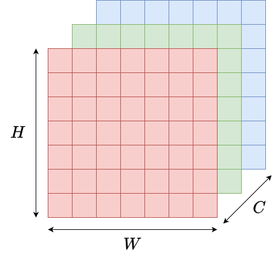

.. slide::

Chapitre 4 - Manipulation d'images
================

🎯 Objectifs du Chapitre
----------------------

.. important::

   À la fin de ce chapitre, vous saurez : 

   - Charger, afficher et sauvegarder des fichiers au format image.
   - Manipuler le contenu d'images (redimensionnement, recadrage, rotation, etc.).
   - Faire du slicing sur des tenseurs.
   - Appliquer une convolution 2D sur une image.

.. slide::

📖 1. Qu'est-ce qu'une image ?
----------------------

Une image numérique est une représentation discrète d'une scène visuelle. 
Elle est constituée d'une grille de pixels organisés en lignes et en colonnes.
La valeur de chaque pixel détermine la couleur et la luminosité à cet emplacement précis de l'image, et peut être donné dans différents espaces colorimétriques, utilisant un ou plusieurs canaux (channel). Par exemple, une image en niveaux de gris utilise un seul canal, tandis qu'une image en couleur RGB (Red, Green, Blue) utilise trois canaux.

Une image est ainsi représentée par un tenseur $$H \times W \times C$$ où 
- $$H$$ est la hauteur (nombre de lignes), 
- $$W$$ est la largeur (nombre de colonnes) et 
- $$C$$ est le nombre de canaux (1 pour les images en niveaux de gris, 3 pour les images RGB, etc.).

⚠️ En fonction de la bibliothèque que l'on utilise, une image peut se présenter sous la forme *channel-first* (C, H, W) ou *channel-last* (H, W, C). Ces deux représentations sont identiques, mais il faut faire attention au format utilisé avant de réaliser des opérations matricielles pour lesquelles l'ordre des dimensions est important !

   **Figure 1** : Exemple de représentation tensorielle d'une image (Hauteur × Largeur × Canaux).

Ainsi, dans une image RGB, chaque pixel a une coordonée (x, y) dans $$W \times H$$ qui permet d'accéder à sa couleur encodée par trois valeurs : une pour chaque canal R, G et B. Par exemple, un pixel rouge pur aura les valeurs [255, 0, 0] dans un espace colorimétrique où chaque canal varie de 0 à 255 (i.e., encodé sur 8 bits). En Machine Learning, il est commun de normaliser ces valeurs de [0; 255] vers [0; 1].

D'autres espaces de couleurs existent, comme HSL, HSV, CIELAB... et permettent de modéliser les couleurs plus finement que l'espace RGB . Cependant, RGB ainsi que sa variente RGBA (qui contient un canal Alpha supplémentaire pour encoder la transparence) sont les plus utilisés en Machine Learning.

.. figure:: images/rgb.jpg
   :align: center
   :width: 300px
   :alt: Espace de couleur RGB

   **Figure 2** : Espace de couleur RGB.

.. slide::
📖 2. Le slicing en Python
----------------------
Pour manipuler des sous-parties de tenseurs (et donc d'image), nous avons besoin de sélectionner des plages de valeur à l'intérieur de celles-ci. La méthode que vous connaissez déjà pour cela est l'utilisation de boucles *for*, avec des indices de début et de fin. Cependant, cette méthode est souvent verbeuse, et l'approche itérative n'est pas adaptée à l'exécution au GPU.

Le slicing est une technique en Python qui permet d'extraire des sous-parties d'une séquence (comme une liste, une chaîne de caractères ou un tableau) en spécifiant des indices de début, de fin et un pas.
Ici, nous nous concentrerons sur le slicing appliqué aux tableaux NumPy qui sont couramment utilisés pour représenter des images, et pour lesquelles les opérations disponibles sont semblables à celles des tenseurs PyTorch.

Le slicing en Python utilise la syntaxe suivante : *sequence[start:stop:step]*, où :

- *start* est l'indice de début (inclusif),
- *stop* est l'indice de fin (exclusif),
- *step* est le pas (optionnel, par défaut 1).
- ' *:* ' est le caractère spécial utilisé comme séparateur

.. code-block:: python
   sequence = np.array([0, 1, 2, 3, 4, 5])
   print(sequence[1:6])    # '[1, 2, 3, 4, 5]', affiche de l'indice 1 (inclu) à l'indice 6 (exclu)
   print(sequence[1:6:2])  # '[1, 3, 5]', affiche de l'indice 1 (inclu) à l'indice 6 (exclu) avec un pas de 2

Il est également possible d'utiliser les indices négatifs, et il n'est pas nécessaire de spécifier tous les paramètres :

.. code-block:: python
   sequence = np.array([0, 1, 2, 3, 4, 5]))
   print(sequence[2:])  # '[2, 3, 4, 5]', affiche de l'indice 2 (inclu) jusqu'à la fin
   print(sequence[:4])  # '[0, 1, 2, 3]', affiche du début jusqu'à l'indice 4 (exclu)
   print(sequence[-3:]) # '[3, 4, 5]', affiche les 3 derniers éléments

Pour réaliser du slicing sur un tableau multidimensionnel, il suffit de séparer les indices de chaque dimension par une virgule :
.. code-block:: python
   sequence_2d = np.array([
      [0, 1, 2], 
      [10, 11, 12], 
      [20, 21, 22]
   ])
   print(sequence_2d[:, 0])  # '[0, 10, 20]', affiche la première colonne de chaque ligne
   print(sequence_2d[0, :])  # '[0, 1, 2]', affiche tous les éléments de la première ligne

Une image étant un tenseur 3D, le slicing peut être utilisé pour accéder à des parties spécifiques de l'image, comme une région rectangulaire ou un canal de couleur particulier : 
.. code-block:: python
   img = np.random.randint(0, 256, (50, 50, 3), dtype=np.uint8)  
   # Image aléatoire de taille 50x50 avec 3 canaux (RVB)
  
   top_left_10px = img[:10, :10, :]  # Sélectionne un carré de 10x10 pixels à partir de l'origine (x=0, y=0, par défaut en haut à gauche). 
   # Résultat : un tenseur de taille (10, 10, 3)

   red_channel = img[:, :, 0]        # Sélectionne le premier canal (rouge) de l'image. 
   # Résultat : un tenseur de taille (50, 50) ou (50, 50, 1) selon la bibliothèque utilisée

.. slide::
📖 3. Convolution
----------------------
Une convolution est une opération mathématique qui applique un filtre (ou noyau, "kernel" en anglais) sur un signal. *Appliquer le filtre* consiste à faire glisser le noyau sur le signal et à calculer le produit scalaire entre le noyau et la partie du signal qu'il recouvre.

.. figure:: images/sig_conv.png
   :align: center
   :width: 400px
   :alt: Convolution signal 1D

   **Figure 3** : Exemple de l'application d'un filtre de convolution sur un signal 1D.

Dans l'exemple ci-dessus : soit le noyau $$a = [1, 2, 1]$$ aligné avec les valeurs $$b = [4, 1, 0]$$ du signal. On applique la formule $$ \sum_{i=0}^{N} a_i*b_i$$, le résultat est donc : $$4*1 + 1*2 + 0*1 = 6$$. 

*Padding* - Comme on peut le voir sur la figure, le signal convolué est de taille inférieure à celle du signal d'origine. Cela est dû à la manière dont le filtre est appliqué, en glissant sur le signal et en ne produisant une sortie que lorsque le filtre est complètement superposé au signal. Pour compenser cette réduction de taille, il est courant d'utiliser un remplissage (padding) qui ajoute des zéros autour du signal d'origine avant d'appliquer la convolution.

*Stride* - Le pas (stride) est un autre paramètre important dans la convolution. Il détermine de combien de positions le filtre se déplace à chaque étape. Un stride de 1 signifie que le filtre se déplace d'une position à la fois, tandis qu'un stride de 2 signifie qu'il saute une position entre chaque application. Dans la figure 3, le stride est fixé à 1.

Pour convoluer une image, il suffit de reproduire l'opération en 2D. Le noyau est alors une matrice, le padding peut s'appliquer tout autour de l'image, et le stride est en deux dimensions (pas horizontal et vertical).  

.. figure:: images/conv_img.gif
   :align: center
   :width: 300px
   :alt: Convolution image 2D

   **Figure 4** : Exemple de convolution d'une image. L'image est représentée par des carrés bleus. Autour de celle-ci, les carrés en pointillés représente le remplissage (padding), c'est-à-dire l'ajout de pixels fictifs tout autour de l'image, et dont la valeur est nulle. Le filtre de convolution est représenté en gris et superposé à l'image. Celui-ci glisse sur l'image par pas de 2 verticalement et horizontalement (*stride=(2,2)*). Le signal convolué est représenté en vert.

En résumé, une convolution est déterminée par :

- *kernel* et *kernel_size* : Le noyau de convolution (i.e., sa taille et ses valeurs)
- *stride* : Le pas de l'application du filtre (verticalement et horizontalement)
- *padding* : Le remplissage appliqué au signal d'origine

La taille du signal convolué est déterminée par celle de l'image d'origine et de ces trois paramètres.

En Machine Learning, les convolutions sont notamment utilisées dans les réseaux de neurones convolutifs (CNN pour Convolution Neural Network). Celles-ci permettent de détecter des motifs (contours) et extraire des caractéristiques localement dans l'image (un pixel étant traité avec ses voisins). Ces réseaux sont particulièrement efficaces pour la classification d'images, la détection d'objets et la segmentation d'images.

.. slide::
🏋️ Travaux Pratiques
--------------------

.. toctree::

    TP_chap4