.. slide::

Chapitre 4 — Manipulation d'images (partie 1)
================

🎯 Objectifs du Chapitre
----------------------

.. important::

   À la fin de ce chapitre, vous saurez :

   - Expliquer comment une image est représentée dans un ordinateur (pixels, canaux, type et plage des valeurs).
   - Charger, afficher et sauvegarder une image, et passer d'un format à l'autre (PIL, NumPy, PyTorch).
   - Sélectionner une zone, un canal ou certains pixels d'une image avec le slicing et les masques booléens.
   - Modifier une image : luminosité, niveaux de gris, redimensionnement, rotation, normalisation, etc.
   - Regrouper plusieurs images en un batch et leur appliquer un traitement en une seule fois, sans boucle.

.. slide::

Pourquoi ce chapitre ?
----------------------

Jusqu'à présent, nos données étaient des **tableaux de nombres** : chaque donnée était décrite par quelques variables. Par exemple, dans le jeu de données **Iris** du TP du chapitre 3, chaque donnée est une fleur d'iris décrite par seulement 4 mesures : la longueur et la largeur de ses sépales et de ses pétales.

À partir de maintenant, nos données seront des **images** : classification d'images au chapitre 5, détection d'objets au chapitre 6. Avant de donner des images à un réseau de neurones, il faut comprendre comment elles sont stockées et savoir les préparer.

Bonne nouvelle : une image n'est rien d'autre qu'un **tenseur**. Tout ce que vous savez déjà faire avec les tenseurs (chapitre 1) s'applique donc aux images !

.. note::

   Pour tester les exemples de ce chapitre, téléchargez l'image `ballon.jpg <images/chap4/ballon.jpg>`_ et placez-la dans le même dossier que votre notebook Jupyter. Il s'agit d'une image prise par la caméra d'un robot footballeur.

   Les bibliothèques utilisées (``numpy``, ``matplotlib``, ``pillow``, ``torch`` et ``torchvision``) ont été installées dans les chapitres précédents.

   ⚠️ La bibliothèque ``pillow`` s'installe sous le nom ``pillow`` mais s'importe sous le nom ``PIL`` : ``from PIL import Image`` (et non ``import pillow``).

.. slide::

📖 1. Qu'est-ce qu'une image numérique ?
----------------------

1.1. Une grille de pixels
~~~~~~~~~~~~~~~~~~~

Une image numérique est une **grille de pixels** (de l'anglais *picture element*) organisés en lignes et en colonnes. Chaque pixel contient une valeur qui représente son intensité lumineuse.

Dans une image en **niveaux de gris**, chaque pixel contient un seul nombre, généralement entre 0 et 255 :

- 0 correspond au **noir**,
- 255 correspond au **blanc**,
- les valeurs intermédiaires sont des nuances de gris.

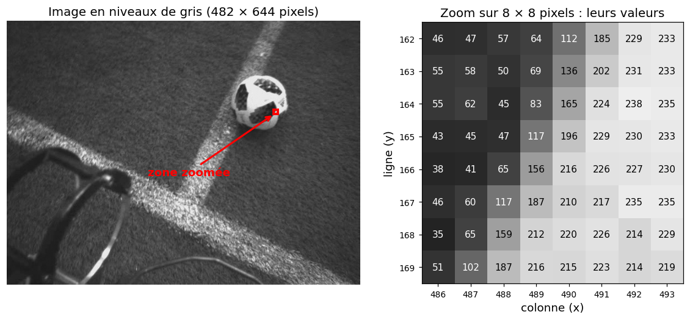

   **Figure 1** : À gauche, l'image ``ballon.jpg`` convertie en niveaux de gris (nous verrons les images en couleur dans la section 1.2). À droite, les valeurs des 8 × 8 pixels encadrés en rouge : les pixels sombres (panneau noir du ballon) ont des valeurs faibles, les pixels clairs (partie blanche du ballon) des valeurs proches de 255.

.. slide::

On peut donc créer une image « à la main » avec un simple tableau NumPy :

.. code-block:: python

   import numpy as np
   import matplotlib.pyplot as plt

   # Une image en niveaux de gris de 7 lignes et 8 colonnes : un smiley !
   smiley = np.array([[255, 255, 255, 255, 255, 255, 255, 255],
                      [255, 255,   0, 255, 255,   0, 255, 255],
                      [255, 255,   0, 255, 255,   0, 255, 255],
                      [255, 255, 255, 128, 128, 255, 255, 255],
                      [255,   0, 255, 255, 255, 255,   0, 255],
                      [255, 255,   0,   0,   0,   0, 255, 255],
                      [255, 255, 255, 255, 255, 255, 255, 255]], dtype=np.uint8)

   print(smiley.shape)   # (7, 8) -> 7 lignes (hauteur) et 8 colonnes (largeur)
   print(smiley[1, 2])   # 0   -> pixel de la ligne 1, colonne 2 : noir (un œil)
   print(smiley[3, 3])   # 128 -> pixel de la ligne 3, colonne 3 : gris (le nez)

   plt.imshow(smiley, cmap='gray', vmin=0, vmax=255)   # cmap='gray' : affichage en niveaux de gris
   plt.colorbar()
   plt.show()

.. warning::

   ⚠️ La forme d'une image est donnée dans l'ordre **(hauteur, largeur)**, c'est-à-dire (nombre de lignes, nombre de colonnes). C'est l'inverse de l'habitude « largeur × hauteur » utilisée pour parler de la résolution d'un écran (1920 × 1080).

.. slide::

1.2. Les images en couleur : les canaux
~~~~~~~~~~~~~~~~~~~

Pour représenter une couleur, on utilise plusieurs valeurs par pixel, appelées **canaux** (*channels* en anglais). Le format le plus courant est **RGB** (*Red, Green, Blue*) : chaque pixel contient 3 valeurs entre 0 et 255, qui indiquent la quantité de rouge, de vert et de bleu.

Comme les pixels d'un écran émettent de la lumière, les couleurs s'**additionnent** : rouge + vert = jaune, et rouge + vert + bleu = blanc.

Le tableau ci-dessous ne donne que **quelques exemples** : en combinant les 256 valeurs possibles de chaque canal, on peut représenter $$256 \times 256 \times 256$$, soit environ **16,7 millions de couleurs** différentes.

+-----------+-------+-------+-------+
| Couleur   |   R   |   G   |   B   |
+===========+=======+=======+=======+
| Rouge     |  255  |   0   |   0   |
+-----------+-------+-------+-------+
| Vert      |   0   |  255  |   0   |
+-----------+-------+-------+-------+
| Bleu      |   0   |   0   |  255  |
+-----------+-------+-------+-------+
| Jaune     |  255  |  255  |   0   |
+-----------+-------+-------+-------+
| Magenta   |  255  |   0   |  255  |
+-----------+-------+-------+-------+
| Cyan      |   0   |  255  |  255  |
+-----------+-------+-------+-------+
| Blanc     |  255  |  255  |  255  |
+-----------+-------+-------+-------+
| Noir      |   0   |   0   |   0   |
+-----------+-------+-------+-------+
| Gris      |  128  |  128  |  128  |
+-----------+-------+-------+-------+

.. slide::

Une image RGB est donc composée de **3 images en niveaux de gris superposées**, une par canal. Construisons une image de 8 bandes de couleur (la syntaxe ``img[:, a:b]`` sera détaillée dans la section 3) :

.. code-block:: python

   img = np.zeros((100, 400, 3), dtype=np.uint8)   # 100 lignes, 400 colonnes, 3 canaux : image noire

   couleurs = [[255, 0, 0], [0, 255, 0], [0, 0, 255], [255, 255, 0],
               [255, 0, 255], [0, 255, 255], [255, 255, 255], [0, 0, 0]]
   for i, c in enumerate(couleurs):
       img[:, i*50:(i+1)*50] = c                  # colonnes i*50 à (i+1)*50 : couleur c

   print(img.shape)        # (100, 400, 3)
   print(img[50, 175])     # [255 255   0] -> un pixel de la 4e bande : jaune

   plt.imshow(img)
   plt.show()

Dans la Figure 2, chaque canal est affiché séparément comme une image en niveaux de gris. Une bande **blanche** (255) signifie que la couleur contient le maximum de cette composante, une bande **noire** (0) qu'elle n'en contient pas du tout.

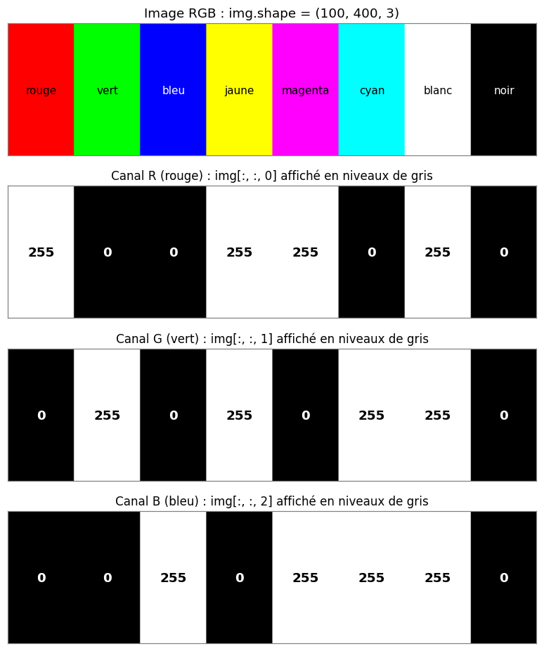

   **Figure 2** : Une image RGB (en haut) et ses trois canaux R, G et B affichés en niveaux de gris, avec la valeur de chaque bande. Par exemple, la bande jaune vaut 255 dans les canaux R et G et 0 dans le canal B, car jaune = rouge + vert.

.. note::

   Il existe aussi le format **RGBA**, qui ajoute un 4e canal **alpha** codant la transparence du pixel (0 = totalement transparent, 255 = totalement opaque). On le rencontre souvent avec les fichiers PNG (voir section 3.4).

.. slide::

1.3. Une image est un tenseur
~~~~~~~~~~~~~~~~~~~

Une image couleur est donc un **tableau à 3 dimensions** : la hauteur $$H$$ (nombre de lignes), la largeur $$W$$ (nombre de colonnes) et le nombre de canaux $$C$$ (1 pour les niveaux de gris, 3 pour RGB, 4 pour RGBA).

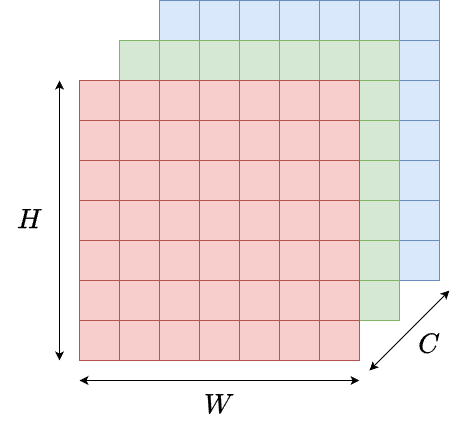

   **Figure 3** : Une image est un tenseur à 3 dimensions : hauteur ($$H$$), largeur ($$W$$) et canaux ($$C$$).

Selon la bibliothèque, l'ordre des dimensions n'est pas le même (exemples avec notre image ``ballon.jpg``) :

- **channel-last** $$(H, W, C)$$ : NumPy, PIL, Matplotlib, OpenCV → ``(482, 644, 3)``.
- **channel-first** $$(C, H, W)$$ : **PyTorch** → ``(3, 482, 644)``.
- **batch** $$(N, C, H, W)$$ : PyTorch traite les données par batch (voir chapitre 3) → ``(32, 3, 482, 644)`` pour 32 images.

💡 Une seule image de 482 × 644 pixels contient déjà $$482 \times 644 \times 3 = 931\,224$$ valeurs, contre seulement 4 valeurs pour une fleur du jeu de données Iris. C'est pour cela que l'on utilisera des réseaux adaptés aux images au chapitre 5 !

.. slide::

1.4. Type et plage des valeurs
~~~~~~~~~~~~~~~~~~~

Les valeurs des pixels peuvent être stockées de deux façons :

- **Entiers** ``uint8`` (*unsigned integer* sur 8 bits) : valeurs entières entre **0 et 255**. C'est le format des fichiers image, et il prend peu de mémoire (1 octet par valeur).
- **Réels** ``float32`` : valeurs généralement entre **0 et 1** (on divise par 255). C'est le format utilisé par les réseaux de neurones, car les calculs (gradients, etc.) se font avec des nombres réels.

💡 Le fichier ``ballon.jpg`` ne pèse que 95 Ko sur le disque car il est **compressé**. Une fois chargé en mémoire, il occupe $$931\,224$$ octets (≈ 0,9 Mo) en ``uint8``, et 4 fois plus en ``float32``.

.. warning::

   ⚠️ **Attention aux dépassements avec le type uint8 !** Un ``uint8`` ne peut contenir que des valeurs entre 0 et 255. Si un calcul dépasse ces bornes, la valeur « fait le tour » (calcul modulo 256), sans aucun message d'erreur :

   .. code-block:: python

      x = np.array([200, 250], dtype=np.uint8)
      print(x + 100)                       # [44 94]      ❌ 300 devient 44 et 350 devient 94 !
      print(x.astype(np.float32) + 100)    # [300. 350.]  ✅ on convertit d'abord en float

   **Bonne pratique** : convertir l'image en ``float32`` avant de faire des calculs, puis revenir en ``uint8`` (après avoir borné les valeurs entre 0 et 255) si besoin.

.. slide::

1.5. Pour aller plus loin : d'autres espaces de couleurs
~~~~~~~~~~~~~~~~~~~

RGB n'est pas la seule façon de représenter une couleur. D'autres **espaces de couleurs** existent :

- **HSV** (*Hue, Saturation, Value*) : sépare la teinte (la couleur « pure »), la saturation (l'intensité de la couleur) et la luminosité. Pratique pour sélectionner les pixels d'une certaine couleur, quelle que soit la luminosité (par exemple tout le vert du terrain, même dans les zones d'ombre).
- **HSL** (*Hue, Saturation, Lightness*) : proche de HSV, mais la luminosité va du noir (0) au blanc (1) en passant par la couleur pure (0,5). Pratique pour éclaircir ou assombrir une couleur sans changer sa teinte, par exemple pour ajuster la luminosité d'une image.
- **CIELAB** : conçu pour que la distance entre deux couleurs corresponde à la différence perçue par l'œil humain. Utilisé en retouche photo et en impression.

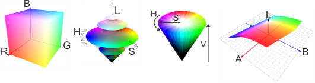

   **Figure 4** : Les espaces de couleur RGB, HSL, HSV et CIELAB.

En Deep Learning, on utilise presque toujours **RGB** : c'est le format des fichiers image, et le réseau apprend lui-même les combinaisons de canaux utiles.

.. slide::

📖 2. Charger, afficher et sauvegarder une image
----------------------

2.1. Avec Pillow (PIL)
~~~~~~~~~~~~~~~~~~~

**Pillow** est la bibliothèque Python de référence pour ouvrir et enregistrer des images. C'est aussi elle qu'utilise ``torchvision``.

.. code-block:: python

   from PIL import Image
   import numpy as np

   img_pil = Image.open('ballon.jpg')     # charger l'image
   print(img_pil.size)                    # (644, 482)  ⚠️ (largeur, hauteur) avec PIL !
   print(img_pil.mode)                    # RGB -> 3 canaux ('L' = niveaux de gris, 'RGBA' = avec transparence)

   img_gris = img_pil.convert('L')        # conversion en niveaux de gris
   img_gris.save('ballon_gris.png')       # sauvegarder : le format est déduit de l'extension

   img_np = np.array(img_pil)             # conversion PIL -> NumPy
   print(img_np.shape, img_np.dtype)      # (482, 644, 3) uint8 -> (hauteur, largeur, canaux)

   img_pil2 = Image.fromarray(img_np)     # conversion NumPy -> PIL (le tableau doit être en uint8)
   print(type(img_pil2))                  # <class 'PIL.Image.Image'> -> on retrouve une image PIL
   print(img_pil2.size, img_pil2.mode)    # (644, 482) RGB -> à nouveau (largeur, hauteur)

.. warning::

   ⚠️ ``img_pil.size`` donne **(largeur, hauteur)** alors que ``img_np.shape`` donne **(hauteur, largeur, canaux)**. C'est une source d'erreur très fréquente !

.. slide::

2.2. Avec Matplotlib
~~~~~~~~~~~~~~~~~~~

Matplotlib permet aussi de charger une image directement sous forme de tableau NumPy, et surtout de l'**afficher** :

.. code-block:: python

   import matplotlib.pyplot as plt

   img = plt.imread('ballon.jpg')            # chargement direct en tableau NumPy
   print(img.shape, img.dtype, img.max())    # (482, 644, 3) uint8 250

   plt.imshow(img)
   plt.title("Mon image")
   plt.axis('off')                           # masquer les axes
   plt.show()

   plt.imsave('ballon_copie.png', img)       # sauvegarder un tableau NumPy en image

.. warning::

   ⚠️ **Le type renvoyé par** ``plt.imread`` **dépend du format du fichier !**

   .. code-block:: python

      img_jpg = plt.imread('ballon.jpg')
      img_png = plt.imread('ballon_gris.png')
      print(img_jpg.dtype, img_jpg.max())    # uint8 250         -> JPEG : entiers entre 0 et 255
      print(img_png.dtype, img_png.max())    # float32 0.9529412 -> PNG : réels entre 0 et 1

   Vérifiez donc toujours le ``dtype`` et les valeurs min/max d'une image après l'avoir chargée.

.. slide::

**Afficher une image en niveaux de gris** :

Lorsque le tableau n'a que 2 dimensions $$(H, W)$$, ``plt.imshow`` utilise par défaut une palette de couleurs (``viridis``, du violet au jaune) et étire le contraste entre le minimum et le maximum de l'image. Pour obtenir un vrai affichage en niveaux de gris :

.. code-block:: python

   gris = np.array(Image.open('ballon.jpg').convert('L'))   # (482, 644)

   plt.imshow(gris)                                   # ❌ fausses couleurs (palette viridis)
   plt.show()
   plt.imshow(gris, cmap='gray', vmin=0, vmax=255)    # ✅ 0 = noir et 255 = blanc
   plt.show()

.. slide::

2.3. Passer en PyTorch (et revenir)
~~~~~~~~~~~~~~~~~~~

Pour donner une image à un réseau de neurones, il faut la convertir en **tenseur PyTorch au format** $$(C, H, W)$$. Il existe plusieurs méthodes :

.. code-block:: python

   import torch
   from torchvision import transforms
   from torchvision.io import read_image

   # Méthode 1 : NumPy -> PyTorch, puis réordonner les dimensions
   img_np = np.array(Image.open('ballon.jpg'))            # (482, 644, 3) uint8
   img_t = torch.from_numpy(img_np).permute(2, 0, 1)      # (H, W, C) -> (C, H, W)
   print(img_t.shape, img_t.dtype)                        # torch.Size([3, 482, 644]) torch.uint8

   # Méthode 2 : lecture directe en tenseur
   img_t = read_image('ballon.jpg')
   print(img_t.shape, img_t.dtype)                        # torch.Size([3, 482, 644]) torch.uint8

   # Méthode 3 : avec ToTensor (la plus utilisée dans les Datasets, voir chapitres 3 et 5)
   img_t = transforms.ToTensor()(Image.open('ballon.jpg'))
   print(img_t.shape, img_t.dtype, img_t.max())           # torch.Size([3, 482, 644]) torch.float32 tensor(0.9804)

``transforms.ToTensor()`` fait trois choses à la fois :

1. conversion d'une image PIL (ou d'un tableau NumPy) en tenseur,
2. passage de $$(H, W, C)$$ à $$(C, H, W)$$,
3. conversion en ``float32`` et division par 255 : les valeurs passent de [0, 255] à [0, 1].

.. slide::

Pour **afficher** un tenseur PyTorch avec Matplotlib, il faut revenir au format $$(H, W, C)$$ :

.. code-block:: python

   # plt.imshow(img_t)                  # ❌ TypeError: Invalid shape (3, 482, 644) for image data
   plt.imshow(img_t.permute(1, 2, 0))   # ✅ (C, H, W) -> (H, W, C)
   plt.show()

💡 Si le tenseur est sur le GPU ou fait partie d'un calcul de gradient, il faut d'abord le ramener sur le CPU et le détacher : ``img_t.detach().cpu().permute(1, 2, 0)``.

.. slide::

2.4. Récapitulatif
~~~~~~~~~~~~~~~~~~~

+------------------------------------+-------------+-------------+-------------+
| Code                               | Forme       | Type        | Valeurs     |
+====================================+=============+=============+=============+
| ``np.array(Image.open('x.jpg'))``  | (H, W, C)   | uint8       | [0, 255]    |
+------------------------------------+-------------+-------------+-------------+
| ``plt.imread('x.jpg')``            | (H, W, C)   | uint8       | [0, 255]    |
+------------------------------------+-------------+-------------+-------------+
| ``plt.imread('x.png')``            | (H, W, C)   | float32     | [0, 1]      |
+------------------------------------+-------------+-------------+-------------+
| ``read_image('x.jpg')``            | (C, H, W)   | uint8       | [0, 255]    |
+------------------------------------+-------------+-------------+-------------+
| ``transforms.ToTensor()(img_pil)`` | (C, H, W)   | float32     | [0, 1]      |
+------------------------------------+-------------+-------------+-------------+

✓ **Bonnes pratiques** : après chaque chargement, affichez ``shape``, ``dtype``, ``min()`` et ``max()`` pour savoir exactement ce que vous manipulez.

.. slide::

📖 3. Sélectionner une partie d'une image : le slicing
----------------------

3.1. Le système de coordonnées d'une image
~~~~~~~~~~~~~~~~~~~

Pour repérer un pixel dans une image, on utilise ses coordonnées : son numéro de ligne $$y$$ et son numéro de colonne $$x$$, comptés à partir d'un point de départ appelé **origine**, de coordonnées (0, 0).

Dans une image, l'origine est le pixel **en haut à gauche**. L'axe des $$x$$ (colonnes) va vers la droite et l'axe des $$y$$ (lignes) va **vers le bas**, contrairement à un graphique en mathématiques où l'origine est en bas à gauche et où l'axe des $$y$$ va vers le haut :

.. code-block:: text

   origine (0, 0)        x (colonnes) →

          0   1   2   3   4   ...   W-1
        ┌───┬───┬───┬───┬───┬
      0 │   │   │   │   │   │
        ├───┼───┼───┼───┼───┼
      1 │   │   │ ● │   │   │       ● = img[1, 2]  (ligne y = 1, colonne x = 2)
        ├───┼───┼───┼───┼───┼
      2 │   │   │   │   │   │
        ├───┼───┼───┼───┼───┼
    ...
    H-1

   y (lignes) ↓

.. warning::

   ⚠️ On accède à un pixel avec ``img[y, x]`` : **la ligne d'abord, la colonne ensuite**. C'est l'inverse de la notation $$(x, y)$$ utilisée en mathématiques !

💡 **Astuce** : ``plt.imshow`` suit cette convention et place par défaut l'origine en haut à gauche (paramètre ``origin='upper'``). Le paramètre ``origin='lower'`` place l'élément ``img[0, 0]`` en bas à gauche, comme dans un graphique en mathématiques.

.. slide::

3.2. Rappels sur le slicing
~~~~~~~~~~~~~~~~~~~

Pour manipuler une partie d'une image, on pourrait utiliser des boucles ``for``. Mais c'est long à écrire et surtout **très lent**. On utilise plutôt le **slicing**, qui permet d'extraire une sous-partie d'un tableau NumPy ou d'un tenseur PyTorch avec la syntaxe ``debut:fin:pas`` :

- ``debut`` : indice de début (**inclus**), 0 par défaut,
- ``fin`` : indice de fin (**exclu**), la fin du tableau par défaut,
- ``pas`` : le pas, 1 par défaut.

.. code-block:: python

   seq = np.array([0, 1, 2, 3, 4, 5])
   print(seq[1:4])     # [1 2 3]    -> de l'indice 1 (inclus) à l'indice 4 (exclu)
   print(seq[1:6:2])   # [1 3 5]    -> avec un pas de 2
   print(seq[:3])      # [0 1 2]    -> du début jusqu'à l'indice 3 (exclu)
   print(seq[-2:])     # [4 5]      -> les 2 derniers éléments
   print(seq[::-1])    # [5 4 3 2 1 0] -> un pas de -1 inverse l'ordre

Pour un tableau à plusieurs dimensions, on sépare les dimensions par une virgule. Le caractère ``:`` seul signifie « tout prendre » :

.. code-block:: python

   tab = np.array([[ 0,  1,  2],
                   [10, 11, 12],
                   [20, 21, 22]])
   print(tab[0, :])       # [0 1 2]    -> la première ligne
   print(tab[:, 0])       # [ 0 10 20] -> la première colonne
   print(tab[1:, 1:])     # [[11 12] [21 22]] -> le bloc en bas à droite

.. slide::

3.3. Slicing sur une image
~~~~~~~~~~~~~~~~~~~

Une image étant un tableau $$(H, W, C)$$, le slicing permet de **recadrer**, de **sélectionner un canal**, de **réduire la taille** ou de **retourner** une image en une seule ligne :

.. code-block:: python

   img = np.array(Image.open('ballon.jpg'))   # (482, 644, 3)

   ballon = img[95:205, 405:520]   # lignes 95 à 204 et colonnes 405 à 519, tous les canaux
   print(ballon.shape)              # (110, 115, 3)

   rouge = img[:, :, 0]             # canal rouge uniquement
   print(rouge.shape)               # (482, 644) -> une image en niveaux de gris

   petite = img[::8, ::8]           # une ligne sur 8 et une colonne sur 8
   print(petite.shape)              # (61, 81, 3) -> image 8 fois plus petite

   miroir_h = img[:, ::-1]          # colonnes dans l'ordre inverse : miroir horizontal
   miroir_v = img[::-1, :]          # lignes dans l'ordre inverse : miroir vertical

💡 Les dimensions qui ne sont pas précisées à la fin sont prises **en entier** : ``img[95:205, 405:520]`` est équivalent à ``img[95:205, 405:520, :]``, c'est pourquoi ``ballon`` garde ses 3 canaux. En revanche, pour choisir un canal (la 3ème dimension), il faut écrire ``:`` pour les deux dimensions qui le précèdent : ``img[:, :, 0]``.

Pour visualiser le résultat, on affiche les 6 images dans une même figure avec ``plt.subplots(nb_lignes, nb_colonnes)`` : chaque case ``axes[i, j]`` (ligne ``i``, colonne ``j``) s'utilise comme ``plt`` :

.. code-block:: python

   fig, axes = plt.subplots(2, 3, figsize=(15, 8))   # 2 lignes × 3 colonnes d'images
   axes[0, 0].imshow(img)
   axes[0, 0].set_title('img (originale)')
   axes[0, 1].imshow(ballon)
   axes[0, 1].set_title('ballon (recadrage)')
   axes[0, 2].imshow(rouge, cmap='gray', vmin=0, vmax=255)   # 1 seul canal -> niveaux de gris
   axes[0, 2].set_title('rouge (canal R)')
   axes[1, 0].imshow(petite)
   axes[1, 0].set_title('petite (1 pixel sur 8)')
   axes[1, 1].imshow(miroir_h)
   axes[1, 1].set_title('miroir_h')
   axes[1, 2].imshow(miroir_v)
   axes[1, 2].set_title('miroir_v')
   plt.show()

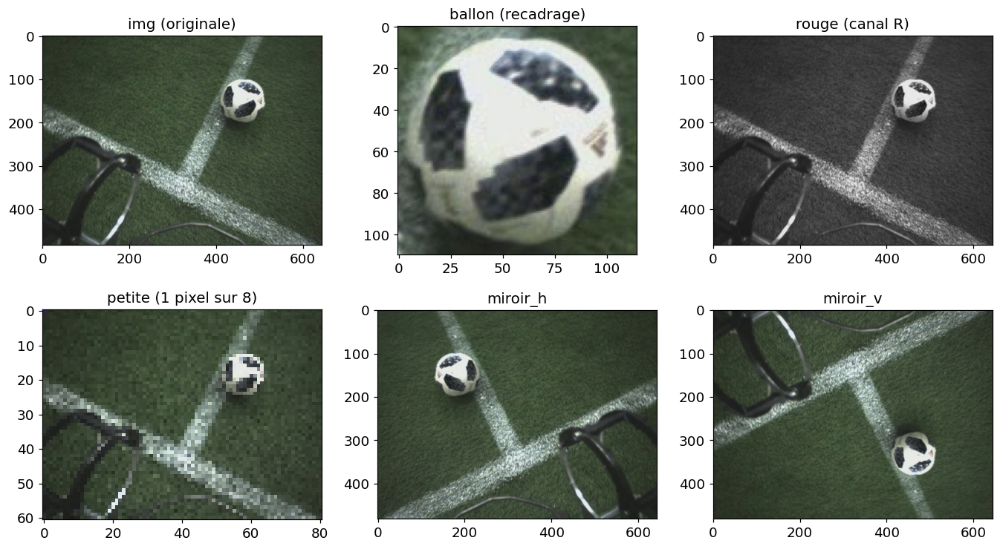

   **Figure 5** : Résultat du code ci-dessus. Les graduations des axes donnent la taille de chaque image : ``ballon`` ne fait que 115 colonnes, ``petite`` seulement 81. Dans ``rouge``, l'herbe apparaît sombre car le vert contient peu de rouge, alors que le ballon et les lignes blanches (R, G et B élevés) restent clairs.

.. slide::

.. warning::

   ⚠️ **En PyTorch, l'ordre des dimensions est** $$(C, H, W)$$ : le même recadrage s'écrit ``img_t[:, 95:205, 405:520]`` et le canal rouge s'écrit ``img_t[0]`` (équivalent à ``img_t[0, :, :]``). Pour un batch $$(N, C, H, W)$$, on ajoute une dimension devant : ``batch[:, :, 95:205, 405:520]``.

.. warning::

   ⚠️ **Le slicing ne copie pas les données**, il crée une *vue* sur le tableau d'origine : les deux variables partagent les mêmes pixels en mémoire. Modifier la vue modifie donc l'image d'origine ! Pour obtenir une vraie copie, on utilise ``.copy()`` en NumPy (``.clone()`` en PyTorch).

.. code-block:: python

   img = np.array(Image.open('ballon.jpg'))
   print(img[150, 460])                        # [232 232 230] -> un pixel blanc du ballon

   ballon = img[95:205, 405:520]               # vue : ballon partage ses pixels avec img
   ballon[:] = 0                               # ⚠️ met aussi à zéro cette zone dans img !
   print(img[150, 460])                        # [0 0 0] -> img a été modifiée

   img2 = np.array(Image.open('ballon.jpg'))
   ballon2 = img2[95:205, 405:520].copy()      # ✅ vraie copie (.clone() en PyTorch)
   ballon2[:] = 0                              # seule la copie est modifiée
   print(img2[150, 460])                       # [232 232 230] -> img2 est intacte

   fig, axes = plt.subplots(1, 2, figsize=(12, 4))   # 1 seule ligne -> axes[0] et axes[1]
   axes[0].imshow(img)
   axes[0].set_title('img après ballon[:] = 0 (vue)')
   axes[1].imshow(img2)
   axes[1].set_title('img2 après ballon2[:] = 0 (copie)')
   plt.show()

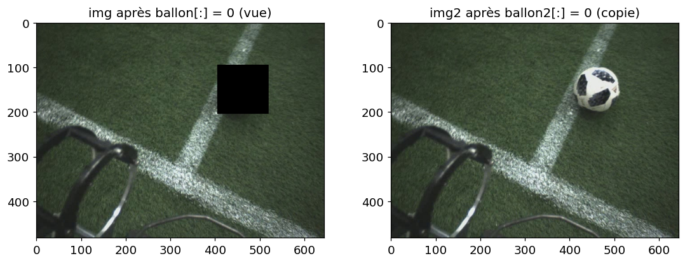

   **Figure 6** : Résultat du code ci-dessus. À gauche, mettre la vue ``ballon`` à zéro a aussi noirci le ballon dans ``img``. À droite, ``ballon2`` est une copie : ``img2`` n'a pas changé.

.. slide::

3.4. Le canal alpha (transparence)
~~~~~~~~~~~~~~~~~~~

Dans une image **RGBA**, le 4e canal (indice 3) code la **transparence** de chaque pixel. Il se manipule comme n'importe quel autre canal, avec le slicing :

.. code-block:: python

   img_rgba = np.array(Image.open('ballon.jpg').convert('RGBA'))   # ajoute un 4e canal : alpha
   print(img_rgba.shape)         # (482, 644, 4)
   print(img_rgba[100, 100])     # [ 49  61  41 255] -> alpha = 255 : pixel totalement opaque

   img_rgba[:, :322, 3] = 60     # la moitié gauche devient presque transparente

   plt.imshow(img_rgba)
   plt.show()

   Image.fromarray(img_rgba).save('ballon_transparent.png')   # ⚠️ le JPEG ne gère pas la transparence : utilisez PNG

⚠️ Avec ``plt.imread`` sur un fichier PNG, toutes les valeurs (y compris alpha) sont des réels entre 0 et 1 : alpha vaut alors 0 (transparent) à 1 (opaque).

.. slide::

3.5. Découper une image en patchs
~~~~~~~~~~~~~~~~~~~

Il est parfois utile de découper une image en petits morceaux de même taille, appelés **patchs** : par exemple pour traiter une très grande image (satellite, médicale) qui ne tient pas en mémoire, ou parce que certains réseaux (les *Vision Transformers*) découpent eux-mêmes l'image en patchs.

Avec deux boucles et du slicing :

.. code-block:: python

   img = np.array(Image.open('ballon.jpg'))   # (482, 644, 3)
   taille = 160                               # patchs de 160 × 160 pixels
   H, W, C = img.shape                        # H = 482, W = 644, C = 3

   patchs = []
   for y in range(0, H - taille + 1, taille):        # range(0, 323, 160) -> y = 0, 160, 320
       for x in range(0, W - taille + 1, taille):    # range(0, 485, 160) -> x = 0, 160, 320, 480
           patchs.append(img[y:y+taille, x:x+taille])

   print(len(patchs))        # 12 -> 3 lignes × 4 colonnes de patchs
   print(patchs[0].shape)    # (160, 160, 3)

**Comment fonctionnent les deux boucles ?** Chaque patch est repéré par son **coin en haut à gauche** ``img[y, x]`` (points rouges de la Figure 7) :

- ``img[y:y+taille, x:x+taille]`` extrait le carré de ``taille`` × ``taille`` pixels qui part de ce coin.
- La boucle extérieure choisit la **ligne de patchs** : ``y`` vaut 0, puis 160, puis 320. Le 3ème argument de ``range`` (le pas) vaut ``taille`` : on avance d'un patch entier à chaque tour, pour que les patchs ne se chevauchent pas.
- Pour chaque valeur de ``y``, la boucle intérieure parcourt **toute la ligne** de gauche à droite : ``x`` vaut 0, 160, 320 puis 480.

Les patchs sont donc rangés **ligne par ligne, de gauche à droite**, comme quand on lit un texte : ``patchs[0]`` à ``patchs[3]`` forment la première ligne, ``patchs[4]`` commence la deuxième.

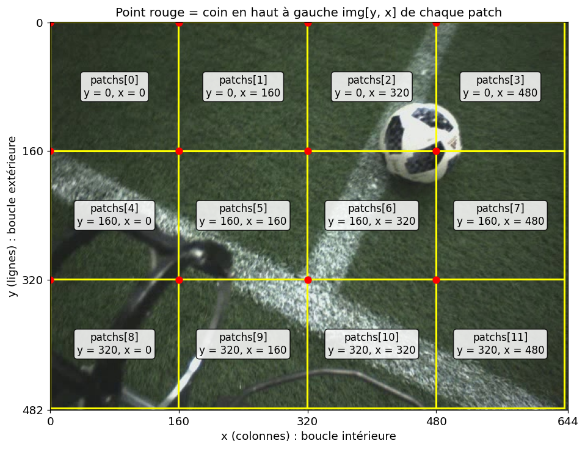

   **Figure 7** : Découpage de ``ballon.jpg`` en patchs de 160 × 160 pixels. Chaque case indique la position du patch dans la liste ``patchs`` et les valeurs de ``y`` et ``x`` au moment où il est extrait.

.. slide::

**Pourquoi la borne de fin vaut-elle** ``H - taille + 1`` **?**

- Elle garantit que le dernier patch **tient entièrement** dans l'image (``y + taille`` ne doit pas dépasser ``H``). Ici, ``H - taille + 1 = 482 - 160 + 1 = 323`` : ``range(0, 323, 160)`` donne ``y = 0, 160, 320`` et s'arrête avant 480, car un patch commençant à ``y = 480`` irait jusqu'à la ligne 640 alors que l'image n'a que 482 lignes. Les 2 dernières lignes de pixels (480 et 481) sont donc ignorées, ainsi que les 4 dernières colonnes (640 à 643).
- Le ``+ 1`` sert quand le dernier patch tombe **pile sur le bord**, car la fin de ``range`` est exclue. Par exemple, pour une image de 480 lignes, ``range(0, 480 - 160 + 1, 160)`` = ``range(0, 321, 160)`` donne bien ``y = 0, 160, 320``. Sans le ``+ 1``, ``range(0, 320, 160)`` s'arrêterait à ``y = 160``, car la borne 320 est exclue : le patch qui commence à ``y = 320`` (lignes 320 à 479) serait oublié alors qu'il tient pile dans l'image.

.. slide::

Pour afficher les 12 patchs, on utilise ``plt.subplots(3, 4)`` comme dans la section 3.3. Comme il y a 4 patchs par ligne, le patch numéro ``k`` va dans la case de ligne ``k // 4`` (division entière) et de colonne ``k % 4`` (reste de la division). Par exemple, ``patchs[6]`` va dans la case ``axes[1, 2]`` :

.. code-block:: python

   fig, axes = plt.subplots(3, 4, figsize=(10, 8))   # 3 lignes × 4 colonnes de patchs
   for k in range(len(patchs)):
       axes[k // 4, k % 4].imshow(patchs[k])
       axes[k // 4, k % 4].set_title(f'patchs[{k}]')
       axes[k // 4, k % 4].axis('off')               # masquer les axes
   plt.show()

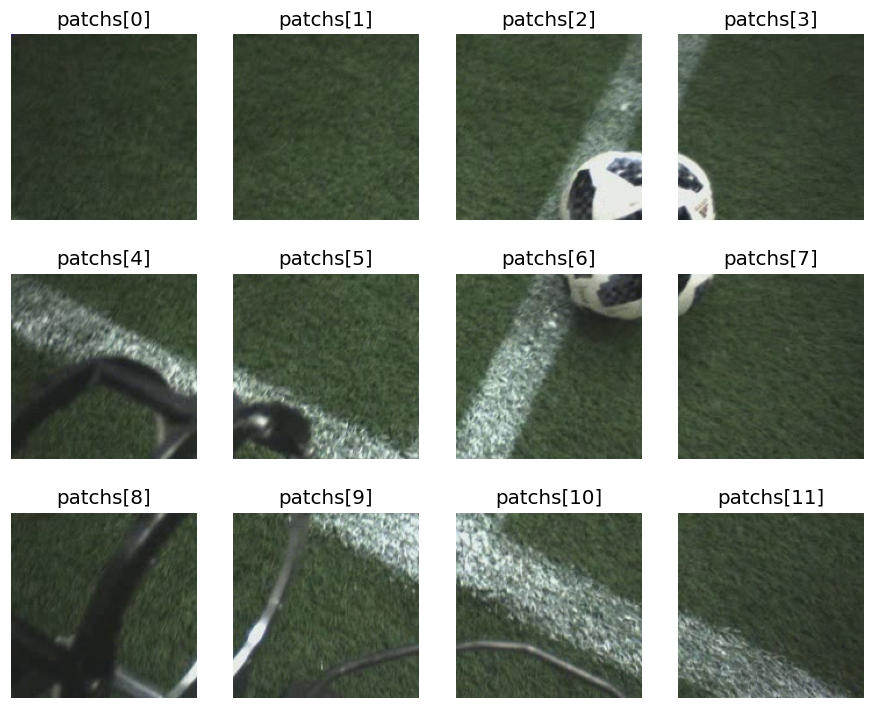

   **Figure 8** : Résultat du code ci-dessus. Le découpage ne tient pas compte du contenu de l'image : le ballon est coupé en 4 morceaux, répartis dans ``patchs[2]``, ``patchs[3]``, ``patchs[6]`` et ``patchs[7]``.

.. slide::

🏋️ Travaux Pratiques
--------------------

.. note::

   Pour ce TP, téléchargez l'image `elephants.png <images/tp4/elephants.png>`_ et placez-la dans le même dossier que votre notebook Jupyter. Tous les exercices utilisent cette image.

.. slide::
🍀 Exercice 1 : Charger et inspecter une image
~~~~~~~~~~~~~~~~~~~~~~~~~~~~~~

Dans cet exercice, vous allez charger une image avec différentes bibliothèques et étudier son format.

**Objectif :** Savoir charger une image et connaître précisément ce que l'on manipule (forme, type, plage des valeurs).

**Consigne :** Écrire un programme qui :

.. step::
    1) Importe les bibliothèques ``numpy``, ``matplotlib.pyplot``, ``PIL.Image``, ``torch`` et ``torchvision.transforms``.

.. step::
    2) Charge l'image ``elephants.png`` avec ``plt.imread`` et l'affiche.

.. step::
    3) Affiche le type, la forme (``shape``), le type des valeurs (``dtype``), ainsi que les valeurs minimale et maximale de l'image chargée.

.. step::
    4) Charge la même image avec PIL, la convertit en tableau NumPy et affiche les mêmes informations.

.. step::
    5) Convertit l'image PIL en tenseur PyTorch avec ``transforms.ToTensor()``, affiche sa forme, puis l'affiche avec Matplotlib.

**Questions :**

.. step::
    6) Combien l'image a-t-elle de lignes, de colonnes et de canaux ?

.. step::
    7) À quoi correspond le 4e canal ? Quelles valeurs contient-il ici, et qu'est-ce que cela signifie ?

.. step::
    8) Pourquoi les valeurs obtenues avec ``plt.imread`` et avec PIL ne sont-elles pas les mêmes ?

**Astuce :**
.. spoiler::
    .. discoverList::
        1. ``np.unique(img[:, :, 3])`` donne la liste des valeurs différentes du 4e canal
        2. Avec PIL, ``img_pil.size`` donne (largeur, hauteur) et ``img_pil.mode`` le format des canaux
        3. Relisez le récapitulatif de la section 2.4 du cours
        4. Pour afficher un tenseur $$(C, H, W)$$ avec Matplotlib : ``plt.imshow(img_t.permute(1, 2, 0))``

**Résultat attendu :**

- ``plt.imread`` : forme ``(1440, 1920, 4)``, type ``float32``, valeurs entre 0 et 1
- PIL : ``img_pil.size`` vaut ``(1920, 1440)``, mode ``RGBA`` ; en NumPy : forme ``(1440, 1920, 4)``, type ``uint8``, valeurs entre 0 et 255
- ``ToTensor`` : ``torch.Size([4, 1440, 1920])``, type ``float32``, valeurs entre 0 et 1

.. slide::
🍀 Exercice 2 : Transparence, recadrage et système de coordonnées
~~~~~~~~~~~~~~~~~~~~~~~~~~~~~~

Dans cet exercice, vous allez modifier les canaux et sélectionner une partie de l'image avec le slicing, sans aucune boucle.

**Objectif :** Maîtriser le slicing sur une image et le système de coordonnées $$(y, x)$$.

On repart de l'image chargée avec Matplotlib :

.. code-block:: python

    import numpy as np
    import matplotlib.pyplot as plt

    img = plt.imread('elephants.png')   # (1440, 1920, 4), valeurs dans [0, 1]

**Consigne :** Écrire un programme qui :

.. step::
    1) Atténue les couleurs de l'image en la rendant semi-transparente (canal alpha à 0.5), puis l'affiche.

.. step::
    2) Donne une transparence aléatoire à chaque pixel, affiche l'image pour vérifier, puis remet le canal alpha à 1.

.. step::
    3) Récupère uniquement l'éléphanteau, puis l'affiche (attention au système de coordonnées !).

.. step::
    4) Affiche l'image avec l'origine (0, 0) en bas à gauche, tout en gardant l'image à l'endroit.

.. warning::

   ⚠️ Chaque **modification** ou **sélection** de l'image (changer le canal alpha, récupérer l'éléphanteau) doit s'écrire en **une seule ligne de code**, sans boucle, grâce au slicing. L'affichage, lui, peut bien sûr prendre plusieurs lignes.

**Questions :**

.. step::
    5) Dans ``img[a:b, c:d]``, à quel axe correspondent ``a:b`` et ``c:d`` ?

.. step::
    6) Que se passe-t-il si l'on utilise seulement le paramètre ``origin='lower'`` de ``plt.imshow`` ?

**Astuce :**
.. spoiler::
    .. discoverList::
        1. Le canal alpha est ``img[:, :, 3]`` et se modifie avec le slicing (section 3.4 du cours)
        2. ``np.random.rand(H, W)`` crée un tableau de valeurs aléatoires entre 0 et 1
        3. Pour trouver les coordonnées de l'éléphanteau, affichez l'image entière avec ``plt.imshow(img)`` : l'axe vertical est gradué en numéros de lignes (``y``) et l'axe horizontal en numéros de colonnes (``x``). Relevez sur chaque axe où commence et où se termine l'éléphanteau, puis utilisez ces valeurs dans ``img[y_debut:y_fin, x_debut:x_fin]``
        4. ``img[::-1]`` inverse l'ordre des lignes de l'image

**Résultat attendu :**

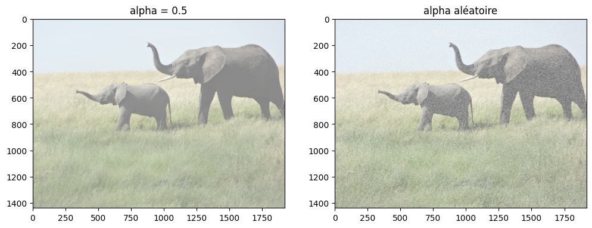

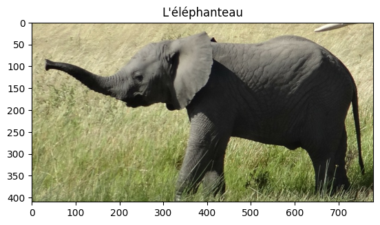

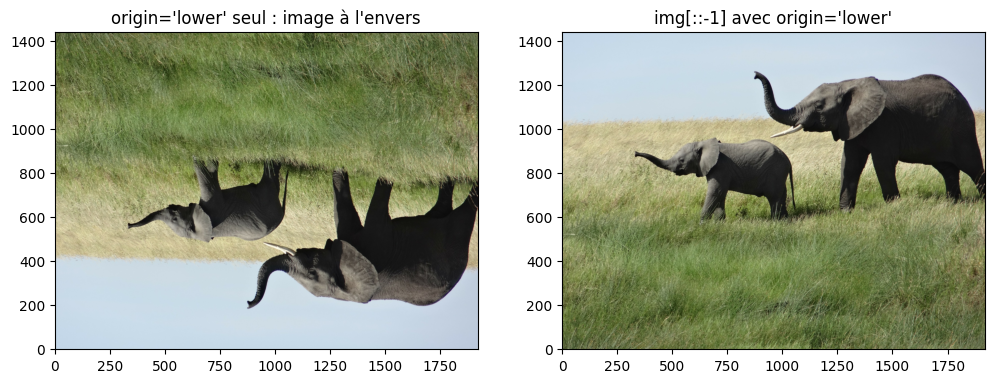

.. slide::
⚖️ Exercice 3 : Découper une image en patchs
~~~~~~~~~~~~~~~~~~~~~~~~~~~~~~

Dans cet exercice, vous allez découper l'image en morceaux, puis reconstituer une image plus petite à partir de ces morceaux, uniquement avec du slicing.

**Objectif :** Découper une image en patchs et réduire sa résolution avec le slicing.

On travaille uniquement sur les canaux RGB de l'image :

.. code-block:: python

    import numpy as np
    import matplotlib.pyplot as plt

    img = plt.imread('elephants.png')[:, :, :3]   # (1440, 1920, 3)

**Consigne :** Écrire un programme qui :

.. step::
    1) Découpe l'image en morceaux (*patchs*) de 240 × 240 pixels et les affiche tous dans une seule figure.

.. step::
    2) Réduit chaque patch d'un facteur 4 avec le slicing, pour obtenir des patchs de 60 × 60 pixels.

.. step::
    3) Reconstitue et affiche l'image à partir des petits patchs.

.. step::
    4) Réduit la résolution de l'image d'origine d'un facteur 20 avec le slicing, puis l'affiche.

**Questions :**

.. step::
    5) Combien de patchs obtenez-vous ? Des pixels de l'image d'origine sont-ils perdus ?

.. step::
    6) Quelle est la taille de l'image reconstituée ?

.. step::
    7) L'image reconstituée est-elle identique à ``img[::4, ::4]`` ? Pourquoi ?

.. step::
    8) Pourquoi l'image réduite d'un facteur 20 paraît-elle « pixelisée » ?

**Astuce :**
.. spoiler::
    .. discoverList::
        1. Utilisez deux boucles ``for`` avec un pas de 240, et le slicing ``img[y:y+240, x:x+240]`` (section 3.5 du cours)
        2. Pour afficher plusieurs images dans une même figure : ``fig, axes = plt.subplots(nb_lignes, nb_colonnes)`` (sections 3.3 et 3.5 du cours)
        3. ``patch[::4, ::4]`` garde une ligne sur 4 et une colonne sur 4 (section 3.3 du cours)
        4. Pour reconstituer l'image, créez un tableau rempli de zéros de la bonne taille avec ``np.zeros((hauteur, largeur, 3))``, puis placez chaque petit patch au bon endroit avec le slicing
        5. ``np.array_equal(a, b)`` vérifie si deux tableaux sont identiques

**Résultat attendu :**

- 48 patchs de forme ``(240, 240, 3)``
- Image reconstituée de forme ``(360, 480, 3)``, identique à ``img[::4, ::4]``
- Image réduite d'un facteur 20 de forme ``(72, 96, 3)``

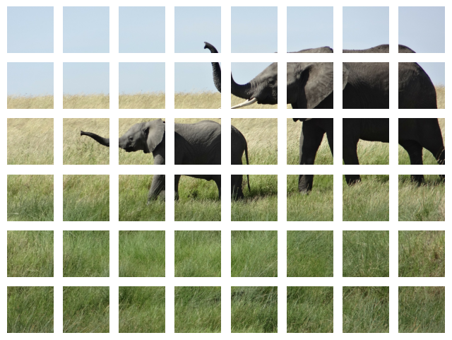

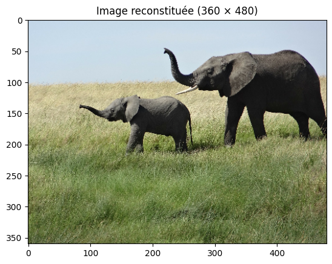

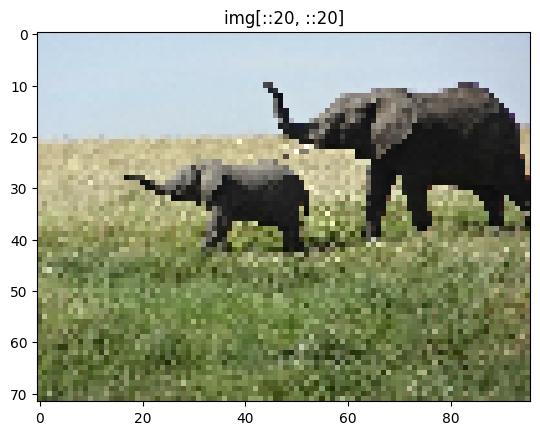
