.. slide::

Chapitre 4 — Manipulation d'images (partie 2)
================

🎯 Objectifs du Chapitre
----------------------

.. important::

   À la fin de ce chapitre, vous saurez :

   - Expliquer comment une image est représentée dans un ordinateur (pixels, canaux, type et plage des valeurs).
   - Charger, afficher et sauvegarder une image, et passer d'un format à l'autre (PIL, NumPy, PyTorch).
   - Sélectionner une zone, un canal ou certains pixels d'une image avec le slicing et les masques booléens.
   - Modifier une image : luminosité, niveaux de gris, redimensionnement, rotation, normalisation, etc.
   - Regrouper plusieurs images en un batch et leur appliquer un traitement en une seule fois, sans boucle.

.. note::

   Les exemples de cette partie utilisent toujours l'image `ballon.jpg <images/chap4/ballon.jpg>`_ de la partie 1, à placer dans le même dossier que votre notebook Jupyter.

.. slide::

📖 4. Modifier les pixels d'une image
----------------------

4.1. Opérations sur toute l'image
~~~~~~~~~~~~~~~~~~~

Comme une image est un tableau, une opération arithmétique s'applique **à tous les pixels d'un coup** :

.. code-block:: python

   img = np.array(Image.open('ballon.jpg')).astype(np.float32)   # ⚠️ en float pour éviter les dépassements

   plus_clair = np.clip(img + 60, 0, 255)                       # luminosité : on ajoute 60 à tous les pixels
   plus_contraste = np.clip((img - 128) * 1.5 + 128, 0, 255)    # contraste : on éloigne les valeurs du gris moyen (128)
   negatif = 255 - img                                          # négatif : on inverse les valeurs

   # Effet des trois modifications sur un pixel d'herbe (vert sombre)
   print(img[100, 100])               # [49. 61. 41.]
   print(plus_clair[100, 100])        # [109. 121. 101.] -> + 60 sur chaque canal
   print(plus_contraste[100, 100])    # [ 9.5 27.5  0. ] -> encore plus sombre, et -2.5 est ramené à 0 par np.clip
   print(negatif[100, 100])           # [206. 194. 214.] -> 255 - valeur : le vert sombre devient rose clair

   fig, axes = plt.subplots(1, 4, figsize=(20, 4))
   axes[0].imshow(img.astype(np.uint8))                         # retour en uint8 pour l'affichage
   axes[0].set_title('Originale')
   axes[1].imshow(plus_clair.astype(np.uint8))
   axes[1].set_title('Luminosité : img + 60')
   axes[2].imshow(plus_contraste.astype(np.uint8))
   axes[2].set_title('Contraste : (img - 128) × 1.5 + 128')
   axes[3].imshow(negatif.astype(np.uint8))
   axes[3].set_title('Négatif : 255 - img')
   plt.show()

Le résultat de cet affichage correspond à la première ligne de la Figure 9.

- ``np.clip(x, 0, 255)`` borne les valeurs : tout ce qui est en dessous de 0 devient 0 et tout ce qui est au-dessus de 255 devient 255.
- ``plt.imshow`` attend des entiers entre 0 et 255 **ou** des réels entre 0 et 1. Un tableau ``float32`` avec des valeurs entre 0 et 255 doit donc être reconverti en ``uint8`` (ou divisé par 255) avant l'affichage.

💡 **Pourquoi pas de boucle for ?** Sur cette image de $$931\,224$$ valeurs, trois boucles imbriquées (lignes, colonnes, canaux) prennent environ 3 secondes sur un PC classique, contre quelques millisecondes avec NumPy, soit plusieurs centaines de fois plus rapide ! Sur GPU avec PyTorch, l'écart est encore plus grand.

.. slide::

4.2. Passer en niveaux de gris
~~~~~~~~~~~~~~~~~~~

Pour passer d'une image couleur à une image en niveaux de gris, on combine les 3 canaux en un seul. On pourrait faire la moyenne des 3 canaux, mais on utilise plutôt une **moyenne pondérée**, car l'œil humain est plus sensible au vert qu'au rouge, et beaucoup moins sensible au bleu :

.. math::

   gris = 0.299 \times R + 0.587 \times G + 0.114 \times B

.. code-block:: python

   img = np.array(Image.open('ballon.jpg')).astype(np.float32)

   gris = 0.299 * img[:, :, 0] + 0.587 * img[:, :, 1] + 0.114 * img[:, :, 2]
   print(gris.shape)        # (482, 644) -> il ne reste qu'un seul canal

   plt.imshow(gris, cmap='gray', vmin=0, vmax=255)
   plt.show()

C'est exactement le calcul réalisé par ``Image.open(...).convert('L')`` avec PIL et par ``transforms.Grayscale()`` avec torchvision.

.. slide::

4.3. Sélectionner des pixels avec un masque booléen
~~~~~~~~~~~~~~~~~~~

Un **masque booléen** est un tableau de ``True`` / ``False`` de même taille que l'image, obtenu avec une condition sur les valeurs des pixels. Il permet de sélectionner (ou de modifier) **uniquement les pixels qui vérifient la condition**.

Par exemple, pour trouver les pixels blancs (lignes du terrain et ballon), on cherche les pixels dont les 3 canaux ont une valeur élevée :

.. code-block:: python

   img = np.array(Image.open('ballon.jpg'))   # (482, 644, 3) uint8

   masque = (img[:, :, 0] > 150) & (img[:, :, 1] > 150) & (img[:, :, 2] > 150)
   print(masque.shape, masque.dtype)   # (482, 644) bool
   print(masque.sum())                 # 12665 -> nombre de pixels blancs (True compte pour 1)
   print(masque.mean())                # 0.0408... -> soit 4 % des pixels de l'image

   img_rouge = img.copy()
   img_rouge[masque] = [255, 0, 0]     # colorie en rouge tous les pixels sélectionnés

   fig, axes = plt.subplots(1, 2, figsize=(12, 4))
   axes[0].imshow(masque, cmap='gray')   # False (0) -> noir, True (1) -> blanc
   axes[0].set_title('Masque : R, G et B > 150 (True = blanc)')
   axes[1].imshow(img_rouge)
   axes[1].set_title('img[masque] = [255, 0, 0]')
   plt.show()

Avec ``cmap='gray'``, ``plt.imshow`` affiche le masque comme une image en noir et blanc : les pixels sélectionnés (``True``) en blanc, les autres (``False``) en noir. Le résultat correspond à la fin de la deuxième ligne de la Figure 9.

.. warning::

   ⚠️ Pour combiner des conditions sur des tableaux, il faut utiliser ``&`` (et), ``|`` (ou) et ``~`` (non), **pas** les mots-clés ``and``, ``or``, ``not``. Les parenthèses autour de chaque condition sont obligatoires.

.. slide::

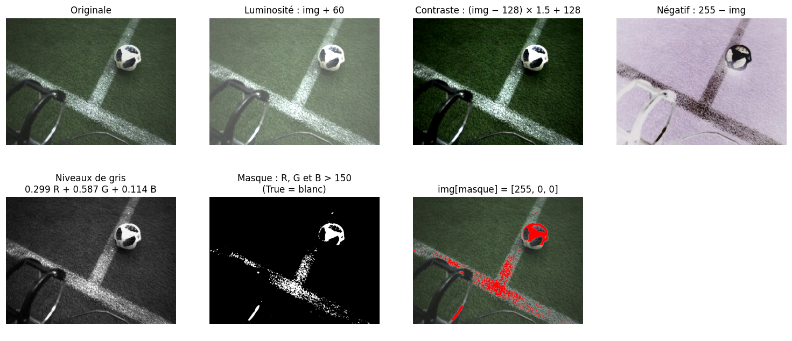

   **Figure 9** : Opérations pixel par pixel sur une image : luminosité, contraste, négatif, niveaux de gris et masque booléen.

Dans la Figure 9, on remarque que le masque sélectionne bien les lignes et le blanc du ballon, mais aussi un **reflet sur le robot** en bas à gauche. Une règle écrite à la main sur les couleurs est simple mais vite limitée : c'est justement pour cela que l'on entraînera des réseaux de neurones à reconnaître les objets (chapitres 5 et 6) !

💡 Créer un masque revient à **annoter automatiquement** les pixels de l'image (ici : « blanc » ou « pas blanc »). C'est une forme très simple de segmentation (voir section 7).

.. slide::

4.4. L'histogramme d'une image
~~~~~~~~~~~~~~~~~~~

L'**histogramme** d'une image compte combien de pixels ont chaque valeur (de 0 à 255). Il donne un résumé de la luminosité et du contraste de l'image, sans la regarder :

.. code-block:: python

   img = np.array(Image.open('ballon.jpg'))

   for c, couleur in enumerate(['red', 'green', 'blue']):
       valeurs = img[:, :, c].ravel()          # .ravel() aplatit le canal en un vecteur de 482 × 644 valeurs
       plt.hist(valeurs, bins=256, range=(0, 256), color=couleur, alpha=0.5, label=f"canal {c}")
   plt.xlabel("valeur du pixel")
   plt.ylabel("nombre de pixels")
   plt.legend()
   plt.show()

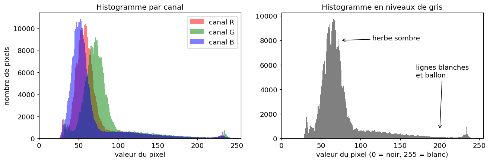

   **Figure 10** : Histogrammes de l'image ``ballon.jpg``. La plupart des pixels sont sombres (le pic correspond à l'herbe), et la longue traîne vers les valeurs élevées correspond aux lignes blanches et au ballon.

.. slide::

À quoi sert l'histogramme ?

- **Vérifier l'exposition** : une image sombre a un histogramme tassé à gauche, une image surexposée un histogramme tassé à droite, une image peu contrastée un histogramme étroit.
- **Choisir un seuil** pour un masque : dans la Figure 10, les pixels blancs sont au-delà de 150 environ.
- **Comparer deux jeux de données** : si les images de test sont beaucoup plus claires que les images d'entraînement, le modèle risque de mal généraliser (voir la notion de généralisation au chapitre 3).

.. slide::

📖 5. Transformations avec torchvision
----------------------

La bibliothèque ``torchvision.transforms`` propose de nombreuses transformations prêtes à l'emploi. Elles s'appliquent aussi bien à des images PIL qu'à des tenseurs $$(C, H, W)$$ ou à des batchs $$(N, C, H, W)$$.

Une transformation s'utilise en deux temps : on la **crée** (avec ses paramètres), puis on l'**applique** comme une fonction :

.. code-block:: python

   from torchvision import transforms

   redim = transforms.Resize((64, 64))   # 1. création de la transformation
   img_64 = redim(img_pil)               # 2. application à une image

.. slide::

5.1. Redimensionner une image
~~~~~~~~~~~~~~~~~~~

Redimensionner les images est presque toujours nécessaire en Deep Learning :

1. **Un réseau attend une taille d'entrée fixe** : au chapitre 5, vous verrez que la taille de la première couche ``nn.Linear`` dépend de la taille des images.
2. **Pour former un batch**, toutes les images doivent avoir la même taille (section 6).
3. **Pour limiter le temps de calcul** : une photo de 4000 × 3000 pixels contient 240 fois plus de pixels qu'une image de 224 × 224 !

.. code-block:: python

   img_pil = Image.open('ballon.jpg')                 # 644 × 482

   petite = transforms.Resize((64, 64))(img_pil)      # ⚠️ (hauteur, largeur) avec torchvision
   print(petite.size)                                  # (64, 64)

   petite2 = img_pil.resize((128, 64))                # ⚠️ (largeur, hauteur) avec PIL !
   print(petite2.size)                                 # (128, 64)

   proportionnelle = transforms.Resize(240)(img_pil)  # un seul nombre : le plus petit côté vaut 240
   print(proportionnelle.size)                         # (320, 240) -> les proportions sont conservées

   fig, axes = plt.subplots(1, 4, figsize=(20, 4))
   axes[0].imshow(img_pil)
   axes[0].set_title('img_pil (644 × 482)')
   axes[1].imshow(petite)
   axes[1].set_title('petite (64 × 64)')
   axes[2].imshow(petite2)
   axes[2].set_title('petite2 (128 × 64)')
   axes[3].imshow(proportionnelle)
   axes[3].set_title('proportionnelle (320 × 240)')
   plt.show()

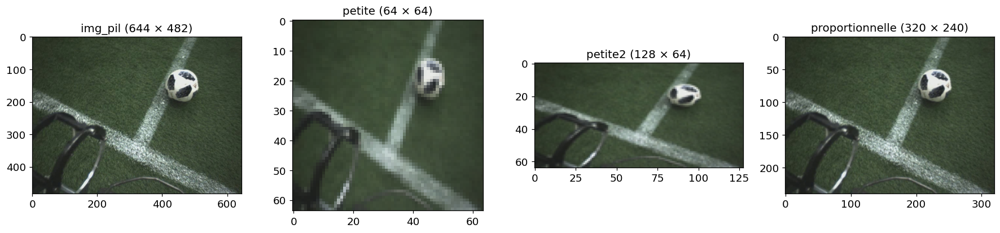

   **Figure 11** : Résultat du code ci-dessus. Les graduations des axes donnent la taille de chaque image. ``petite`` et ``petite2`` n'ont pas les proportions de l'image d'origine : le ballon est écrasé dans ``petite`` et étiré dans ``petite2``. ``proportionnelle`` conserve les proportions.

.. slide::

Quelques points d'attention :

- **Déformation** : passer de 644 × 482 à 64 × 64 ne respecte pas les proportions, l'image est « écrasée » (Figure 11). Pour l'éviter, on peut redimensionner le plus petit côté puis recadrer (``Resize`` puis ``CenterCrop``).
- **Interpolation** : pour calculer les nouveaux pixels, on utilise les pixels voisins. Par défaut, torchvision utilise une interpolation **bilinéaire** (moyenne pondérée des 4 voisins). L'interpolation **au plus proche voisin** (*nearest*) copie simplement le pixel le plus proche : c'est plus rapide, mais l'image paraît pixelisée.
- **Perte d'information** : réduire une image supprime des détails. Un ballon de 10 pixels de large dans l'image d'origine n'en fera plus que 1 ou 2 après une réduction par 8 !

💡 Pour redimensionner directement un batch de tenseurs, on peut aussi utiliser ``torch.nn.functional.interpolate(batch, size=(64, 64), mode='bilinear')``, qui attend un tenseur ``float`` de forme $$(N, C, H, W)$$.

.. slide::

5.2. Recadrer, retourner, pivoter…
~~~~~~~~~~~~~~~~~~~

Voici les transformations les plus courantes :

- ``transforms.CenterCrop(300)`` : garde un carré de 300 × 300 pixels au centre de l'image.
- ``transforms.RandomCrop(224)`` : garde un carré de 224 × 224 pixels à une position **aléatoire**.
- ``transforms.RandomResizedCrop(224)`` : garde une zone de taille et de position aléatoires, puis la redimensionne en 224 × 224.
- ``transforms.RandomHorizontalFlip(p=0.5)`` : miroir horizontal avec une probabilité ``p``.
- ``transforms.RandomRotation(30)`` : rotation d'un angle aléatoire entre −30° et +30°.
- ``transforms.ColorJitter(brightness, contrast, saturation, hue)`` : modifie aléatoirement les couleurs de l'image. Chaque paramètre agit sur une propriété différente :

  - **luminosité** (*brightness*) : rend toute l'image plus claire ou plus sombre, en multipliant les valeurs de tous les pixels par un même facteur (avec ``brightness=0.4``, un facteur tiré au hasard entre 0.6 et 1.4) ;
  - **contraste** (*contrast*) : augmente ou diminue l'écart entre les zones claires et les zones sombres, en éloignant ou en rapprochant les valeurs de la valeur moyenne de l'image (comme dans la section 4.1) ;
  - **saturation** : règle l'intensité des couleurs, sans changer les couleurs elles-mêmes. Le vert de l'herbe reste vert, mais devient plus terne (délavé, proche du gris) ou plus vif (plus « pur »), sans devenir plus clair ni plus sombre. C'est comme si l'on ajoutait du gris de même clarté dans un pot de peinture (couleur plus terne) ou qu'on en retirait (couleur plus vive). Avec ``saturation=0.4``, les couleurs deviennent au hasard un peu plus ternes ou un peu plus vives ;
  - **teinte** (*hue*) : change les couleurs elles-mêmes. La teinte est la couleur « pure » d'un pixel (rouge, jaune, vert, bleu…), indépendamment de sa luminosité et de sa saturation. La modifier décale toutes les couleurs de l'image le long du cercle des couleurs (rouge → jaune → vert → cyan → bleu → magenta → rouge) : le vert de l'herbe peut ainsi devenir jaune ou bleu. La valeur de ``hue`` doit être comprise entre 0 et 0.5.
- ``transforms.Grayscale()`` : conversion en niveaux de gris.
- ``transforms.GaussianBlur(kernel_size, sigma)`` : floute l'image (c'est une convolution, une opération que nous détaillerons au chapitre 5).

.. slide::

Pour appliquer ces transformations à l'image ``ballon.jpg`` et afficher les résultats dans une grille de 3 × 3 cases (comme pour les patchs de la section 3.5) :

.. code-block:: python

   img_pil = Image.open('ballon.jpg')

   transformations = [                                          # (titre, transformation)
       ('CenterCrop(300)', transforms.CenterCrop(300)),
       ('RandomCrop(224)', transforms.RandomCrop(224)),
       ('RandomResizedCrop(224)', transforms.RandomResizedCrop(224, scale=(0.2, 0.5))),   # zone de 20 à 50 % de l'image
       ('RandomHorizontalFlip(p=1.0)', transforms.RandomHorizontalFlip(p=1.0)),           # p=1.0 : toujours retournée
       ('RandomRotation(30)', transforms.RandomRotation(30)),
       ('ColorJitter(...)', transforms.ColorJitter(brightness=0.8, contrast=0.5, saturation=0.8)),
       ('Grayscale()', transforms.Grayscale()),
       ('GaussianBlur(15, sigma=5)', transforms.GaussianBlur(kernel_size=15, sigma=5)),
   ]

   fig, axes = plt.subplots(3, 3, figsize=(14, 11))
   axes[0, 0].imshow(img_pil)                                   # l'image d'origine dans la première case
   axes[0, 0].set_title('Originale (644 × 482)')
   for k in range(len(transformations)):
       titre, transfo = transformations[k]
       resultat = transfo(img_pil)                              # application de la transformation
       case = axes[(k + 1) // 3, (k + 1) % 3]                   # cases suivantes : k + 1 = 1, 2, ..., 8
       case.imshow(resultat, cmap='gray')                       # cmap n'est utilisé que pour l'image à 1 canal
       case.set_title(titre)
   for ax in axes.ravel():
       ax.axis('off')                                           # masquer les axes de toutes les cases
   plt.show()

.. slide::

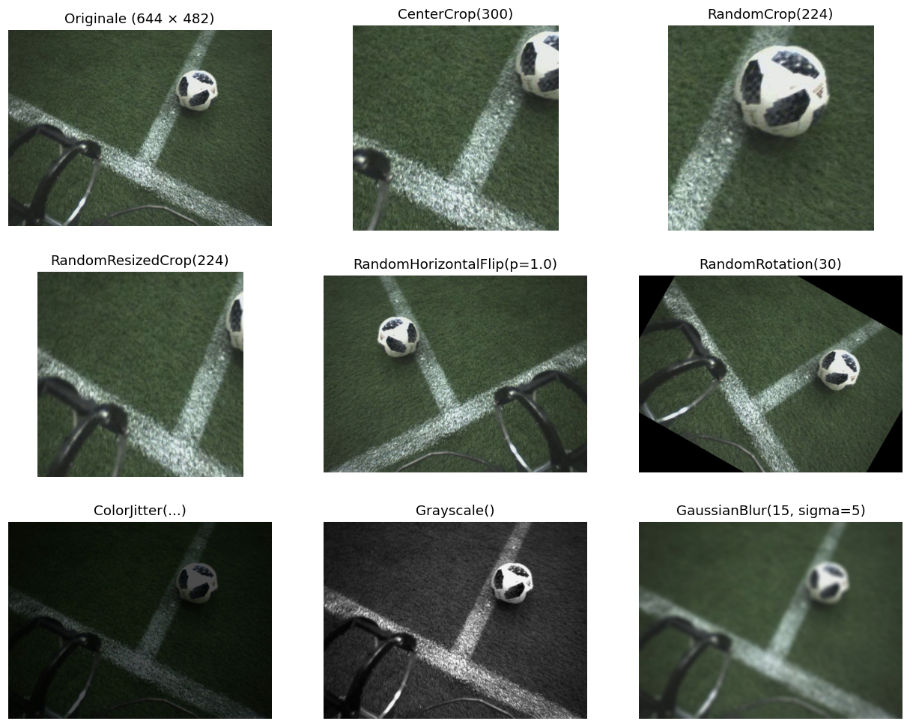

   **Figure 12** : Exemple de résultat du code de la diapo précédente. Les transformations ``Random...`` étant aléatoires, votre figure sera un peu différente à chaque exécution.

⚠️ Les transformations ``Random...`` donnent un résultat **différent à chaque appel**. Pour appliquer une transformation précise et reproductible, utilisez les fonctions de ``torchvision.transforms.functional`` : par exemple ``TF.rotate(img, 25)`` ou ``TF.hflip(img)`` après ``import torchvision.transforms.functional as TF``.

.. slide::

5.3. Normaliser les valeurs
~~~~~~~~~~~~~~~~~~~

Comme pour les données du chapitre 2, il faut mettre les valeurs des pixels à une échelle adaptée avant l'entraînement. Cela se fait en général en deux étapes :

1. ``transforms.ToTensor()`` : division par 255, les valeurs passent de [0, 255] à [0, 1] (normalisation).
2. ``transforms.Normalize(mean, std)`` : pour chaque canal $$c$$, calcule $$\frac{x - mean[c]}{std[c]}$$.

.. code-block:: python

   img_t = transforms.ToTensor()(Image.open('ballon.jpg'))   # (482, 644, 3) -> (3, 482, 644), valeurs dans [0, 1]
   moyennes = img_t.mean(dim=(1, 2))   # moyenne sur les dimensions 1 (H) et 2 (W) : une valeur par canal
   print(moyennes.shape)               # torch.Size([3])
   print(moyennes)                     # tensor([0.2685, 0.3169, 0.2536]) -> moyennes de R, G et B
   print(img_t.std(dim=(1, 2)))        # tensor([0.1307, 0.1343, 0.1425]) -> écarts-types de R, G et B

   normalize = transforms.Normalize(mean=[0.5, 0.5, 0.5], std=[0.5, 0.5, 0.5])   # une valeur par canal (R, G, B)
   img_norm = normalize(img_t)
   print(img_norm.shape)                    # torch.Size([3, 482, 644]) -> la forme ne change pas
   print(img_norm.min(), img_norm.max())    # tensor(-0.8510) tensor(0.9608) -> valeurs dans [-1, 1]

**Que se passe-t-il dans ce code ?**

- ``ToTensor()`` change l'ordre des dimensions : l'image $$(H, W, C) = (482, 644, 3)$$ devient un tenseur $$(C, H, W) = (3, 482, 644)$$ (section 2.3), et ses valeurs passent dans [0, 1].
- ``img_t.mean(dim=(1, 2))`` calcule la moyenne **le long des dimensions 1 et 2**, c'est-à-dire sur toutes les lignes ($$H$$) et toutes les colonnes ($$W$$) : on obtient la moyenne de tous les pixels d'un même canal. Les dimensions 1 et 2 disparaissent du résultat et seule la dimension 0 (les canaux) reste : la forme passe de (3, 482, 644) à (3,), soit une moyenne pour R, une pour G et une pour B. Sans ``dim``, ``img_t.mean()`` donnerait une seule moyenne pour toute l'image. ``std`` fonctionne de la même façon.
- Les listes ``[0.5, 0.5, 0.5]`` contiennent **une valeur par canal** : ``Normalize`` utilise ``mean[0]`` et ``std[0]`` pour le canal rouge, ``mean[1]`` et ``std[1]`` pour le vert, ``mean[2]`` et ``std[2]`` pour le bleu. On peut donc donner une valeur différente à chaque canal.
- ``Normalize`` ne change que les valeurs, pas la forme : ``img_norm`` a toujours la forme (3, 482, 644).

.. slide::

.. warning::

   ⚠️ **Attention au nom trompeur** : malgré son nom, ``transforms.Normalize`` réalise une **standardisation** (on soustrait une moyenne et on divise par un écart-type, voir chapitre 2), et non une normalisation entre 0 et 1.

   Pour obtenir des valeurs de moyenne 0 et d'écart-type 1, ``mean`` et ``std`` doivent être la moyenne et l'écart-type de chaque canal, **calculés sur le jeu d'entraînement uniquement** (voir chapitre 3). Les valeurs ``[0.5, 0.5, 0.5]`` sont un choix simple qui ramène les valeurs dans [−1, 1].

Pour voir l'effet de ``Normalize``, on affiche l'image avant et après, ainsi que l'histogramme des valeurs de leurs pixels :

.. code-block:: python

   fig, axes = plt.subplots(1, 3, figsize=(18, 4))
   axes[0].imshow(img_t.permute(1, 2, 0))
   axes[0].set_title('img_t : valeurs dans [0, 1]')
   axes[1].imshow(img_norm.permute(1, 2, 0))                   # ⚠️ affichage faussé : provoque l'avertissement « Clipping input data... »
   axes[1].set_title('img_norm affichée directement')
   axes[2].hist(img_t.flatten(), bins=100, alpha=0.5, label='img_t')
   axes[2].hist(img_norm.flatten(), bins=100, alpha=0.5, label='img_norm')
   axes[2].set_title('Valeurs des pixels (3 canaux)')
   axes[2].legend()
   plt.show()

.. slide::

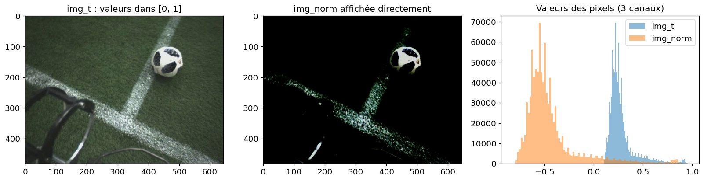

   **Figure 13** : Résultat du code de la diapo précédente.

- **Histogramme** : avec ``mean`` et ``std`` à 0.5, ``Normalize`` calcule $$\frac{x - 0.5}{0.5} = 2x - 1$$ : les valeurs sont décalées et étirées de [0, 1] vers [−1, 1]. Elles ne sont pas centrées sur 0, car 0.5 n'est pas la vraie moyenne des pixels de cette image (entre 0.25 et 0.32 selon le canal).
- **Image** : ``plt.imshow`` n'affiche correctement que des réels entre 0 et 1. Les valeurs négatives, majoritaires ici, sont ramenées à 0 et donc affichées en noir. Seuls les pixels clairs (ballon, lignes) restent visibles. Matplotlib le signale par l'avertissement *Clipping input data to the valid range for imshow...* : ce n'est pas une erreur, la figure s'affiche quand même, mais elle ne représente pas fidèlement les valeurs.

Pour **afficher** correctement une image normalisée, il faut faire l'opération inverse :

.. code-block:: python

   mean = torch.tensor([0.5, 0.5, 0.5]).view(3, 1, 1)    # forme (3, 1, 1) pour le broadcasting sur (3, H, W)
   std = torch.tensor([0.5, 0.5, 0.5]).view(3, 1, 1)

   img_affichable = img_norm * std + mean                # retour dans [0, 1]
   plt.imshow(img_affichable.permute(1, 2, 0))
   plt.show()

.. slide::

5.4. Enchaîner les transformations avec Compose
~~~~~~~~~~~~~~~~~~~

``transforms.Compose`` permet d'enchaîner plusieurs transformations, appliquées dans l'ordre de la liste. On distingue deux usages :

- le **prétraitement** : appliqué à **toutes** les images (entraînement, validation et test) pour qu'elles aient le format attendu par le réseau,
- l'**augmentation de données** : des transformations **aléatoires**, appliquées **uniquement aux images d'entraînement**.

.. code-block:: python

   # Prétraitement : pour la validation et le test
   pretraitement = transforms.Compose([
       transforms.Resize((224, 224)),
       transforms.ToTensor(),
       transforms.Normalize(mean=[0.5, 0.5, 0.5], std=[0.5, 0.5, 0.5]),
   ])

   # Augmentation + prétraitement : pour l'entraînement
   augmentation = transforms.Compose([
       transforms.RandomResizedCrop(224, scale=(0.4, 1.0)),
       transforms.RandomHorizontalFlip(),
       transforms.RandomRotation(15),
       transforms.ColorJitter(brightness=0.4, contrast=0.4, saturation=0.4),
       transforms.ToTensor(),
       transforms.Normalize(mean=[0.5, 0.5, 0.5], std=[0.5, 0.5, 0.5]),
   ])

   x = augmentation(Image.open('ballon.jpg'))
   print(x.shape)    # torch.Size([3, 224, 224])

⚠️ ``Normalize`` doit être placée **après** ``ToTensor``, car elle ne s'applique qu'à des tenseurs.

.. slide::

Pour voir l'effet de l'augmentation, on applique 6 fois ``augmentation`` à la même image. Comme ``augmentation`` se termine par ``Normalize``, il faut annuler la normalisation avant l'affichage, avec les tenseurs ``mean`` et ``std`` de la section 5.3 :

.. code-block:: python

   img_pil = Image.open('ballon.jpg')

   fig, axes = plt.subplots(1, 6, figsize=(18, 3.3))
   for i in range(6):
       x = augmentation(img_pil)                  # nouveau tirage aléatoire à chaque appel : (3, 224, 224)
       x_affichable = x * std + mean              # on annule Normalize pour l'affichage (section 5.3)
       axes[i].imshow(x_affichable.permute(1, 2, 0))
       axes[i].set_title(f'tirage n°{i + 1}')
       axes[i].axis('off')
   plt.show()

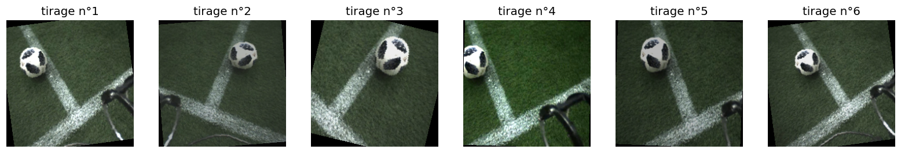

   **Figure 14** : Exemple de résultat du code ci-dessus (les tirages sont aléatoires, votre figure sera différente). À chaque époque, le réseau voit ainsi une version légèrement différente de chaque image d'entraînement.

.. slide::

L'augmentation de données permet d'obtenir **artificiellement** un jeu d'entraînement plus varié, et donc un modèle plus **robuste** (aux changements de luminosité, de cadrage, d'orientation, etc.) qui généralise mieux.

.. warning::

   ⚠️ **Une augmentation ne doit pas changer l'étiquette de l'image !** Par exemple, un miroir vertical transforme un « 6 » manuscrit en « 9 », et un miroir horizontal rend un texte illisible. Choisissez les augmentations en fonction de votre problème.

   ⚠️ **Pas d'augmentation pour la validation et le test** : on veut évaluer le modèle sur de vraies images (voir chapitre 3).

💡 Au chapitre 5, ces transformations seront passées au paramètre ``transform`` d'un ``Dataset`` (voir chapitre 3), pour être appliquées automatiquement à chaque chargement d'image.

.. slide::

📖 6. Traiter un batch d'images
----------------------

6.1. Empiler des images
~~~~~~~~~~~~~~~~~~~

Pour profiter de la puissance du GPU, on ne traite pas les images une par une, mais par **batch** (voir chapitre 3). Un batch de $$N$$ images est un tenseur de forme $$(N, C, H, W)$$, obtenu en **empilant** des images avec ``torch.stack`` :

.. code-block:: python

   pretraitement = transforms.Compose([
       transforms.Resize((224, 224)),
       transforms.ToTensor(),
   ])

   # Ici on charge 4 fois la même image ; en pratique ce seraient 4 fichiers différents
   chemins = ['ballon.jpg', 'ballon.jpg', 'ballon.jpg', 'ballon.jpg']
   images = [pretraitement(Image.open(c).convert('RGB')) for c in chemins]   # liste de tenseurs (3, 224, 224)

   batch = torch.stack(images)      # empile selon une nouvelle dimension 0
   print(batch.shape)               # torch.Size([4, 3, 224, 224]) -> (N, C, H, W)

.. warning::

   ⚠️ Toutes les images doivent avoir **exactement la même forme** pour être empilées, sinon :
   ``RuntimeError: stack expects each tensor to be equal size``. D'où l'importance de :

   - redimensionner toutes les images à la même taille,
   - convertir toutes les images dans le même mode avec ``.convert('RGB')`` : un PNG peut être en RGBA (4 canaux) ou en niveaux de gris (1 canal) !

💡 **Et le DataLoader du chapitre 3 ?** Pendant un entraînement, c'est le ``DataLoader`` qui construit les batchs pour vous : il récupère chaque image avec le ``__getitem__`` du ``Dataset``, puis les empile avec ``torch.stack``. C'est pour cela que votre ``Dataset`` d'images doit toujours renvoyer des images de même taille et avec le même nombre de canaux ! Savoir construire un batch soi-même reste utile pour tester un modèle ou faire une prédiction sur quelques images.

.. slide::

Pour afficher les images du batch, on parcourt sa dimension 0 : ``batch[i]`` est la i-ème image, de forme $$(3, 224, 224)$$.

.. code-block:: python

   fig, axes = plt.subplots(1, 4, figsize=(16, 4))
   for i in range(4):
       axes[i].imshow(batch[i].permute(1, 2, 0))   # (3, 224, 224) -> (224, 224, 3) pour Matplotlib
       axes[i].set_title(f'batch[{i}]')
   plt.show()

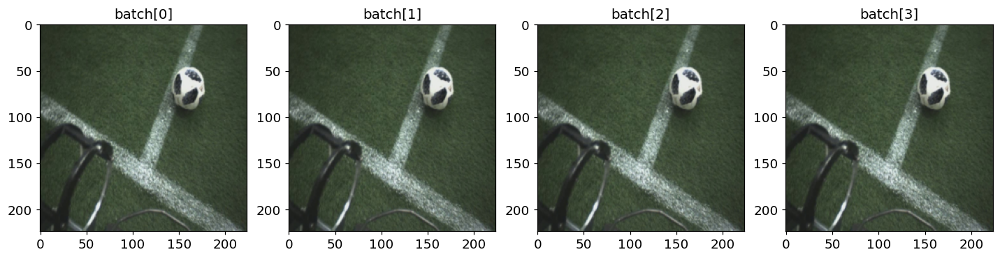

   **Figure 15** : Résultat du code ci-dessus : les 4 images du batch, toutes redimensionnées en 224 × 224 pixels par ``Resize((224, 224))`` (d'où le ballon légèrement écrasé).

.. slide::

6.2. Opérations sur un batch
~~~~~~~~~~~~~~~~~~~

Toutes les opérations vues dans ce chapitre s'appliquent à **toutes les images du batch en une seule instruction**, sans boucle ``for`` :

.. code-block:: python

   print(batch[0].shape)                   # torch.Size([3, 224, 224]) -> la première image
   print(batch[:, 0].shape)                # torch.Size([4, 224, 224]) -> le canal rouge de toutes les images

   moyennes = batch.mean(dim=(0, 2, 3))    # moyenne de chaque canal sur tout le batch
   print(moyennes.shape)                   # torch.Size([3]) -> une valeur par canal (utile pour Normalize !)

   miroirs = batch.flip(dims=[3])          # miroir horizontal de toutes les images (dimension 3 = W)

   gris = 0.299 * batch[:, 0] + 0.587 * batch[:, 1] + 0.114 * batch[:, 2]   # (4, 224, 224)
   gris = gris.unsqueeze(1)                # (4, 1, 224, 224) : on garde une dimension pour le canal

   import torch.nn.functional as F
   petits = F.interpolate(batch, size=(64, 64), mode='bilinear')   # (4, 3, 64, 64)

   device = 'cuda' if torch.cuda.is_available() else 'cpu'
   batch = batch.to(device)                # tout le batch sur le GPU en une ligne

💡 Le paramètre ``dim`` indique les dimensions sur lesquelles on calcule : ``dim=(0, 2, 3)`` fait la moyenne sur les images, les lignes et les colonnes, et garde donc une valeur par canal.

.. slide::

📖 7. Les grandes tâches de la vision par ordinateur
----------------------

Maintenant que nous savons manipuler des images, voyons ce que l'on peut demander à un réseau de neurones de faire avec. Les trois tâches principales sont :

- **Classification** : prédire **une étiquette pour toute l'image** (« ballon », « chat », « voiture »…). C'est l'objet du **chapitre 5**.
- **Détection d'objets** : trouver **chaque objet** de l'image, et prédire pour chacun une **boîte englobante** et une étiquette. C'est l'objet du **chapitre 6**.
- **Segmentation** : prédire **une classe pour chaque pixel** de l'image.

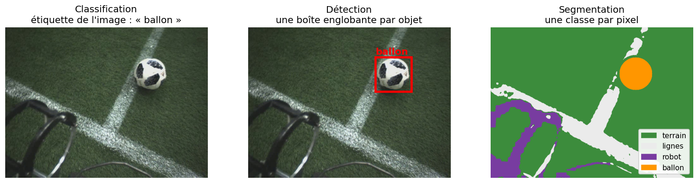

   **Figure 16** : Les trois grandes tâches de la vision par ordinateur sur la même image. La segmentation présentée ici a été obtenue automatiquement avec des masques sur les couleurs (comme dans la section 4.3), elle est donc approximative.

.. slide::

Pour entraîner un modèle de manière supervisée, il faut des images **annotées**, c'est-à-dire accompagnées de la réponse attendue. Chaque tâche demande un type d'annotation différent :

- **Classification** : une étiquette par image (rapide à annoter).
- **Détection** : les coordonnées d'une boîte et une étiquette pour chaque objet (plus long).
- **Segmentation** : un masque précis au pixel près pour chaque objet (très long).

La **qualité des annotations** a un impact direct sur les performances du modèle : un modèle entraîné sur des annotations fausses ou incohérentes apprendra des erreurs. Au chapitre 6, vous annoterez vous-même des images avec l'outil **Label Studio**.

.. slide::

🏋️ Travaux Pratiques
--------------------

.. note::

   Les exercices de cette partie utilisent à nouveau l'image `elephants.png <images/tp4/elephants.png>`_ de la partie 1, à placer dans le même dossier que votre notebook Jupyter.

.. slide::
🍀 Exercice 4 : Redimensionner et flouter une image
~~~~~~~~~~~~~~~~~~~~~~~~~~~~~~

Dans cet exercice, vous allez comparer la réduction de résolution par slicing de l'exercice 3 avec celle de ``torchvision``, puis lisser l'image.

**Objectif :** Redimensionner une image et lui appliquer un flou avec ``torchvision.transforms``.

.. code-block:: python

    import matplotlib.pyplot as plt
    import torch
    from torchvision import transforms

    img = plt.imread('elephants.png')[:, :, :3]   # (1440, 1920, 3)

**Consigne :** Écrire un programme qui :

.. step::
    1) Convertit l'image en tenseur PyTorch de forme $$(C, H, W)$$.

.. step::
    2) Réduit la résolution de l'image d'un facteur 20 avec ``transforms.Resize``.

.. step::
    3) Applique un flou gaussien (``transforms.GaussianBlur``) à l'image obtenue avec ``Resize``.

.. step::
    4) Affiche côte à côte la réduction par slicing ``img[::20, ::20]`` de l'exercice 3, la réduction avec ``Resize`` et l'image floutée.

**Questions :**

.. step::
    5) Quelle différence observez-vous entre la réduction par slicing et la réduction avec ``Resize`` ? Pourquoi ?

.. step::
    6) Quel est l'effet du flou gaussien ? Que se passe-t-il si vous augmentez ``sigma`` ?

**Astuce :**
.. spoiler::
    .. discoverList::
        1. ``torch.from_numpy(img).permute(2, 0, 1)`` donne un tenseur $$(C, H, W)$$ (section 2.3 du cours)
        2. ``transforms.Resize`` prend la nouvelle taille $$(H, W)$$ en paramètre (section 5.1 du cours)
        3. Pour afficher un tenseur $$(C, H, W)$$ avec Matplotlib : ``plt.imshow(img_t.permute(1, 2, 0))``

**Résultat attendu :** les deux images réduites ont une taille de 72 × 96 pixels.

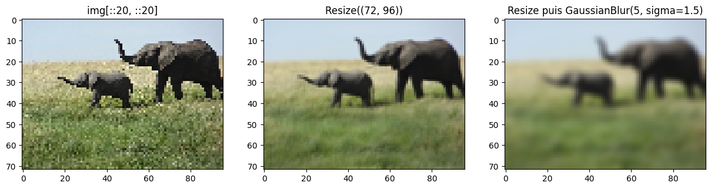

.. slide::
⚖️ Exercice 5 : La nuit tombe sur la savane
~~~~~~~~~~~~~~~~~~~~~~~~~~~~~~

Dans cet exercice, vous allez transformer le ciel bleu de l'image en ciel de nuit.

**Objectif :** Utiliser l'histogramme d'une image pour construire un masque booléen, puis modifier uniquement les pixels sélectionnés.

**Consigne :** Écrire un programme qui :

.. step::
    1) Affiche l'histogramme des couleurs (canaux R, G et B) de l'image.

.. step::
    2) Crée un masque booléen qui sélectionne les pixels du ciel, en s'aidant de l'histogramme et des valeurs de quelques pixels du ciel.

.. step::
    3) Affiche le masque.

.. step::
    4) Remplace la couleur des pixels du ciel par un bleu sombre (nuit) et affiche le résultat.

.. step::
    5) Calcule le pourcentage de pixels de l'image qui appartiennent au ciel.

**Questions :**

.. step::
    6) Quels pics de l'histogramme correspondent au ciel ? Comment le savez-vous ?

.. step::
    7) Votre masque sélectionne-t-il des pixels qui ne sont pas dans le ciel ? Comment pourriez-vous l'améliorer ?

.. step::
    8) En quoi ce masque est-il une annotation automatique de l'image ? À quelle tâche de vision par ordinateur correspond-il ?

**Astuce :**
.. spoiler::
    .. discoverList::
        1. ``img[:, :, c].ravel()`` aplatit le canal ``c`` pour l'histogramme (section 4.4 du cours)
        2. Affichez la valeur d'un pixel du ciel, par exemple ``img[50, 50]`` : le ciel est clair et plus bleu que rouge
        3. Combinez plusieurs conditions avec ``&``, et n'oubliez pas les parenthèses (section 4.3 du cours)
        4. ``img[masque] = [...]`` modifie tous les pixels du masque d'un coup
        5. Comme ``True`` vaut 1, ``masque.mean()`` donne la proportion de pixels sélectionnés

**Résultat attendu :**

Environ 22 % des pixels de l'image appartiennent au ciel.

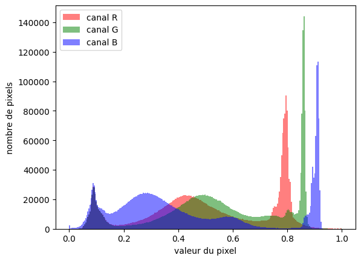

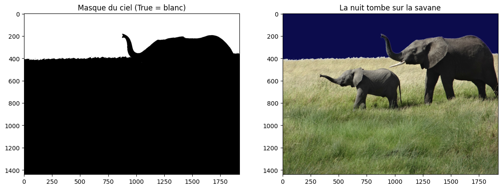

.. slide::
🌶️ Exercice 6 : Traiter un batch d'images avec PyTorch
~~~~~~~~~~~~~~~~~~~~~~~~~~~~~~

Dans cet exercice, vous allez appliquer les mêmes traitements à plusieurs images à la fois.

**Objectif :** Regrouper plusieurs images en un batch $$(N, C, H, W)$$ et leur appliquer des traitements en une seule instruction.

**Consigne :** Écrire un programme qui :

.. step::
    1) Utilise une image de chien, une image de chat et une image de cheval récupérées sur internet (au format JPEG ou PNG), en plus de ``elephants.png``.

.. step::
    2) Charge les 4 images, les redimensionne en 256 × 256 pixels et les empile en un seul tenseur de forme $$(4, 3, 256, 256)$$.

.. step::
    3) Applique au batch, **sans boucle sur les images**, les traitements suivants :

    - miroir horizontal,
    - conversion en niveaux de gris,
    - réduction de la résolution d'un facteur 4,
    - flou gaussien,
    - recadrage d'un carré de 128 × 128 pixels au centre.

.. step::
    4) Calcule la moyenne et l'écart-type de chaque canal sur l'ensemble du batch.

.. step::
    5) Affiche, dans une même figure, les images d'origine et le résultat de chaque traitement.

.. warning::

   ⚠️ Le chargement des images peut se faire image par image, mais tous les traitements de la question 3 doivent s'appliquer au batch entier en une seule instruction.

**Questions :**

.. step::
    6) Que se passe-t-il si vous oubliez ``.convert('RGB')`` lors du chargement de ``elephants.png`` ? Pourquoi ?

.. step::
    7) Quelle est la forme du tenseur obtenu pour chaque traitement ?

.. step::
    8) Pourquoi est-il préférable de traiter les images par batch plutôt qu'avec une boucle ?

**Astuce :**
.. spoiler::
    .. discoverList::
        1. ``torch.stack(liste_de_tenseurs)`` crée le batch (section 6.1 du cours)
        2. Le miroir horizontal correspond à la dimension 3 (W) : ``batch.flip(dims=[3])``
        3. Niveaux de gris : ``0.299 * batch[:, 0] + 0.587 * batch[:, 1] + 0.114 * batch[:, 2]``, puis ``.unsqueeze(1)`` pour garder la dimension du canal
        4. ``torch.nn.functional.interpolate(batch, scale_factor=0.25, mode='bilinear')`` réduit la résolution de tout le batch
        5. ``transforms.GaussianBlur`` s'applique aussi à un batch $$(N, C, H, W)$$
        6. ``batch.mean(dim=(0, 2, 3))`` donne une moyenne par canal (section 6.2 du cours)

**Résultat attendu :**

- Batch : ``torch.Size([4, 3, 256, 256])``
- Miroir et flou : ``torch.Size([4, 3, 256, 256])``
- Niveaux de gris : ``torch.Size([4, 1, 256, 256])``
- Basse résolution : ``torch.Size([4, 3, 64, 64])``
- Recadrage : ``torch.Size([4, 3, 128, 128])``
- Moyenne et écart-type : 3 valeurs chacun (une par canal)

.. slide::
🌶️ Exercice 7 : Créer son propre Dataset d'images
~~~~~~~~~~~~~~~~~~~~~~~~~~~~~~

Dans cet exercice, vous allez créer un ``Dataset`` PyTorch qui charge, prétraite et étiquette automatiquement vos images de l'exercice 6.

**Objectif :** Préparer des images pour l'entraînement d'un réseau de neurones avec un ``Dataset`` et un ``DataLoader``.

**Consigne :** Écrire un programme qui :

.. step::
    1) Crée une classe ``MyDataset`` qui hérite de ``torch.utils.data.Dataset`` et qui prend en paramètres une liste de chemins d'images, une liste de labels et une transformation.

.. step::
    2) Prétraite automatiquement chaque image de la manière suivante :

    - redimensionnement à 64 × 64 pixels,
    - lissage avec un flou gaussien,
    - conversion en tenseur,
    - normalisation des valeurs de chaque canal entre −0.5 et 0.5.

.. step::
    3) Associe un label (aussi appelé étiquette ou vérité terrain) à chaque image : 0 pour l'éléphant, 1 pour le chien, 2 pour le chat et 3 pour le cheval.

.. step::
    4) Crée un ``DataLoader`` avec des batchs de 2 images mélangées, le parcourt en affichant la forme des images et les labels de chaque batch, puis affiche les images du dernier batch.

.. step::
    5) Crée une seconde version du dataset pour l'entraînement, avec de l'augmentation de données (miroir horizontal et rotation aléatoires), et vérifie que deux appels à ``dataset[0]`` renvoient des images différentes.

.. warning::

   ⚠️ Votre classe doit bien **hériter** de ``torch.utils.data.Dataset``, et il est impératif d'implémenter les méthodes ``__len__()`` et ``__getitem__()``.

**Questions :**

.. step::
    6) Quelles valeurs de ``mean`` et de ``std`` faut-il donner à ``transforms.Normalize`` pour obtenir des valeurs entre −0.5 et 0.5 ?

.. step::
    7) Pourquoi faut-il appliquer les transformations dans ``__getitem__``, et pas une seule fois au chargement des images ?

.. step::
    8) Pourquoi ne faut-il pas utiliser d'augmentation de données pour la validation et le test ?

**Astuce :**
.. spoiler::
    .. discoverList::
        1. Revoyez la classe ``Dataset`` au chapitre 3 et ``transforms.Compose`` dans la section 5.4 du cours
        2. ``transforms.ToTensor()`` donne des valeurs dans [0, 1], et ``transforms.Normalize`` calcule ``(x - mean) / std``
        3. Pour afficher une image normalisée, il faut d'abord annuler la normalisation (section 5.3 du cours)
        4. ``torch.equal(a, b)`` vérifie si deux tenseurs sont identiques

**Résultat attendu :**

- ``len(dataset)`` vaut 4
- ``dataset[0]`` renvoie une image de forme ``torch.Size([3, 64, 64])``, avec des valeurs entre −0.5 et 0.5, et le label 0
- Chaque batch du ``DataLoader`` contient des images de forme ``torch.Size([2, 3, 64, 64])`` et 2 labels
- Avec l'augmentation, ``torch.equal(dataset_train[0][0], dataset_train[0][0])`` renvoie le plus souvent ``False``

.. slide::
🏋️ Exercices Supplémentaires
--------------------

.. toctree::

    exos_sup_chap4
