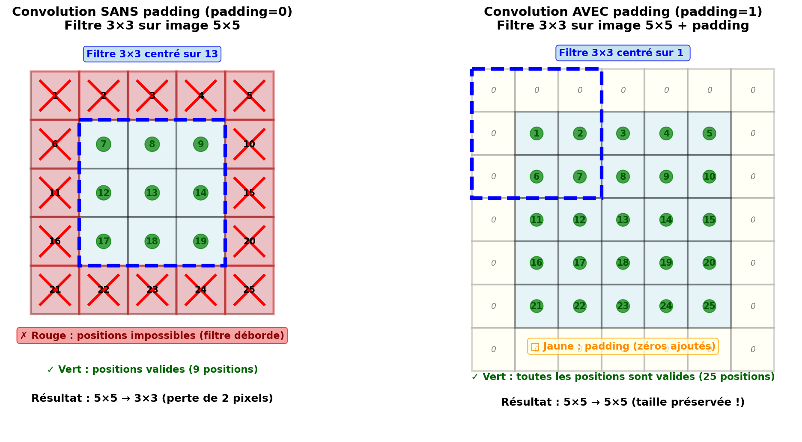

.. slide::

Chapitre 5 — Classification d'images avec CNN
================

🎯 Objectifs du Chapitre
----------------------

.. important::

   À la fin de ce chapitre, vous saurez : 

   - Comprendre la différence entre un MLP et les réseaux convolutifs (CNN).
   - Utiliser les couches de convolution pour le traitement d'images.
   - Appliquer les techniques de pooling pour réduire la dimensionnalité.
   - Gérer les mini-batchs pour un entraînement efficace.
   - Sauvegarder et charger les poids d'un modèle entraîné.
   - Utiliser les datasets PyTorch pour organiser vos données.

.. slide::

📖 1. MLP vs Convolutions : pourquoi les CNN ?
----------------------

Dans les chapitres précédents, nous avons utilisé des perceptrons multi-couches (MLP) pour résoudre divers problèmes. Cependant, lorsqu'on travaille avec des images, les MLP présentent plusieurs limitations importantes.

1.1. Limitations des MLP pour les images
~~~~~~~~~~~~~~~~~~~

Imaginons une image en couleur de taille $$224×224$$ pixels. Si on "aplatit" (avec ``flatten`` ou ``view`` par exemple) cette image pour la donner à un MLP :

- Chaque pixel RGB → 3 valeurs
- Total d'entrées : $$224 \times 224 \times 3 = 150528$$ valeurs

Si la première couche cachée a 512 neurones :

- Nombre de poids : $$150528 \times 512 = 77070336$$ paramètres

**Problèmes** :

1. **Trop de paramètres** : le modèle devient énorme, difficile à entraîner et très gourmand en mémoire.
2. **Perte de structure spatiale** : en aplatissant l'image, on perd l'information sur la proximité des pixels. Or, dans une image, les pixels voisins sont fortement corrélés.
3. **Pas de généralisation spatiale** : un MLP doit réapprendre le même motif s'il apparaît à des positions différentes dans l'image.

.. slide::

1.2. Solution : les réseaux convolutifs (CNN)
~~~~~~~~~~~~~~~~~~~

Les réseaux de neurones convolutifs (CNN, de Convolutional Neural Networks en anglais) résolvent ces problèmes en utilisant des convolutions au lieu de couches entièrement connectées.

.. slide::

1.3. Qu'est-ce qu'un filtre (ou noyau de convolution) ?
~~~~~~~~~~~~~~~~~~~

Un filtre (aussi appelé *kernel* ou *noyau*) est une petite matrice de poids apprenables qui sert à détecter des motifs dans l'image.

- **Taille typique** : $$3×3$$, $$5×5$$, ou $$7×7$$ pixels
- **Fonctionnement** : le filtre "glisse" sur toute l'image (comme un tampon qu'on déplacerait)
- **Détection** : à chaque position, il calcule une somme pondérée des pixels qu'il couvre
- **Apprentissage** : les poids du filtre sont appris automatiquement pendant l'entraînement

💡 **Intuition** : imaginez que vous cherchez des visages dans une photo. Vos yeux scannent l'image en cherchant des motifs caractéristiques (deux yeux, un nez, une bouche). Les filtres font exactement la même chose, mais de manière automatique et sur des milliers de motifs différents !

.. slide::

1.4. À quoi servent les filtres ?
~~~~~~~~~~~~~~~~~~~

Chaque filtre est spécialisé dans la détection d'un type de motif :

- **Contours** : verticaux, horizontaux, diagonaux
- **Textures** : lignes, points, motifs répétés
- **Formes** : coins, courbes, angles
- **Caractéristiques complexes** : yeux, roues, fenêtres (dans les couches profondes)

Les filtres s'organisent de manière hiérarchique :

- **Premières couches** : détectent des caractéristiques simples (bords, couleurs)
- **Couches intermédiaires** : combinent ces caractéristiques pour détecter des formes
- **Couches profondes** : détectent des objets complexes (visages, voitures, animaux)

.. slide::

1.5. Qu'est-ce qui détermine quel filtre fait quoi ?
~~~~~~~~~~~~~~~~~~~

C'est l'entraînement qui détermine la spécialisation de chaque filtre ! Voici comment :

1. **Initialisation aléatoire** : au départ, les poids des filtres sont initialisés aléatoirement (petites valeurs proches de 0).

2. **Apprentissage automatique** : pendant l'entraînement, l'algorithme de descente de gradient ajuste progressivement les poids de chaque filtre pour minimiser l'erreur du réseau.

3. **Spécialisation émergente** : chaque filtre "apprend" naturellement à détecter les motifs les plus utiles pour la tâche. Par exemple :
   
   - Si le réseau doit reconnaître des chats, certains filtres apprendront à détecter des oreilles pointues
   - Si c'est pour des voitures, d'autres détecteront des roues ou des phares

4. **Pas de programmation manuelle** : on ne dit jamais explicitement à un filtre "tu dois détecter les contours verticaux". C'est le réseau qui découvre lui-même quels motifs sont importants !

💡 **Analogie** : c'est comme apprendre à reconnaître des champignons comestibles. Au début, vous ne savez pas quoi regarder. Après avoir vu des centaines d'exemples, votre cerveau apprend automatiquement à repérer les indices pertinents (couleur du chapeau, forme du pied, présence d'un anneau, etc.). Les filtres font exactement pareil !

.. slide::

1.6. Avantages des convolutions
~~~~~~~~~~~~~~~~~~~

1. **Partage de poids** : le même filtre est appliqué sur toute l'image, réduisant drastiquement le nombre de paramètres.
2. **Invariance par translation** : un motif appris à un endroit peut être détecté ailleurs dans l'image (un visage reste un visage, qu'il soit en haut à gauche ou en bas à droite).
3. **Préservation de la structure spatiale** : les convolutions traitent des régions locales, préservant les relations entre pixels voisins.

**Exemple de gain en paramètres** :

- Un filtre $$3×3$$ sur une image RGB → $$3 \times 3 \times 3 = 27$$ poids par filtre
- Avec 64 filtres différents → $$64 \times 27 = 1728$$ paramètres au total

Comparé aux 77 millions de paramètres du MLP, c'est une réduction spectaculaire !

.. slide::

📖 2. Les couches de convolution dans PyTorch
----------------------

Comme nous l'avons vu au chapitre 4, une convolution 2D applique un filtre sur une image en le faisant glisser sur toute la surface. PyTorch fournit ``nn.Conv2d`` pour créer ces couches convolutives.

2.1. Syntaxe de base
~~~~~~~~~~~~~~~~~~~

.. code-block:: python

   import torch
   import torch.nn as nn

   # Créer une couche de convolution
   # Note : stride=1 et padding=0 sont les valeurs par défaut, on ne les écrit que si on veut une autre valeur
   conv = nn.Conv2d(
       in_channels=3,      # nombre de canaux en entrée (1 pour niveaux de gris, 3 pour RGB, 4 pour RGBA)
       out_channels=64,    # nombre de filtres à apprendre (64 détecteurs de motifs différents)
       kernel_size=3,      # taille du filtre 3×3 pixels (valeurs courantes : 3, 5, 7, etc.)
       stride=1,           # pas de déplacement du filtre (un stride de 1 déplace d'1 pixel à chaque fois et un stride de 2 divise la taille spatiale par 2)
       padding=1           # ajoute 1 pixel de zéros autour de l'image pour conserver la taille spatiale
   )

   # Exemple d'utilisation
   x = torch.randn(1, 3, 224, 224)  # batch_size=1, canaux=3, Height=224, Width=224
   y = conv(x)
   print(y.shape)  # torch.Size([1, 64, 224, 224])

.. slide::

2.2. Calcul de la taille de sortie
~~~~~~~~~~~~~~~~~~~

.. math::

   H_{out} = \left\lfloor \frac{H_{in} + 2 \times \text{padding} - \text{kernel_size}}{\text{stride}} \right\rfloor + 1

**Exemple avec padding=1, kernel_size=3, stride=1 sur une image 224×224** :

.. math::

   H_{out} = \left\lfloor \frac{224 + 2 - 3}{1} \right\rfloor + 1 = 224

La taille spatiale est préservée.

.. slide::

2.3 Padding
~~~~~~~~~~~~~

La visualisation ci-dessous montre ce qui se passe avec et sans padding :

.. slide::

Avec un filtre $$3×3$$ et **padding=0** : le filtre ne peut pas se centrer sur les pixels des bords (il déborderait de l'image). C'est à dire que le filtre ne peut se centrer ni sur toute la ligne du haut, ni sur toute la ligne du bas, ni sur toute la colonne de gauche, ni sur toute la colonne de droite.

**Exemple concret : image $$5×5$$ avec filtre $$3×3$$**

Pour comprendre ce qui se passe, regardons le filtre $$3×3$$ qui doit se centrer sur chaque pixel :

.. code-block:: text

   Image 5×5 :
   ┌───┬───┬───┬───┬───┐
   │ X │ X │ X │ X │ X │  ← Ligne du haut : impossible (5 pixels)
   ├───┼───┼───┼───┼───┤
   │ X │ ✓ │ ✓ │ ✓ │ X │  ← Ligne 2 : coins impossibles, centre OK
   ├───┼───┼───┼───┼───┤
   │ X │ ✓ │ ✓ │ ✓ │ X │  ← Ligne 3 : coins impossibles, centre OK
   ├───┼───┼───┼───┼───┤
   │ X │ ✓ │ ✓ │ ✓ │ X │  ← Ligne 4 : coins impossibles, centre OK
   ├───┼───┼───┼───┼───┤
   │ X │ X │ X │ X │ X │  ← Ligne du bas : impossible (5 pixels)
   └───┴───┴───┴───┴───┘
     ↑               ↑
   Colonne         Colonne
   gauche          droite
   impossible      impossible
   (5 pixels)      (5 pixels)

**⚠️ Attention à ne pas confondre deux choses différentes :**

1. **Nombre de positions impossibles** = 16 pixels (toute la bordure marquée X)
   
   - Ligne du haut : 5 pixels
   - Ligne du bas : 5 pixels
   - Colonne gauche : 5 pixels (dont 2 déjà comptés dans les lignes)
   - Colonne droite : 5 pixels (dont 2 déjà comptés dans les lignes)
   - **Total : 5 + 5 + 3 + 3 = 16 positions impossibles**

2. **Réduction des dimensions** = passer de $$5×5$$ à $$3×3$$
   
   - **En hauteur** : ligne du haut + ligne du bas impossibles → **on perd 2 lignes**
   - **En largeur** : colonne gauche + colonne droite impossibles → **on perd 2 colonnes**
   - **Résultat** : $$5×5$$ devient $$3×3$$ (image de sortie réduite)

**💡 En résumé** : on a 16 pixels de bordure où le filtre ne peut pas se positionner, mais cela se traduit par une **réduction de 2 en hauteur** (5→3) et **2 en largeur** (5→3), pas par une réduction de 16 pixels au total !

.. slide::
**Formule générale** : 

Pour un filtre de taille $$k×k$$, on perd :

- **En hauteur** : (kernel_size - 1) lignes au total
  
  - $$\frac{kernel\_size - 1}{2}$$ lignes en haut
  - $$\frac{kernel\_size - 1}{2}$$ lignes en bas

- **En largeur** : (kernel_size - 1) colonnes au total
  
  - $$\frac{kernel\_size - 1}{2}$$ colonnes à gauche
  - $$\frac{kernel\_size - 1}{2}$$ colonnes à droite

**Exemples détaillés** :

1. **Filtre $$3×3$$ sur image $$5×5$$** :
   
   - Perte : (3-1) = 2 en hauteur, (3-1) = 2 en largeur
   - Détail : 1 ligne en haut + 1 ligne en bas, 1 colonne à gauche + 1 colonne à droite
   - **Résultat** : $$5×5$$ → $$3×3$$
   - Calcul : hauteur = 5 - 2 = 3, largeur = 5 - 2 = 3

2. **Filtre $$5×5$$ sur image $$7×7$$** :
   
   - Perte : (5-1) = 4 en hauteur, (5-1) = 4 en largeur
   - Détail : 2 lignes en haut + 2 lignes en bas, 2 colonnes à gauche + 2 colonnes à droite
   - **Résultat** : $$7×7$$ → $$3×3$$
   - Calcul : hauteur = 7 - 4 = 3, largeur = 7 - 4 = 3

3. **Filtre $$5×5$$ sur image $$5×5$$** :
   
   - Perte : (5-1) = 4 en hauteur, (5-1) = 4 en largeur
   - Détail : 2 lignes en haut + 2 lignes en bas, 2 colonnes à gauche + 2 colonnes à droite
   - **Résultat** : $$5×5$$ → $$1×1$$ (un seul pixel central valide !)
   - Calcul : hauteur = 5 - 4 = 1, largeur = 5 - 4 = 1

.. warning::
   **💡 Règle simple** : Dimensions de sortie = Dimensions d'entrée - (kernel_size - 1)

   **Solution pour ne rien perdre** : le padding qui ajoute des zéros autour pour que le filtre puisse se centrer partout !

.. slide::

📖 3. Pooling : réduire la dimensionnalité
----------------------

Les couches de pooling permettent de réduire progressivement la taille spatiale des représentations, ce qui :

- **Diminue le nombre de paramètres et le temps de calcul** : en réduisant la taille spatiale (par exemple de 224×224 à 112×112), on divise par 4 le nombre de valeurs à traiter dans les couches suivantes ce qui implique moins de paramètres et un entraînement plus rapide.
- **Apporte une invariance aux petites translations** : si un motif (par exemple un œil) se déplace légèrement dans l'image (de quelques pixels), le max pooling va quand même détecter la même valeur maximale dans la région. Cela rend le réseau plus robuste aux petits déplacements des objets
- **Augmente le champ réceptif** : après un pooling, chaque neurone "voit" une région plus grande de l'image d'origine, ce qui lui permet de capturer des motifs plus globaux

3.1. Max Pooling
~~~~~~~~~~~~~~~~~~~

Le max pooling prend le maximum dans chaque région. C'est le type de pooling le plus utilisé car il préserve mieux les caractéristiques importantes (contours, textures).

.. code-block:: python

   import torch.nn.functional as F

   # Exemple : matrice 4×4
   x = torch.tensor([[[[1., 2., 3., 4.],
                       [5., 6., 7., 8.],
                       [9., 10., 11., 12.],
                       [13., 14., 15., 16.]]]])  # [batch=1, canaux=1, height=4, width=4]

   # Max pooling avec kernel 2×2 et stride 2
   # kernel_size=2 : on regarde des fenêtres de 2×2 pixels
   # stride=2 : on déplace la fenêtre de 2 pixels à chaque fois (pas de chevauchement)
   y = F.max_pool2d(x, kernel_size=2, stride=2)
   print(y)
   # tensor([[[[ 6.,  8.],
   #           [14., 16.]]]])  # [1, 1, 2, 2] - taille divisée par 2

**Explication détaillée** : 

Le max pooling divise l'image en régions de $$2×2$$ pixels et garde seulement le maximum de chaque région.

**Visualisation des 4 régions** :

.. code-block:: text

   Image d'origine 4×4 :
   ┌────┬────┬────┬────┐
   │ 1  │ 2  │ 3  │ 4  │
   ├────┼────┼────┼────┤
   │ 5  │ 6  │ 7  │ 8  │
   ├────┼────┼────┼────┤
   │ 9  │ 10 │ 11 │ 12 │
   ├────┼────┼────┼────┤
   │ 13 │ 14 │ 15 │ 16 │
   └────┴────┴────┴────┘

   Découpage en 4 régions 2×2 :
   ┌─────────┬─────────┐
   │  1   2  │  3   4  │  ← région 1 (haut-gauche) : max([1,2,5,6]) = 6
   │  5   6  │  7   8  │  ← région 2 (haut-droite) : max([3,4,7,8]) = 8
   ├─────────┼─────────┤
   │  9  10  │ 11  12  │  ← région 3 (bas-gauche) : max([9,10,13,14]) = 14
   │ 13  14  │ 15  16  │  ← région 4 (bas-droite) : max([11,12,15,16]) = 16
   └─────────┴─────────┘

   Résultat après max pooling 2×2 :
   ┌────┬────┐
   │ 6  │ 8  │
   ├────┼────┤
   │ 14 │ 16 │
   └────┴────┘
   
   Taille : 4×4 → 2×2 (divisée par 2 en hauteur et en largeur)

.. slide::

3.2. Average Pooling
~~~~~~~~~~~~~~~~~~~

L'average pooling calcule la moyenne de chaque région.

.. code-block:: python

   y = F.avg_pool2d(x, kernel_size=2, stride=2)
   print(y)
   # tensor([[[[ 3.5,  5.5],
   #           [11.5, 13.5]]]])

**Explication** :

- [1,2,5,6] → (1+2+5+6)/4 = 3.5
- [3,4,7,8] → 5.5
- etc.

.. slide::

3.3. Exemple d'un CNN qui peut-être utilisé pour la classification d'images
~~~~~~~~~~~~~~~~~~~

Maintenant que nous avons vu les convolutions et le pooling, voici un exemple complet de CNN pour la classification d'images RGB de taille $$224×224$$ pixels en 10 classes :

.. code-block:: python

   class CNNWithPooling(nn.Module):
       def __init__(self, num_classes=10):
           super(CNNWithPooling, self).__init__()
           
           # Première couche convolutive : 3 canaux → 32 filtres
           self.conv1 = nn.Conv2d(3, 32, kernel_size=3, padding=1)
           
           # Deuxième couche convolutive : 32 canaux → 64 filtres
           self.conv2 = nn.Conv2d(32, 64, kernel_size=3, padding=1)
           
           # Couches fully-connected pour la classification
           self.fc1 = nn.Linear(64 * 56 * 56, 128)
           self.fc2 = nn.Linear(128, num_classes)
       
       def forward(self, x):
           # x: [batch_size, 3, 224, 224] - image RGB d'entrée
           
           # Bloc 1 : Convolution + ReLU + Max Pooling
           x = F.relu(self.conv1(x))           # [batch, 32, 224, 224] - applique 32 filtres
           x = F.max_pool2d(x, kernel_size=2)  # [batch, 32, 112, 112] - divise la taille par 2
           # Quand on ne précise pas le stride, PyTorch utilise par défaut la même valeur que kernel_size, donc ici stride=2 également.
           
           # Bloc 2 : Convolution + ReLU + Max Pooling
           x = F.relu(self.conv2(x))           # [batch, 64, 112, 112] - applique 64 filtres
           x = F.max_pool2d(x, kernel_size=2)  # [batch, 64, 56, 56] - divise encore par 2
           
           # Aplatir les features maps pour les couches fully-connected
           # Note : on peut utiliser view() plutôt que flatten() pour plus de contrôle
           # - x.view(x.size(0), -1) : préserve la dimension du batch, aplatit le reste
           # - x.flatten(1) : équivalent mais moins explicite (le 1 signifie "à partir de la dimension 1")
           # - Le -1 signifie "calcule automatiquement cette dimension"
           x = x.view(x.size(0), -1)       # [batch, 64*56*56] = [batch, 200704]
           
           # Classification avec couches fully-connected
           x = F.relu(self.fc1(x))         # [batch, 128]
           x = self.fc2(x)                 # [batch, num_classes] - scores pour chaque classe
           
           return x

.. slide::

3.4. Création et test du modèle
~~~~~~~~~~~~~~~~~

.. code-block:: python

   # Créer et tester le modèle
   model = CNNWithPooling(num_classes=10)
   
   # Afficher l'architecture
   print(model)
   
   # Test avec un batch d'images
   x = torch.randn(4, 3, 224, 224)  # batch de 4 images RGB 224×224
   output = model(x)
   print(f"Input shape: {x.shape}")
   print(f"Output shape: {output.shape}")  # torch.Size([4, 10])

.. warning::

   ⚠️ **Adaptation nécessaire selon vos données**
   
   Ce modèle est conçu pour des **images RGB de taille 224×224 pixels**. 
   
   Si vos images ont une **taille différente**, vous devez adapter la première couche fully-connected :
   
   - Utilisez la formule : ``nn.Linear(nombre_de_filtres * (H_final) * (W_final), ...)``
   - Où ``H_final`` et ``W_final`` sont les dimensions spatiales après toutes les convolutions et poolings
   
   💡 **Astuce** : Pour connaître la taille exacte, ajoutez ``print(x.shape)`` juste avant ``x.view()`` dans la méthode ``forward()``.

.. slide::

📖 4. Mini-batchs : entraînement efficace
----------------------

L'entraînement par mini-batchs est une technique fondamentale en deep learning qui combine les avantages de deux approches extrêmes.

4.1. Trois approches d'entraînement
~~~~~~~~~~~~~~~~~~~

**1. Batch Gradient Descent (tout le dataset)** :

- Calcule le gradient sur toutes les données
- Mise à jour stable mais très lente
- Nécessite beaucoup de mémoire

**2. Stochastic Gradient Descent (SGD, un exemple à la fois)** :

- Calcule le gradient sur un seul exemple
- Très rapide mais gradient bruité
- Converge de manière erratique

**3. Mini-Batch Gradient Descent** :

- Calcule le gradient sur un petit groupe d'exemples (typiquement 32, 64, 128)
- **Compromis idéal** : rapide et gradient raisonnablement stable
- Exploite efficacement le parallélisme du GPU

.. slide::

4.2. Pourquoi les mini-batchs ?
~~~~~~~~~~~~~~~~~~~

**Avantages** :

1. **Efficacité GPU** : les GPUs sont optimisés pour traiter plusieurs données en parallèle
2. **Estimation du gradient** : le gradient calculé sur un mini-batch est une bonne approximation du gradient sur tout le dataset
3. **Régularisation** : le bruit dans les mini-batchs peut aider à éviter les minima locaux
4. **Gestion mémoire** : on ne charge qu'une partie du dataset en mémoire à la fois

**Choix de la taille** :

- Petits batchs (16-32) : gradient plus bruité, convergence plus exploratrice
- Grands batchs (128-256) : gradient plus stable, convergence plus directe
- Compromis courant : 32 ou 64

.. slide::

4.3. Mini-batchs dans PyTorch
~~~~~~~~~~~~~~~~~~~

En PyTorch, tous les tenseurs ont une dimension de batch en première position :

.. code-block:: python

   # Format attendu : [batch_size, channels, height, width]
   images = torch.randn(32, 3, 224, 224)  # batch de 32 images RGB 224×224

   # Les opérations sont automatiquement appliquées sur tout le batch
   # Exemple : Convolution SANS padding (padding=0 par défaut)
   conv = nn.Conv2d(3, 64, kernel_size=3)
   output = conv(images)  # [32, 64, 222, 222] -> la taille diminue !

**Exemple d'entraînement avec mini-batchs** :

.. code-block:: python

   # Supposons qu'on a des données et un modèle
   model = CNNWithPooling()
   optimizer = torch.optim.Adam(model.parameters(), lr=0.001)
   criterion = nn.CrossEntropyLoss()

   # Données factices
   images = torch.randn(100, 3, 224, 224) # dataset de 100 images
   labels = torch.randint(0, 10, (100,))

   # Paramètres
   batch_size = 32
   num_batches = len(images) // batch_size

   # Entraînement par mini-batchs
   for epoch in range(5): # 5 époques
       for i in range(num_batches):
           # Extraire un mini-batch d'images et labels dans en suivant l'ordre du dataset
           # Attention en pratique on tire les mini-batchs de manière aléatoire
           start_idx = i * batch_size 
           end_idx = start_idx + batch_size
           
           batch_images = images[start_idx:end_idx]
           batch_labels = labels[start_idx:end_idx]
           
           # Forward pass
           outputs = model(batch_images)
           loss = criterion(outputs, batch_labels)
           
           # Backward pass et optimisation
           optimizer.zero_grad()
           loss.backward()
           optimizer.step()
       
       print(f"Epoch {epoch+1}, Loss: {loss.item():.4f}")

.. slide::

📖 5. Datasets et DataLoaders PyTorch
----------------------

Gérer manuellement les mini-batchs comme ci-dessus devient rapidement fastidieux. PyTorch fournit ``Dataset`` et ``DataLoader`` pour automatiser ce processus.

5.1. La classe Dataset
~~~~~~~~~~~~~~~~~~~

``Dataset`` est une classe abstraite qui représente votre jeu de données. Il existe deux approches :

**Approche 1 : Utiliser TensorDataset (recommandé pour des tenseurs simples)**

Si vos données sont déjà sous forme de tenseurs PyTorch, utilisez directement ``TensorDataset`` :

.. code-block:: python

   from torch.utils.data import TensorDataset

   # Créer des données factices
   num_samples = 1000
   images = torch.randn(num_samples, 3, 64, 64)  # 1000 images RGB 64×64
   labels = torch.randint(0, 10, (num_samples,))  # labels de 0 à 9
   
   # Créer un dataset avec TensorDataset (une seule ligne !)
   dataset = TensorDataset(images, labels)
   
   print(f"Nombre d'exemples : {len(dataset)}")  # 1000
   
   # Accéder à un exemple
   image, label = dataset[0]
   print(f"Shape de l'image : {image.shape}")  # torch.Size([3, 64, 64])
   print(f"Label : {label}")  # tensor(X) avec X entre 0 et 9

💡 **Avantage** : Simple et direct, pas besoin de créer une classe personnalisée.

.. slide::

**Approche 2 : Créer une classe Dataset personnalisée avec transformations**

Exemple complet avec chargement depuis des fichiers et application de transformations :

.. code-block:: python

   from torch.utils.data import Dataset
   from torchvision import transforms
   from PIL import Image
   import os

   class ImageFolderDataset(Dataset):
       def __init__(self, image_paths, labels, transform=None):
           """
           Args:
               image_paths: Liste des chemins vers les images
               labels: Liste des labels correspondants
               transform: Transformations à appliquer (optionnel)
           """
           self.image_paths = image_paths
           self.labels = labels
           self.transform = transform
       
       def __len__(self):
           return len(self.image_paths)
       
       def __getitem__(self, idx):
           # Charger l'image depuis le disque
           img_path = self.image_paths[idx]
           image = Image.open(img_path).convert('RGB')
           label = self.labels[idx]
           
           # Appliquer les transformations si spécifiées
           if self.transform:
               image = self.transform(image)
           
           return image, label

   # Exemple d'utilisation avec transformations
   train_paths = ['img1.jpg', 'img2.jpg', 'img3.jpg']  # Chemins vers vos images
   train_labels = [0, 1, 0]  # Labels correspondants

   # Définir les transformations pour l'entraînement
   train_transform = transforms.Compose([
       transforms.Resize((224, 224)),        # Redimensionner
       transforms.RandomHorizontalFlip(),    # Augmentation
       transforms.ToTensor(),                # Convertir en tenseur
       transforms.Normalize(mean=[0.5, 0.5, 0.5], std=[0.5, 0.5, 0.5])
   ])

   # Créer le dataset en passant les transformations
   train_dataset = ImageFolderDataset(train_paths, train_labels, transform=train_transform)

   # Utiliser le dataset
   image, label = train_dataset[0]
   print(image.shape)  # torch.Size([3, 224, 224])
   
   # Pour la validation/test, créer des transformations SANS augmentation
   val_paths = ['val_img1.jpg', 'val_img2.jpg']  # Chemins vers vos images de validation
   val_labels = [1, 0]  # Labels correspondants
   
   val_transform = transforms.Compose([
       transforms.Resize((224, 224)),         # Redimensionner (pas d'augmentation !)
       transforms.ToTensor(),                 # Convertir en tenseur
       transforms.Normalize(mean=[0.5, 0.5, 0.5], std=[0.5, 0.5, 0.5])
   ])
   val_dataset = ImageFolderDataset(val_paths, val_labels, transform=val_transform)

.. slide::
**À propos des transformations** :

Les transformations permettent de modifier les images avant de les donner au réseau. Elles ont deux rôles :

1. **Prétraitement (toujours nécessaire)** : 
   
   - ``ToTensor()`` : convertit une image PIL ou numpy en tenseur PyTorch
   - ``Normalize(mean, std)`` : centre les valeurs autour de 0 pour faciliter l'apprentissage

2. **Augmentation de données (uniquement pour l'entraînement)** :
   
   - ``RandomHorizontalFlip()`` : retourne l'image horizontalement de manière aléatoire
   - ``RandomRotation()`` : fait pivoter l'image d'un angle aléatoire
   - ``ColorJitter()`` : modifie la luminosité, le contraste, etc.

💡 **Pourquoi pas d'augmentation pour validation/test ?** On veut évaluer le modèle sur les vraies images, pas sur des versions modifiées artificiellement.

.. slide::

5.2. La classe DataLoader
~~~~~~~~~~~~~~~~~~~

``DataLoader`` encapsule un ``Dataset`` et fournit :

- Le découpage automatique en mini-batchs
- Le mélange des données (shuffle)
- Le chargement parallèle (multiprocessing)
- La gestion du dernier batch incomplet

.. code-block:: python

   from torch.utils.data import DataLoader

   # Créer le dataset
   ...

   # Créer le dataloader
   dataloader = DataLoader(
       dataset,
       batch_size=32,        # taille des batchs
       shuffle=True,         # mélanger les données à chaque epoch (recommandé pour l'entraînement)
       num_workers=4,        # nombre de processus parallèles pour charger les données (0 = chargement dans le processus principal, >0 = chargement en parallèle pour accélérer)
       drop_last=True       # si True, ignore le dernier batch s'il est incomplet (utile quand la taille du batch doit être fixe, par exemple pour le batch normalization)
   )

   # Itération sur les batchs
   for batch_idx, (images, labels) in enumerate(dataloader):
       print(f"Batch {batch_idx}: images shape = {images.shape}, labels shape = {labels.shape}")
       # Batch 0: images shape = torch.Size([32, 3, 64, 64]), labels shape = torch.Size([32])

.. slide::

5.3. Diviser en ensembles d'entraînement et de validation
~~~~~~~~~~~~~~~~~~~

Avant de créer des DataLoaders, il est essentiel de bien diviser vos données en trois ensembles distincts : **train**, **validation** et **test**.

PyTorch fournit ``random_split`` qui divise automatiquement un dataset et mélange les données :

.. code-block:: python

   from torch.utils.data import TensorDataset, random_split
   
   # 1. Créer ou charger toutes les données
   all_images = torch.randn(1000, 3, 64, 64)
   all_labels = torch.randint(0, 10, (1000,))
   
   # 2. Créer un dataset avec toutes les données
   full_dataset = TensorDataset(all_images, all_labels)
   
   # 3. Définir les tailles de chaque ensemble (70% train, 15% val, 15% test)
   train_size = int(0.70 * len(full_dataset))  # 700
   val_size = int(0.15 * len(full_dataset))     # 150
   test_size = len(full_dataset) - train_size - val_size  # 150
   
   # 4. Diviser le dataset automatiquement (avec mélange aléatoire)
   train_dataset, val_dataset, test_dataset = random_split(
       full_dataset,
       [train_size, val_size, test_size]
   )
   
   # 5. Créer les DataLoaders
   # shuffle=True pour train : mélanger les données à chaque epoch évite que le modèle apprenne l'ordre des exemples
   # shuffle=False pour val/test : l'ordre n'a pas d'importance pour l'évaluation, et garder le même ordre permet de reproduire les résultats
   train_loader = DataLoader(train_dataset, batch_size=32, shuffle=True)
   val_loader = DataLoader(val_dataset, batch_size=32, shuffle=False)
   test_loader = DataLoader(test_dataset, batch_size=32, shuffle=False)
   
   print(f"Train: {len(train_dataset)} exemples, {len(train_loader)} batches")
   print(f"Validation: {len(val_dataset)} exemples, {len(val_loader)} batches")
   print(f"Test: {len(test_dataset)} exemples, {len(test_loader)} batches")

💡 **Avantages** : ``random_split`` mélange automatiquement les données et crée des sous-ensembles du dataset original sans dupliquer les données en mémoire.

.. slide::

**À quoi servent ces trois ensembles ?**

1. **Train (70-80%)** : Utilisé pour entraîner le modèle
   
   - Calcul du gradient et mise à jour des poids
   - Apprentissage des patterns dans les données

2. **Validation (10-15%)** : Utilisé pendant l'entraînement pour :
   
   - Surveiller les performances sur des données non vues
   - Détecter le surapprentissage (overfitting)
   - Choisir les meilleurs hyperparamètres
   - Décider quand arrêter l'entraînement
   - Sauvegarder le meilleur modèle

3. **Test (10-15%)** : Utilisé **uniquement à la fin** pour :
   
   - Évaluer les performances finales du modèle
   - Obtenir des métriques non biaisées
   - Tester sur des données complètement nouvelles

.. warning::

   ⚠️ **Ne JAMAIS utiliser le test set pendant l'entraînement !**
   
   Le test set doit rester totalement invisible jusqu'à l'évaluation finale, sinon vous risquez de sur-optimiser votre modèle sur ces données (data leakage).

.. slide::

5.4. Datasets PyTorch intégrés
~~~~~~~~~~~~~~~~~~~

PyTorch fournit de nombreux datasets prêts à l'emploi dans ``torchvision.datasets`` :

.. code-block:: python

   from torchvision import datasets, transforms

   # MNIST (chiffres manuscrits 0-9 en noir et blanc, images 28×28)
   mnist_train = datasets.MNIST(
       root='./data',
       train=True,
       download=True,
       transform=transforms.ToTensor()
   )

   # CIFAR-10 (images naturelles en couleur 32×32, 10 classes : avion, voiture, oiseau, chat, cerf, chien, grenouille, cheval, bateau, camion)
   cifar_train = datasets.CIFAR10(
       root='./data',
       train=True,
       download=True,
       transform=transforms.ToTensor()
   )

   # Créer un DataLoader
   train_loader = DataLoader(mnist_train, batch_size=64, shuffle=True)

   # Utilisation
   for images, labels in train_loader:
       print(images.shape)  # torch.Size([64, 1, 28, 28]) pour MNIST
       break

.. slide::

📖 6. Sauvegarder et charger les poids d'un modèle
----------------------

Après avoir entraîné un modèle pendant des heures, il est essentiel de pouvoir sauvegarder son état pour le réutiliser plus tard sans avoir à tout ré-entraîner. Il est aussi possible de sauvegarder périodiquement pendant l'entraînement pour éviter de tout perdre en cas d'interruption. Aussi on peut reprendre l'entraînement plus tard. 

6.1. Sauvegarder un modèle complet
~~~~~~~~~~~~~~~~~~~

PyTorch offre deux approches pour sauvegarder un modèle :

**Méthode 1 : Sauvegarder tout le modèle**

.. code-block:: python

   import torch

   # Entraînement du modèle
   model = CNNWithPooling(num_classes=10)
   # ... entraînement ...

   # Sauvegarder le modèle complet
   torch.save(model, 'model_complet.pth')

   # Charger le modèle complet
   model_charge = torch.load('model_complet.pth')
   model_charge.eval()  # passer en mode évaluation

**⚠️ Attention** : cette méthode sauvegarde toute la structure du modèle. Si vous modifiez la définition de la classe, le chargement peut échouer.

.. slide::

6.2. Sauvegarder uniquement les poids (méthode recommandée)
~~~~~~~~~~~~~~~~~~~

**Méthode 2 : Sauvegarder uniquement les paramètres (state_dict)**

.. code-block:: python

   # Sauvegarder uniquement les poids
   torch.save(model.state_dict(), 'model_weights.pth')

   # Charger les poids
   model = CNNWithPooling(num_classes=10)  # créer d'abord une instance du modèle
   model.load_state_dict(torch.load('model_weights.pth'))
   model.eval()

**💡 Avantages** :

- Plus flexible : on peut modifier légèrement l'architecture
- Fichier plus léger
- Meilleure pratique recommandée par PyTorch

.. code-block:: python

   # Exemple : charger des poids dans un modèle avec architecture modifiée
   torch.save(model.state_dict(), 'model_10classes.pth')  # modèle avec 10 classes
   
   new_model = CNNWithPooling(num_classes=5)  # nouveau modèle avec 5 classes
   state_dict = torch.load('model_10classes.pth')
   del state_dict['fc2.weight'], state_dict['fc2.bias']  # supprimer les poids incompatibles
   new_model.load_state_dict(state_dict, strict=False)  # charger en ignorant les couches manquantes

.. warning::
   **⚠️ Attention** : modifier l'architecture et charger partiellement les poids avec ``strict=False`` est dangereux ! Vous risquez de créer des incohérences dans le modèle. À éviter sauf si vous savez exactement ce que vous faites.

.. slide::

6.3. Sauvegarder l'état complet de l'entraînement
~~~~~~~~~~~~~~~~~~~

Pour reprendre l'entraînement exactement où vous l'aviez arrêté, sauvegardez également l'optimiseur et l'epoch :

.. code-block:: python

   # Sauvegarder tout l'état d'entraînement
   checkpoint = {
       'epoch': epoch,
       'model_state_dict': model.state_dict(),
       'optimizer_state_dict': optimizer.state_dict(),
       'loss': loss,
   }
   torch.save(checkpoint, 'checkpoint.pth')

   # Charger et reprendre l'entraînement
   model = CNNWithPooling(num_classes=10)
   optimizer = torch.optim.Adam(model.parameters())

   checkpoint = torch.load('checkpoint.pth')
   model.load_state_dict(checkpoint['model_state_dict'])
   optimizer.load_state_dict(checkpoint['optimizer_state_dict'])
   start_epoch = checkpoint['epoch']
   loss = checkpoint['loss']

   model.train()  # reprendre l'entraînement

**Variante : Sauvegarder à chaque epoch**

.. code-block:: python

   import os
   os.makedirs('checkpoints', exist_ok=True)
   
   # Boucle d'entraînement avec sauvegarde à chaque epoch
   for epoch in range(num_epochs):
       model.train()
       # ... entraînement ...
       
       # Sauvegarder à chaque epoch
       checkpoint = {
           'epoch': epoch,
           'model_state_dict': model.state_dict(),
           'optimizer_state_dict': optimizer.state_dict(),
           'train_loss': train_loss,
           'val_loss': val_loss,
       }
       torch.save(checkpoint, f'checkpoints/checkpoint_epoch_{epoch}.pth')
   
   # Reprendre depuis un epoch spécifique (par exemple epoch 5)
   checkpoint = torch.load('checkpoints/checkpoint_epoch_5.pth')
   model.load_state_dict(checkpoint['model_state_dict'])
   optimizer.load_state_dict(checkpoint['optimizer_state_dict'])
   start_epoch = checkpoint['epoch'] + 1  # reprendre à l'epoch suivant
   
   # Continuer l'entraînement
   for epoch in range(start_epoch, num_epochs):
       # ... suite de l'entraînement ...
       pass

.. slide::

📖 7. Récapitulatif 
----------------------

7.1. Pipeline complet d'entraînement
~~~~~~~~~~~~~~~~~~~

Voici le pipeline standard pour entraîner un CNN avec toutes les techniques vues :

.. code-block:: python

   import torch
   import torch.nn as nn
   import torch.optim as optim
   from torch.utils.data import Dataset, DataLoader
   from torchvision import transforms
   from PIL import Image
   import os
   from torch.utils.data import random_split

   # 1. Définir le Dataset
   class CustomDataset(Dataset):
       def __init__(self, image_paths, labels, transform=None):
           """
           Args:
               image_paths: Liste des chemins vers les images
               labels: Liste des labels correspondants
               transform: Transformations à appliquer (optionnel)
           """
           self.image_paths = image_paths
           self.labels = labels
           self.transform = transform
       
       def __len__(self):
           return len(self.image_paths)
       
       def __getitem__(self, idx):
           # Charger l'image depuis le disque
           img_path = self.image_paths[idx]
           image = Image.open(img_path).convert('RGB')
           label = self.labels[idx]
           
           # Appliquer les transformations si spécifiées
           if self.transform:
               image = self.transform(image)
           
           return image, label

   # 2. Définir le modèle avec convolutions et pooling
   class CNN(nn.Module):
       def __init__(self, num_classes):
           super(CNN, self).__init__()
           self.conv1 = nn.Conv2d(3, 32, kernel_size=3, padding=1)
           self.pool = nn.MaxPool2d(2, 2)
           self.conv2 = nn.Conv2d(32, 64, kernel_size=3, padding=1)
           self.fc = nn.Linear(64 * 16 * 16, num_classes)
       
       def forward(self, x):
           x = self.pool(torch.relu(self.conv1(x)))
           x = self.pool(torch.relu(self.conv2(x)))
           x = x.view(x.size(0), -1)
           x = self.fc(x)
           return x

   # 3. Préparer les données avec DataLoader
   # Définir les transformations
   train_transform = transforms.Compose([
       transforms.Resize((64, 64)),
       transforms.RandomHorizontalFlip(),
       transforms.ToTensor(),
       transforms.Normalize(mean=[0.5, 0.5, 0.5], std=[0.5, 0.5, 0.5])
   ])
   
   val_transform = transforms.Compose([
       transforms.Resize((64, 64)),
       transforms.ToTensor(),
       transforms.Normalize(mean=[0.5, 0.5, 0.5], std=[0.5, 0.5, 0.5])
   ])
   
   # Charger toutes les données (à adapter selon votre cas)
   all_paths = None # Il faut spécifier le chemin, par exemple : ['path/img/image1.jpg', 'path/img/image2.jpg', ...].
   all_labels = None # Il  faut spécifier le chemin, par exemple : [0, 1, 2, ...].

   # Créer le dataset complet
   full_dataset = CustomDataset(all_paths, all_labels, transform=None)
   
   # Diviser le dataset, par exemple, en train (70%), validation (15%) et test (15%)
   
   train_size = int(0.70 * len(full_dataset))
   val_size = int(0.15 * len(full_dataset))
   test_size = len(full_dataset) - train_size - val_size
   
   train_dataset, val_dataset, test_dataset = random_split(
       full_dataset,
       [train_size, val_size, test_size]
   )
   
   # Appliquer les transformations appropriées à chaque subset
   # Note: random_split crée des Subset qui utilisent le transform du dataset parent
   # Pour des transformations différentes, on doit créer les datasets séparément:
   train_dataset = CustomDataset(
       all_paths[:train_size], 
       all_labels[:train_size], 
       transform=train_transform
   )
   val_dataset = CustomDataset(
       all_paths[train_size:train_size+val_size],
       all_labels[train_size:train_size+val_size],
       transform=val_transform
   )
   test_dataset = CustomDataset(
       all_paths[train_size+val_size:],
       all_labels[train_size+val_size:],
       transform=val_transform  # pas d'augmentation pour test comme pour val
   )
   
   # Créer les DataLoaders
   train_loader = DataLoader(train_dataset, batch_size=32, shuffle=True, num_workers=4)
   val_loader = DataLoader(val_dataset, batch_size=32, shuffle=False)
   test_loader = DataLoader(test_dataset, batch_size=32, shuffle=False)

   # 4. Initialiser le modèle, la loss et l'optimiseur
   device = torch.device('cuda' if torch.cuda.is_available() else 'cpu')
   model = CNN(num_classes=10).to(device)
   criterion = nn.CrossEntropyLoss()
   optimizer = optim.Adam(model.parameters(), lr=0.001)

   # 5. Créer un dossier pour les sauvegardes
   os.makedirs('checkpoints', exist_ok=True)
   best_val_loss = float('inf')

   # 6. Boucle d'entraînement
   num_epochs = None # il faut mettre un nombre d'epoch, par exemple : 50
   
   for epoch in range(num_epochs):
       # PHASE D'ENTRAÎNEMENT
       model.train()
       train_loss = 0.0
       
       for batch_idx, (images, labels) in enumerate(train_loader):
           images, labels = images.to(device), labels.to(device)
           
           # Forward pass
           outputs = model(images)
           loss = criterion(outputs, labels)
           
           # Backward pass et optimisation
           optimizer.zero_grad()
           loss.backward()
           optimizer.step()
           
           train_loss += loss.item()
       
       # PHASE DE VALIDATION
       model.eval()
       val_loss = 0.0
       correct = 0
       total = 0
       
       with torch.no_grad():
           for images, labels in val_loader:
               images, labels = images.to(device), labels.to(device)
               outputs = model(images)
               loss = criterion(outputs, labels)
               val_loss += loss.item()
               
               _, predicted = torch.max(outputs, 1)
               total += labels.size(0)
               correct += (predicted == labels).sum().item()
       
       # Calcul des moyennes
       train_loss /= len(train_loader)
       val_loss /= len(val_loader)
       val_acc = 100 * correct / total
       
       print(f"Epoch [{epoch+1}/{num_epochs}]")
       print(f"  Train Loss: {train_loss:.4f}")
       print(f"  Val Loss: {val_loss:.4f}, Val Acc: {val_acc:.2f}%")
       
       # Sauvegarder le meilleur modèle
       if val_loss < best_val_loss:
           best_val_loss = val_loss
           torch.save({
               'epoch': epoch,
               'model_state_dict': model.state_dict(),
               'optimizer_state_dict': optimizer.state_dict(),
               'val_loss': val_loss,
               'val_acc': val_acc,
           }, 'checkpoints/best_model.pth')
           print(f"  ✓ Meilleur modèle sauvegardé!")

   print("Entraînement terminé!")

.. slide::

7.2. Pipeline complet d'inférence (test final)
~~~~~~~~~~~

Après l'entraînement, évaluez le modèle sur le test set pour obtenir les performances finales :

.. code-block:: python

   # 7. PHASE D'INFÉRENCE - Évaluation finale sur le test set
   
   # Charger le meilleur modèle sauvegardé
   checkpoint = torch.load('checkpoints/best_model.pth')
   model.load_state_dict(checkpoint['model_state_dict'])
   print(f"Meilleur modèle chargé (epoch {checkpoint['epoch']}, val_loss: {checkpoint['val_loss']:.4f})")
   
   # Passer en mode évaluation
   model.eval()
   
   # Évaluation sur le test set
   test_loss = 0.0
   correct = 0
   total = 0
   all_predictions = []
   all_labels = []
   
   with torch.no_grad():
       for images, labels in test_loader:
           images, labels = images.to(device), labels.to(device)
           
           # Forward pass
           outputs = model(images)
           loss = criterion(outputs, labels)
           test_loss += loss.item()
           
           # Prédictions
           _, predicted = torch.max(outputs, 1)
           total += labels.size(0)
           correct += (predicted == labels).sum().item()
           
           # Sauvegarder pour analyse détaillée (optionnel)
           all_predictions.extend(predicted.cpu().numpy())
           all_labels.extend(labels.cpu().numpy())
   
   # Calcul des métriques finales
   test_loss /= len(test_loader)
   test_acc = 100 * correct / total
   
   print("\n" + "="*50)
   print("RÉSULTATS FINAUX SUR LE TEST SET")
   print("="*50)
   print(f"Test Loss: {test_loss:.4f}")
   print(f"Test Accuracy: {test_acc:.2f}%")
   print(f"Erreurs: {total - correct}/{total}")
   print("="*50)
   
   # Optionnel : Matrice de confusion et rapport de classification
   from sklearn.metrics import classification_report, confusion_matrix
   import numpy as np
   
   print("\nRapport de classification:")
   print(classification_report(all_labels, all_predictions))
   
   print("\nMatrice de confusion:")
   cm = confusion_matrix(all_labels, all_predictions)
   print(cm)

.. slide::

7.3. Bonnes pratiques
~~~~~~~~~~~~~~~~~~~

**Organisation des données** :

1. Toujours séparer train/validation/test
2. Utiliser ``Dataset`` et ``DataLoader`` pour gérer les données
3. Appliquer les transformations (normalisation, augmentation) dans le ``Dataset``

**Architecture du modèle** :

1. Utiliser des convolutions pour les images (pas de MLP)
2. Alterner convolutions et pooling pour réduire progressivement la taille
3. Ajouter du batch normalization pour stabiliser l'entraînement
4. Utiliser ReLU comme activation dans les couches cachées

**Entraînement** :

1. Utiliser des mini-batchs (taille typique : 32-64)
2. Shuffler les données d'entraînement (``shuffle=True``)
3. Ne PAS shuffler les données de validation/test
4. Utiliser ``model.train()`` pour l'entraînement et ``model.eval()`` pour l'évaluation
5. Utiliser ``torch.no_grad()`` pendant la validation pour économiser la mémoire

**Sauvegarde** :

1. Sauvegarder le meilleur modèle basé sur la validation loss
2. Sauvegarder régulièrement des checkpoints pour pouvoir reprendre
3. Préférer ``state_dict()`` à sauvegarder le modèle entier

.. slide::

🏋️ Travaux Pratiques 5
--------------------

.. toctree::

    TP_chap5
