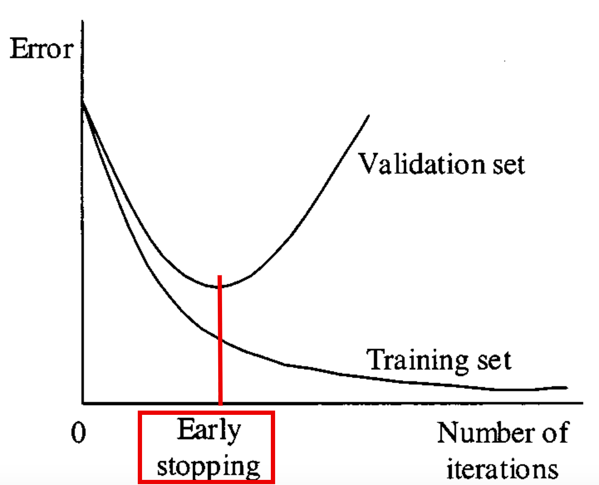
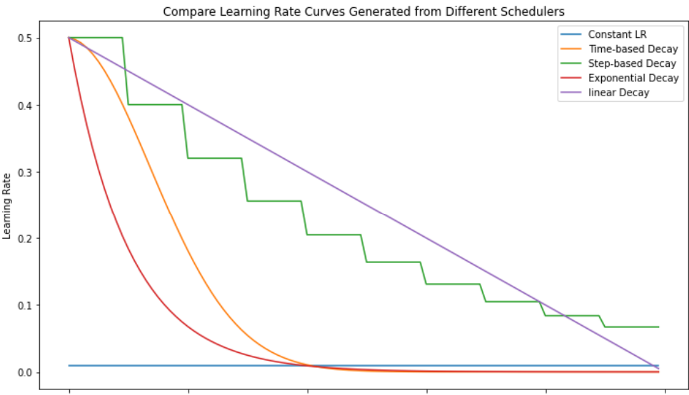
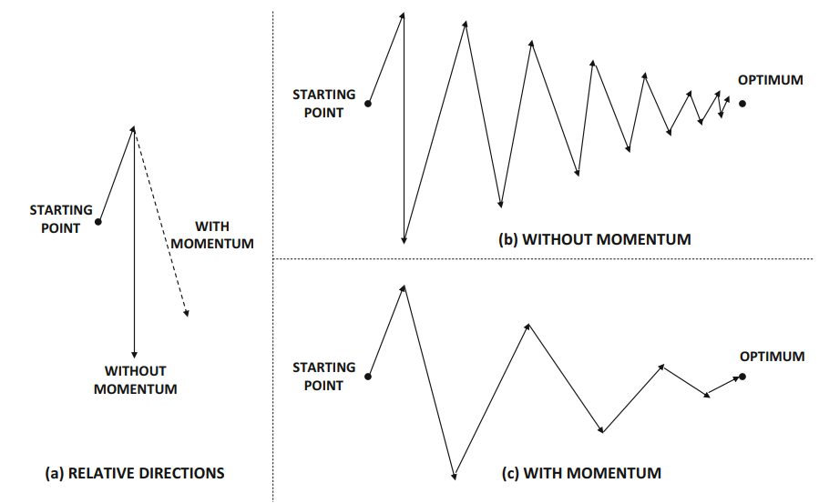

.. .. raw:: html
..     

.. slide::

Chapitre 7 - Hyperparamètres: Contrôler et optimiser son entraînement
================

🎯 Objectifs du Chapitre
----------------------

.. important::

   À la fin de ce chapitre, vous saurez définir et utiliser les concepts suivants pour contrôler et optimiser l'entraînement de vos modèles de Deep Learning : 

   - Early Stopping
   - Learning Rate Scheduling
   - Regularizers
   - Normalizers 

.. slide::

Introduction générale
---------------------

L'entraînement d'un réseau de neurones dépend fortement des hyper-paramètres, ces valeurs fixées avant l'entraînement et qui influencent profondément la performance, la stabilité et la vitesse de convergence du modèle. Contrairement aux paramètres appris automatiquement (poids et biais), les hyper-paramètres requièrent une maîtrise conceptuelle et une expérimentation réfléchie.

Dans ce cours, nous examinerons quatre leviers essentiels pour optimiser un entraînement :

- Early Stopping
- Learning Rate Scheduling
- Régularisations
- Normalisations internes (BatchNorm, LayerNorm, etc.)

.. slide::

📖 1. Early Stopping
---------------------

L'early stopping consiste à arrêter l'entraînement lorsque les performances sur le jeu de validation cessent de s'améliorer. Il s'agit d'un moyen simple et efficace d'éviter l'overfitting.

Par exemple, lorsque l'on ne sait pas combien d'époques un modèle doit être entraîné, il est commun de fixer le nombre d'époques à une valeur élevée (e.g., 2000). L'early stopping permet d'arrêter l'entraînement pour éviter du surapprentissage et économiser les ressources de calcul (notamment GPU).

.. slide::

Objectifs
~~~~~~~~~

- Comprendre comment détecter le surapprentissage (overfitting) pendant l'entraînement.
- Savoir interrompre l'entraînement au bon moment pour optimiser la généralisation.
- Utiliser un mécanisme automatique d'arrêt avec une « patience ».

   **Figure 1** : Early Stopping - Arrêt de l'entraînement lorsque la performance sur le jeu de validation se dégrade.

.. slide::

Exemple de code dans la boucle d'entraînement qui utilise l'Early Stopping :
.. code-block:: python

    import torch
    import numpy as np

    patience = 10
    best_val_loss = np.inf
    patience_cpt = 0

    for epoch in range(2000):
        train(...)
        val_loss = validate(...)

        # Il y a amélioration : on réinitialise le compteur de patience et on sauvegarde le modèle
        if val_loss < best_val_loss: 
            best_val_loss = val_loss 
            patience_cpt = 0 
            torch.save(model.state_dict(), "best_model.pt")
        # Il n'y a pas d'amélioration : on incrémente le compteur de patience
        else:
            patience_cpt += 1
        # La patience est épuisée : on arrête l'entraînement
        if patience_cpt >= patience:
            print("Early stopping at epoch", epoch)
            break 

    model.load_state_dict(torch.load("best_model.pt"))

.. warning::

   ⚠️ **Le suivi de l'Early Stopping se fait sur le jeu de validation !**
   
    Ne jamais utiliser le jeu de test pour décider d'arrêter l'entraînement, car cela biaiserait l'évaluation finale du modèle.

.. slide::

📖 2. Learning Rate Scheduler
---------------------

Le learning rate (pas d'apprentissage en français) influence directement la vitesse et la stabilité de la convergence. Un scheduler modifie automatiquement sa valeur selon une stratégie.

.. note::
    **Rappel:** Le learning rate est un hyper-paramètre crucial qui détermine la taille des pas effectués lors de la mise à jour des poids du modèle pendant l'entraînement. Un learning rate trop élevé peut entraîner une divergence, tandis qu'un learning rate trop faible peut ralentir la convergence.

    C'est la norme (i.e., longueur) du vecteur de mise à jour des poids.

    .. figure:: images/LRissue.png
        :align: center
        :width: 800px
        :alt: SGD
        **Figure 2** : SGD - Illustration de la mise à jour des poids avec un learning rate trop petit (gauche), trop grand (droite) et ajusté dynamiquement (centre). La valeur du learning rate influence la norme du vecteur gradient.

Réduire le Learning Rate au cours de l'entraînement permet souvent d'améliorer la convergence et la performance finale du modèle. Plusieurs stratégies existent, telles que la réduction par palier, la réduction exponentielle, ou les méthodes basées sur la performance (e.g., ReduceLROnPlateau).

.. slide::

PyTorch propose plusieurs classes de scheduler dans le module ``torch.optim.lr_scheduler``. Ces classes prennent nécessairement un optimiseur en argument lors de leur initialisation.

Une fois déclaré, utiliser le scheduler dans la boucle d'entraînement consiste à appeler la méthode ``step()`` à chaque époque (ou selon une autre fréquence, selon le scheduler).

.. code-block:: python
    optimizer = torch.optim.SGD(model.parameters(), lr=0.5)

    # StepLR -- Réduction à intervalles fixes
    step_scheduler = torch.optim.lr_scheduler.StepLR(optimizer, step_size=10, gamma=0.1)

    # ReduceLROnPlateau -- Réduction basée sur la performance (patience)
    plateau_scheduler = torch.optim.lr_scheduler.ReduceLROnPlateau(
        optimizer, factor=0.5, patience=3
    )

    # ExponentialLR -- Réduction exponentielle
    exp_scheduler = torch.optim.lr_scheduler.ExponentialLR(optimizer, gamma=0.95)

    # CosineAnnealingLR -- Réduction basée sur le temps, suivant une loi cosinusoïdale
    cosine_time_scheduler = torch.optim.lr_scheduler.CosineAnnealingLR(optimizer, T_max=50)

    # LinearLR -- Réduction linéaire
    linear_scheduler = torch.optim.lr_scheduler.LinearLR(optimizer, start_factor=1.0, end_factor=0.1, total_iters=100)

    # Utilisation du scheduler dans la boucle d'entraînement
    for epoch in range(50):
        train_loss = train(...)
        val_loss = validate(...)

        scheduler.step(val_loss) # Pour ReduceLROnPlateau, on passe aussi la métrique de validation

Voici une illustration du comportement de ces différentes stratégies au cours de l'entraînement :

        **Figure 3** : Stratégies de Learning Rate Scheduling - Illustration des différentes stratégies de réduction du learning rate au cours de l'entraînement.

.. slide::

Bonus : Momentum
^^^^^^^^^^^^^^^^^

Le momentum est une technique complémentaire qui aide à accélérer la convergence en accumulant une "vitesse" dans la direction des gradients. C'est une **inertie (ou élan)** qui permet de lisser les mises à jour des poids en fonction des gradients précédents. Tous les optimiseurs basés sur le gradient (e.g., SGD) peuvent intégrer le momentum. 

        **Figure 4** : Effet du Momentum - Illustration de la mise à jour des poids avec et sans momentum.

.. warning::
    ⚠️ Il est important de faire attention aux valeurs des gradients lorsque l'on utilise à la fois un optimiseur avec momentum et un Learning Rate Scheduler. Bien que cela soit la plupart du temps efficace, cela multiplie les sources de variations dans les mises à jour des poids, ce qui peut parfois déstabiliser l'entraînement.

.. slide::

📖 3. Regularizers
---------------------

Les Regularizers (régularisateurs en français)1 pénalisent la complexité du modèle en ajoutant une contrainte aux poids. Ils aident à prévenir l'overfitting en limitant la capacité du modèle à s'adapter trop étroitement aux données d'entraînement. 

Les régularisations les plus courantes sont : 

- **L2 Regularization** (Ridge) : pénalise la somme des carrés des poids, encourageant des poids plus petits et répartis.
- **L1 Regularization** (Lasso) : pénalise la somme des valeurs absolues des poids, favorisant la sparsité (beaucoup de poids deviennent exactement zéro).
- **Dropout** : technique qui consiste à "éteindre" aléatoirement certains neurones pendant l'entraînement, ce qui aide à prévenir la co-adaptation des neurones et améliore la généralisation.

.. slide::

3.1. L2 Regularization
~~~~~~~~~~~~~~~~~~~

La régularisation L2 ajoute une pénalité proportionnelle à la somme des carrés des poids du modèle dans la fonction de perte. La formule est donnée par :

.. math::

    L_{total} = L_{original} + \lambda \sum_{i} w_i^2

où :

- $$L_{total}$$ est la nouvelle fonction de perte avec régularisation.
- $$L_{original}$$ est la fonction de perte originale (e.g., erreur quadratique moyenne, entropie croisée, etc.).
- $$\lambda$$ est le coefficient de régularisation (hyper-paramètre à ajuster).
- $$w_i$$ représente les poids du modèle.

Cette régularisation encourage les poids à être petits, ce qui réduit la complexité du modèle et aide à prévenir l'overfitting.

En PyTorch, la régularisation L2 peut être facilement appliquée en utilisant le paramètre ``weight_decay`` (correspondant à $$\lambda$$ dans la formule ci-dessus.) lors de la création de l'optimiseur :
.. code-block:: python
    optimizer = torch.optim.SGD(model.parameters(), lr=0.01, weight_decay=0.001)

.. slide::

3.2. L1 Regularization
~~~~~~~~~~~~~~~~~~~

La régularisation L1 ajoute une pénalité proportionnelle à la somme des valeurs absolues des poids du modèle dans la fonction de perte. La formule est donnée par :

.. math::

    L_{total} = L_{original} + \lambda \sum_{i} |w_i|

où :

- $$L_{total}$$ est la nouvelle fonction de perte avec régularisation.
- $$L_{original}$$ est la fonction de perte originale (e.g., erreur quadratique moyenne, entropie croisée, etc.).
- $$\lambda$$ est le coefficient de régularisation (hyper-paramètre à ajuster).
- $$w_i$$ représente les poids du modèle.

Cette régularisation encourage les poids à valoir 0, ce qui favorise la sparsité dans le modèle. Cela peut être utile pour sélectionner automatiquement les caractéristiques les plus importantes dans les données.

Contrairement à la régularisation L2, PyTorch ne propose pas de paramètre weight_decay pour la régularisation L1. Il est donc nécessaire de l'implémenter manuellement comme montré ci-dessous : 

.. code-block:: python
    l1_lambda = 0.001
    for epoch in range(epochs):
        optimizer.zero_grad()
        output = model(input)
        loss = criterion(output, target)

        # Ajout de la régularisation L1
        l1_norm = sum(p.abs().sum() for p in model.parameters())
        loss = loss + l1_lambda * l1_norm

        loss.backward()
        optimizer.step()

.. slide::

.. note::
    🧠 Pour récapituler. 

    **L1 Regularization** :

        - Pénalise la somme des valeurs absolues des poids.
        - Encourage la **sparsité**, c'est-à-dire que de nombreux poids deviennent exactement égaux à zéro.
        - Utile lorsque vous souhaitez obtenir un modèle économe ou effectuer une sélection automatique des caractéristiques.

    **L2 Regularization** :

        - Pénalise la somme des carrés des poids.
        - Encourage des poids plus petits et répartis, mais rarement égaux à zéro.
        - Utile pour réduire la complexité du modèle tout en conservant toutes les caractéristiques.

    **Quand utiliser l'une ou l'autre ?**

    **L1 Regularization** :

        - Lorsque vous travaillez avec des données comportant de nombreuses caractéristiques inutiles ou redondantes.
        - Lorsque vous souhaitez interpréter le modèle en identifiant les caractéristiques les plus importantes.

    **L2 Regularization** :

        - Lorsque vous souhaitez éviter l'overfitting tout en conservant toutes les caractéristiques.
        - Lorsque vous travaillez avec des modèles où la sparsité n'est pas une priorité.

    Les deux approches peuvent bien entendu être combinées pour bénéficier de leurs avantages respectifs.

.. slide::

3.3. Dropout
~~~~~~~~~~~

Le Dropout (dilution en français) est une technique de régularisation qui consiste à "éteindre" aléatoirement un pourcentage de neurones dans un réseau pendant l'entraînement. Cela empêche les neurones de co-adapter leurs poids, ce qui améliore la généralisation du modèle.

Le dropout est généralement appliqué après une couche d'activation (e.g., ReLU) et avant la couche suivante.
Cette technique n'est utilisée que pendant l'entraînement. Lors de l'inférence (évaluation), tous les neurones sont actifs.

.. math::

    y_i = 
    \begin{cases} 
    z_i & \text{avec probabilité 1-p} \\
    0 & \text{avec probabilité p}
    \end{cases}

où :

- $$y_i$$ est la sortie du neurone après application du dropout.
- $$z_i$$ est la sortie initiale du neurone avant dropout.
- $$p$$ est la probabilité de diluer (i.e., ignorer) un neurone (hyper-paramètre à ajuster).

.. warning::
    ⚠️ Ici c'est bien la sortie du neurone (feature map) qui est diluée, et non la valeur des poids.
    En démontrera l'implémentation où le Dropout est appliquée sur les caractéristiques (features) des données.
    
.. slide::

En PyTorch, le Dropout peut être facilement appliqué comme une couche en utilisant la classe ``nn.Dropout``. Voici un exemple d'utilisation :

.. code-block:: python

    import torch
    import torch.nn as nn

    class My_Network(nn.Module):
        def __init__(self):
            super().__init__()
            self.fc1 = nn.Linear(784, 512)
            self.drop = nn.Dropout(0.5) # Couche de Dropout avec une proba p=0.5 de dilution
            self.fc2 = nn.Linear(512, 10)

        def forward(self, x):
            x = torch.relu(self.fc1(x))
            x = self.drop(x) # Application du Dropout **uniquement pendant l'entraînement** (model.train())
            return self.fc2(x)

Comme on peut le voir dans le code ci-dessus, la couche de Dropout est appliquée sur les caractéristiques (features) des données ``x = self.drop(x)``.
Cette couche se désactive automatiquement lors de l'évaluation du modèle (i.e., mode évaluation avec ``model.eval()``).

.. slide::

📖 4. Normalizers
---------------------

4.1. Problème de distribution
~~~~~~~~~~~~~~~~~~~~~~

Les réseaux de neurones sont des machines statistiques sensibles aux distributions des données, à leur domaine de valeur. On peut définir deux types de distributions de données :

- In-distribution (ID) : données qui suivent la distribution que le modèle a l'habitude de voir et est capable de traiter efficacement.
- Out-of-distribution (OOD) : données qui suivent une distribution que le modèle n'a jamais vu et qu'il ne traite donc pas efficacement.

.. note:: 
    Cette distinction ID/OOD est vraie pour les domaines de valeur mais également pour la distribution globale des caractéristiques d'une donnée. 

    Par exemple : Soit un réseau entraîné à classer des chiens et chats sur des images dont les canaux RGB sont normalisés entre 0 et 1. 

    1. Si on lui présente une **image de chien** avec des canaux RGB **entre 0 et 1**, l'image est in-distribution (ID).
    2. Si on lui présente une **image de chien** avec des canaux RGB **entre 0 et 255**, l'image est out-of-distribution (OOD) car le modèle n'a jamais vu ce type de données.
    3. Si on lui présente une **image d'oiseau** avec des canaux RGB **entre 0 et 1**, l'image est également out-of-distribution (OOD) car le modèle n'a jamais vu ce type de données.

    Avec les normalizers, nous allons nous intéresser au domaine de valeur des caractéristiques internes (i.e., sorties des couches intermédiaires) d'un réseau de neurones (normaliser le cas 2. ci-dessus).

Pourtant, il est normal que les distributions des caractéristiques internes (i.e., sorties des couches intermédiaires) varient au cours de l'entraînement puisqu'elles sont dépendantes des poids qui sont mis à jour à chaque itération. Ce changement de distribution interne est appelé le **internal covariate shift** (décalage interne des covariables en français) et peut ralentir l'entraînement.

.. slide::

4.2. Normalizers pour contrer l'internal covariate shift
~~~~~~~~~~~~~~~~~~~~~~

Les Normalizers (normalisateurs en français) sont des techniques utilisées pour standardiser ou normaliser les activations des couches intermédiaires d'un réseau de neurones, et contrebalancent donc l'internal covariate shift.

Pour normaliser ces distributions internes, la plupart des Normalizers se basent sur la même formule : 

.. math::

    \hat{x} = \frac{x - \mu(x)}{\sigma(x) + \epsilon} * \gamma + \beta

où :

- $$\hat{x}$$ est la valeur normalisée.
- $$x$$ est la valeur d'entrée (activation de la couche intermédiaire).
- $$\mu(x)$$ est la moyenne des activations.
- $$\sigma(x)$$ est l'écart-type des activations.
- $$\epsilon$$ est une petite constante pour éviter la division par zéro.
- $$\gamma$$ et $$\beta$$ sont des paramètres appris qui permettent de redimensionner et de recentrer les activations normalisées. Le modèle a donc une capacité de décrire le domaine de valeur qu'il est capable de traiter.

.. slide::

Différents Normalizers se distinguent par la manière dont ils calculent $$\mu$$ et $$\sigma$$, ainsi que par le moment où ils sont appliqués dans le réseau.

Les normalizers les plus courants sont :

- **Batch Normalization (BatchNorm)** : normalise les activations en utilisant la moyenne et l'écart-type calculés **sur un mini-batch de données**. Cela aide à stabiliser et accélérer l'entraînement.
- **Layer Normalization (LayerNorm)** : normalise les activations en utilisant la moyenne et l'écart-type calculés **sur toutes les caractéristiques d'une seule donnée**. Utile pour les architectures récurrentes, souvent utilisé en natural language processing.
- **Instance Normalization (InstanceNorm)** : normalise les activations en utilisant la moyenne et l'écart-type calculés **sur chaque canal d'une seule donnée**. Souvent utilisé en computer vision.
- **Group Normalization (GroupNorm)** : divise les canaux en groupes et normalise les activations au sein de chaque groupe. Utile lorsque la taille du batch est petite.

En PyTorch, ces normalizers sont disponibles dans le module ``torch.nn``. Voici un exemple d'utilisation de la Batch Normalization :

.. code-block:: python
    import torch
    import torch.nn as nn

    class ImageNormalizerNetwork(nn.Module):
        def __init__(self):
            super().__init__()
            self.batch_norm = nn.BatchNorm2d(3)  # Normalisation des 3 canaux sur tout le batch
            self.layer_norm = nn.LayerNorm([3, 224, 224])  # Normalisation pour chaque échantillon du batch (tous les canaux)
            self.instance_norm = nn.InstanceNorm2d(3)  # Normalisation pour chaque canal de chaque échantillon
            self.group_norm = nn.GroupNorm(1, 3)  # Normalisation de groupe (1 groupe pour 3 canaux)

        def forward(self, x):
            x_batch_norm = self.batch_norm(x)  # Apply Batch Normalization
            x_layer_norm = self.layer_norm(x)  # Apply Layer Normalization
            x_instance_norm = self.instance_norm(x)  # Apply Instance Normalization
            x_group_norm = self.group_norm(x)  # Apply Group Normalization

            return x_batch_norm, x_layer_norm, x_instance_norm, x_group_norm
