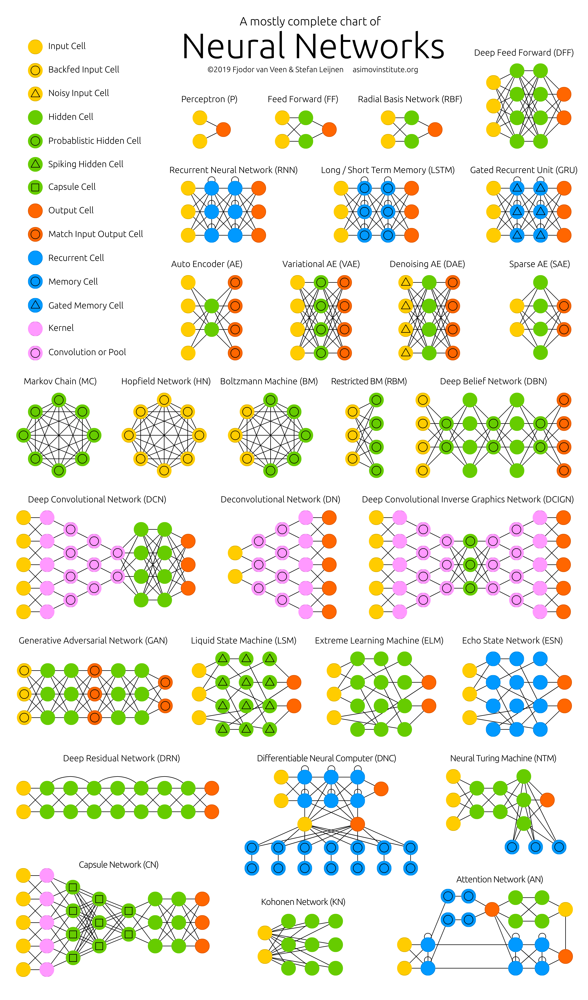
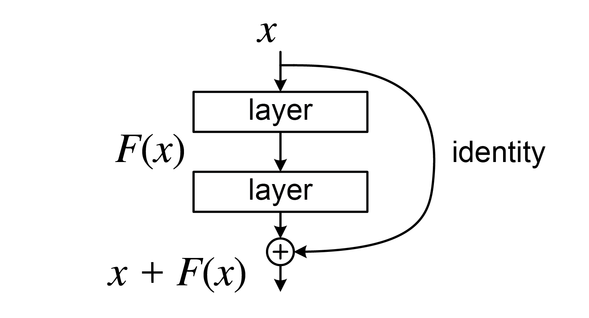
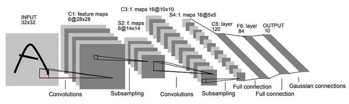
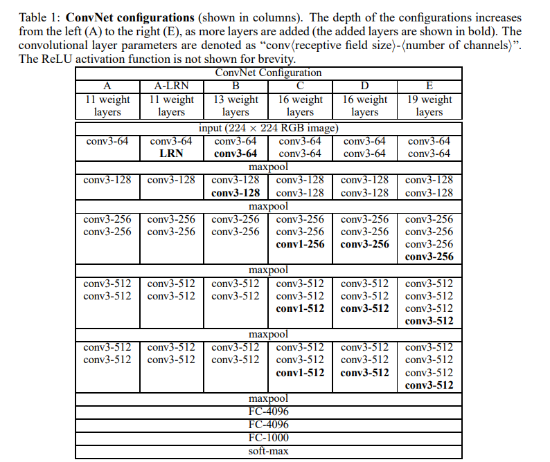
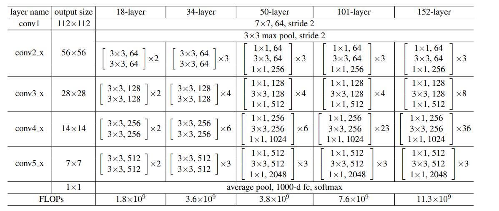
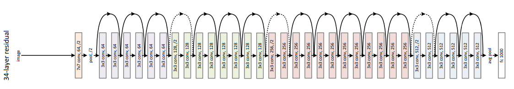

.. .. raw:: html
..     

.. slide::

Chapitre 8 - Architectures de réseaux de neurones profonds
================

🎯 Objectifs du Chapitre
----------------------

.. important::

    Ce chapitre propose une introduction à différentes architectures de réseaux de neurones classiques. 
    
    Vous pouvez consulter le `Neural Network Zoo <https://www.asimovinstitute.org/neural-network-zoo/>`_ pour une vue d'ensemble visuelle des architectures.
   
.. slide::

📖 1. Architectures vs. Modèles
---------------------

Il est important de distinguer deux concepts fondamentaux souvent confondus par abus de langage : les **architectures** et les **modèles** de réseaux de neurones profonds.

.. warning::
    En pratique, les termes "architecture" et "modèle" sont souvent utilisés de manière interchangeable, mais il est utile de comprendre la distinction entre les concepts fondamentaux réutilisables et les compositions spécifiques prêtes à l'emploi.

    Leur définition dans ce chapitre est une convention pédagogique pour dissocier ces deux familles.

.. slide::

**Architectures (Building Blocks)**
    Ce sont des composants réutilisables qui définissent comment traiter les données.
    
    Par exemple, un bloc convolutif composé d'une couche de convolution suivie d'une activation et d'une normalisation est réutilisable dans différents modèles. Le nombre de répétition du bloc, le nombre de filtres, et les hyperparamètres peuvent varier selon le modèle.

    Exemples de modèles:
    
    - Bloc convolutif : convolution + activation + normalisation
    - Bloc résiduel (Residual Block) : `y = f(x) + x`
    - Bloc d'auto-attention : calcul de similarité entre éléments
    - Auto-encoder
    - Transformer
    
    Les modèles sont des **briques élémentaires** indépendantes et réutilisables.
    La figure ci-dessous illustre plusieurs architectures de réseaux de neurones parmi les plus communes. Il est évident impossible de recenser toutes les architectures existantes, tant ce domaine évolue rapidement. 

    Il n'est cependant pas nécessaire de toutes les connaître par cœur, mais plutôt de comprendre le principe de composition modulaire des architectures pour créer des modèles adaptés à des tâches spécifiques, et être capable de mettre en œuvre ces concepts quand c'est utile.

    **Figure 1** : Neural Network Zoo - Vue d'ensemble visuelle des architectures de réseaux de neurones. Une explication pour chaque modèle est disponible sur le site de l'`Asimov Institute <https://www.asimovinstitute.org/neural-network-zoo/>`_.

.. slide::

**Modèles (Networks)**
    Ce sont des compositions organisées de modèles pour résoudre un problème spécifique.
    
    Les modèles sont des arrangements spécifiques de modèles adaptés à des tâches particulières, comme la classification d'images ou la traduction automatique. C'est généralement ce que l'on appelle "réseau de neurones profond" et dont les noms sont connus du grand public.
    
    
    Exemples :

    - LeNet, VGG, YOLO : empile des blocs convolutifs simples
    - ResNet : empile des blocs résiduels (convolutifs) en profondeur
    - BERT et GPT : empile des blocs de Transformer
    
    Les architectures définissent l'**arrangement global** et le nombre de couches.

**Avantage de cette séparation**
    Un même bloc résiduel peut être utilisé dans ResNet, DenseNet, ou vos propres modèles.
    Cela encourage la **modularité** et la **réutilisabilité** du code.

.. slide::

📖 2. Quelques Architectures
---------------------

2.1. Multi Layer Perceptron (MLP)
~~~~~~~~~~~~~~~~~~~~~~~~

Un Multi Layer Perceptron (MLP) est un réseau de neurones feed-forward composé de couches entièrement connectées (Fully Connected). C'est l'architecture la plus simple et la plus fondamentale.

.. code-block:: python
    import torch
    import torch.nn as nn

    class MLP_block(nn.Module):
        def __init__(self, input_size, hidden_size, output_size):
            super(MLP_block, self).__init__()
            self.fc1 = Linear(input_size, hidden_size)
            self.relu = nn.ReLU()
            self.fc2 = Linear(hidden_size, output_size)
        
        def forward(self, x):
            x = self.fc1(x)
            x = self.relu(x)
            x = self.fc2(x)
            return x

**Caractéristiques :**

- Chaque neurone d'une couche est connecté à tous les neurones de la couche suivante
- Les informations circulent dans une seule direction : input → couches cachées → output
- Simple mais efficace pour des données tabulaires ou prétraitées

Il est commun d'ajouter ce type d'architecture en fin de réseau complexe. On considère alors que le réseau complexe **extrait des caractéristiques pertinentes**, et le MLP sert à réduire ces caractéristiques en une représentation qui correspond à l'espace de sortie souhaité.

.. slide::

2.2. Convolutional Neural Networks (CNN)
~~~~~~~~~~~~~~~~~~~~~~~~

Les Convolutional Neural Networks (CNN) utilisent des couches de convolution pour extraire des caractéristiques spatiales à partir d'images.

.. code-block:: python

    import torch.nn as nn

    class ConvBlock(nn.Module):
        def __init__(self, in_channels, out_channels, kernel_size=3, padding=1):
            super(ConvBlock, self).__init__()
            self.conv = nn.Conv2d(in_channels, out_channels, kernel_size, padding=padding)
            self.bn = nn.BatchNorm2d(out_channels)
            self.relu = nn.ReLU(inplace=True)
        
        def forward(self, x):
            x = self.conv(x)
            x = self.bn(x)
            x = self.relu(x)
            return x

**Caractéristiques :**

- **Convolution** : applique des filtres (kernels) qui glissent sur l'image pour détecter des patterns locaux (contours, textures, formes). Les mêmes filtres sont appliqués partout, réduisant le nombre de paramètres et permettant de capturer des caractéristiques spatiales.
- **Batch Normalization** : normalise les activations pour stabiliser l'entraînement
- **Activation ReLU** : introduit la non-linéarité

Les CNN sont particulièrement efficaces pour les données images grâce à leur capacité à capturer les dépendances spatiales et les patterns visuels à différents niveaux d'abstraction.

.. slide::

2.3. Bloc Résiduel
~~~~~~~~~~~~~~~~~~~~~~~~

Un bloc résiduel (Residual Block) est une architecture fondamentale introduite par ResNet qui permet d'entraîner des réseaux très profonds en contournant le problème de la disparition du gradient.

L'idée clé est simple : au lieu d'apprendre directement la transformation `y = f(x)`, on apprend la **résidu** (différence) : `y = f(x) + x` tout en créant un raccourcis pour la remontée du gradient.

.. note::
    La mise à jour des poids faite par la backpropagation est réalisée avec une pondération. La dernière couche du réseau (plus proche de la sortie) reçoit une forte mise à jour des poids. Plus on remonte dans les couches, plus la mise à jour des poids diminue. Dans les réseaux très profonds, les premières couches reçoivent des mises à jour très faibles, ce qui empêche un apprentissage efficace.

    Les blocs résiduels permettent de créer des raccourcis pour le flux de gradient, facilitant ainsi l'entraînement des réseaux profonds en permettant la mise à jour des paramètres des couches plus hautes dans le réseau.

    **Figure 2** : Schéma d'un bloc résiduel. La fonction `F(x)` représente une série de couches (par exemple, convolution, normalisation, activation). Le chemin de droite est le raccourci qui est ajoute (ou concatène) l'entrée `x` à la sortie de `F(x)`.

**Caractéristiques :**

- **Connexion résiduelle (skip connection)** : résout le problème de la disparition du gradient, permet au gradient de contourner les couches en cas de problème
- **Flexibilité** : permet d'ajouter des couches sans dégrader les performances
- **Non-séquentiel** : Ce modèle n'est pas strictement séquentiel, car il inclut des connexions directes entre les couches non adjacentes.

L'avantage principal est que même si `f(x)` est difficile à apprendre au début, le réseau peut apprendre l'identité (résidu = 0), ce qui maintient les performances.

.. slide::

2.4. Auto-attention et Transformer
~~~~~~~~~~~~~~~~~~~~~~~~

L'auto-attention est un composant clé des architectures de type Transformer, qui ont révolutionné le traitement du langage naturel et d'autres domaines.

L'auto-attention est un mécanisme qui permet à un modèle de se concentrer sur différentes parties d'une séquence d'entrée lorsqu'il génère une sortie. Ce mécanisme est particulièrement utile dans le traitement du langage naturel et les tâches de séquençage, car il permet au modèle de peser l'importance des mots ou des éléments en fonction de leur contexte. Récemment, ce concept à également été appliqué avec succès à d'autres domaines, comme la vision par ordinateur (Vision Transformer, ViT) et le traitement de graphes (Graph Attention Networks, GAT).

**Fonctionnement :**

1. **Calcul des scores d'attention** : Pour chaque élément de la séquence, le modèle calcule un score d'attention par rapport à tous les autres éléments. Cela se fait généralement en utilisant des produits scalaires entre le tenseur de caractéristique et sa transposée. C'est donc (directement ou non) un produit du tenseur avec lui-même, ce qui explique le terme "auto"-attention.

2. **Normalisation** : Les scores d'attention sont ensuite normalisés à l'aide d'une fonction softmax pour obtenir des poids d'attention qui totalisent 1.

3. **Aggregation** : Les poids d'attention sont utilisés pour combiner les valeurs (value) des éléments de la séquence, produisant ainsi une représentation contextuelle enrichie pour chaque élément.

**Caractéristiques :**

- **Interprétabilité** : Les poids d'attention peuvent être visualisés, offrant une meilleure compréhension de la manière dont le modèle prend ses décisions.

- **Efficacité** : Réduit le besoin de structures de réseau complexes, car un seul mécanisme peut capturer des dépendances complexes.

- **Modularité** : Peut être intégré dans diverses architectures, y compris les Transformers, pour améliorer les performances sur des tâches variées.

.. slide::

📖 3. Quelques Modèles
---------------------

Ce chapitre présente quelques modèles classiques de réseaux de neurones profonds qui ont marqué l'histoire du Deep Learning, **tels qu'ils sont présentés dans la littérature académique**.

Les différentes méthodes de représentation de ces modèles sont toutes valides et il est important d'être capable de les déchiffrer.

3.1. LeNet-5
~~~~~~~~~~~~~~~~~~~~~~~~

LeNet-5 est l'un des premiers modèles de réseaux de neurones convolutifs (CNN) développée par Yann LeCun en 1998. Elle a été conçue pour la reconnaissance de chiffres manuscrits dans le cadre du projet MNIST. Il a joué un rôle crucial dans la démonstration de l'efficacité des CNN pour les tâches de vision par ordinateur et a initié le regain de popularité dans les réseaux de neurones pour le traitement d'image dans les années 2010s.

    **Figure 3** : Architecture de LeNet-5. Source `LeNet-5 Paper, 1998 <http://yann.lecun.com/exdb/publis/pdf/lecun-98.pdf>`_.

Pour une image en entrée de taille 32×32×1 en niveau de gris, l'architecture de LeNet-5 comprend environ **60 000 paramètres entraînables**.

3.2. VGG
~~~~~~~~~~~~~~~~~~~~~~~~

VGG est une des premières architectures de réseaux de neurones **profonds** à avoir démontré que l'augmentation de la profondeur du réseau pouvait améliorer significativement les performances en classification d'images. Proposée par Simonyan et Zisserman en 2014, VGG a introduit une approche simple mais efficace en utilisant des couches convolutives de petite taille (3x3) empilées pour construire des réseaux très profonds.

Comme montré dans l'image ci-dessous, l'architecture se décline en plusieurs variantes, telles que VGG16 (16 couches) et VGG19 (19 couches), qui diffèrent par le nombre de couches convolutives. L'utilisation de petites convolutions permet de réduire le nombre de paramètres tout en augmentant la profondeur du réseau, ce qui améliore la capacité d'apprentissage des caractéristiques complexes des images.

    **Figure 4** : Architecture de VGG. Source `VGG Paper, 2014 <https://arxiv.org/abs/1409.1556>`_.

VGG a été conçu pour traiter des images plus larges en RGB (224x224x3) et comprend **entre 133 et 144 millions de paramètres entraînables** selon la variante. La **capacité d'apprentissage** de VGG est donc bien plus grande que celle de LeNet-5, ce qui lui permet de capturer des caractéristiques plus complexes et variées dans les images.
Cependant, cette augmentation de la profondeur et du nombre de paramètres entraîne également des défis en termes de temps d'entraînement et de ressources computationnelles nécessaires. 

3.3. ResNet
~~~~~~~~~~~~~~~~~~~~~~~~

ResNet (Residual Network) est une architecture de réseau de neurones profonds introduite par Kaiming He et ses collègues en 2015. Cette architecture reprend la structure de VGG en y ajoutant des **blocs résiduels** (Residual Blocks) qui permettent de construire des réseaux beaucoup plus profonds sans souffrir du problème de la disparition du gradient.

Comme VGG, ce modèle est préposé sous différentes variantes plus ou moins profondes. ResNet-50, ResNet-101 et ResNet-152 sont parmi les variantes les plus populaires, avec respectivement 50, 101 et 152 couches. Grâce aux blocs résiduels, ResNet peut atteindre des profondeurs allant jusqu'à 152 couches tout en maintenant des performances élevées, contrairement à VGG.

    **Figure 5** : Architecture de ResNet. Source `ResNet Paper, 2015 <https://arxiv.org/abs/1512.03385>`_.

Le modèle n'étant pas séquentiel, la représentation sous forme de tableau n'est plus forcément adaptée. Il est donc désormais également commun de représenter les modèles sous forme de graphes où les noeuds représentent des couches. Les liens représentent alors la dépendance entre les couches (qui prend en entrée la sortie de quelle couche).

    **Figure 6** : Représentation graphique de ResNet. Source `ResNet Paper, 2015 <https://arxiv.org/abs/1512.03385>`_.

Bien que l'architecture soit plus profonde que VGG, les modèles ResNet comportent moins de paramètres à apprendre, **entre 30 et 120 millions** de ResNet-18 à ResNet-152. Bien que ResNet soit plus profond que VGG, il est aussi moins large : le nombre de filtres des couches cachées est bien plus faible que dans VGG. Cela permet de réduire le nombre total de paramètres tout en maintenant une grande capacité d'apprentissage grâce à la profondeur accrue. 

.. slide::

📖 4. Pour aller plus loin
---------------------

4.1. Transfer learning et Fine-tuning
~~~~~~~~~~~~~~~~~~~~~~~~

Tous les modèles d'apprentissage que nous avons vus jusqu'à présent sont entraînés **from scratch**, c'est-à-dire que les poids sont initialisés aléatoirement avant l'entraînement. 

Mais il est également possible d'initialiser les poids d'un modèle avec des valeurs pré-entraînées sur une autre tâche, ou par une autre personne. L'entraînement sert alors a affiner ces poids pour la nouvelle tâche ou sur nos propres données, c'est le **fine-tuning**.

.. code-block:: python

    import torch
    import torch.nn as nn

    # A ce stade, les poids du modèle sont initialisés aléatoirement
    model = MyModel(...)

    weights_path = "pretrained_weights.pt" 
    weights = torch.load(weights_path, map_location="cpu")

    # On suppose que l'architecture du modèle qui a été utilisée pour l'entraînement des poids pré-entraînés est la même que celle utilisée ici, sinon le chargement échoue.
    # On change les poids du modèle avec les poids pré-entraînés
    model.load_state_dict(weights, strict=True)

Dans de nombreux cas, il est avantageux d'utiliser des modèles pré-entraînés sur de grandes bases de données (comme ImageNet) et de les adapter à une nouvelle tâche spécifique. C'est ce qu'on appelle le **transfer learning**. En pratique, **fine-tuning** et **transfer learning** peuvent êtres considérés comme des concepts équivalents. 

.. note::
    ImageNet est un jeu de données de référence en vision par ordinateur, contenant plus de 14 millions d'images annotées réparties en plus de 20 000 catégories. Il est largement utilisé pour entraîner et évaluer des modèles de reconnaissance d'images.
    
    Cette base de données est trop grosse pour être utilisée dans un cadre normal. C'est pourquoi on utilise souvent des modèles pré-entraînés sur ImageNet, qui ont déjà appris des caractéristiques visuelles générales.
    
    Quand on dit « pré-entraîné sur ImageNet », cela signifie généralement que les poids du modèle ont été optimisés pour la classification d'images sur un grand nombre de classes ImageNet, puis réutilisés comme point de départ pour une nouvelle tâche.

Les poids/paramètres pré-entraînés sont souvent disponibles dans les bibliothèques Deep Learning populaires comme PyTorch ou TensorFlow.

.. code-block:: python

    import torch
    from torchvision.models import vgg16, VGG16_Weights

    # Crée un VGG16 et charge automatiquement les poids pré-entraînés sur ImageNet
    ImageNet_weights = VGG16_Weights.DEFAULT
    model = vgg16(weights=ImageNet_weights)
    model.eval()

    # (optionnel) Pré-traitement recommandé pour ImageNet
    preprocess = ImageNet_weights.transforms()

.. 4.2. Modèles Student-teacher 
.. ~~~~~~~~~~~~~~~~~~~~~~~~

.. Une autre méthode pour transférer des connaissances d'un modèle à un autre est l'approche **student-teacher** (ou distillation de connaissances). Dans cette approche, un modèle plus grand et plus complexe (le "teacher") est utilisé pour entraîner un modèle plus petit et plus efficace (le "student"). Le modèle student apprend à imiter les prédictions du modèle teacher, ce qui lui permet de bénéficier des connaissances acquises par le modèle teacher tout en étant plus léger et plus rapide à exécuter.

.. Cette méthode suppose donc que l'on a déjà un accès à un modèle efficace mais souvent lourd (teacher), et que l'on souhaite créer un modèle plus léger (student) pour une utilisation en production ou sur des dispositifs avec des ressources limitées.