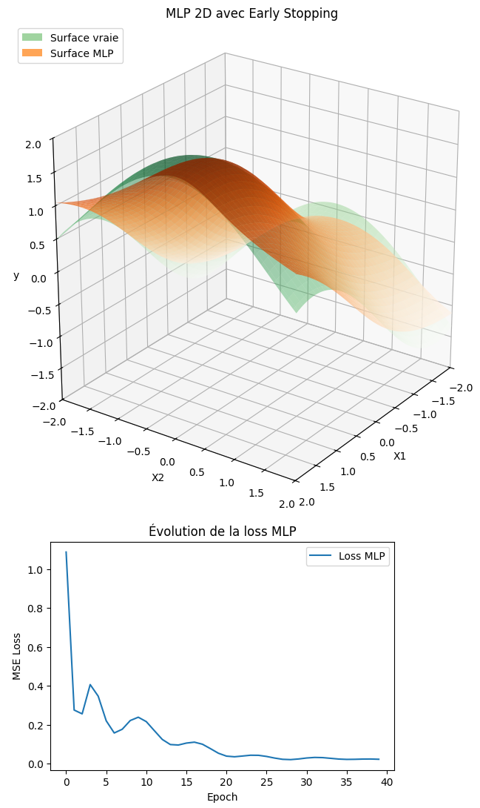
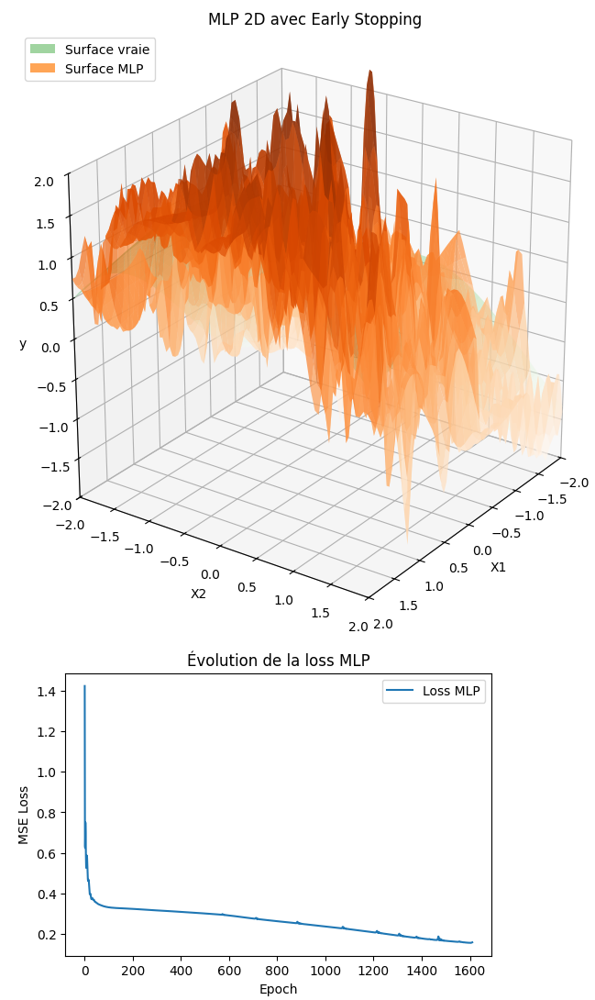

.. slide::
🏋️ Exercices supplémentaires
===============================
Dans cette section, il y a des exercices supplémentaires pour vous entraîner. Ils suivent le même classement de difficulté que précédemment.

.. slide::
⚖️ Exercice supplémentaire 1 : Approximation d'une fonction 2D avec un MLP 
~~~~~~~~~~~~~~~~~~~~~~~~~~~~~~~~~~~~~~~~~~~~~~~~~~~~~~

Cet exercise propose l'entraînement d'un MLP avec des données en 2D.

**Objectif :** Entraîner un MLP pour approximer la fonction suivante :

.. math::

    y = \sin(X_1) + \cos(X_2)

où $$(X_1, X_2) \in [-2,2]^2$$, et visualiser la prédiction du modèle par rapport à la fonction réelle.

**Consigne :**  

1) Générer ``N = 800`` points aléatoires $$(X_1, X_2)$$ dans $$[-2,2]$$ et calculer $$y$$ en suivant la fonction.

2) Standardiser les entrées pour le MLP.

3) Créer un MLP simple :

   - Entrée : 2 features  
   - 2 couches cachées de 64 neurones avec activation ``Tanh``  
   - Sortie : 1 prédiction

4) Entraîner le modèle avec Adam et MSE loss pendant 1000 epochs.

5) Ajouter early stopping avec ``patience = 20`` et ``tolerance = 0.1``.

6) Préparer une grille 2D pour visualiser la fonction réelle et la prédiction du modèle.

7) Afficher sur une seule figure 3D :

   - Surface réelle en vert transparent  
   - Surface prédite par le MLP en orange semi-transparent  
   - Ajouter une légende pour distinguer les surfaces

8) Tracer l'évolution de la loss pendant l'entraînement pour vérifier la convergence.

9) Refaire un test avec des données bruitées (ajouter un bruit gaussien de moyenne 0 et écart-type 0.6 à y) et observer l'impact sur la prédiction du MLP.

**Questions :**  

10) Que remarquez-vous sur la capacité du MLP à approximer la fonction sous-jacente malgré le bruit ?  
11) Que se passe-t-il si vous augmentez ou diminuez le niveau de bruit ?  
12) Comment l’early stopping impacte-t-il l’apprentissage ?

**Astuce :**
.. spoiler::
    .. discoverList::
        1. Pour l'early stopping, stocker la meilleure loss et un compteur d'epochs sans amélioration.  
        2. Pour la visualisation, utiliser ``ax.plot_surface`` pour les surfaces et ``Patch`` pour la légende.  
        3. La standardisation permet au MLP de mieux converger.  
        4. Vérifier la loss finale pour s'assurer que le modèle a appris correctement la fonction.
        5. Pour générer le bruit, utilisez ``0.6 * torch.randn_like(y_clean)``.

**Astuce avancée :**        
.. spoiler::
    .. discoverList:: 
        **Voici le code pour la visualisation 3D avec Matplotlib :**
        .. code-block:: python
            x1g, x2g = torch.meshgrid(
            torch.linspace(-2, 2, 80),
            torch.linspace(-2, 2, 80),
            indexing="ij"
            )

            Xg = torch.cat([x1g.reshape(-1,1), x2g.reshape(-1,1)], dim=1)
            Xg_std = (Xg - X_mean) / X_std

            with torch.no_grad():
                y_true_grid = (torch.sin(x1g) + torch.cos(x2g))
                y_pred_grid = model(Xg_std).reshape(80, 80)
                y_pred_train = model(X_stdized)

            fig = plt.figure(figsize=(9,7))
            ax = fig.add_subplot(111, projection='3d')
            ax.set_title("MLP 2D avec Early Stopping")
            ax.set_xlabel("X1"); ax.set_ylabel("X2"); ax.set_zlabel("y")
            ax.set_xlim(-2, 2); ax.set_ylim(-2, 2); ax.set_zlim(-2, 2)
            try:
                ax.set_box_aspect((1,1,1))
            except Exception:
                pass
            ax.view_init(elev=25, azim=35)

            ax.plot_surface(x1g.numpy(), x2g.numpy(), y_true_grid.numpy(),
                            cmap="Greens", alpha=0.45, linewidth=0)
            ax.plot_surface(x1g.numpy(), x2g.numpy(), y_pred_grid.numpy(),
                            cmap="Oranges", alpha=0.70, linewidth=0)
            legend_elements = [
                Patch(facecolor="tab:green", alpha=0.45, label="Surface vraie"),
                Patch(facecolor="tab:orange", alpha=0.70, label="Surface MLP")
            ]
            ax.legend(handles=legend_elements, loc="upper left")

            plt.tight_layout()
            plt.show()

**Résultats attendus :**

- Voici un exemple de la figure 3D attendue pour les points 1 à 8 de la consigne avec la surface réelle (verte) et la surface prédite par le MLP (orange) :

- Voici un exemple de la figure 3D attendue pour le point 9 de la consigne avec la surface réelle (verte) et la surface prédite par le MLP (orange) :

.. slide::
⚖️ Exercice supplémentaire 2 : Comparaison de deux MLP avec torchsummary
~~~~~~~~~~~~~~~~~~~~~~~~~~~~~~~~~~~~~~~~~~~~~~~~~~~~~~

Dans cet exercice, vous allez comparer deux MLP pour approximer une fonction non linéaire. L'objectif est d'observer l'impact de la taille du réseau sur la performance et de comprendre comment ``torchsummary`` permet d'évaluer la structure du modèle.

**Objectif** :

- Comprendre comment la taille et la complexité d'un MLP influencent la qualité des prédictions.
- Utiliser ``torchsummary`` pour visualiser le nombre de paramètres et la structure du réseau.
- Comparer deux MLP sur une même fonction et interpréter leurs résultats.

**Consignes** :

1) Générer un jeu de données avec la fonction non linéaire suivante : 

   .. code-block:: python

       import torch
       torch.manual_seed(0)
       N = 200
       X = torch.linspace(0, 3, N).unsqueeze(1)
       y = torch.exp(X) + 0.1*torch.randn_like(X)  # fonction exponentielle bruitée

2) Définir deux MLP avec ``nn.Module`` et une activation ``Tanh`` :

   - **Petit MLP** : 2 couches cachées de 5 neurones chacune
   - **Grand MLP** : 2 couches cachées de 50 neurones chacune

3) Entraîner les deux modèles avec Adam et ``nn.MSELoss()`` pendant 2000 epochs et learning rate 0.01.

4) Utiliser ``torchsummary`` pour afficher la structure et le nombre de paramètres de chaque modèle.

5) Tracer les prédictions des deux MLP sur le même graphique ainsi que la fonction vraie.

6) Comparer les performances et interpréter les résultats à l’aide du résumé des modèles.

**Astuce avancée :**        
.. spoiler::
    .. discoverList:: 
    - Pour ``torchsummary``, vous pouvez faire :

    .. code-block:: python

        from torchsummary import summary
        summary(model, input_size=(1,))

    - Stockez les pertes à chaque epoch pour tracer l'évolution et vérifier la convergence.
    - Le petit MLP a moins de paramètres et risque moins de sur-apprentissage, mais peut être limité pour des fonctions très complexes.
    - Le grand MLP peut sur-apprendre le bruit si le dataset est petit ou bruité.

**Résultats attendus :**

- Une figure montrant les prédictions des deux MLP et la fonction vraie comme celle ci-dessous.
- Le résumé des modèles avec le nombre de paramètres et la structure (torchsummary).
- Discussion : quel MLP capture mieux la fonction ? 

.. image:: images/chap2_exo_sup_2_resultat.png
    :alt: Résultat attendu MLP 
    :align: center