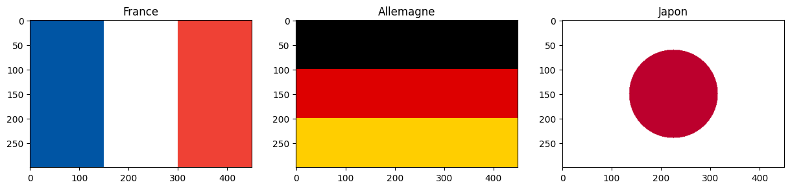
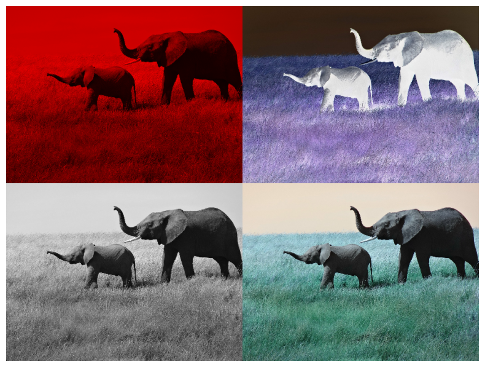
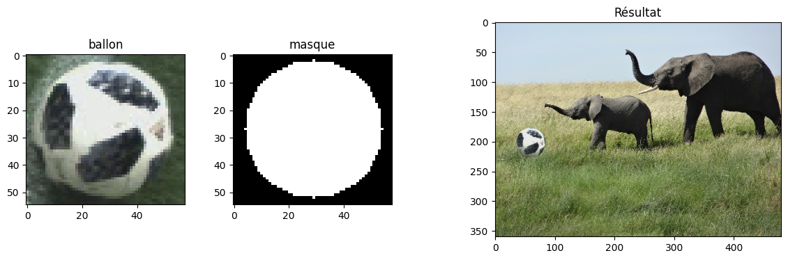
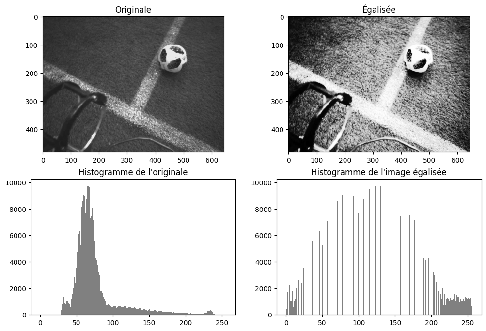

.. slide::
🏋️ Exercices supplémentaires
===============================
Dans cette section, il y a des exercices supplémentaires pour vous entraîner. Ils suivent le même classement de difficulté que précédemment.

.. note::

   Ces exercices utilisent les images `ballon.jpg <images/chap4/ballon.jpg>`_ (cours du chapitre 4) et `elephants.png <images/tp4/elephants.png>`_ (TP du chapitre 4). Placez-les dans le même dossier que votre notebook Jupyter.

.. slide::
🍀 Exercice supplémentaire 1 : Dessiner des drapeaux
~~~~~~~~~~~~~~~~~~~~~~~~~~~~~~

Dans cet exercice, vous allez créer des images de toutes pièces, sans charger de fichier.

**Objectif :** Créer une image avec NumPy, puis la colorier avec le slicing et un masque booléen, sans aucune boucle.

**Consigne :** Écrire un programme qui :

.. step::
    1) Crée une image noire RGB de 300 lignes et 450 colonnes, de type ``uint8``, et affiche sa forme.

.. step::
    2) Crée le drapeau français : trois bandes **verticales** de même largeur, bleue ``[0, 85, 164]``, blanche ``[255, 255, 255]`` et rouge ``[239, 65, 53]``.

.. step::
    3) Crée le drapeau allemand : trois bandes **horizontales** de même hauteur, noire ``[0, 0, 0]``, rouge ``[221, 0, 0]`` et or ``[255, 206, 0]``.

.. step::
    4) Crée le drapeau japonais : un fond blanc et, au centre, un disque rouge ``[188, 0, 45]`` de rayon 90 pixels.

.. step::
    5) Affiche les trois drapeaux côte à côte dans une même figure.

**Questions :**

.. step::
    6) Que se passe-t-il à l'affichage si vous oubliez ``dtype=np.uint8`` lors de la création de l'image ? Pourquoi ?

.. step::
    7) Qu'est-ce qui change dans le slicing entre le drapeau français et le drapeau allemand ?

.. step::
    8) Combien de pixels sont rouges dans le drapeau japonais ? Comparez avec l'aire d'un disque de rayon 90.

**Astuce :**
.. spoiler::
    .. discoverList::
        1. ``np.zeros((H, W, 3), dtype=np.uint8)`` crée une image noire
        2. ``img[:, a:b] = [r, g, b]`` colorie toutes les lignes des colonnes ``a`` à ``b - 1`` (section 3.3 du cours)
        3. Un pixel ``(y, x)`` est dans le disque si $$(x - x_c)^2 + (y - y_c)^2 \le r^2$$, où $$(y_c, x_c)$$ est le centre de l'image
        4. ``y = np.arange(H).reshape(H, 1)`` et ``x = np.arange(W).reshape(1, W)`` : grâce au broadcasting (chapitre 2), une condition sur ``x`` et ``y`` donne directement un masque de forme ``(H, W)`` (section 4.3 du cours)
        5. ``masque.sum()`` compte les ``True``

**Résultat attendu :**

Le disque contient 25 445 pixels, très proche de $$\pi \times 90^2 \approx 25\,447$$.

.. slide::
⚖️ Exercice supplémentaire 2 : Une affiche « pop art »
~~~~~~~~~~~~~~~~~~~~~~~~~~~~~~

Dans cet exercice, vous allez créer une affiche dans le style d'Andy Warhol, en assemblant quatre versions d'une même image.

**Objectif :** Manipuler les canaux d'une image et assembler plusieurs images en une seule, sans boucle.

**Consigne :** Écrire un programme qui :

.. step::
    1) Charge ``elephants.png`` avec PIL en RGB (sans le canal alpha), la convertit en tableau NumPy et réduit sa résolution d'un facteur 4 avec le slicing.

.. step::
    2) Crée quatre versions de l'image :

    - une version où seul le canal rouge est conservé (les canaux G et B sont mis à 0),
    - le négatif de l'image,
    - une version en niveaux de gris, mais avec 3 canaux identiques,
    - une version où l'ordre des canaux est inversé (B, G, R au lieu de R, G, B).

.. step::
    3) Assemble les quatre versions en une seule image de 2 × 2 cases, l'affiche, puis la sauvegarde sous le nom ``pop_art.png``.

**Questions :**

.. step::
    4) Pourquoi la version en niveaux de gris doit-elle avoir 3 canaux pour être placée dans l'affiche ?

.. step::
    5) Pourquoi le ciel change-t-il de couleur quand on inverse l'ordre des canaux ? Dans quelle situation cette inversion peut-elle arriver par erreur ?

.. step::
    6) Comment faudrait-il calculer le négatif si l'image avait été chargée avec ``plt.imread`` ?

**Astuce :**
.. spoiler::
    .. discoverList::
        1. ``Image.open(...).convert('RGB')`` supprime le canal alpha
        2. ``img[:, :, 1:] = 0`` met à 0 les canaux G et B (pensez à travailler sur une copie !)
        3. ``img[:, :, ::-1]`` inverse l'ordre des canaux
        4. ``np.stack([gris, gris, gris], axis=2)`` empile 3 fois le même canal le long d'une nouvelle 3e dimension
        5. Créez une image noire de forme ``(2 * H, 2 * W, 3)``, puis placez chaque version dans sa case avec le slicing, comme pour la reconstitution des patchs de l'exercice 3
        6. ``Image.fromarray(tableau).save('pop_art.png')`` sauvegarde un tableau ``uint8`` (section 2.1 du cours)

**Résultat attendu :** une affiche de forme ``(720, 960, 3)``.

.. slide::
⚖️ Exercice supplémentaire 3 : Un ballon dans la savane
~~~~~~~~~~~~~~~~~~~~~~~~~~~~~~

Dans cet exercice, vous allez découper le ballon de l'image ``ballon.jpg`` et le coller dans la savane, devant l'éléphanteau.

**Objectif :** Combiner le slicing et un masque booléen pour coller une partie d'une image dans une autre.

**Consigne :** Écrire un programme qui :

.. step::
    1) Charge ``elephants.png`` (en RGB) et ``ballon.jpg`` en tableaux NumPy, puis réduit la résolution de ``elephants.png`` d'un facteur 4 avec le slicing.

.. step::
    2) Récupère le ballon dans ``ballon.jpg`` (lignes 95 à 204, colonnes 405 à 519), puis réduit sa résolution d'un facteur 2.

.. step::
    3) Crée un masque circulaire de même taille que le ballon réduit : un disque de rayon 25 pixels, centré dans l'image du ballon.

.. step::
    4) Colle **uniquement les pixels du disque** dans l'image de la savane, avec le coin en haut à gauche du ballon en ``(y, x) = (175, 30)``.

.. step::
    5) Affiche côte à côte le ballon, le masque et le résultat.

**Questions :**

.. step::
    6) Pourquoi ne colle-t-on pas directement tout le rectangle du ballon ?

.. step::
    7) L'image de la savane réduite par slicing est une *vue* sur l'image chargée. Quelle conséquence cela a-t-il quand on colle le ballon ? Comment l'éviter ?

.. step::
    8) Que se passe-t-il si vous collez le ballon en ``x = 450`` ? Pourquoi ?

**Astuce :**
.. spoiler::
    .. discoverList::
        1. Le recadrage du ballon est celui de la section 3.3 du cours : ``img[95:205, 405:520]``
        2. Le masque circulaire se construit comme le drapeau japonais de l'exercice supplémentaire 1
        3. ``zone = savane[y0:y0+h, x0:x0+w]`` est une vue sur la zone de collage : modifier ``zone`` modifie ``savane`` (section 3.3 du cours)
        4. ``zone[masque] = ballon[masque]`` ne copie que les pixels du disque (section 4.3 du cours)

**Résultat attendu :** le ballon réduit a la forme ``(55, 58, 3)`` et le masque la forme ``(55, 58)``.

.. slide::
🌶️ Exercice supplémentaire 4 : Égaliser l'histogramme d'une image
~~~~~~~~~~~~~~~~~~~~~~~~~~~~~~

L'image ``ballon.jpg`` est sombre : environ 80 % de ses pixels ont une valeur entre 40 et 90 (voir l'histogramme de la section 4.4 du cours). Dans cet exercice, vous allez améliorer son contraste en **égalisant son histogramme**, c'est-à-dire en étalant les valeurs des pixels sur tout l'intervalle [0, 255].

**Objectif :** Améliorer le contraste d'une image avec une table de correspondance appliquée à tous les pixels, sans boucle.

**Principe :** on construit une table ``lut`` de 256 cases qui donne, pour chaque valeur ``v`` de l'image d'origine, sa nouvelle valeur :

.. math::

   lut[v] = \text{arrondi}\left(255 \times \frac{\text{nombre de pixels de valeur} \le v}{\text{nombre total de pixels}}\right)

**Consigne :** Écrire un programme qui :

.. step::
    1) Charge ``ballon.jpg`` en niveaux de gris avec PIL et la convertit en tableau NumPy.

.. step::
    2) Calcule l'histogramme de l'image : un tableau de 256 cases contenant le nombre de pixels de chaque valeur.

.. step::
    3) Calcule l'histogramme cumulé, puis la table ``lut`` avec la formule ci-dessus.

.. step::
    4) Applique la table à toute l'image **en une seule ligne**, sans boucle.

.. step::
    5) Affiche l'image d'origine, l'image égalisée et leurs deux histogrammes dans une même figure.

.. step::
    6) Compare votre résultat avec la fonction ``equalize`` de ``torchvision.transforms.functional``.

**Questions :**

.. step::
    7) Que fait l'instruction ``lut[gris]`` ?

.. step::
    8) Comment évoluent les valeurs sombres de l'herbe ? Pourquoi ?

.. step::
    9) Pourquoi l'histogramme de l'image égalisée n'est-il pas parfaitement plat ?

.. step::
    10) Votre résultat est-il identique à celui de torchvision ? À quoi l'égalisation peut-elle servir en Deep Learning ?

**Astuce :**
.. spoiler::
    .. discoverList::
        1. ``Image.open('ballon.jpg').convert('L')`` charge l'image en niveaux de gris
        2. ``np.bincount(gris.ravel(), minlength=256)`` compte le nombre de pixels de chaque valeur
        3. ``np.cumsum(hist)`` calcule l'histogramme cumulé : la case ``v`` contient le nombre de pixels de valeur inférieure ou égale à ``v``
        4. Utilisez un tableau d'entiers comme indices d'un autre tableau : ``lut[gris]`` a la même forme que ``gris``
        5. ``TF.equalize`` (avec ``import torchvision.transforms.functional as TF``) attend un tenseur ``uint8`` de forme $$(C, H, W)$$ : ``torch.from_numpy(gris).unsqueeze(0)``

**Résultat attendu :**

- Les valeurs 44, 66 et 152 de l'image d'origine deviennent 13, 130 et 243 dans l'image égalisée.
- L'écart moyen avec ``TF.equalize`` est d'environ 4.6 niveaux de gris (8 au maximum).

